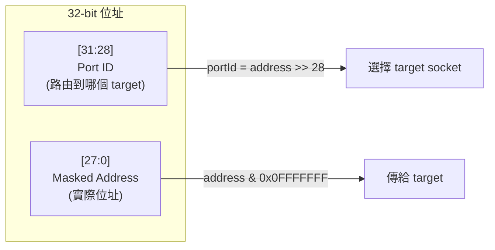
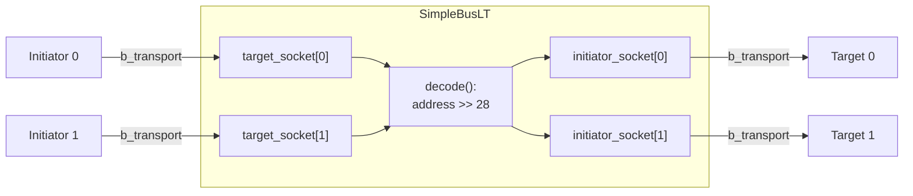
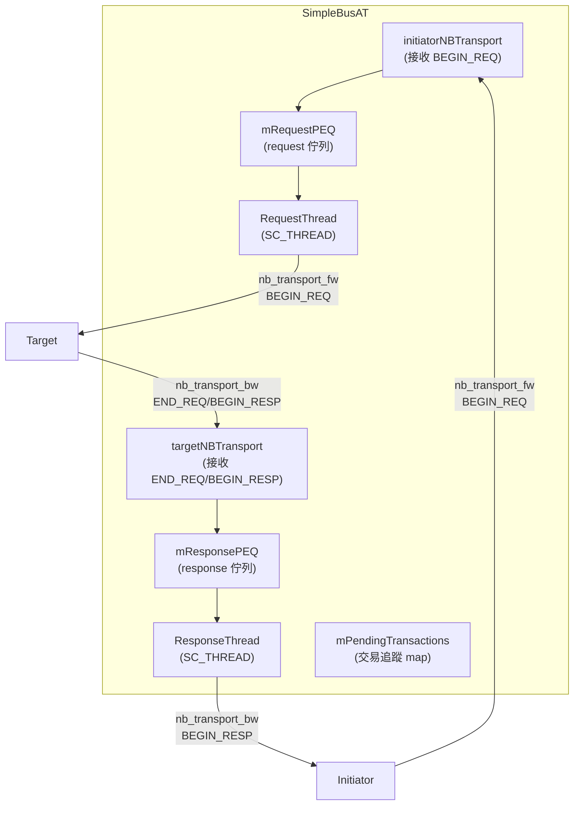

## 概觀

`SimpleBusLT` 和 `SimpleBusAT` 是連接多個 initiator 與多個 target 的互連元件。它們的角色就像 **API gateway** 或 **reverse proxy**（如 nginx）-- 接收來自前端的請求，根據位址路由到後端的正確 target。

### 軟體類比

```
// SimpleBus 就像一個 reverse proxy
//
// Client A --|                     |--> Backend 1 (port 0)
// Client B --|-- nginx (路由器) --|
// Client C --|                     |--> Backend 2 (port 1)
//
// 路由規則：URL 的前 4 位元決定後端 server
```

## 位址解碼（路由規則）

兩個 bus 模型使用相同的簡單位址解碼邏輯：

```
address[31:28]  = port ID（選擇哪個 target）
address[27:0]   = masked address（實際的記憶體位址）
```



這意味著：
- `0x00000000` - `0x0FFFFFFF` 路由到 target 0
- `0x10000000` - `0x1FFFFFFF` 路由到 target 1
- `0x20000000` - `0x2FFFFFFF` 路由到 target 2
- 以此類推...

在轉發之前，bus 會修改 generic payload 的位址，把高 4 位元遮掉。

## SimpleBusLT -- LT 模式 Bus

**檔案**：`include/models/SimpleBusLT.h`

全部實作在 header 中（template class），使用 `simple_target_socket_tagged` 和 `simple_initiator_socket_tagged` 來支援多 socket。

### 架構



### 工作方式

`SimpleBusLT` 是**完全同步**的 -- 它只是一個直通的路由器：

```
Initiator 呼叫 b_transport(gp, delay)
  --> SimpleBusLT::initiatorBTransport()
      1. decode(gp.address) -> portId
      2. gp.set_address(gp.address & 0x0FFFFFFF)   // 移除 routing bits
      3. initiator_socket[portId]->b_transport(gp, delay)  // 直接轉發
  <-- return
```

沒有額外的延遲、沒有排隊、沒有仲裁。一個 blocking call 直接穿透到 target。

### 註冊的 callback

| callback | 功能 |
|----------|------|
| `initiatorBTransport` | 路由 `b_transport` 呼叫 |
| `transportDebug` | 路由 debug transport 呼叫 |
| `getDMIPointer` | 路由 DMI 指標請求，並調整位址範圍 |
| `invalidateDMIPointers` | 將 target 的 DMI 失效通知廣播給所有 initiator |

### DMI 位址轉換

DMI 需要特別處理位址範圍。`getDMIPointer` 在取得 target 的 DMI 指標後，使用 `limitRange()` 將 target 的位址範圍轉換回 bus 的全域位址空間：

```cpp
bool getDMIPointer(int SocketId, transaction_type& trans, tlm::tlm_dmi& dmi_data) {
    unsigned int portId = decode(trans.get_address());
    // 將位址傳給 target（遮掉 routing bits）
    trans.set_address(maskedAddress);
    bool result = (*decodeSocket)->get_direct_mem_ptr(trans, dmi_data);

    // 將 target 回傳的位址範圍加回 routing bits
    sc_dt::uint64 start = dmi_data.get_start_address();
    sc_dt::uint64 end = dmi_data.get_end_address();
    limitRange(portId, start, end);  // start += portId << 28
    dmi_data.set_start_address(start);
    dmi_data.set_end_address(end);
    return result;
}
```

## SimpleBusAT -- AT 模式 Bus

**檔案**：`include/models/SimpleBusAT.h`

AT 模式的 bus 複雜得多。它不能直接轉發呼叫，而是要管理多筆**並發的**非同步交易。

### 架構



### 工作流程

#### 前向路徑（Initiator -> Target）

1. Initiator 呼叫 `nb_transport_fw(gp, BEGIN_REQ, t)`
2. `initiatorNBTransport` 將交易加入追蹤 map，放入 `mRequestPEQ`
3. `RequestThread` 從 PEQ 取出交易，解碼位址，轉發到 target
4. 根據 target 的回傳值處理：
   - `TLM_ACCEPTED` / `TLM_UPDATED`：等待後續的 END_REQ 或 BEGIN_RESP
   - `TLM_COMPLETED`：交易完成，放入 `mResponsePEQ`

#### 後向路徑（Target -> Initiator）

1. Target 呼叫 `nb_transport_bw(gp, END_REQ/BEGIN_RESP, t)`
2. `targetNBTransport` 通知相關事件
3. 如果是 `BEGIN_RESP`，放入 `mResponsePEQ`
4. `ResponseThread` 從 PEQ 取出，轉發 `BEGIN_RESP` 給 initiator
5. 根據 initiator 的回傳值處理：
   - `TLM_COMPLETED`：交易完成
   - `TLM_ACCEPTED`：等待 END_RESP
6. 如果需要，轉發 `END_RESP` 給 target

### 交易追蹤

```cpp
struct ConnectionInfo {
    target_socket_type* from;      // 來源 initiator 的 socket
    initiator_socket_type* to;     // 目的 target 的 socket
};

std::map<transaction_type*, ConnectionInfo> mPendingTransactions;
```

每筆交易都被追蹤，記錄它是從哪個 initiator 來的、要送到哪個 target。這讓 bus 在收到 target 的回應時知道要回給哪個 initiator。

### 記憶體管理

AT bus 在接收到 `BEGIN_REQ` 時呼叫 `trans.acquire()` 增加引用計數。在交易完成時呼叫 `trans.release()`。這確保交易物件在整個非同步流程中不會被過早釋放。

## 兩者比較

| 方面 | SimpleBusLT | SimpleBusAT |
|------|-------------|-------------|
| 傳輸模式 | `b_transport`（同步） | `nb_transport_fw/bw`（非同步） |
| Thread 數量 | 0 | 2（`RequestThread` + `ResponseThread`） |
| PEQ 數量 | 0 | 2（`mRequestPEQ` + `mResponsePEQ`） |
| 並發處理 | 無（一次一筆） | 多筆並發交易 |
| 交易追蹤 | 不需要 | `mPendingTransactions` map |
| 記憶體管理 | 不需要 | `acquire()` / `release()` |
| 路由邏輯 | 直接轉發 | PEQ 排程 + 轉發 |
| DMI 支援 | 完整 | 完整（標記為 FIXME） |
| 位址解碼 | `address >> 28` | `address >> 28` |
| 複雜度 | 低（~190 行） | 高（~375 行） |

### 何時選用哪個？

- **SimpleBusLT**：功能驗證、高速模擬、不需要 bus 競爭建模
- **SimpleBusAT**：需要建模 bus 延遲、仲裁、或多筆並發交易的場景
