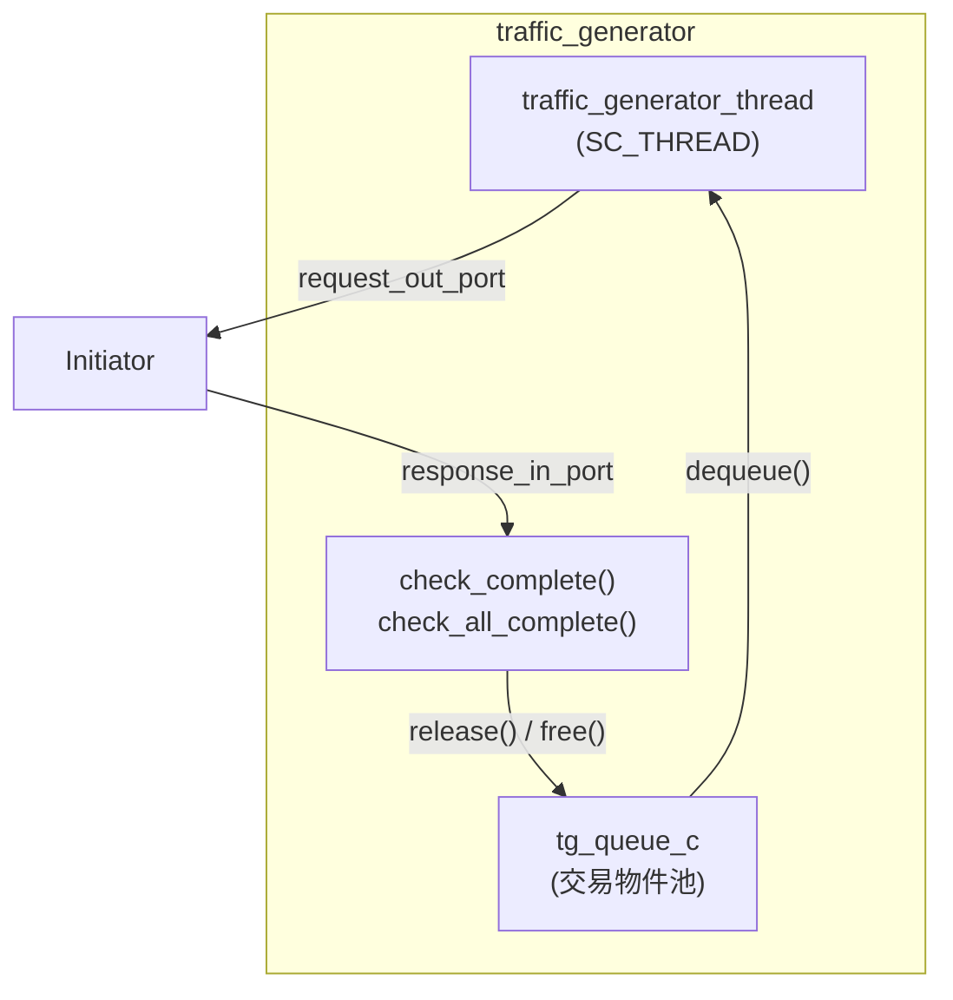
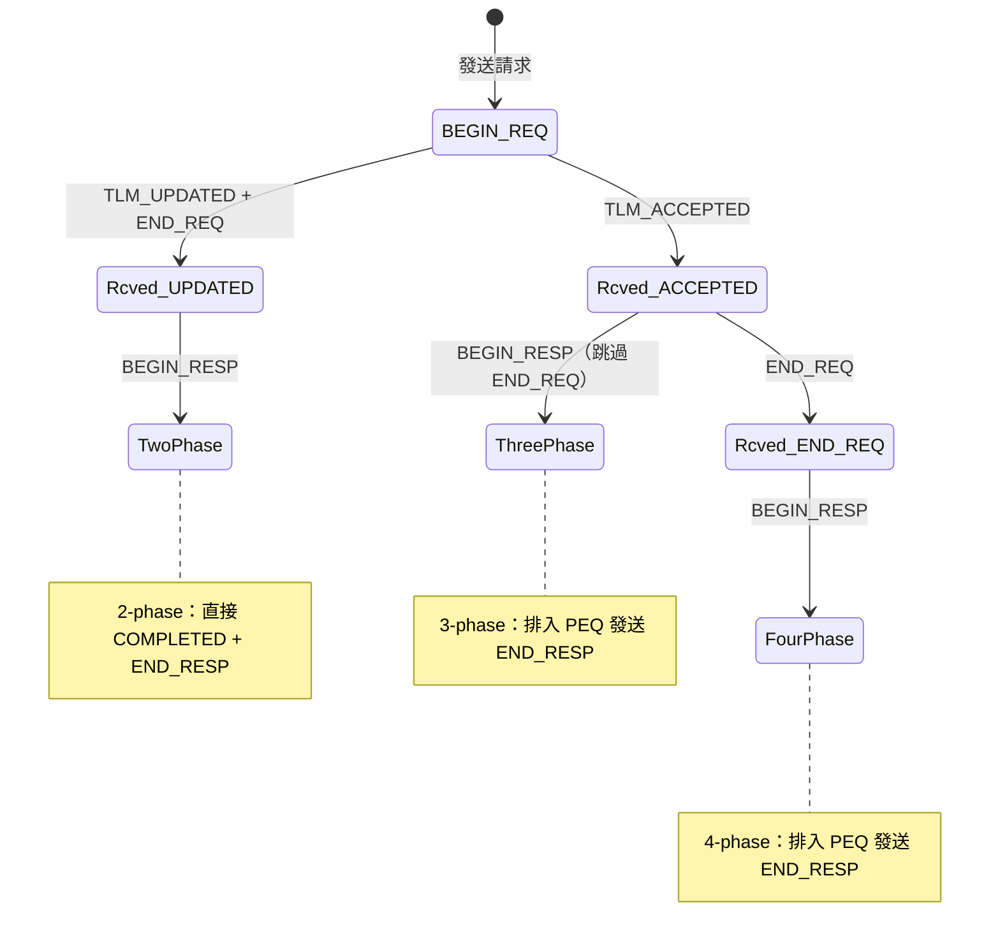

## 概觀

基礎設施元件提供測試和輔助功能，讓 TLM 範例可以專注於展示核心協定機制。

| 元件 | 軟體類比 | 功能 |
|------|----------|------|
| `traffic_generator` | 負載測試工具（k6, Python locust） | 自動產生 write-then-read 測試流量 |
| `select_initiator` | 自適應 HTTP client | 能處理 2/3/4 phase 不同協定的 AT initiator |
| `extension_initiator_id` | HTTP custom header | 在 generic payload 上附加自訂 metadata |
| `reporting` | logging library（Python logging） | 統一的日誌輸出框架 |

## traffic_generator -- 流量產生器

**檔案**：`include/traffic_generator.h`, `src/traffic_generator.cpp`

`traffic_generator` 是所有 TLM 範例的測試驅動程式。它產生一系列 write 和 read 交易，然後驗證讀回的資料是否與寫入的一致。

### 軟體類比

```python
# traffic_generator 就像一個自動化測試腳本
async def memory_test(base_address):
    # Phase 1: 寫入
    for addr in range(base, base + 64, 4):
        await write_request(addr, addr)  # 寫入位址作為資料
    # Phase 2: 讀回並驗證
    for addr in range(base, base + 64, 4):
        data = await read_request(addr)
        assert data == addr, "Data mismatch!"
```

### 架構



### 建構參數

| 參數 | 說明 |
|------|------|
| `ID` | 產生器識別碼 |
| `base_address_1` | 第一個目標位址區段 |
| `base_address_2` | 第二個目標位址區段 |
| `active_txn_count` | 最大同時進行的交易數量（物件池大小） |

### 測試流程

`traffic_generator_thread` 執行以下步驟：

1. 對每個 base address（共 2 個）：
   - **Write Loop**：產生 16 筆 write 交易（4 bytes 資料 = 位址值）
   - **`check_all_complete()`** -- 等待所有 write 完成
   - **Read Loop**：產生 16 筆 read 交易，讀回剛寫入的位址
   - **`check_all_complete()`** -- 驗證所有 read 資料正確
2. 第二個 base address 使用反轉資料（`~address`）

### 交易物件池 (tg_queue_c)

`tg_queue_c` 實作了 TLM 的 `tlm_mm_interface`（memory management interface），提供交易物件的重複使用：

| 方法 | 功能 | 軟體類比 |
|------|------|----------|
| `enqueue()` | 建立新的 generic payload 並放入池中 | `new` + 放入 free list |
| `dequeue()` | 取出一個可用的 payload | 從 free list 取出 |
| `free()` | 回收 payload（由 `release()` 觸發） | 歸還到 free list |

每個 payload 附帶一個 4-byte 的資料 buffer（`m_txn_data_size = 4`）。

### 資料驗證

`check_complete()` 讀取 response FIFO，對 read 交易驗證資料：

```cpp
// 位址作為預期資料，但低 28 位元會被 SimpleBus 修改
const unsigned int data_mask(0x0FFFFFFF);
unsigned int read_data_masked = read_data & data_mask;

if (read_data_masked != (expected_data & data_mask)
    && read_data_masked != (~expected_data & data_mask)) {
    REPORT_FATAL(..., "Memory read data ERROR");
}
```

注意：因為 `SimpleBus` 會修改高 4 位元（用於 port 路由），所以只比對低 28 位元。

## select_initiator -- 自適應 AT Initiator

**檔案**：`include/select_initiator.h`, `src/select_initiator.cpp`

`select_initiator` 是一個能自動識別並正確處理 **2-phase、3-phase 和 4-phase** 協定的 AT initiator。根據 target 的回應動態調整行為。

### 與其他 AT Initiator 的差異

普通 AT initiator 只能處理特定的 phase 模式。`select_initiator` 透過追蹤 `previous_phase_enum` 來判斷應該走哪種路徑：



### 協定選擇邏輯

在 `nb_transport_bw` 處理 `BEGIN_RESP` 時：

| 先前狀態 | 協定類型 | 處理方式 |
|----------|---------|---------|
| `Rcved_UPDATED_enum` | 2-phase | 立即回傳 `TLM_COMPLETED`（phase = END_RESP），不排入 PEQ |
| `Rcved_ACCEPTED_enum` | 3-phase | 排入 PEQ 發送 END_RESP，通知 enable event |
| `Rcved_END_REQ_enum` | 4-phase | 排入 PEQ 發送 END_RESP |

### 追蹤模式

`m_enable_target_tracking` 旗標控制 `TLM_UPDATED` 回傳時的追蹤行為：
- `true`（預設）：設定為 `Rcved_UPDATED_enum`，後續 `BEGIN_RESP` 走 2-phase 路徑
- `false`：設定為 `Rcved_END_REQ_enum`，後續 `BEGIN_RESP` 走 4-phase 路徑

## extension_initiator_id -- Payload 擴展

**檔案**：`include/extension_initiator_id.h`, `src/extension_initiator_id.cpp`

TLM generic payload 的自訂擴展（extension），用來在交易中附加 initiator 的識別字串。

### 軟體類比

```python
# 就像在 HTTP request 上加 custom header
import requests
requests.get('/api/data', headers={
    'X-Initiator-ID': 'Initiator ID: 42'  # 自訂 metadata
})
```

### 實作

繼承 `tlm::tlm_extension<extension_initiator_id>`，必須實作：

| 方法 | 功能 |
|------|------|
| `copy_from()` | 從另一個 extension 複製資料 |
| `clone()` | 建立一份深拷貝 |

資料成員只有一個：`std::string m_initiator_id`。

### 使用方式

在 `traffic_generator` 中（需定義 `USING_EXTENSION_OPTIONAL`）：

```cpp
extension_initiator_id *ext = new extension_initiator_id;
ext->m_initiator_id = "'Initiator ID: 42'";
transaction_ptr->set_extension(ext);
```

在 `at_target_4_phase` 中讀取：

```cpp
extension_initiator_id *ext;
gp.get_extension(ext);
if (ext) {
    // 使用 ext->m_initiator_id
}
```

## reporting -- 日誌系統

**檔案**：`include/reporting.h`, `src/report.cpp`

提供統一的日誌輸出巨集和輔助函式。

### 日誌級別控制

```cpp
// 全域旗標
bool tlm_enable_info_reporting;
bool tlm_enable_warning_reporting;
bool tlm_enable_error_reporting;
bool tlm_enable_fatal_reporting;

// 控制巨集
REPORT_ENABLE_ALL_REPORTING();
REPORT_DISABLE_ALL_REPORTING();
REPORT_SET_ENABLES(info, warning, error, fatal);
```

### 日誌巨集

| 巨集 | SystemC 對應 | 用途 |
|------|-------------|------|
| `REPORT_INFO(source, routine, text)` | `SC_REPORT_INFO` | 一般資訊 |
| `REPORT_WARNING(source, routine, text)` | `SC_REPORT_WARNING` | 警告 |
| `REPORT_ERROR(source, routine, text)` | `SC_REPORT_ERROR` | 錯誤 |
| `REPORT_FATAL(source, routine, text)` | `SC_REPORT_FATAL` | 致命錯誤 |

每個巨集都會在訊息前加上時間戳和函式名稱。可以透過定義 `REPORTING_OFF` 巨集在編譯時完全移除所有日誌輸出。

### 輔助函式 (report namespace)

`report.cpp` 中提供了 TLM 型別的字串轉換：

| 函式 | 輸入 | 輸出範例 |
|------|------|----------|
| `report::print(tlm_phase)` | `BEGIN_REQ` | `"BEGIN_REQ"` |
| `report::print(tlm_sync_enum)` | `TLM_COMPLETED` | `"COMPLETED"` |
| `report::print(tlm_response_status)` | `TLM_OK_RESPONSE` | `"OK_RESPONSE"` |
| `report::print(ID, gp)` | generic payload | 格式化的 command/address/data |
| `report::print(ID, dmi)` | DMI properties | start/end addr, latency, access |

這些函式在所有 initiator 和 target 的日誌訊息中被廣泛使用。
