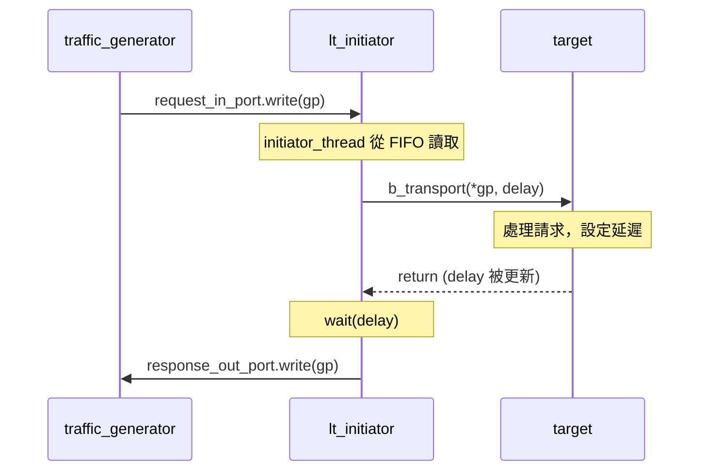
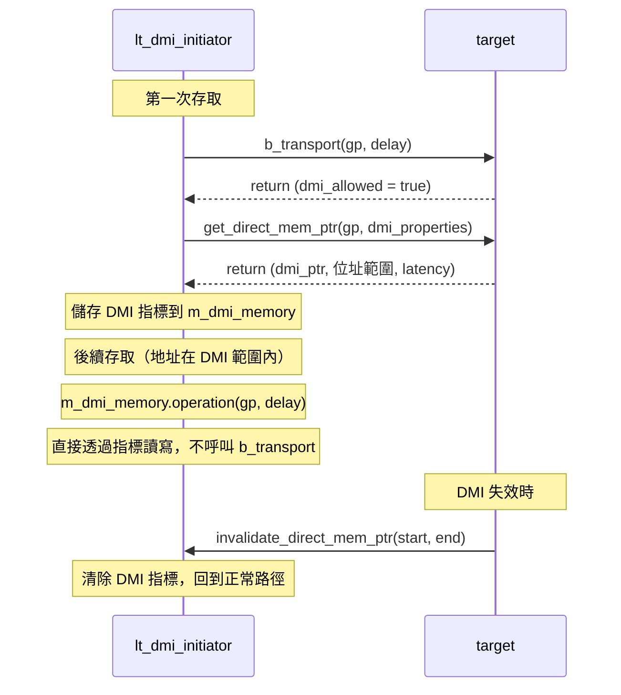
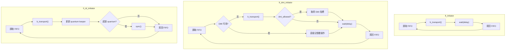

## 概觀

LT (Loosely-Timed) initiator 使用 **blocking transport** (`b_transport`) 來發送交易請求。這等同於軟體中的同步 HTTP client -- 發出請求後會等待回應完成才繼續。

```
// 軟體類比：同步 HTTP 請求
const response = await fetch('/api/data');  // 阻塞直到回應
processResponse(response);
```

三個 LT initiator 變體共享相同的基本模式，但各自加入了不同的最佳化策略：

| 元件 | 軟體類比 | 特點 |
|------|----------|------|
| `lt_initiator` | 基本的 `await fetch()` | 最簡單的同步呼叫 |
| `lt_dmi_initiator` | `fetch()` + `mmap` 快取 | 首次走正常路徑，之後直接存取記憶體 |
| `lt_td_initiator` | 批次處理 + `await fetch()` | 累積本地時間，減少同步次數 |

## 共同架構

所有 LT initiator 都遵循相同的資料流模式：



### 共同介面

三個 LT initiator 都有：

- **`initiator_socket`** -- TLM initiator socket，連接到 bus 或 target
- **`request_in_port`** -- 從 `traffic_generator` 接收交易請求的 FIFO port
- **`response_out_port`** -- 將完成的交易送回 `traffic_generator` 的 FIFO port
- **`initiator_thread`** -- `SC_THREAD`，主迴圈從 FIFO 讀取請求、發送、等待延遲、回傳結果

## lt_initiator -- 基本同步 Initiator

**檔案**：`include/lt_initiator.h`, `src/lt_initiator.cpp`

最簡單的 TLM initiator 實作。核心邏輯就是一個無窮迴圈：

1. 從 `request_in_port` 讀取一筆交易（如果 FIFO 為空則阻塞）
2. 呼叫 `b_transport(*transaction_ptr, delay)` -- 這是一個 blocking call
3. 檢查回應狀態（`TLM_OK_RESPONSE` 或錯誤）
4. `wait(delay)` -- 消耗 target 回傳的延遲時間
5. 將完成的交易寫回 `response_out_port`

```cpp
// 核心流程（簡化版）
void lt_initiator::initiator_thread(void) {
    while (true) {
        transaction_ptr = request_in_port->read();   // 1. 取得請求
        sc_time delay = SC_ZERO_TIME;
        initiator_socket->b_transport(*transaction_ptr, delay);  // 2. 發送
        if (gp_status == tlm::TLM_OK_RESPONSE)
            wait(delay);                              // 4. 等待延遲
        response_out_port->write(transaction_ptr);    // 5. 回傳結果
    }
}
```

**特殊功能**：`lt_initiator` 有兩個 socket -- `initiator_socket`（必要）和 `initiator_socket_opt`（選用）。選用 socket 使用 `simple_initiator_socket_optional`，允許不連接也不會報錯。

## lt_dmi_initiator -- DMI 快速存取 Initiator

**檔案**：`include/lt_dmi_initiator.h`, `src/lt_dmi_initiator.cpp`

在 `lt_initiator` 的基礎上加入 **DMI (Direct Memory Interface)** 支援。

### DMI 的軟體類比

想像一個 HTTP client 第一次存取遠端資料時走正常網路路徑，但 server 告訴它：「這塊資料你可以直接用 `mmap` 存取，不用再透過 HTTP。」之後的存取就直接透過共享記憶體進行，速度大幅提升。

```
// 軟體類比
response = await fetch('/api/memory');          // 第一次：正常 HTTP
if (response.headers['X-DMI-Allowed']) {
    sharedMem = mmap(response.dmiPointer);      // 取得直接存取指標
}
// 之後：
data = sharedMem[address];                      // 直接記憶體存取，不走 HTTP
```

### DMI 工作流程



### 關鍵成員

- **`m_dmi_memory`**（`dmi_memory` 類型）-- 管理 DMI 指標、檢查位址是否在 DMI 範圍內、執行直接讀寫
- **`m_dmi_properties`**（`tlm_dmi` 類型）-- 儲存 DMI 屬性（指標、位址範圍、延遲）
- **`custom_invalidate_dmi_ptr`** -- 當 target 呼叫 `invalidate_direct_mem_ptr` 時，清除本地 DMI 快取

## lt_td_initiator -- Temporal Decoupling Initiator

**檔案**：`include/lt_td_initiator.h`, `src/lt_td_initiator.cpp`

在 `lt_initiator` 的基礎上加入 **temporal decoupling** -- 允許本地時間跑在全域時間之前，減少同步次數。

### Temporal Decoupling 的軟體類比

想像一個分散式系統中的 worker 節點。正常情況下，每完成一個請求就要跟中央 coordinator 同步時鐘。使用 temporal decoupling，worker 可以先批次處理多個請求，累積本地時間，等超過一個「配額」（quantum）時才一次同步。

```
// 軟體類比：批次處理
const QUANTUM = 500;  // 累積到 500ns 再同步
let localTime = 0;

while (true) {
    const response = await processRequest();     // 處理請求
    localTime += response.delay;                 // 累積本地時間
    if (localTime >= QUANTUM) {
        await syncWithCoordinator(localTime);    // 同步全域時鐘
        localTime = 0;
    }
}
```

### 關鍵成員

- **`m_quantum_keeper`**（`tlm_quantumkeeper` 類型）-- 管理本地時間與全域同步
  - `get_local_time()` -- 取得目前累積的本地時間
  - `set(delay)` -- 設定新的本地時間
  - `need_sync()` -- 檢查是否超過 quantum 需要同步
  - `sync()` -- 與全域時鐘同步

### 工作流程差異

與 `lt_initiator` 的關鍵差異在於延遲處理方式：

| 步驟 | lt_initiator | lt_td_initiator |
|------|-------------|-----------------|
| 取得延遲 | `delay = SC_ZERO_TIME` | `delay = m_quantum_keeper.get_local_time()` |
| 發送請求 | `b_transport(gp, delay)` | `b_transport(gp, m_delay)` |
| 處理延遲 | `wait(delay)` | `m_quantum_keeper.set(m_delay)` |
| 同步時機 | 每次交易都同步 | 僅在 `need_sync()` 為 true 時 |

在建構函式中，設定全域 quantum 為 500 ns：
```cpp
tlm_utils::tlm_quantumkeeper::set_global_quantum(sc_time(500, SC_NS));
```

這表示 initiator 可以累積最多 500 ns 的本地時間偏移才需要與 SystemC 核心同步。

## 三者比較



| 特性 | lt_initiator | lt_dmi_initiator | lt_td_initiator |
|------|-------------|-----------------|-----------------|
| 傳輸方式 | `b_transport` | `b_transport` + DMI | `b_transport` |
| 時間模型 | 每次 `wait(delay)` | 每次 `wait(delay)` | 累積到 quantum 再同步 |
| 效能 | 基準 | 重複存取快很多 | 減少同步開銷 |
| 複雜度 | 低 | 中 | 中 |
| Socket 類型 | `simple_initiator_socket` | `simple_initiator_socket` | `simple_initiator_socket` |
| 適用場景 | 基本功能驗證 | 需要快速記憶體存取 | 需要高模擬速度 |
