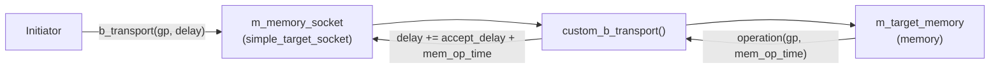
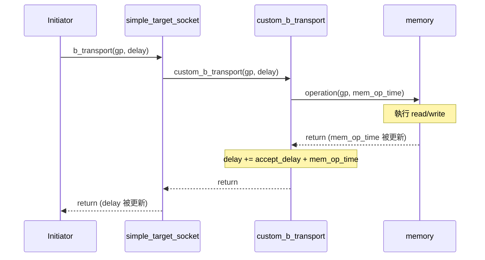
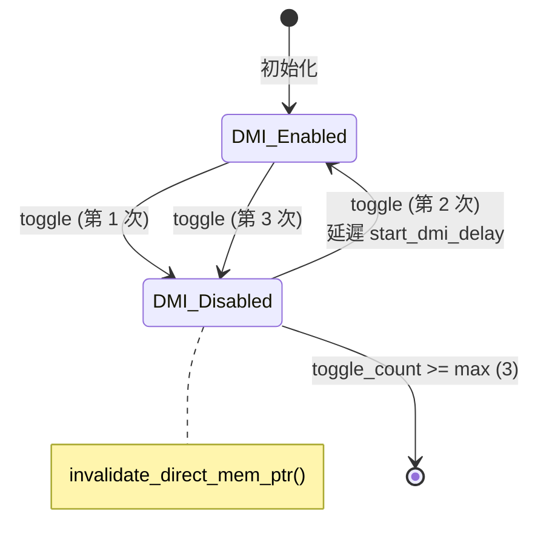

## 概觀

LT (Loosely-Timed) target 負責處理來自 initiator 的 `b_transport`（blocking transport）呼叫。就像軟體中的同步 HTTP request handler -- 收到請求、處理、回傳結果，全部在同一個函式呼叫中完成。

```javascript
// 軟體類比：Express.js 的同步 handler
app.post('/api/memory', (req, res) => {
    const data = memoryStore.read(req.body.address);  // 讀取記憶體
    res.json(data);                                    // 回傳結果
    // delay 透過回傳值（累積的延遲時間）傳達
});
```

三個 LT target 變體：

| 元件 | 軟體類比 | 特點 |
|------|----------|------|
| `lt_target` | 基本的 request handler | 處理請求、回傳延遲 |
| `lt_dmi_target` | handler + 可開關的 `mmap` 支援 | 可動態提供/撤銷 DMI 指標 |
| `lt_synch_target` | handler + 強制等待 | 在 handler 內呼叫 `wait()`，強制 initiator 同步 |

## 共同架構

所有 LT target 都使用 `simple_target_socket` 並註冊 `custom_b_transport` callback。內部包含一個 `memory` 物件來執行實際的讀寫操作。



### 共同建構參數

所有 LT target 都接收以下參數：

| 參數 | 說明 | 軟體類比 |
|------|------|----------|
| `ID` | target 識別碼 | server instance ID |
| `memory_socket` | socket 名稱 | endpoint 名稱 |
| `memory_size` | 記憶體大小 (bytes) | 資料庫容量 |
| `memory_width` | 記憶體寬度 (bytes) | 單次讀寫的最大資料量 |
| `accept_delay` | 接受延遲 | 請求排隊等待時間 |
| `read_response_delay` | 讀取延遲 | SELECT 查詢時間 |
| `write_response_delay` | 寫入延遲 | INSERT/UPDATE 查詢時間 |

## lt_target -- 基本同步 Target

**檔案**：`include/lt_target.h`, `src/lt_target.cpp`

最簡單的 TLM target 實作。

### 工作流程



### 關鍵實作

`custom_b_transport` 的邏輯非常直接：

```cpp
void lt_target::custom_b_transport(
    tlm::tlm_generic_payload &payload,
    sc_core::sc_time &delay_time)
{
    sc_core::sc_time mem_op_time;
    m_target_memory.operation(payload, mem_op_time);  // 執行記憶體操作
    delay_time = delay_time + m_accept_delay + mem_op_time;  // 累積延遲
}
```

延遲的計算方式：`總延遲 = 傳入延遲 + accept_delay + memory_operation_delay`

**特殊功能**：`lt_target` 有兩個 socket -- `m_memory_socket`（主要）和 `m_optional_socket`（選用，使用 `simple_target_socket_optional`）。兩者都註冊同一個 `custom_b_transport`。

## lt_dmi_target -- DMI 支援的 Target

**檔案**：`include/lt_dmi_target.h`, `src/lt_dmi_target.cpp`

在 `lt_target` 的基礎上，增加了動態開關 DMI 存取的能力。

### DMI 的軟體類比

想像一個 REST API server 有時候會告訴 client：「你可以直接存取共享記憶體，不用走 HTTP 了。」但基於安全或一致性考量，server 也可以隨時撤銷這個權限。

### 額外功能

1. **DMI 指標提供**：實作 `get_direct_mem_ptr()` -- 當 initiator 請求 DMI 時，回傳記憶體的原始指標
2. **DMI 允許標記**：在 `custom_b_transport()` 中設定 `payload.set_dmi_allowed(true/false)`
3. **DMI 開關切換**：`toggle_dmi_method`（SC_METHOD）定期切換 DMI 狀態

### DMI 開關機制



- **`m_dmi_enabled`** -- 追蹤目前 DMI 是否開啟
- **`m_toggle_count`** / **`m_max_dmi_toggle_count`** (= 3) -- 限制切換次數
- 當 DMI 被關閉時，呼叫 `m_memory_socket->invalidate_direct_mem_ptr()` 通知所有 initiator 清除 DMI 快取
- 切換使用 `next_trigger()` 延遲下一次執行

### get_direct_mem_ptr 實作

```cpp
bool lt_dmi_target::get_direct_mem_ptr(
    tlm::tlm_generic_payload &gp,
    tlm::tlm_dmi &dmi_properties)
{
    if (!m_dmi_enabled) return false;

    sc_dt::uint64 address = gp.get_address();
    if (address < m_end_address + 1) {
        dmi_properties.allow_read_write();
        dmi_properties.set_start_address(m_start_address);
        dmi_properties.set_end_address(m_end_address);
        dmi_properties.set_dmi_ptr(m_target_memory.get_mem_ptr());
        dmi_properties.set_read_latency(m_read_response_delay);
        dmi_properties.set_write_latency(m_write_response_delay);
        return true;
    }
    return false;
}
```

## lt_synch_target -- 強制同步 Target

**檔案**：`include/lt_synch_target.h`, `src/lt_synch_target.cpp`

特殊用途的 LT target，在 `b_transport` 內呼叫 `wait()` 來**強制** initiator 與全域時鐘同步。

### 為什麼需要強制同步？

在 temporal decoupling 模式下，initiator 的本地時間可能跑在全域時間前面。`lt_synch_target` 透過在 `b_transport` 中呼叫 `wait()`，強制 SystemC 核心排程一次時間前進。

```
// 軟體類比
app.post('/api/sync-memory', async (req, res) => {
    const data = memoryStore.read(req.body.address);
    await sleep(computedDelay);  // 強制等待（不只是回傳延遲值）
    res.json({ data, delay: 0 });  // 延遲已經被消耗了
});
```

### 關鍵差異

與 `lt_target` 的唯一差異在於 `custom_b_transport` 中：

```cpp
void lt_synch_target::custom_b_transport(
    tlm::tlm_generic_payload &payload,
    sc_core::sc_time &delay_time)
{
    sc_core::sc_time mem_op_time;
    m_target_memory.operation(payload, mem_op_time);
    delay_time = delay_time + m_accept_delay + mem_op_time;

    wait(delay_time);          // 強制同步！消耗全部延遲
    delay_time = SC_ZERO_TIME; // 重設延遲為零
}
```

| 步驟 | lt_target | lt_synch_target |
|------|-----------|-----------------|
| 計算延遲 | `delay += accept + mem_op` | `delay += accept + mem_op` |
| 消耗延遲 | 不消耗（回傳給 initiator 處理） | `wait(delay)` 消耗全部 |
| 回傳延遲 | 累積的延遲值 | `SC_ZERO_TIME` |
| 效果 | initiator 自行決定何時同步 | 強制 SystemC 核心推進時間 |

這個 target 專門設計來搭配 `lt_td_initiator` 使用，用於測試 temporal decoupling 機制在遇到強制同步點時的行為。

## 三者比較

| 特性 | lt_target | lt_dmi_target | lt_synch_target |
|------|-----------|---------------|-----------------|
| Socket 類型 | `simple_target_socket` + optional | `simple_target_socket` | `simple_target_socket` |
| DMI 支援 | 無 | 有（可動態開關） | 無 |
| 強制同步 | 無 | 無 | 有 |
| `b_transport` 內呼叫 `wait()` | 否 | 否 | 是 |
| 適用場景 | 基本功能驗證 | DMI 範例 | TD 範例（測試同步機制） |
