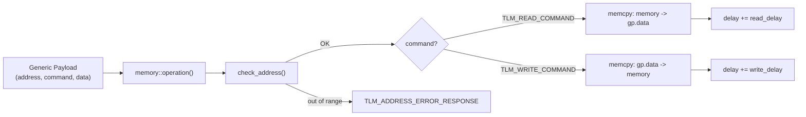
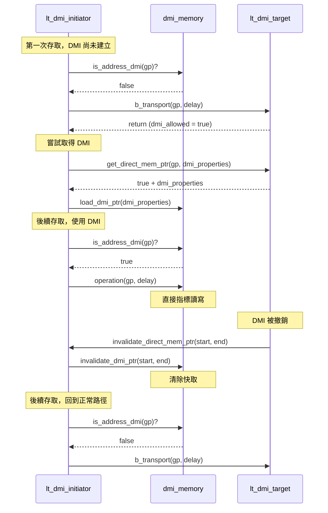

## 概觀

`memory` 和 `dmi_memory` 提供了所有 TLM target 使用的記憶體儲存功能。它們**不是** SystemC module，而是純粹的 C++ 類別，被嵌入到各個 target 模組中。

### 軟體類比

| 元件 | 軟體類比 |
|------|----------|
| `memory` | 記憶體內資料庫（如 Redis），透過 API 存取 |
| `dmi_memory` | 共享記憶體管理器（如 `mmap` wrapper），直接指標存取 |

## memory -- 通用記憶體

**檔案**：`include/memory.h`, `src/memory.cpp`

### 功能

`memory` 類別封裝了一塊動態分配的 `unsigned char` 陣列，提供基於 TLM generic payload 的讀寫操作。



### 建構參數

```cpp
memory(
    const unsigned int ID,      // 用於日誌的識別碼
    sc_core::sc_time read_delay,   // 讀取延遲
    sc_core::sc_time write_delay,  // 寫入延遲
    sc_dt::uint64 memory_size,     // 記憶體大小 (bytes)
    unsigned int memory_width      // 記憶體寬度 (bytes)
);
```

- 建構時分配 `memory_size` bytes 的記憶體並初始化為零
- 驗證 `memory_width > 0` 且 `memory_size % memory_width == 0`

### 主要方法

#### operation()

執行實際的讀/寫操作：

1. 從 generic payload 提取 address、command、data pointer、data length
2. `check_address()` -- 驗證位址是否在範圍內
3. 檢查 `byte_enable`（不支援，回傳 `TLM_BYTE_ENABLE_ERROR_RESPONSE`）
4. 檢查 `streaming_width`（不支援非等長 streaming，回傳 `TLM_BURST_ERROR_RESPONSE`）
5. 執行 read/write：逐 byte 複製資料

```cpp
case tlm::TLM_WRITE_COMMAND:
    for (unsigned int i = 0; i < length; i++)
        m_memory[address++] = data[i];  // 寫入
    delay_time += m_write_delay;
    break;

case tlm::TLM_READ_COMMAND:
    for (unsigned int i = 0; i < length; i++)
        data[i] = m_memory[address++];  // 讀取
    delay_time += m_read_delay;
    break;
```

#### get_delay()

只取得延遲值而不實際執行操作。AT target 在 `nb_transport_fw` 階段用來計算延遲，而實際操作推遲到 `begin_response_method` 中執行。

#### get_mem_ptr()

回傳內部記憶體陣列的原始指標。供 DMI 使用 -- target 透過這個指標讓 initiator 直接存取記憶體。

### 錯誤處理

| 情況 | 回應狀態 |
|------|---------|
| 位址超出範圍 | `TLM_ADDRESS_ERROR_RESPONSE` |
| 位址 + 長度超出範圍 | `TLM_ADDRESS_ERROR_RESPONSE` |
| 設定了 byte enable | `TLM_BYTE_ENABLE_ERROR_RESPONSE` |
| streaming_width 不等於 data_length | `TLM_BURST_ERROR_RESPONSE` |
| 不支援的 command | `TLM_COMMAND_ERROR_RESPONSE` |

## dmi_memory -- DMI 記憶體管理器

**檔案**：`include/dmi_memory.h`, `src/dmi_memory.cpp`

`dmi_memory` 是 **initiator 端**的 DMI 快取管理器。它儲存 target 提供的 DMI 指標，並透過該指標直接執行讀寫操作。

### 軟體類比

```javascript
// dmi_memory 就像一個 mmap wrapper
class DmiMemory {
    constructor() {
        this.mappedPtr = null;      // DMI 指標
        this.startAddress = 0;       // 映射起始位址
        this.size = 0;               // 映射大小
    }

    loadMapping(dmiInfo) {           // load_dmi_ptr()
        this.mappedPtr = dmiInfo.ptr;
        this.startAddress = dmiInfo.startAddress;
        this.size = dmiInfo.endAddress - dmiInfo.startAddress;
    }

    isAddressMapped(address) {       // is_address_dmi()
        return address >= this.startAddress
            && address < this.startAddress + this.size;
    }

    read(address) {                  // operation() with TLM_READ_COMMAND
        const offset = address - this.startAddress;
        return this.mappedPtr[offset];  // 直接指標存取！
    }

    invalidate(start, end) {         // invalidate_dmi_ptr()
        this.mappedPtr = null;       // 清除映射
    }
}
```

### 主要方法

#### load_dmi_ptr()

從 `tlm_dmi` 物件載入 DMI 參數：

- `m_dmi_ptr` -- 直接記憶體指標
- `m_dmi_read_latency` / `m_dmi_write_latency` -- DMI 延遲（通常比正常存取快）
- `m_dmi_base_address` -- 映射起始位址
- `m_dmi_size` -- 映射大小
- `m_granted_access` -- 授權的存取類型（讀/寫/讀寫）

#### is_address_dmi()

檢查 generic payload 中的位址是否在 DMI 映射範圍內，並驗證存取權限：

- 位址必須在 `[m_dmi_base_address, m_dmi_base_address + m_dmi_size)` 範圍內
- 寫入操作需要非 `DMI_ACCESS_READ` 且非 `DMI_ACCESS_NONE` 的權限
- 讀取操作需要非 `DMI_ACCESS_WRITE` 且非 `DMI_ACCESS_NONE` 的權限

#### operation()

透過 DMI 指標直接讀寫：

```cpp
// 計算偏移量
m_offset = m_address - m_dmi_base_address;

// 直接指標操作
case TLM_WRITE_COMMAND:
    m_dmi_ptr[m_offset + i] = m_data[i];
    delay += m_dmi_write_latency;
    break;
case TLM_READ_COMMAND:
    m_data[i] = m_dmi_ptr[m_offset + i];
    delay += m_dmi_read_latency;
    break;
```

#### invalidate_dmi_ptr()

當 target 撤銷 DMI 權限時，清除本地快取（設定 `m_start_address > m_end_address` 使所有位址檢查失敗）。

### DMI 完整流程



## 兩者的關係

| 方面 | memory | dmi_memory |
|------|--------|------------|
| 使用端 | Target 內部 | Initiator 內部 |
| 資料儲存 | 自行分配記憶體陣列 | 使用 target 提供的指標 |
| 存取方式 | 透過 generic payload | 透過 DMI 指標直接存取 |
| 角色 | 真正的記憶體儲存 | 快取的 DMI 指標管理器 |
| SystemC 依賴 | 無（純 C++ 類別） | 無（純 C++ 類別） |
