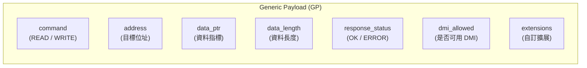
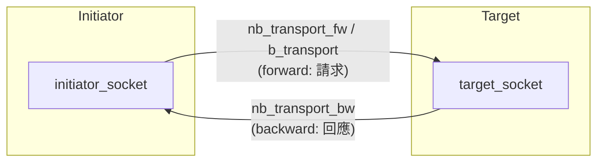
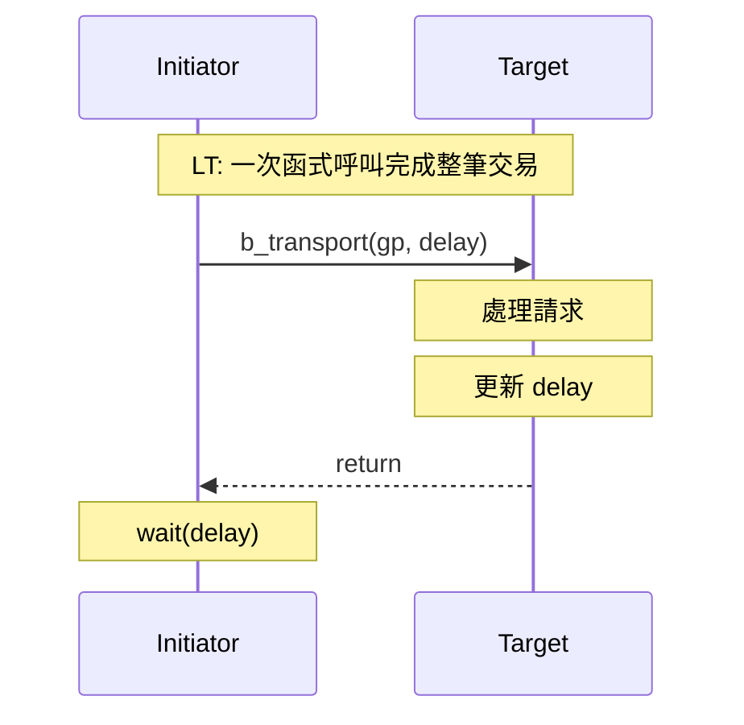
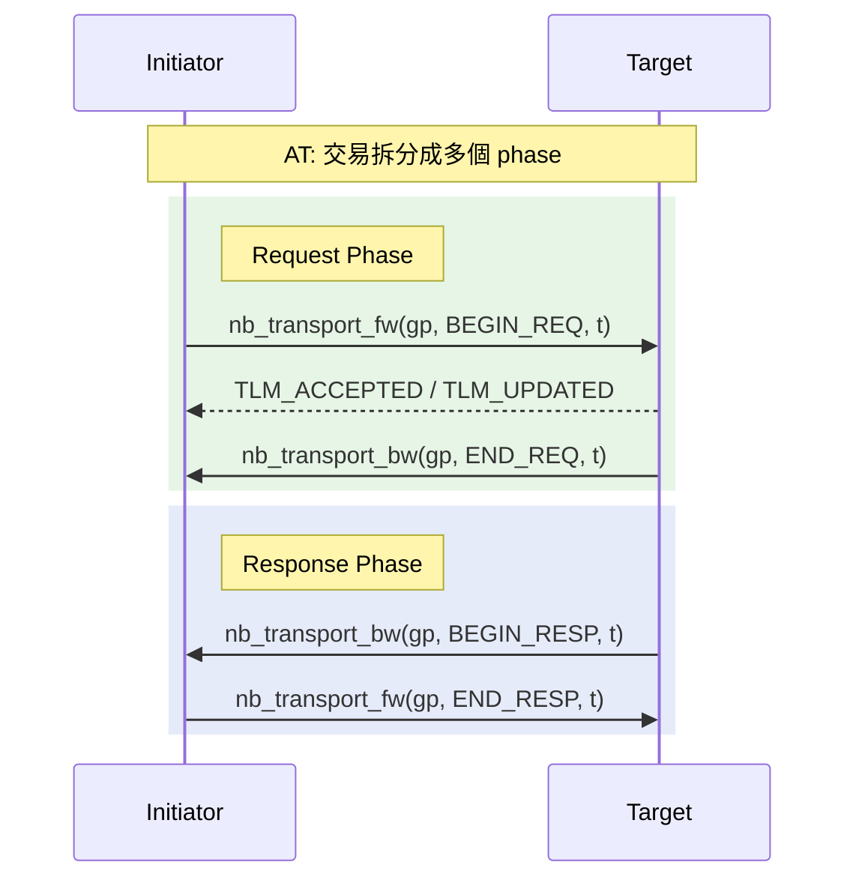
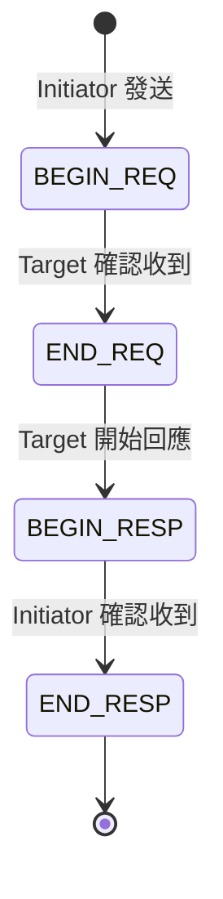
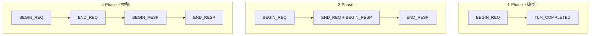
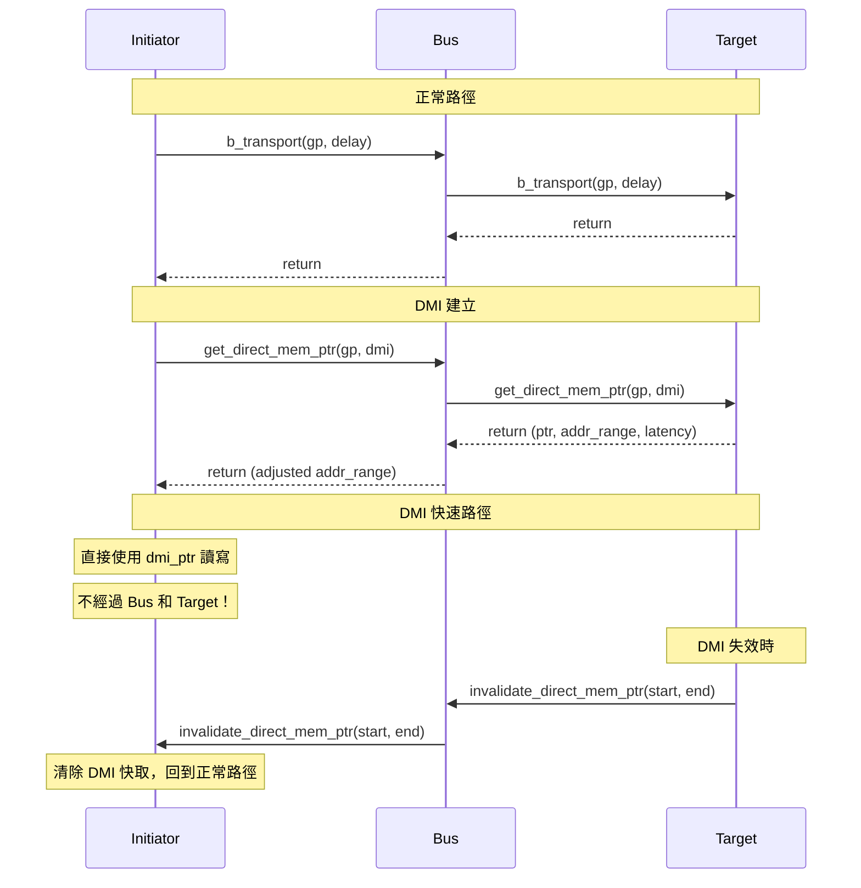
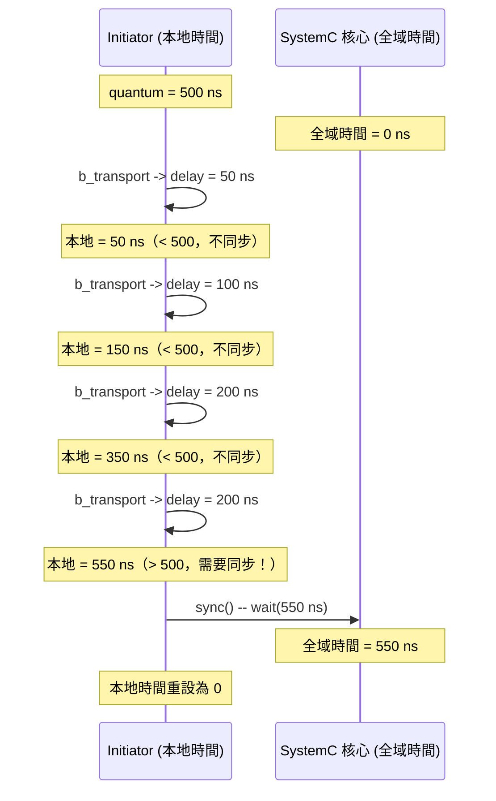
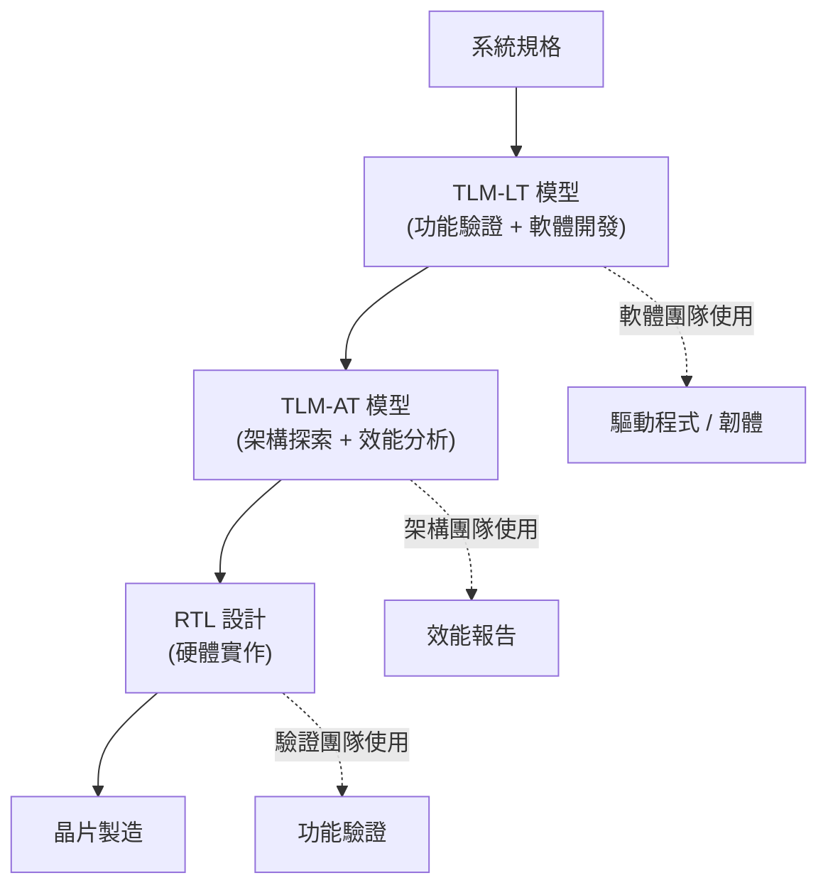

## 什麼是 TLM？

**TLM (Transaction Level Modeling)** 是一種將硬體元件之間的通訊抽象化的方法。在傳統的 RTL (Register Transfer Level) 模擬中，每個時脈週期的每根信號線都會被模擬。TLM 則把整個通訊過程壓縮成一次「交易」（transaction） -- 一個函式呼叫。

### 軟體類比

| 抽象層級 | 硬體 | 軟體類比 |
|----------|------|----------|
| RTL | 每個時脈、每根信號 | 逐 byte 的 TCP socket 操作 |
| TLM-AT | 有 phase 的交易 | HTTP/2 多路復用 + 進度回呼 |
| TLM-LT | 單次函式呼叫 | `await fetch('/api/data')` |

效能差異巨大：TLM 模擬通常比 RTL 快 **1000 倍以上**。這讓軟體團隊可以在硬體還沒完成之前就開始開發和測試驅動程式。

## 核心概念

### 1. Transaction (交易)

一筆交易就是一個 **Generic Payload (GP)** 物件，包含讀寫操作需要的所有資訊。



軟體類比 -- 就是一個 HTTP request 物件：

| GP 欄位 | HTTP 類比 |
|---------|----------|
| `command` | HTTP method (GET/POST) |
| `address` | URL |
| `data_ptr` + `data_length` | request/response body |
| `response_status` | HTTP status code (200/404/500) |
| `dmi_allowed` | `X-DMI-Allowed` header |
| `extensions` | custom HTTP headers |

### 2. Socket (連線端點)

TLM socket 是模組之間的**雙向**連線端點。一個 socket 同時支援前向和後向傳輸。



軟體類比 -- 類似 gRPC 的 bidirectional streaming，或 WebSocket 連線。不像 HTTP 只有 request-response，TLM socket 允許雙方隨時發送訊息。

### 3. Initiator 與 Target

| 角色 | 定義 | 軟體類比 |
|------|------|----------|
| Initiator | 發起交易的一方 | HTTP client |
| Target | 處理交易的一方 | HTTP server |

一個模組可以同時是 initiator 和 target（例如 bus）。

## LT vs AT：兩種傳輸模式

### LT (Loosely-Timed) -- 同步模式



**軟體類比**：同步 HTTP 請求

```javascript
// LT 就像 await fetch()
const response = await fetch('/api/memory?addr=0x1000');
const data = await response.json();
```

**特點**：
- 一次函式呼叫（`b_transport`）完成整筆交易
- 呼叫者阻塞直到完成
- 延遲透過 `delay` 參數累積
- **最快的模擬速度**，適合功能驗證

### AT (Approximately-Timed) -- 非同步模式



**軟體類比**：HTTP/2 多路復用 + 進度回呼

```javascript
// AT 就像帶回呼的非同步 HTTP
const request = http2.request('/api/memory?addr=0x1000');
request.on('headers', (h) => { /* END_REQ: server 收到了 */ });
request.on('response', (r) => { /* BEGIN_RESP: 開始收資料 */ });
request.on('end', () => { /* END_RESP: 傳輸完成 */ });
request.end();  // BEGIN_REQ: 發送請求
```

**特點**：
- 交易拆分成 2~4 個 phase
- 非阻塞呼叫，可管線化（pipeline）
- 更精確的時序建模
- **較慢的模擬速度**，適合需要精確時序的場景

### LT vs AT 選擇指南

| 需求 | 選擇 |
|------|------|
| 最快的模擬速度 | LT |
| 只需要功能驗證 | LT |
| 需要建模 bus 競爭 | AT |
| 需要精確的時序行為 | AT |
| 軟體開發測試平台 | LT |
| 架構探索 | AT |

## Phase 協定詳解

### 四個標準 Phase



| Phase | 方向 | 意義 | 軟體類比 |
|-------|------|------|----------|
| `BEGIN_REQ` | Initiator -> Target | 請求開始 | TCP SYN |
| `END_REQ` | Target -> Initiator | 請求被接受 | TCP SYN-ACK |
| `BEGIN_RESP` | Target -> Initiator | 回應開始 | HTTP 200 OK headers |
| `END_RESP` | Initiator -> Target | 回應確認 | TCP ACK |

### Phase 可以被省略

不是每筆交易都需要走完全部 4 個 phase：



### 回傳值 (tlm_sync_enum)

| 值 | 意義 | 後續動作 |
|----|------|----------|
| `TLM_ACCEPTED` | 已接受，等待後續回呼 | 等待 backward path 上的 phase |
| `TLM_UPDATED` | 已接受，且 phase/delay 被更新 | 讀取更新後的 phase 和 delay |
| `TLM_COMPLETED` | 交易立即完成 | 消耗 annotated delay，不需要更多 phase |

## DMI (Direct Memory Interface) -- 快速路徑

### 為什麼需要 DMI？

即使 LT 模式已經很快了，每次讀寫都要走一次函式呼叫仍然有開銷。DMI 允許 initiator 取得 target 記憶體的原始指標，之後直接透過指標讀寫，完全繞過 transport 層。



### 軟體類比

| 概念 | 軟體類比 |
|------|----------|
| 正常 transport | 透過 REST API 讀寫資料庫 |
| DMI | `mmap` 共享記憶體，直接指標操作 |
| DMI invalidation | `mmap` 映射被 `munmap` 或 `madvise(MADV_DONTNEED)` |

### DMI 提供的資訊

```cpp
struct tlm_dmi {
    unsigned char* dmi_ptr;           // 直接記憶體指標
    sc_dt::uint64  start_address;     // 有效位址範圍起始
    sc_dt::uint64  end_address;       // 有效位址範圍結束
    sc_time        read_latency;      // DMI 讀取延遲
    sc_time        write_latency;     // DMI 寫入延遲
    dmi_access_e   granted_access;    // 授權（READ/WRITE/READ_WRITE）
};
```

## Temporal Decoupling -- 時間解耦

### 問題

在 SystemC 模擬中，每次 `wait()` 都會讓模擬核心評估所有就緒的 process。如果每筆交易都 `wait(delay)`，模擬會很慢。

### 解法

Temporal decoupling 允許 initiator 的本地時間跑在全域時間前面。只有當累積的偏移超過一個「配額」（quantum）時才同步。



### 軟體類比

```javascript
// 沒有 temporal decoupling：每個操作都同步
for (const op of operations) {
    await processAsync(op);          // 每次都等待
    await syncClock();               // 每次都同步
}

// 有 temporal decoupling：批次處理
let localTime = 0;
const QUANTUM = 500;
for (const op of operations) {
    localTime += processSync(op);    // 本地累積
    if (localTime >= QUANTUM) {
        await syncClock(localTime);  // 超過配額才同步
        localTime = 0;
    }
}
```

### Quantum Keeper

```cpp
// 使用方式
tlm_utils::tlm_quantumkeeper m_quantum_keeper;

// 設定全域配額
tlm_quantumkeeper::set_global_quantum(sc_time(500, SC_NS));

// 在交易後更新
m_quantum_keeper.set(delay);

// 檢查是否需要同步
if (m_quantum_keeper.need_sync()) {
    m_quantum_keeper.sync();  // 呼叫 wait()，推進全域時間
}
```

## 為什麼 TLM 重要？

### 對軟體工程師的價值

1. **早期軟體開發**：不需要等硬體完成，就可以用 TLM 模型開發和測試驅動程式
2. **快速迭代**：TLM 模擬比 RTL 快 1000x，測試循環從小時級縮短到秒級
3. **架構探索**：可以快速嘗試不同的硬體配置（記憶體大小、bus 寬度、cache 策略）
4. **軟硬體協同設計**：讓軟體和硬體團隊可以在同一個模型上協作

### TLM 在系統設計中的位置


