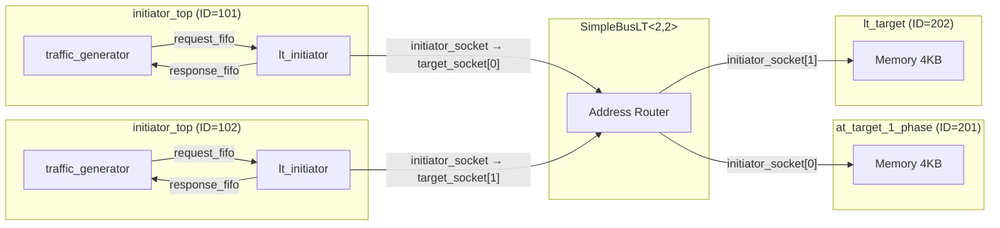

# LT (Loosely-Timed) 基本範例總覽

## 軟體類比：同步 HTTP 用戶端與伺服器

想像你正在寫一個最簡單的 HTTP 程式：用戶端送出一個 request，然後**阻塞等待**直到伺服器回傳 response。整個流程是同步的、一來一回的。

在 TLM 的世界裡，LT（Loosely-Timed）模式就是這個概念：

| HTTP 模型 | TLM LT 模型 |
|---|---|
| HTTP Client | Initiator（發起交易的一方，例如 CPU） |
| HTTP Server | Target（回應交易的一方，例如記憶體） |
| URL Router / Reverse Proxy | Bus（SimpleBusLT，根據位址路由交易） |
| `POST /data` (blocking call) | `b_transport()` (blocking transport) |
| Request body | `tlm_generic_payload`（包含位址、資料、讀/寫指令） |

重點：呼叫 `b_transport()` 時，整個呼叫者會阻塞（就像 `requests.get()` 會阻塞 Python 程式一樣），直到 target 處理完畢才返回。

## 系統架構

這個範例建構了一個最小的「多 client、多 server」系統：

- 2 個 initiator（用戶端），各自內含一個 traffic generator（產生讀寫請求）和一個 lt_initiator（執行 `b_transport` 呼叫）
- 1 個 SimpleBusLT（路由器），根據位址將請求轉發到對應的 target
- 2 個 target（伺服器），各自擁有 4KB 的模擬記憶體

## 元件連線圖

## 執行流程概要

1. `sc_main()` 建立 `lt_top` 頂層模組
2. `lt_top` 的建構式初始化所有元件，並透過 socket binding 將它們連線
3. 呼叫 `sc_start()` 啟動模擬
4. 兩個 traffic generator 各自在 SC_THREAD 中產生讀寫交易
5. 交易透過 `b_transport()` 經過 bus 路由到對應的 target
6. Target 完成記憶體讀寫後返回結果
7. Traffic generator 檢查結果正確性，所有交易完成後模擬結束

## 位址映射

| 位址範圍 | 目標 |
|---|---|
| `0x0000000000000000` 起始 | Target 1（經由 bus initiator_socket[0]） |
| `0x0000000010000000` 起始 | Target 2（經由 bus initiator_socket[1]） |

## 原始碼檔案

| 檔案 | 說明 |
|---|---|
| `src/lt.cpp` | 程式進入點 `sc_main` |
| `include/lt_top.h` / `src/lt_top.cpp` | 頂層模組，負責元件實例化與連線 |
| `include/initiator_top.h` / `src/initiator_top.cpp` | Initiator 包裝模組，內含 traffic generator 和 lt_initiator |

詳細的原始碼分析請參閱 [lt.md](lt.md)。
