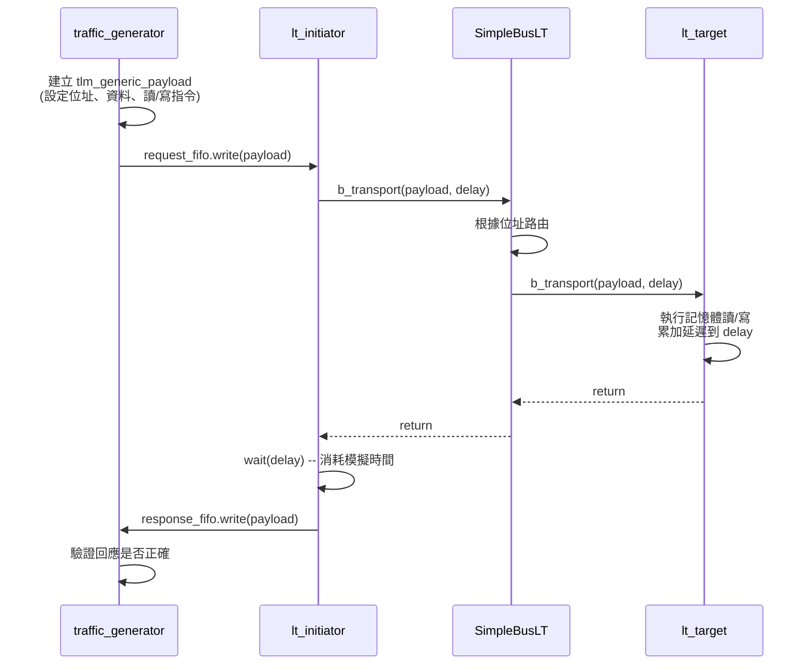

# LT 基本範例 -- 原始碼分析

本文件分析 `lt/` 目錄下所有原始碼，這是 TLM 2.0 最基本的 Loosely-Timed blocking transport 範例。

## 核心概念

LT 模式的精髓就是 **blocking transport**：initiator 呼叫 `b_transport()`，這個呼叫會阻塞直到 target 完成處理。就像你用 Python 的 `requests.get(url)` 一樣 -- 函式返回時，回應已經準備好了。

## 檔案結構

```
lt/
  include/
    initiator_top.h      -- initiator 包裝模組的宣告
    lt_top.h             -- 頂層模組的宣告
  src/
    initiator_top.cpp    -- initiator 包裝模組的實作
    lt_top.cpp           -- 頂層模組的實作，含元件連線
    lt.cpp               -- sc_main 進入點
```

---

## 1. `lt.cpp` -- 程式進入點

這是整個範例最簡單的檔案。SystemC 程式的進入點是 `sc_main`（而非 `main`）。

```cpp
int sc_main(int, char*[]) {
    REPORT_ENABLE_ALL_REPORTING();
    lt_top top("top");       // 建立頂層模組
    sc_core::sc_start();     // 啟動模擬（無時間限制，跑到沒有事件為止）
    return 0;
}
```

軟體類比：這就像啟動一個微服務架構 -- 你建立所有的 service（top 模組），然後啟動 event loop（`sc_start`）。

---

## 2. `lt_top.h` / `lt_top.cpp` -- 頂層模組

### 元件宣告

`lt_top` 繼承自 `sc_module`，內含以下成員：

| 成員 | 類型 | 說明 |
|---|---|---|
| `m_bus` | `SimpleBusLT<2, 2>` | 簡單匯流排，2 個 target port、2 個 initiator port |
| `m_at_and_lt_target_1` | `at_target_1_phase` | 第一個 target（同時支援 AT 和 LT） |
| `m_lt_target_2` | `lt_target` | 第二個 target（純 LT，使用 convenience socket） |
| `m_initiator_1` | `initiator_top` | 第一個 initiator |
| `m_initiator_2` | `initiator_top` | 第二個 initiator |

### 建構式中的連線

建構式做兩件事：

**第一步：初始化所有元件**

每個 target 都配置了記憶體大小、寬度和延遲參數：

```cpp
m_at_and_lt_target_1(
    "m_at_and_lt_target_1",
    201,                                   // Target ID
    "memory_socket_1",                     // socket name
    4*1024,                                // 4KB memory
    4,                                     // 4-byte width
    sc_core::sc_time(20, sc_core::SC_NS),  // accept delay
    sc_core::sc_time(100, sc_core::SC_NS), // read delay
    sc_core::sc_time(60, sc_core::SC_NS)   // write delay
)
```

軟體類比：這就像配置一個 REST API 伺服器的回應延遲 -- accept delay 是伺服器接收請求的時間，read/write delay 是處理請求的時間。

**第二步：Socket binding（連線）**

```cpp
// initiator -> bus
m_initiator_1.top_initiator_socket(m_bus.target_socket[0]);
m_initiator_2.top_initiator_socket(m_bus.target_socket[1]);

// bus -> target
m_bus.initiator_socket[0](m_at_and_lt_target_1.m_memory_socket);
m_bus.initiator_socket[1](m_lt_target_2.m_memory_socket);
```

軟體類比：這就像在 nginx 設定檔中配置反向代理規則 -- 把來自不同 client 的流量路由到不同的後端服務。

---

## 3. `initiator_top.h` / `initiator_top.cpp` -- Initiator 包裝模組

### 設計模式

`initiator_top` 是一個包裝模組，封裝了兩個內部元件：

- **`traffic_generator`**（來自 `tlm/common/`）：產生讀寫請求的「劇本」
- **`lt_initiator`**（來自 `tlm/common/`）：實際執行 `b_transport()` 呼叫的元件

兩者之間透過 `sc_fifo` 通訊：

```
traffic_generator --[request_fifo]--> lt_initiator --[response_fifo]--> traffic_generator
```

軟體類比：這就像把「測試案例產生器」和「HTTP client」分開 -- 測試案例產生器決定要送什麼請求，HTTP client 負責真正發送請求。兩者之間用 message queue（FIFO）連接。

### 階層式 Socket 連線

`initiator_top` 暴露一個 `top_initiator_socket`，並且在建構式中將內部 `lt_initiator` 的 socket 綁定到這個外部 socket：

```cpp
m_initiator.initiator_socket(top_initiator_socket);
```

這是 TLM 的**階層式連線**（hierarchical binding）-- 內部元件的 socket 透過外部模組的 socket 對外通訊，就像把部門內部的電話轉接到公司的總機號碼。

### 必要的虛擬方法

因為 `initiator_top` 實作了 `tlm_bw_transport_if`（backward transport interface），它必須提供兩個方法的實作，即使在 LT 模式下不會被呼叫：

- `invalidate_direct_mem_ptr()` -- DMI 相關（本範例未使用）
- `nb_transport_bw()` -- Non-blocking backward transport（AT 模式使用，本範例未使用）

這些方法在被意外呼叫時只會報告錯誤。

---

## 交易處理流程

以下是一次完整交易的執行流程：



## 重點摘要

1. **LT 模式使用 `b_transport()`**：同步阻塞呼叫，一次完成整個交易
2. **`tlm_generic_payload`** 是交易的「信封」：包含位址、資料指標、命令類型（讀/寫）、回應狀態
3. **延遲以 `sc_time` 參數返回**：target 不會真正消耗模擬時間，而是把延遲加到 `delay` 參數中，由 initiator 決定何時消耗
4. **Socket binding 是靜態的**：在建構式中完成，模擬開始後不可改變
5. **SimpleBusLT 做位址路由**：根據 payload 中的位址決定轉發到哪個 target
