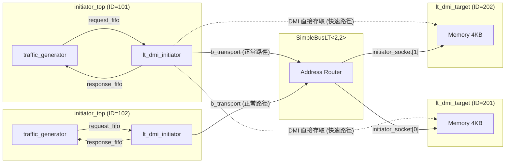

# LT + DMI 範例總覽

## 軟體類比：mmap 快速記憶體存取

在一般的檔案 I/O 中，每次讀寫都需要經過 system call（`read()`/`write()`），核心要做權限檢查、拷貝資料等等。但如果你使用 `mmap()`，作業系統會把檔案直接映射到你的程式記憶體空間中，之後你就可以像存取普通變數一樣讀寫檔案 -- 不需要任何 system call，速度快很多。

TLM 的 DMI（Direct Memory Interface）就是同樣的概念：

| 普通檔案 I/O | TLM 一般交易 |
|---|---|
| `read(fd, buf, len)` | `b_transport(payload, delay)` |
| 每次都要 system call | 每次都要經過 bus 路由 |
| 安全但慢 | 精確但慢 |

| mmap | TLM DMI |
|---|---|
| `ptr = mmap(fd)` | `get_direct_mem_ptr()` 取得記憶體指標 |
| `*ptr = data` | 直接透過指標讀寫 |
| 快速，繞過核心 | 快速，繞過 bus 和 target |

## 與基本 LT 的差異

基本 LT 範例中，每次讀寫都要經過完整的 `b_transport()` 呼叫鏈（initiator -> bus -> target -> bus -> initiator）。加入 DMI 後：

1. 第一次交易仍然走正常路徑
2. Target 告訴 initiator：「你可以用 DMI 直接存取我的記憶體」
3. 之後的交易，initiator 直接透過指標讀寫 target 的記憶體，不經過 bus

## 系統架構

虛線表示 DMI 快速路徑 -- 繞過 bus，直接存取記憶體。

## 原始碼檔案

| 檔案 | 說明 |
|---|---|
| `src/lt_dmi.cpp` | 程式進入點 `sc_main` |
| `include/lt_dmi_top.h` / `src/lt_dmi_top.cpp` | 頂層模組，含元件實例化、連線及模擬時間限制 |
| `include/initiator_top.h` / `src/initiator_top.cpp` | Initiator 包裝模組，使用 `lt_dmi_initiator` |

詳細的原始碼分析請參閱 [lt-dmi.md](lt-dmi.md)。
