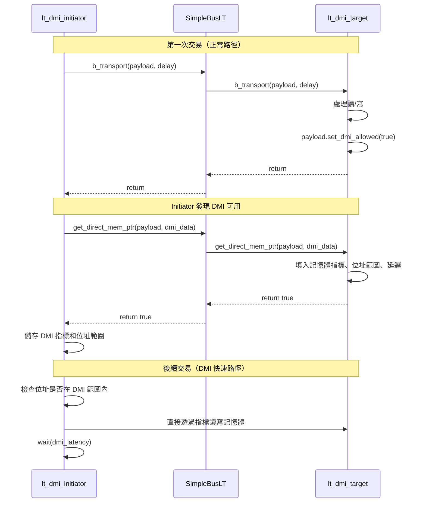

# LT + DMI 範例 -- 原始碼分析

本文件分析 `lt_dmi/` 目錄下所有原始碼，展示如何在 Loosely-Timed 模式中加入 Direct Memory Interface（DMI）來加速模擬。

## 核心概念

DMI 讓 initiator 可以取得 target 記憶體的直接指標，之後的讀寫操作不需要再透過正常的 transport 呼叫鏈。這就像 `mmap()` 讓你直接存取檔案內容一樣，省去了每次 system call 的開銷。

## 檔案結構

```
lt_dmi/
  include/
    initiator_top.h      -- initiator 包裝模組宣告（使用 lt_dmi_initiator）
    lt_dmi_top.h         -- 頂層模組宣告
  src/
    initiator_top.cpp    -- initiator 包裝模組實作
    lt_dmi_top.cpp       -- 頂層模組實作
    lt_dmi.cpp           -- sc_main 進入點
```

---

## 1. `lt_dmi.cpp` -- 程式進入點

與基本 LT 範例幾乎相同：

```cpp
int sc_main(int, char*[]) {
    REPORT_ENABLE_ALL_REPORTING();
    lt_dmi_top top("top");
    sc_core::sc_start();
    return 0;
}
```

---

## 2. `lt_dmi_top.h` / `lt_dmi_top.cpp` -- 頂層模組

### 與基本 LT 的差異

| 面向 | 基本 LT | LT + DMI |
|---|---|---|
| Target 類型 | `lt_target` / `at_target_1_phase` | `lt_dmi_target`（支援 DMI） |
| Initiator 內部元件 | `lt_initiator` | `lt_dmi_initiator`（支援 DMI） |
| 模擬時間限制 | 無（跑到結束） | 有（1,000,000 ns = 1 ms） |

### 元件宣告

```cpp
SimpleBusLT<2, 2>       m_bus;               // 匯流排
lt_dmi_target           m_lt_dmi_target_1;    // DMI target 1
lt_dmi_target           m_lt_dmi_target_2;    // DMI target 2
initiator_top           m_initiator_1;        // initiator 1
initiator_top           m_initiator_2;        // initiator 2
```

### 模擬時間限制

這個範例新增了一個 `limit_thread`，在指定時間後停止模擬：

```cpp
SC_THREAD(limit_thread);
// ...
void lt_dmi_top::limit_thread() {
    sc_core::wait(sc_core::SC_ZERO_TIME);   // 等模擬初始化完成
    sc_core::wait(m_simulation_limit);       // 等到時間到
    sc_core::sc_stop();                      // 停止模擬
}
```

軟體類比：這就像在壓力測試中設定一個 timeout -- 不管測試是否跑完，時間到了就強制結束。

### 連線方式

連線與基本 LT 完全相同：initiator -> bus -> target。

---

## 3. `initiator_top.h` / `initiator_top.cpp` -- Initiator 包裝模組

### 與基本 LT 的關鍵差異

唯一的差異是內部使用 `lt_dmi_initiator` 而非 `lt_initiator`：

```cpp
lt_dmi_initiator  m_lt_dmi_initiator;  // 支援 DMI 的 initiator
```

`lt_dmi_initiator`（定義在 `tlm/common/` 中）會在交易完成後檢查 `is_dmi_allowed()` 旗標，如果 target 允許 DMI，就呼叫 `get_direct_mem_ptr()` 取得直接記憶體指標。

### 階層式 Socket 連線

與基本 LT 相同，內部 socket 綁定到外部 socket：

```cpp
m_lt_dmi_initiator.initiator_socket(top_initiator_socket);
```

---

## DMI 運作流程



## DMI 的關鍵資料結構

`tlm_dmi` 物件包含以下資訊：

| 欄位 | 說明 | 軟體類比 |
|---|---|---|
| `dmi_ptr` | 指向 target 記憶體的指標 | `mmap()` 返回的指標 |
| `start_address` | DMI 有效的起始位址 | 映射區域的起始位元組 |
| `end_address` | DMI 有效的結束位址 | 映射區域的結束位元組 |
| `read_latency` | 讀取延遲 | 估算的 I/O 延遲 |
| `write_latency` | 寫入延遲 | 估算的 I/O 延遲 |
| `access_type` | 允許的存取類型（讀/寫/兩者） | 檔案映射的權限（`PROT_READ`/`PROT_WRITE`） |

## DMI 失效機制

就像 `mmap()` 映射的記憶體頁面可能被核心回收一樣，DMI 指標也可能被 target 撤銷。Target 透過呼叫 `invalidate_direct_mem_ptr()` 通知 initiator DMI 已失效，initiator 必須重新走正常路徑。

在本範例中，`initiator_top` 的 `invalidate_direct_mem_ptr()` 只是報告錯誤（因為實際的 DMI 失效處理在 `lt_dmi_initiator` 中完成）。

## 為什麼 DMI 能加速模擬？

1. **減少函式呼叫鏈**：不需要經過 bus 路由和 target 的 `b_transport()` 方法
2. **減少 payload 處理**：不需要解析 `tlm_generic_payload` 中的位址和命令
3. **直接記憶體存取**：用 `memcpy` 或指標操作直接讀寫，最快的方式

在大型系統模擬中，DMI 可以將記憶體存取的模擬速度提升數倍到數十倍。

## 重點摘要

1. **DMI 是一種效能最佳化**：第一次走正常路徑，之後直接存取記憶體
2. **Target 控制 DMI 授權**：透過 `set_dmi_allowed(true)` 和 `get_direct_mem_ptr()` 提供指標
3. **DMI 可以被撤銷**：target 透過 `invalidate_direct_mem_ptr()` 通知失效
4. **模擬時間仍需消耗**：即使用 DMI，initiator 仍需 `wait()` 對應的延遲，維持時序正確性
5. **本範例增加了模擬時間限制**：`limit_thread` 在 1ms 後強制結束模擬
