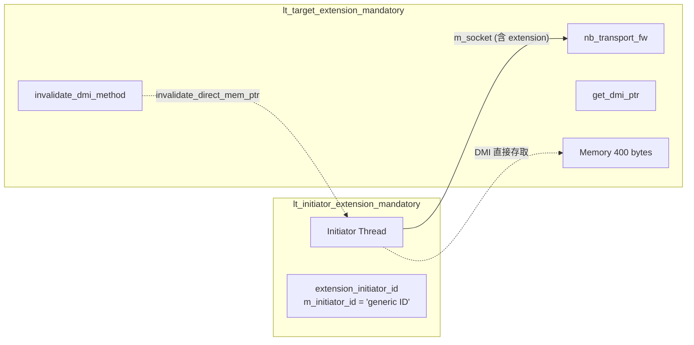

# LT + Mandatory Extension 範例總覽

## 軟體類比：必要的 HTTP Headers

在 HTTP 協定中，有些 API 要求你必須帶上特定的 headers 才能正常使用。例如：

- `Authorization: Bearer <token>` -- 沒有這個 header，伺服器會拒絕你的請求
- `Content-Type: application/json` -- 沒有這個 header，伺服器不知道怎麼解析你的資料

TLM 的 extension 就是類似的概念。`tlm_generic_payload` 預設攜帶了位址、資料、讀/寫指令等基本資訊（就像 HTTP 的 URL 和 body），但有時候 target 需要額外的資訊。Extension 就是附加在 payload 上的自定義 metadata。

| HTTP 模型 | TLM Extension 模型 |
|---|---|
| HTTP Headers | `tlm_extension` |
| Required headers（如 `Authorization`） | Mandatory extension |
| Optional headers（如 `Accept-Language`） | Optional extension |
| 缺少 required header -> 400/401 | 缺少 mandatory extension -> FATAL error |

## 什麼是 Mandatory Extension？

- **Mandatory extension**：target **要求**每個交易都必須攜帶的 extension。如果缺少，target 會報告致命錯誤。
- **Optional extension**：target 可以使用但不強制要求的 extension。缺少時 target 仍能正常處理交易。

本範例中的 mandatory extension 是 `extension_initiator_id`，包含一個字串欄位 `m_initiator_id`，表示發起交易的 initiator 身份。

## 系統架構

本範例是所有 LT 範例中最簡單的架構 -- 沒有 bus，只有一個 initiator 直接連接一個 target：

## 本範例的特殊之處

1. **使用 `simple_initiator_socket` / `simple_target_socket` 的自定義 protocol type**：socket 參數化為 `extension_initiator_id` 而非預設的 `tlm_base_protocol_types`，確保 extension 類型在編譯時期就被約束
2. **使用 `nb_transport_fw` 而非 `b_transport`**：雖然是 LT 範例，但 initiator 透過 `nb_transport_fw` 以 `BEGIN_REQ` phase 發送交易，target 直接返回 `TLM_COMPLETED`，效果等同於 blocking transport
3. **包含 DMI 支援**：target 會在交易完成後標記 `dmi_allowed`，initiator 後續交易會嘗試使用 DMI
4. **DMI 會定時失效**：target 設定了一個 timer（預設 25ns），到時間後會呼叫 `invalidate_direct_mem_ptr` 撤銷 DMI

## 原始碼檔案

| 檔案 | 說明 |
|---|---|
| `src/lt_extension_mandatory.cpp` | 程式進入點 `sc_main` |
| `include/lt_extension_mandatory_top.h` / `src/lt_extension_mandatory_top.cpp` | 頂層模組 |
| `include/lt_initiator_extension_mandatory.h` / `src/lt_initiator_extension_mandatory.cpp` | 帶 extension 的 initiator |
| `include/lt_target_extension_mandatory.h` / `src/lt_target_extension_mandatory.cpp` | 要求 extension 的 target |

Extension 本身定義在共用程式碼中：`tlm/common/include/extension_initiator_id.h`

詳細的原始碼分析請參閱 [lt-extension-mandatory.md](lt-extension-mandatory.md)。
