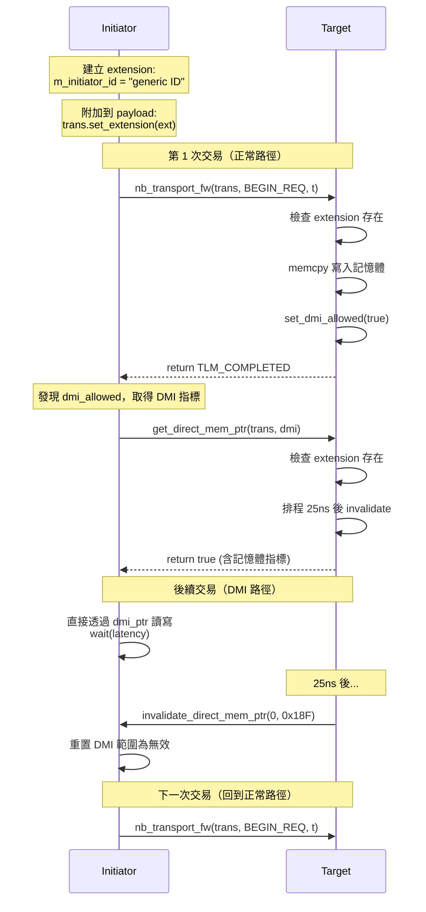

# LT + Mandatory Extension 範例 -- 原始碼分析

本文件分析 `lt_extension_mandatory/` 目錄下所有原始碼，展示如何定義和使用 TLM mandatory extension。

## 核心概念

TLM extension 讓你在 `tlm_generic_payload` 上附加自定義的資料。就像 HTTP headers 讓你在 request 中攜帶額外資訊一樣，extension 讓 initiator 可以在交易中附帶 target 需要的自定義 metadata。

## 檔案結構

```
lt_extension_mandatory/
  include/
    lt_extension_mandatory_top.h            -- 頂層模組
    lt_initiator_extension_mandatory.h      -- initiator
    lt_target_extension_mandatory.h         -- target
  src/
    lt_extension_mandatory.cpp              -- sc_main
    lt_extension_mandatory_top.cpp          -- 頂層模組實作
    lt_initiator_extension_mandatory.cpp    -- initiator 實作
    lt_target_extension_mandatory.cpp       -- target 實作

# 共用程式碼（在 tlm/common/ 中）
  common/include/extension_initiator_id.h   -- extension 類別定義
  common/src/extension_initiator_id.cpp     -- extension 實作
```

---

## 1. Extension 類別：`extension_initiator_id`

定義在 `common/include/extension_initiator_id.h`。

### 繼承架構

```cpp
class extension_initiator_id
: public tlm::tlm_extension<extension_initiator_id>
{
public:
    void copy_from(const tlm_extension_base &extension);
    tlm::tlm_extension_base* clone() const;

    std::string m_initiator_id;   // 自定義資料：initiator 身份字串
};
```

要建立一個 TLM extension，你需要：

1. 繼承 `tlm::tlm_extension<YourClass>`（CRTP 模式 -- Curiously Recurring Template Pattern）
2. 實作 `copy_from()` 和 `clone()` 方法

軟體類比：這就像定義一個自定義的 HTTP header class，你需要實作 `serialize()` 和 `deserialize()` 方法讓框架知道怎麼處理。

### 為什麼需要 `copy_from` 和 `clone`？

TLM 框架有時需要拷貝 payload（例如跨 clock domain 時），此時 extension 也需要被正確拷貝。`copy_from` 做淺拷貝，`clone` 做深拷貝（返回一個新物件）。

---

## 2. `lt_extension_mandatory.cpp` -- 程式進入點

```cpp
int sc_main(int, char*[]) {
    REPORT_ENABLE_ALL_REPORTING();
    lt_extension_mandatory_top top("top");
    sc_core::sc_start();
    return 0;
}
```

---

## 3. `lt_extension_mandatory_top.h` / `lt_extension_mandatory_top.cpp` -- 頂層模組

### 元件

```cpp
lt_initiator_extension_mandatory  m_initiator;  // initiator
lt_target_extension_mandatory     m_target;     // target
```

注意：這個範例沒有 bus -- initiator 直接連接 target。

### 建構式

```cpp
lt_extension_mandatory_top::lt_extension_mandatory_top(sc_core::sc_module_name name)
    : sc_core::sc_module(name)
    , m_initiator("m_initiator", 5, 0)           // 5 筆交易，起始位址 0
    , m_target("m_target", sc_core::sc_time(25, sc_core::SC_NS))  // DMI 失效時間 25ns
{
    m_initiator.m_socket(m_target.m_socket);  // 直接連接
}
```

---

## 4. `lt_initiator_extension_mandatory.h` / `lt_initiator_extension_mandatory.cpp` -- Initiator

### 自定義 Protocol Type 的 Socket

```cpp
typedef tlm_utils::simple_initiator_socket<
    lt_initiator_extension_mandatory,
    32,
    extension_initiator_id     // 自定義 protocol type
> initiator_socket_type;
```

第三個模板參數 `extension_initiator_id` 取代了預設的 `tlm_base_protocol_types`，這表示此 socket 使用自定義的 protocol。

軟體類比：這就像在 gRPC 中定義自定義的 message type -- 編譯器會確保你只能發送正確類型的訊息。

### Initiator Thread

`initiator_thread` 是核心邏輯：

```cpp
void lt_initiator_extension_mandatory::initiator_thread() {
    transaction_type  trans;
    phase_type        phase;
    sc_time           t;

    // 建立 extension 並附加到 payload
    extension_initiator_id* extension_ptr = new extension_initiator_id();
    extension_ptr->m_initiator_id = "generic ID";
    trans.set_extension(extension_ptr);

    while (create_transaction(trans)) {
        phase = tlm::BEGIN_REQ;
        t = SC_ZERO_TIME;

        // 先檢查是否可以用 DMI
        if (address_in_dmi_range(trans)) {
            // DMI 快速路徑：直接讀寫記憶體
            do_dmi_access(trans);
        } else {
            // 正常路徑：透過 nb_transport_fw
            switch (m_socket->nb_transport_fw(trans, phase, t)) {
                case tlm::TLM_COMPLETED:
                    wait(t);
                    break;
                // ...
            }
            // 如果 target 允許 DMI，嘗試取得 DMI 指標
            if (trans.is_dmi_allowed()) {
                acquire_dmi_pointer(trans);
            }
        }
    }

    delete extension_ptr;
}
```

### 交易產生邏輯

`create_transaction()` 先寫入 5 筆交易，再讀取 5 筆交易（共 10 筆），寫入的資料是遞增的整數：

| 交易 # | 命令 | 位址 | 資料 |
|---|---|---|---|
| 0 | WRITE | 0x00 | 0 |
| 1 | WRITE | 0x04 | 1 |
| 2 | WRITE | 0x08 | 2 |
| 3 | WRITE | 0x0C | 3 |
| 4 | WRITE | 0x10 | 4 |
| 5 | READ | 0x00 | (預期讀回 0) |
| 6 | READ | 0x04 | (預期讀回 1) |
| ... | ... | ... | ... |

### DMI 支援

Initiator 維護了一個 `tlm_dmi` 物件來快取 DMI 資訊：

```cpp
dmi_type m_dmi_properties;
```

初始狀態下，DMI 範圍被設為無效（start=1, end=0），所以第一次交易必定走正常路徑。

當收到 `invalidate_direct_mem_ptr` 回呼時，initiator 重置 DMI 範圍為無效。

---

## 5. `lt_target_extension_mandatory.h` / `lt_target_extension_mandatory.cpp` -- Target

### 自定義 Protocol Type 的 Socket

```cpp
typedef tlm_utils::simple_target_socket<
    lt_target_extension_mandatory,
    32,
    extension_initiator_id     // 與 initiator 相同的 protocol type
> target_socket_type;
```

### Extension 檢查

在 `nb_transport_fw` 中，target 做的第一件事就是檢查 extension 是否存在：

```cpp
extension_initiator_id *extension_ptr;
trans.get_extension(extension_ptr);

if (extension_ptr == 0) {
    // extension 不存在 -> FATAL error
    REPORT_FATAL(filename, __FUNCTION__, "Extension not present - ERROR");
} else {
    // extension 存在，可以讀取自定義資料
    msg << "Extension present, Data: " << extension_ptr->m_initiator_id;
    // ... 繼續處理交易
}
```

軟體類比：這就像 API server 在 middleware 中檢查 `Authorization` header -- 沒有就返回 401，有的話才繼續處理請求。

### 記憶體操作

Target 擁有一塊 400 bytes 的記憶體（位址 0x00 到 0x18F），用 `memcpy` 做讀寫：

```cpp
// 寫入
memcpy(&m_memory[address], data, sizeof(unsigned int));
t += sc_time(10, SC_NS);  // 寫入延遲 10ns

// 讀取
memcpy(data, &m_memory[address], sizeof(unsigned int));
t += sc_time(100, SC_NS); // 讀取延遲 100ns
```

### DMI 支援

Target 的 `get_dmi_ptr` 方法同樣會檢查 extension：

```cpp
bool lt_target_extension_mandatory::get_dmi_ptr(transaction_type &trans, tlm::tlm_dmi &dmi) {
    // 設定 timer：25ns 後失效
    m_invalidate_dmi_event.notify(m_invalidate_dmi_time);

    // 檢查 extension
    extension_initiator_id *extension_ptr;
    trans.get_extension(extension_ptr);
    if (extension_ptr == 0) {
        REPORT_FATAL(...);
    }

    // 提供 DMI 資訊
    dmi.allow_read_write();
    dmi.set_start_address(0x00);
    dmi.set_end_address(0x18F);
    dmi.set_dmi_ptr(m_memory);
    dmi.set_read_latency(sc_time(100, SC_NS));
    dmi.set_write_latency(sc_time(10, SC_NS));

    return true;
}
```

### DMI 定時失效

`invalidate_dmi_method` 是一個 `SC_METHOD`，在 `m_invalidate_dmi_event` 觸發時呼叫：

```cpp
void lt_target_extension_mandatory::invalidate_dmi_method() {
    m_socket->invalidate_direct_mem_ptr(m_min_address, m_max_address);
}
```

每次 `get_dmi_ptr` 被呼叫時，都會重新排程這個 event（25ns 後觸發）。所以 DMI 指標每 25ns 就會失效一次，initiator 必須重新走正常路徑並重新取得 DMI 指標。

軟體類比：這就像快取的 TTL（Time-To-Live）-- 快取條目在一定時間後自動失效，客戶端必須重新請求最新資料。

---

## 完整交易流程



## 重點摘要

1. **Extension 是附加在 payload 上的自定義 metadata**：透過 `set_extension` / `get_extension` 存取
2. **Mandatory = target 要求必須存在**：缺少則報告致命錯誤
3. **Extension 需要繼承 `tlm_extension<T>`**：並實作 `copy_from()` 和 `clone()`
4. **自定義 protocol type 參數化 socket**：在編譯時期約束 extension 類型
5. **本範例結合了 extension + DMI + 定時失效**：展示多種 TLM 機制的組合使用
6. **架構最簡單**：無 bus，initiator 直接連接 target，便於專注理解 extension 機制
