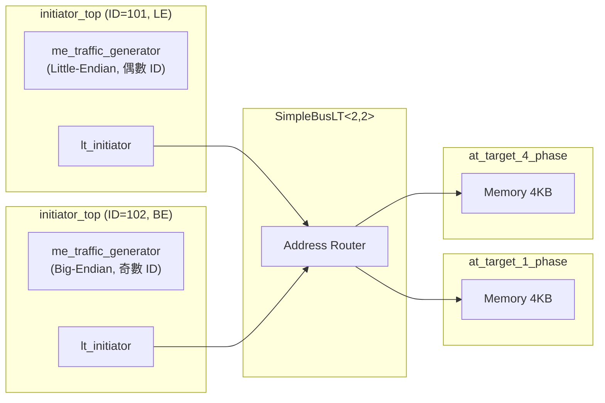

# LT + Mixed Endian 範例總覽

## 什麼是 Endianness（位元組順序）？

Endianness 就是「多位元組數值在記憶體中的排列方式」。用一個生活化的例子來說明：

假設你要把數字 `0x12345678`（一個 32-bit 整數）存進 4 個位元組的記憶體中。有兩種排法：

| 記憶體位址 | 0 | 1 | 2 | 3 |
|---|---|---|---|---|
| **Big-Endian**（大端序） | `12` | `34` | `56` | `78` |
| **Little-Endian**（小端序） | `78` | `56` | `34` | `12` |

- **Big-Endian**：最高位的位元組放在最前面（就像我們寫數字的方式：從最大位開始）
- **Little-Endian**：最低位的位元組放在最前面（倒過來放）

軟體類比：想像你要在紙上寫一個日期。美式寫法 `12/31/2025`（月/日/年）和 ISO 寫法 `2025-12-31`（年-月-日）就是兩種不同的「endianness」-- 資訊完全相同，只是排列順序不同。

## 為什麼有 Mixed Endian？

| 處理器 | Endianness |
|---|---|
| x86 / x86-64（Intel, AMD） | Little-Endian |
| ARM | 可切換（Big 或 Little） |
| PowerPC | 可切換（預設 Big） |
| MIPS | 可切換 |
| 網路協定（TCP/IP） | Big-Endian（「network byte order」） |

在真實系統中，一個 SoC（System-on-Chip）上可能同時存在不同 endianness 的處理器。當一個 little-endian 的 CPU 寫入資料到記憶體，再由一個 big-endian 的 CPU 讀取時，如果不做轉換，讀到的數值就會是錯的。

TLM 提供了 endianness conversion 函式，讓不同 endianness 的 initiator 可以正確地存取同一塊記憶體。

## 系統架構



注意：偶數 ID 的 initiator 使用 little-endian，奇數 ID 使用 big-endian。

## 互動式操作

與其他 LT 範例不同，這個範例有一個**互動式命令列介面**。使用者可以手動輸入讀寫命令來觀察不同 endianness 的效果：

```
l8  addr count          -- 以 8-bit 讀取
l16 addr count          -- 以 16-bit 讀取
l32 addr count          -- 以 32-bit 讀取
s8  addr d0 d1 ...      -- 以 8-bit 寫入
s16 addr d0 d1 ...      -- 以 16-bit 寫入
s32 addr d0 d1 ...      -- 以 32-bit 寫入
m                       -- 顯示記憶體映射
w                       -- 切換到另一個 initiator
q                       -- 結束
```

## 原始碼檔案

| 檔案 | 說明 |
|---|---|
| `src/lt.cpp` | 程式進入點 `sc_main` |
| `include/lt_top.h` / `src/lt_top.cpp` | 頂層模組 |
| `include/initiator_top.h` / `src/initiator_top.cpp` | Initiator 包裝模組 |
| `include/me_traffic_generator.h` / `src/me_traffic_generator.cpp` | Mixed-endian traffic generator（含互動式介面） |

詳細的原始碼分析請參閱 [lt-mixed-endian.md](lt-mixed-endian.md)。
