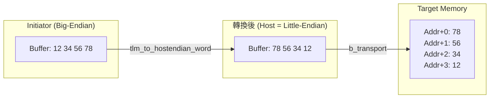

# LT + Mixed Endian 範例 -- 原始碼分析

本文件分析 `lt_mixed_endian/` 目錄下所有原始碼，展示 TLM 如何處理不同 endianness 的 initiator 存取同一塊記憶體。

## 核心概念

當一個 little-endian initiator 和一個 big-endian initiator 存取同一塊記憶體時，TLM 提供了 endianness conversion 函式（`tlm_to_hostendian_word` / `tlm_from_hostendian_word`）來確保資料的正確性。這些函式會在交易發送前將資料轉換為 target 的 endianness，收到回應後再轉換回 initiator 的 endianness。

## 檔案結構

```
lt_mixed_endian/
  include/
    initiator_top.h           -- initiator 包裝模組
    lt_top.h                  -- 頂層模組
    me_traffic_generator.h    -- mixed-endian traffic generator
  src/
    initiator_top.cpp         -- initiator 包裝模組實作
    lt_top.cpp                -- 頂層模組實作
    me_traffic_generator.cpp  -- traffic generator 實作
    lt.cpp                    -- sc_main 進入點
```

---

## 1. `lt.cpp` -- 程式進入點

與其他 LT 範例相同：

```cpp
int sc_main(int, char*[]) {
    REPORT_ENABLE_ALL_REPORTING();
    lt_top top("top");
    sc_core::sc_start();
    return 0;
}
```

---

## 2. `lt_top.h` / `lt_top.cpp` -- 頂層模組

### 元件

| 成員 | 類型 | 說明 |
|---|---|---|
| `m_bus` | `SimpleBusLT<2, 2>` | 匯流排 |
| `m_lt_target_1` | `at_target_1_phase` | 第一個 target |
| `m_lt_target_2` | `at_target_4_phase` | 第二個 target |
| `m_initiator_1` | `initiator_top` | 第一個 initiator（ID=101） |
| `m_initiator_2` | `initiator_top` | 第二個 initiator（ID=102） |

### 連線

與基本 LT 範例的連線方式完全相同。兩個 initiator 透過 bus 連接到兩個 target。

---

## 3. `initiator_top.h` / `initiator_top.cpp` -- Initiator 包裝模組

### 與基本 LT 的差異

唯一的差異是使用 `me_traffic_generator` 取代 `traffic_generator`：

```cpp
lt_initiator          m_initiator;       // 與基本 LT 相同
me_traffic_generator  m_traffic_gen;     // mixed-endian traffic generator
```

`lt_initiator` 本身不需要修改 -- endianness 轉換完全在 traffic generator 層處理，對 initiator 透明。

---

## 4. `me_traffic_generator.h` / `me_traffic_generator.cpp` -- Mixed-Endian Traffic Generator

這是本範例的核心，也是唯一有大量新邏輯的檔案。

### Endianness 決定規則

```cpp
// 偶數 ID -> little-endian，奇數 ID -> big-endian
m_endianness = ((m_ID & 1) == 0 ? tlm::TLM_LITTLE_ENDIAN : tlm::TLM_BIG_ENDIAN);
// 偵測主機的 endianness
m_host_endianness = tlm::get_host_endianness();
```

軟體類比：就像網路程式中，你需要知道自己機器的 byte order 和對方機器的 byte order，才能正確轉換資料。

### 互動式命令列

`me_traffic_generator_thread` 是一個 `SC_THREAD`，提供互動式命令列介面，讓使用者手動輸入讀寫命令：

```
l8  addr count          -- 讀取 count 個 8-bit 值
l16 addr count          -- 讀取 count 個 16-bit 值
l32 addr count          -- 讀取 count 個 32-bit 值
s8  addr d0 d1 ...      -- 寫入多個 8-bit 值
s16 addr d0 d1 ...      -- 寫入多個 16-bit 值
s32 addr d0 d1 ...      -- 寫入多個 32-bit 值
w                       -- 切換到另一個 initiator
q                       -- 結束此 initiator
```

### 多 Initiator 的輪流機制

多個 `me_traffic_generator` 透過一個 static 的等待佇列和 event 來輪流使用命令列：

```cpp
static std::list<me_traffic_generator *> me_ui_waiters;
static sc_core::sc_event me_ui_change_event;
```

每個 traffic generator 在啟動時把自己加入等待佇列，只有佇列前端的那個才能接收使用者輸入。按 `w` 可以把目前的 generator 移到佇列尾端，讓下一個 generator 接管。

軟體類比：就像多個 SSH session 共用一個終端機 -- 只有目前「active」的 session 可以接收輸入，按快捷鍵可以切換。

### Transaction Pool

`me_traffic_generator` 內含一個簡單的 transaction pool（`pool_c` class），用來重複利用 `tlm_generic_payload` 物件：

```cpp
tlm::tlm_generic_payload *pop();   // 取得一個 payload（從 pool 或新建）
void push(payload);                 // 歸還 payload（release 引用計數）
void free(payload);                 // 重置並放回 pool
```

軟體類比：這就像一個 connection pool -- 重複利用已建立的連線，避免每次都要 new/delete。

### Endianness 轉換

轉換的核心在 `do_do_load` 和 `do_do_store` 中：

**寫入流程：**

```cpp
// 1. 設定 payload（位址、資料、命令）
req_transaction_ptr->set_command(tlm::TLM_WRITE_COMMAND);
req_transaction_ptr->set_address(addr);
req_transaction_ptr->set_data_ptr(m_buffer);

// 2. 如果 initiator 和主機 endianness 不同，做轉換
if (m_endianness != m_host_endianness)
    tlm::tlm_to_hostendian_word<T>(req_transaction_ptr, 4);

// 3. 送出交易
request_out_port->write(req_transaction_ptr);
resp = response_in_port->read();

// 4. 轉換回來
if (m_endianness != m_host_endianness)
    tlm::tlm_from_hostendian_word<T>(req_transaction_ptr, 4);
```

**讀取流程：** 類似，但 `to_hostendian` 在發送前呼叫（修改 payload 讓 target 用正確的位元組順序回填資料），`from_hostendian` 在收到回應後呼叫（把資料轉回 initiator 的 byte order）。

### 轉換函式的模板參數

`tlm_to_hostendian_word<T>` 中的 `T` 是資料的**存取粒度**（word size）：

| T | 說明 |
|---|---|
| `uint8_t` | 8-bit 存取，不需要 byte swap（單一位元組沒有 endianness 問題） |
| `uint16_t` | 16-bit 存取，每 2 個位元組做 swap |
| `uint32_t` | 32-bit 存取，每 4 個位元組做 swap |

第二個參數 `4` 是 target 的記憶體寬度（bus width）。

---

## Endianness 轉換圖解

假設一個 big-endian initiator 要在 little-endian host 上寫入 `0x12345678`：



之後如果一個 little-endian initiator 讀取同一個位址，它會看到 `0x12345678` -- 因為記憶體中的 `78 56 34 12` 在 little-endian 的解讀下就是 `0x12345678`。

## 重點摘要

1. **Endianness 是位元組排列順序**：big-endian 從高位開始，little-endian 從低位開始
2. **TLM 提供 endianness conversion 函式**：`tlm_to_hostendian_word` / `tlm_from_hostendian_word`
3. **轉換在 initiator 端完成**：對 target 和 bus 完全透明
4. **本範例使用互動式命令列**：使用者可以手動測試不同 endianness 的讀寫效果
5. **Endianness 由 ID 決定**：偶數 ID = little-endian，奇數 ID = big-endian
6. **8-bit 存取不需要轉換**：單一位元組沒有排列順序的問題
