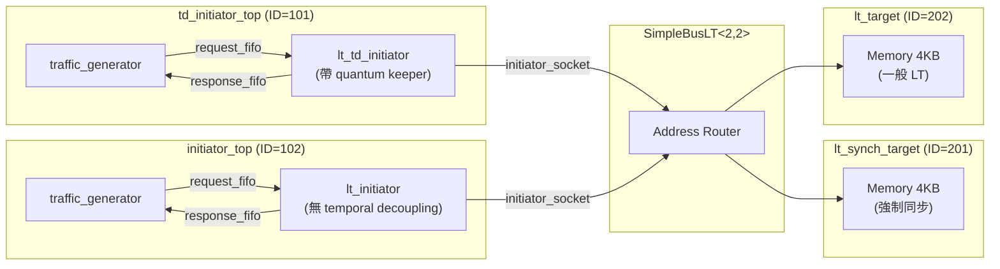
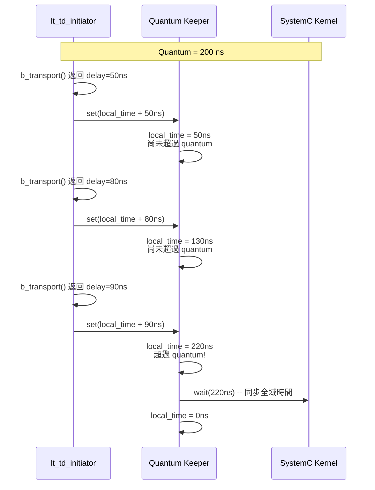

# LT + Temporal Decoupling 範例總覽

## 軟體類比：批次處理與時間預算

想像一個多人線上遊戲的伺服器。每個玩家的操作理想上應該「即時」同步到所有其他玩家，但這樣每一個小動作都要同步一次，效能太差了。

實際做法是：每個玩家累積一小段時間的操作（例如 100ms），然後一次性同步。這段「容許的不同步時間」就叫做 **time quantum**。只要不超過這個時間，即使各玩家的操作順序稍有偏差，玩家也感受不到。

TLM 的 Temporal Decoupling 就是同樣的概念：

| 遊戲伺服器 | TLM Temporal Decoupling |
|---|---|
| 累積操作，定時同步 | Initiator 累積本地時間，定時與全域時間同步 |
| Time quantum = 100ms | Time quantum = 設定的模擬時間段 |
| 減少同步次數，提升效能 | 減少 `sc_core::wait()` 次數，提升模擬速度 |
| 同步點 = tick | 同步點 = quantum keeper 觸發 `wait()` |

## 為什麼需要 Temporal Decoupling？

在標準 LT 模式中，每次 `b_transport()` 完成後，initiator 都會呼叫 `wait(delay)` 來消耗模擬時間。每次 `wait()` 都會讓 SystemC kernel 切換 context，這是模擬效能的主要瓶頸。

Temporal decoupling 的做法是：

1. 不立即 `wait()`，而是把延遲累加到一個**本地時間偏移量**（local time offset）
2. 當累積的本地時間超過設定的 **time quantum** 時，才一次性 `wait()` 回到全域時間
3. 這樣大幅減少了 context switch 的次數

## 系統架構

注意：這個範例刻意混合了一個 temporal decoupling initiator 和一個普通 LT initiator，以及一個會強制同步的 target（`lt_synch_target`）和一個普通 target，展示不同元件如何共存。

## Quantum Keeper 運作原理

## 原始碼檔案

| 檔案 | 說明 |
|---|---|
| `src/lt_temporal_decouple.cpp` | 程式進入點 `sc_main` |
| `include/lt_temporal_decouple_top.h` / `src/lt_temporal_decouple_top.cpp` | 頂層模組 |
| `include/td_initiator_top.h` / `src/td_initiator_top.cpp` | Temporal decoupling initiator 包裝模組 |
| `include/initiator_top.h` / `src/initiator_top.cpp` | 普通 LT initiator 包裝模組（對照用） |

詳細的原始碼分析請參閱 [lt-temporal-decouple.md](lt-temporal-decouple.md)。
