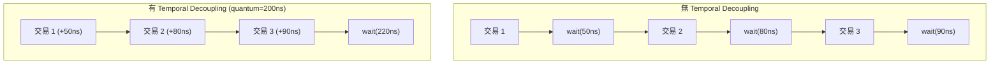

# LT + Temporal Decoupling 範例 -- 原始碼分析

本文件分析 `lt_temporal_decouple/` 目錄下所有原始碼，展示 temporal decoupling 如何加速 LT 模擬。

## 核心概念

Temporal decoupling 讓 initiator 可以「提前」執行多筆交易，把延遲累積在本地，等到累積的延遲超過一個設定的上限（quantum）時才一次性同步。這減少了 SystemC kernel 的 context switch 次數，是 LT 模擬效能最佳化的關鍵技術。

## 檔案結構

```
lt_temporal_decouple/
  include/
    initiator_top.h                -- 普通 LT initiator 包裝模組
    td_initiator_top.h             -- temporal decoupling initiator 包裝模組
    lt_temporal_decouple_top.h     -- 頂層模組
  src/
    initiator_top.cpp              -- 普通 LT initiator 實作
    td_initiator_top.cpp           -- temporal decoupling initiator 實作
    lt_temporal_decouple_top.cpp   -- 頂層模組實作
    lt_temporal_decouple.cpp       -- sc_main 進入點
```

---

## 1. `lt_temporal_decouple.cpp` -- 程式進入點

```cpp
int sc_main(int, char*[]) {
    REPORT_ENABLE_ALL_REPORTING();
    lt_temporal_decouple_top top("top");
    sc_core::sc_start();
    return 0;
}
```

---

## 2. `lt_temporal_decouple_top.h` / `lt_temporal_decouple_top.cpp` -- 頂層模組

### 元件宣告

這個範例刻意混合了不同類型的 initiator 和 target：

| 成員 | 類型 | 說明 |
|---|---|---|
| `m_bus` | `SimpleBusLT<2, 2>` | 匯流排 |
| `m_lt_synch_target_1` | `lt_synch_target` | 會強制同步的 target |
| `m_lt_target_2` | `lt_target` | 普通 LT target |
| `m_td_initiator_1` | `td_initiator_top` | temporal decoupling initiator |
| `m_initiator_2` | `initiator_top` | 普通 LT initiator（對照組） |

### `lt_synch_target` 的角色

`lt_synch_target` 是一個特殊的 target，它會在處理交易前強制呼叫 `wait()` 來同步全域時間。這模擬了現實中某些硬體（例如有副作用的 I/O 裝置）必須確保時間正確的情況。

軟體類比：在分散式系統中，大部分操作可以用 eventual consistency，但某些操作（例如金融交易）需要 strong consistency -- 必須確認所有節點的時間和狀態是一致的。

### 連線

```cpp
// Temporal decoupling initiator -> bus
m_td_initiator_1.top_initiator_socket(m_bus.target_socket[0]);
// 普通 initiator -> bus
m_initiator_2.top_initiator_socket(m_bus.target_socket[1]);

// bus -> targets
m_bus.initiator_socket[0](m_lt_synch_target_1.m_memory_socket);
m_bus.initiator_socket[1](m_lt_target_2.m_memory_socket);
```

---

## 3. `td_initiator_top.h` / `td_initiator_top.cpp` -- Temporal Decoupling Initiator

### 與普通 initiator_top 的差異

唯一的差異是使用 `lt_td_initiator` 而非 `lt_initiator`：

```cpp
lt_td_initiator  m_lt_td_initiator;  // 帶有 quantum keeper 的 initiator
```

`lt_td_initiator`（定義在 `tlm/common/`）內部使用 `tlm_quantumkeeper` 來管理本地時間偏移。

### 建構式

與普通 `initiator_top` 結構相同：

```cpp
// traffic generator <-> initiator 之間透過 FIFO 連接
m_traffic_gen.request_out_port(m_request_fifo);
m_lt_td_initiator.request_in_port(m_request_fifo);

m_lt_td_initiator.response_out_port(m_response_fifo);
m_traffic_gen.response_in_port(m_response_fifo);

// 階層式 socket 連線
m_lt_td_initiator.initiator_socket(top_initiator_socket);
```

---

## 4. `initiator_top.h` / `initiator_top.cpp` -- 普通 LT Initiator（對照組）

這個檔案與基本 LT 範例中的 `initiator_top` 完全相同，使用 `lt_initiator`（不帶 temporal decoupling）。它存在於此範例中是為了展示兩種 initiator 可以在同一個系統中共存。

---

## Quantum Keeper 機制詳解

`tlm_quantumkeeper` 是 TLM 2.0 提供的工具類別，管理 temporal decoupling 的本地時間。它的核心 API：

| 方法 | 說明 | 軟體類比 |
|---|---|---|
| `set_global_quantum(time)` | 設定全域 quantum（所有 initiator 共用） | 設定同步間隔 |
| `set(local_time)` | 更新本地時間偏移 | 累加操作延遲 |
| `get_local_time()` | 取得目前本地時間偏移 | 查詢累積的「債務」 |
| `need_sync()` | 是否需要同步（本地時間 >= quantum） | 是否該 flush 了 |
| `sync()` | 執行同步（呼叫 `wait()`，重置本地時間） | 批次提交 |
| `reset()` | 重置本地時間為零 | 清零計數器 |

### 在 `lt_td_initiator` 中的使用模式

```
for each transaction:
    b_transport(payload, delay)       // delay 由 target 回傳
    m_quantum_keeper.set(delay)       // 累積到本地時間
    if m_quantum_keeper.need_sync():  // 超過 quantum 了嗎？
        m_quantum_keeper.sync()       // 是 -> wait() 同步
```

## Temporal Decoupling 的效能影響



- **無 TD**：3 次 context switch（每次 wait 都是一次 context switch）
- **有 TD**：1 次 context switch

在一個執行數百萬次交易的模擬中，減少 context switch 可以帶來數倍的效能提升。

## 時序精度的取捨

Temporal decoupling 是一種效能與精度的取捨：

- **Quantum 越大**：效能越好（同步越少），但時序精度越低
- **Quantum 越小**：時序精度越高，但效能改善越小
- **Quantum = 0**：等同於不使用 temporal decoupling

對於純 LT 模擬（只需要功能正確、不需要時序精確），使用較大的 quantum 通常是合理的。

## 重點摘要

1. **Temporal decoupling 累積本地時間，批次同步**：減少 `wait()` 次數以提升效能
2. **Quantum keeper 管理同步時機**：本地時間超過 quantum 時自動同步
3. **本範例混合了 TD 和非 TD initiator**：展示兩者可以共存
4. **`lt_synch_target` 會強制同步**：模擬需要精確時序的硬體
5. **Quantum 大小是效能與精度的取捨**：依據模擬需求調整
