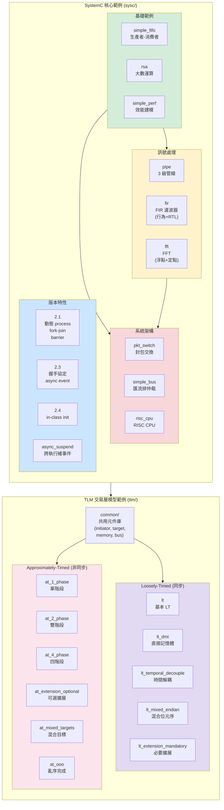
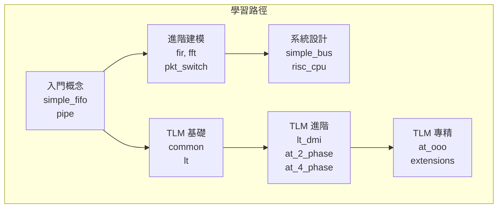

# SystemC 官方範例 - 全域架構總覽

## 全域架構圖

## 依賴方向總覽

## 檔案統計

| 分類 | 範例數 | 原始碼檔案 | 文件檔案 | 含 spec.md |
| --- | --- | --- | --- | --- |
| sysc 基礎 | 3 | 4 | 11 | 2 |
| sysc 管線/DSP | 3 | 39 | 25 | 3 |
| sysc 系統架構 | 3 | 58 | 29 | 3 |
| sysc 版本特性 | 4 | 19 | 19 | 0 |
| tlm common | 1 | 40 | 9 | 1 |
| tlm LT | 5 | 28 | 10 | 0 |
| tlm AT | 6 | 35 | 12 | 0 |
| topdown | - | - | 6 | - |
| **合計** | **25** | **226** | **121** | **9** |

## 文件類型說明

| 類型 | 說明 | 範例 |
| --- | --- | --- |
| `_index.md` | 子系統總覽頁，含架構圖和檔案列表 | `code/sysc/pipe/_index.md` |
| `*.md` (per-file) | 對應原始碼檔案的詳細解析 | `code/sysc/pipe/stage1.md` |
| `spec.md` | 硬體 IP 規格說明（用軟體類比） | `code/sysc/pipe/spec.md` |
| topdown `*.md` | 跨範例的概念性文件 | `topdown/tlm-explained.md` |

## 軟體類比速查表

| SystemC / 硬體概念 | 軟體類比 |
| --- | --- |
| FIFO | Python queue.Queue |
| Pipeline | Unix pipe / ETL chain |
| FIR Filter | 滑動視窗加權平均 |
| FFT | 頻譜分析器 / 音樂等化器 |
| Packet Switch | 網路路由器 / RabbitMQ |
| Bus Arbitration | 共享資源 + Mutex / 執行緒排程器 |
| RISC CPU | 指令解譯器 + 快取系統 |
| TLM LT | 同步 HTTP (fetch + await) |
| TLM AT | 非同步 HTTP (callback/asyncio.Future) |
| TLM DMI | mmap / kernel bypass |
| TLM Extension | 自訂 HTTP Header |
| sc_module | class / component |
| sc_port | dependency injection |
| sc_signal | Observable / reactive variable |
| SC_THREAD | coroutine / Python coroutine (asyncio) |
| SC_METHOD | event callback |
| sc_event | condition variable / asyncio.Future |
| Delta cycle | microtask queue |
