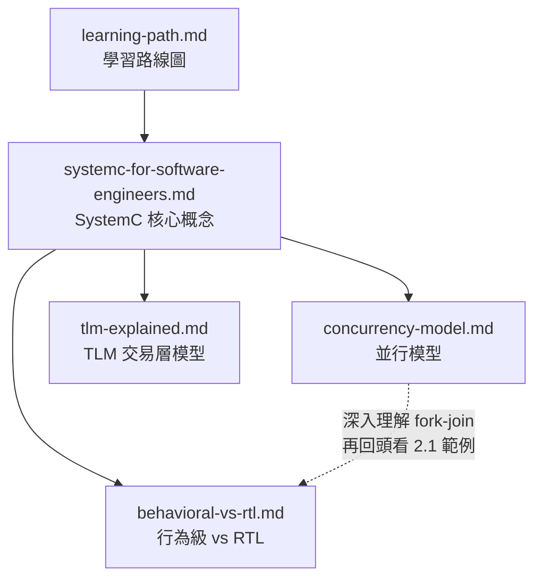
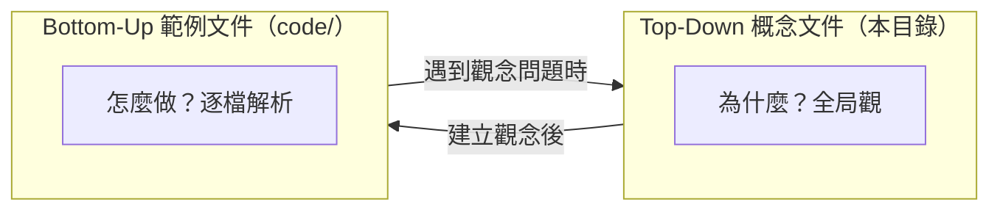

# 概念性文件索引

> 本目錄收錄**由上而下（top-down）**的概念文件，目的是讓**沒有硬體背景的軟體工程師**
> 在閱讀個別範例之前，先建立 SystemC 與 TLM 的全局觀。

---

## 文件一覽

| 文件 | 說明 | 適合誰先讀 |
|------|------|-----------|
| [learning-path.md](learning-path.md) | 學習路線圖與範例選讀指南 | 所有讀者（建議第一份閱讀） |
| [systemc-for-software-engineers.md](systemc-for-software-engineers.md) | 用軟體概念解釋 SystemC 核心觀念 | 第一次接觸 SystemC 的軟體工程師 |
| [tlm-explained.md](tlm-explained.md) | 用軟體概念解釋 TLM 交易層模型 | 準備閱讀 TLM 範例之前 |
| [behavioral-vs-rtl.md](behavioral-vs-rtl.md) | 行為級 vs RTL 建模的差異與取捨 | 對「為什麼同一功能要寫兩次」有疑問時 |
| [concurrency-model.md](concurrency-model.md) | SystemC 的並行模型（協作式多工） | 對 SC_THREAD / SC_METHOD / delta cycle 感到困惑時 |

---

## 建議閱讀順序

**路線說明**：

1. 先看 **learning-path.md**，決定你要走哪條學習路線。
2. 不論哪條路線，都建議先讀 **systemc-for-software-engineers.md** 建立基礎觀念。
3. 如果你要讀 pipeline / DSP / system 類範例，先讀 **concurrency-model.md**。
4. 如果你對 fir 範例的雙版本設計有疑問，讀 **behavioral-vs-rtl.md**。
5. 如果你要讀 TLM 範例，先讀 **tlm-explained.md**。

---

## 與 bottom-up 文件的關係

- **Top-down 文件**回答「為什麼（why）」和「大方向（what）」
- **Bottom-up 文件**回答「怎麼做（how）」和「程式碼細節」
- 兩者互相參照，構成完整的學習體驗
