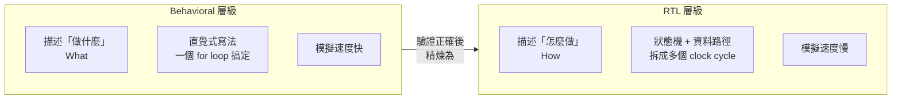
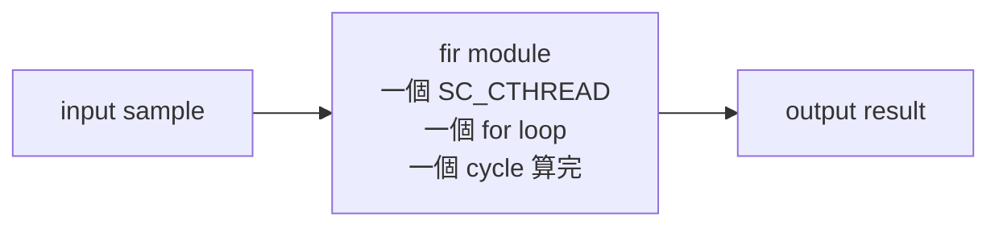
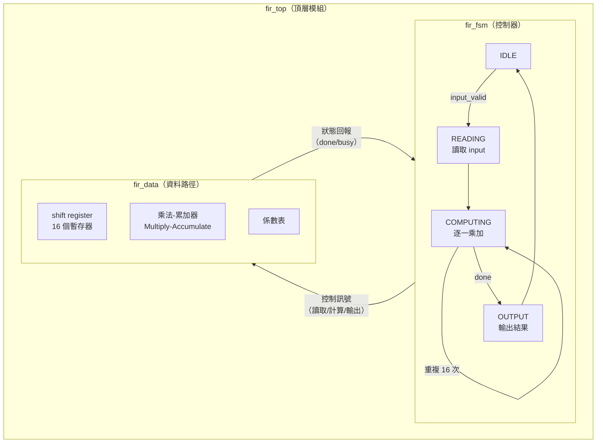
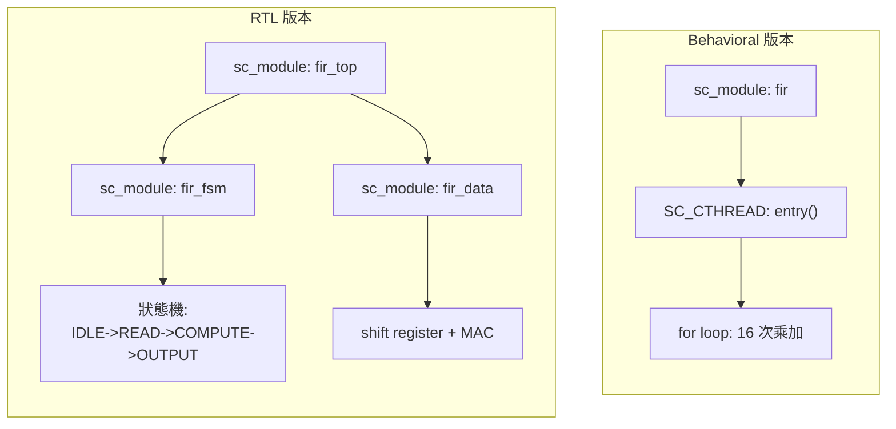
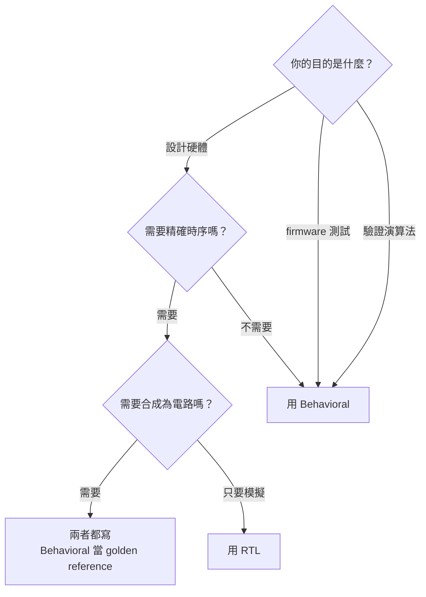
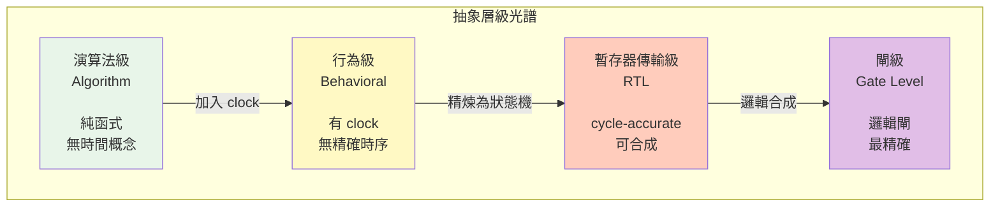

# Behavioral vs RTL -- 兩種建模層級的差異與取捨

> 本文以 FIR 濾波器範例為主要案例，解釋硬體建模中兩種最重要的抽象層級。
> 前置知識：建議先閱讀 [systemc-for-software-engineers.md](systemc-for-software-engineers.md)。

---

## 為什麼同一個功能要寫兩次？

在軟體世界中，你很少需要把同一個演算法寫兩次。但在硬體設計中，這是標準流程：

1. **先寫 Behavioral（行為級）**：確認演算法正確
2. **再寫 RTL（暫存器傳輸級）**：實作成可以合成為電路的描述

這就像軟體世界中的：
- **Python prototype** -> **optimized C++ production code**
- **演算法白板設計** -> **考慮 cache/memory/threading 的實作**
- **單元測試中的 reference implementation** -> **正式的高效能實作**



---

## 以 FIR 濾波器為例

FIR 濾波器的演算法本質上就是一個**滑動視窗加權平均**：

```
output = coeff[0] * sample[n] + coeff[1] * sample[n-1] + ... + coeff[15] * sample[n-15]
```

這等同於：

```python
# Python 版本 -- 這就是 Behavioral 的精神
def fir_filter(samples, coefficients):
    return sum(s * c for s, c in zip(samples, coefficients))
```

現在來看 SystemC 中，同一個演算法如何用兩種層級實作。

### Behavioral 版本 -- 一個 clock cycle 完成



**特點**：
- 一個 module、一個 process
- 用一個 for loop 把 16 個乘法和加法全做完
- 從外部看，每個 clock cycle 輸入一個 sample，輸出一個 result
- 程式碼直覺，和軟體寫法幾乎一樣

**軟體類比**：直接呼叫一個函式，一次算完回傳結果。

### RTL 版本 -- 拆成多個 clock cycle



**特點**：
- 拆成兩個子模組：**FSM（有限狀態機）**控制流程、**Datapath（資料路徑）**做運算
- 乘法不是一次做完，而是每個 clock cycle 做一次，重複 16 次
- 需要 16+ 個 clock cycle 才能完成一次運算
- 可以直接合成為實際電路

**軟體類比**：把函式拆成一個 state machine，每次呼叫只做一小步。就像把一個同步函式改寫成 generator（每次 yield 只做一步）。

---

## 對比分析

### 程式結構對比



### 各面向比較

| 面向 | Behavioral | RTL |
|------|-----------|-----|
| **程式碼量** | 少（約 50 行） | 多（約 200 行） |
| **可讀性** | 高，接近演算法描述 | 低，需要理解狀態機 |
| **模擬速度** | 快 | 慢（需要模擬每個 cycle） |
| **時序精確度** | 低（只知道「一個 cycle」） | 高（知道每步的時序） |
| **可合成性** | 不一定能合成 | 可以合成為電路 |
| **除錯難度** | 低 | 高 |
| **硬體資源估算** | 無法估算 | 可以估算面積和功耗 |

### 時序差異圖

```mermaid
gantt
    title FIR 濾波器時序比較
    dateFormat X
    axisFormat %s

    section Behavioral
    讀取 input + 計算 16 次乘加 + 輸出 : 0, 1

    section RTL
    IDLE            : 0, 1
    讀取 input      : 1, 2
    乘加 第 1 次    : 2, 3
    乘加 第 2 次    : 3, 4
    乘加 ...        : 4, 5
    乘加 第 16 次   : 5, 6
    輸出 result     : 6, 7
```



---

## 什麼時候用哪個層級？

### 用 Behavioral 的場景

1. **演算法驗證**：先確認演算法邏輯正確，再考慮硬體實作
2. **系統級模擬**：只關心功能正確性，不關心時序（例如跑 firmware 測試）
3. **Golden reference**：作為 RTL 的對照組，用來驗證 RTL 的正確性
4. **早期架構探索**：快速評估不同演算法的效能差異

### 用 RTL 的場景

1. **硬體合成**：最終要把模型轉成真正的電路
2. **精確時序分析**：需要知道每個操作需要多少 clock cycle
3. **面積/功耗估算**：需要知道硬體資源的使用量
4. **與實際硬體對照**：確認模型與 Verilog/VHDL RTL 的行為一致

### 決策流程



---

## 超越 FIR：其他範例中的層級差異

官方範例中還有其他展示不同抽象層級的案例：

| 範例 | Behavioral 面向 | RTL 面向 |
|------|----------------|---------|
| [fir](../code/sysc/fir/_index.md) | `fir.h/cpp`：一個 loop 完成 | `fir_fsm + fir_data`：狀態機 + 資料路徑 |
| [fft](../code/sysc/fft/_index.md) | 浮點版本：直覺的蝶形運算 | 定點版本：有限精度的硬體實作 |
| [risc_cpu](../code/sysc/risc_cpu/_index.md) | 指令的功能描述 | 分成 fetch/decode/execute 等管線階段 |
| [simple_bus](../code/sysc/simple_bus/_index.md) | blocking transport（功能級） | 帶仲裁的 non-blocking transport |

### 抽象層級光譜



---

## 重點整理

1. **Behavioral 描述「做什麼」，RTL 描述「怎麼做」** -- 兩者服務不同目的
2. **先寫 Behavioral 再寫 RTL** -- Behavioral 是 RTL 的正確性參考
3. **模擬速度和精確度是反比** -- 越精確越慢，根據需求選擇
4. **軟體工程師最常接觸 Behavioral** -- 除非你要設計硬體，否則 Behavioral 層級就足夠
5. **TLM 是另一個抽象層級** -- 專注在通訊（而非計算），詳見 [tlm-explained.md](tlm-explained.md)

---

## 延伸閱讀

- [fir 範例詳解](../code/sysc/fir/_index.md) -- 看 Behavioral 和 RTL 的完整程式碼分析
- [fft 範例詳解](../code/sysc/fft/_index.md) -- 看浮點和定點的精度取捨
- [concurrency-model.md](concurrency-model.md) -- 理解 clock、process、delta cycle 如何驅動 RTL 模擬
