# SystemC 並行模型 -- 軟體工程師的理解方式

> 本文解釋 SystemC 如何在**單一執行緒**上模擬硬體的並行行為。
> 前置知識：建議先閱讀 [systemc-for-software-engineers.md](systemc-for-software-engineers.md)。

---

## 核心問題：如何用一個 thread 模擬「同時」？

硬體中的元件是真正同時運作的 -- 當 CPU 在執行指令時，記憶體控制器同時在處理讀取、DMA 同時在搬運資料。但 SystemC 跑在一般的 x86 電腦上，用的是標準的 C++ 執行環境。

SystemC 的解法是**協作式多工（cooperative multitasking）** -- 和 Python asyncio event loop 本質上是同一件事。

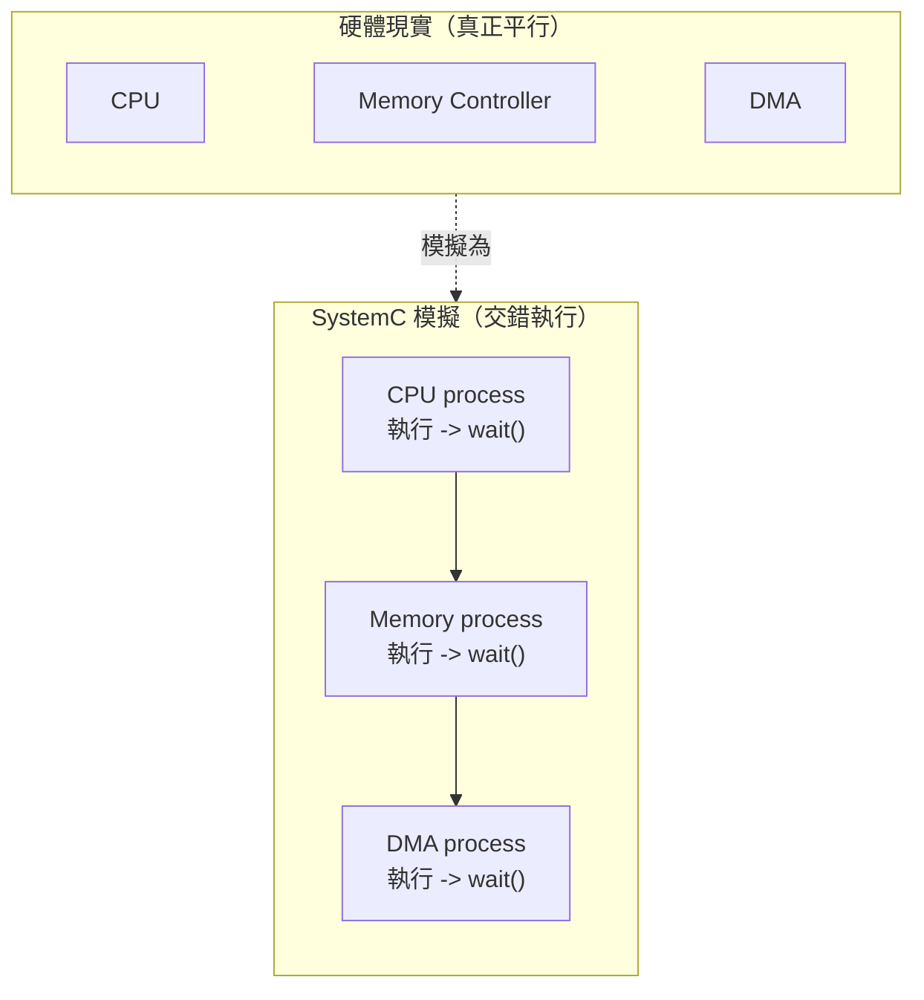

---

## 協作式 vs 搶占式多工

| 特性 | 搶占式（pthreads） | 協作式（SystemC） |
|------|-------------------|------------------|
| 切換時機 | OS 隨時可以中斷 | process 主動呼叫 `wait()` 才切換 |
| 需要 mutex | 是（共享資料可能被搶占） | 否（任一時刻只有一個在跑） |
| Race condition | 常見問題 | 不存在（單 thread） |
| Deadlock | 可能發生 | 不會（但可能 livelock） |
| 類似技術 | OS thread、C++ std::thread | Python asyncio、Python coroutine (asyncio) |

**關鍵觀念**：在 SystemC 中，你永遠不需要寫 `mutex_lock()` 來保護共享資料。因為在任何一個時間點，只有一個 process 在執行。只有當你主動呼叫 `wait()` 時，控制權才會交回給 kernel。

---

## 三種 Process 類型

SystemC 提供三種 process 類型，適用於不同場景：

### SC_THREAD -- 協程

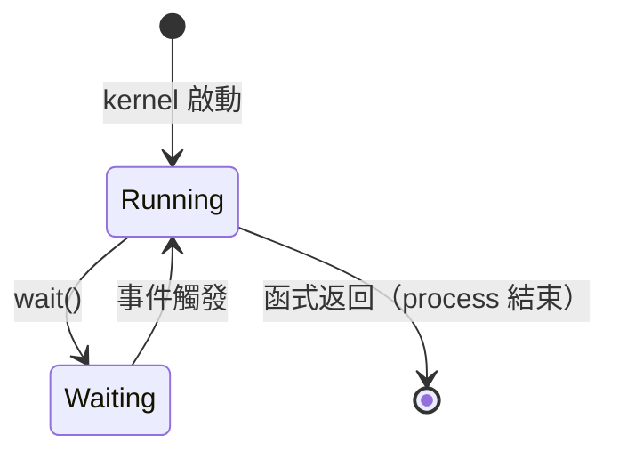

**特性**：
- 有自己的 call stack（像一個獨立的 coroutine）
- 可以在任何地方呼叫 `wait()` 暫停
- 通常包含一個無窮迴圈（`while(true) { ... wait(); ... }`）
- 記憶體開銷較大（每個 thread 需要獨立的 stack）

**軟體對應**：

| 語言 | 對應概念 |
|------|---------|
| Python | `async def` + `await` |
| C++ | `std::coroutine` (C++20) |

**典型用法**：

```
SC_THREAD(main_loop);
sensitive << clk.pos();

void main_loop() {
    while (true) {
        // 做一些事
        data = input.read();
        result = process(data);
        output.write(result);
        wait();  // 暫停，等下一個 clock edge
    }
}
```

### SC_METHOD -- 事件回調

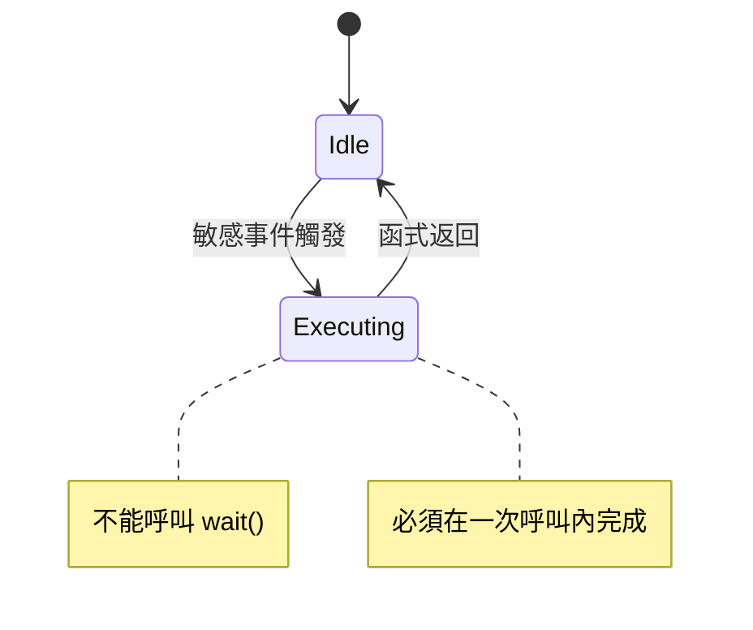

**特性**：
- 沒有自己的 stack（就是一個普通的函式呼叫）
- **不能**呼叫 `wait()` -- 必須在一次執行內完成所有工作
- 每次被觸發時從頭開始執行（無狀態，或靠 member variable 保存狀態）
- 記憶體開銷小

**軟體對應**：

| 語言 | 對應概念 |
|------|---------|
| JavaScript | `element.addEventListener('click', handler)` |
| React | `useEffect` 回調 |
| C | signal handler |
| SQL | trigger |

**典型用法**：組合邏輯（combinational logic）或簡單的狀態轉移

```
SC_METHOD(compute);
sensitive << a << b << sel;

void compute() {
    if (sel.read())
        out.write(a.read());
    else
        out.write(b.read());
}
```

### SC_CTHREAD -- Clock 驅動的 Thread

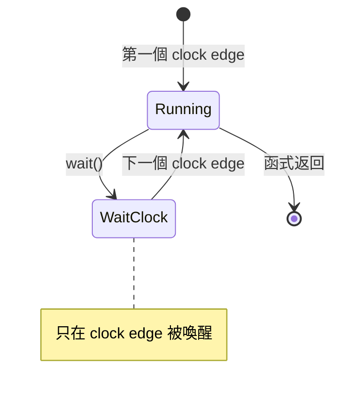

**特性**：
- 是 SC_THREAD 的特化版本
- 只能對 **clock edge** 敏感（`sensitive << clk.pos()`）
- 支援 `reset_signal_is()` 自動 reset
- 最適合描述同步（clock-driven）的硬體行為

**軟體對應**：一個每隔固定時間被喚醒的 cron job / timer callback，但有自己的狀態。

### 三者比較

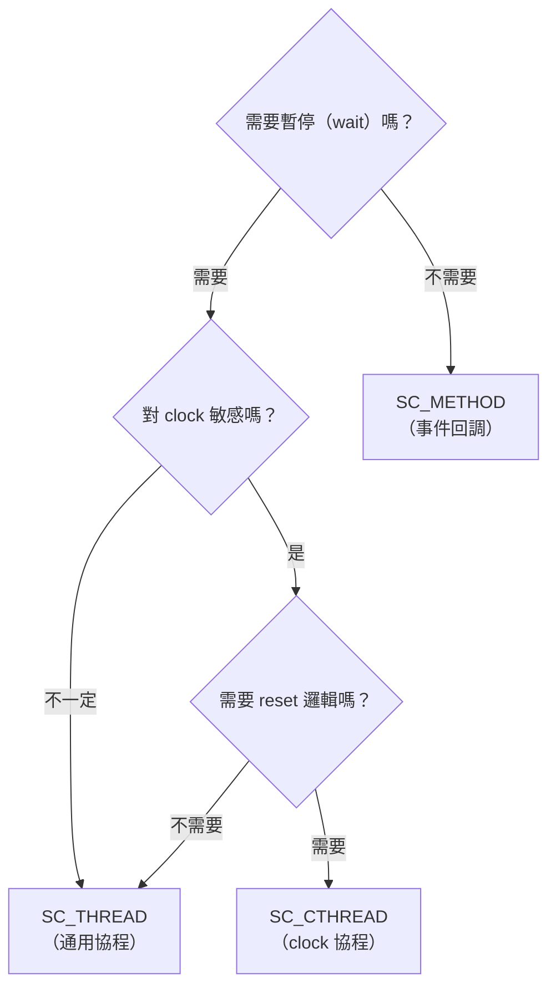

---

## 事件與敏感性

### 靜態敏感（Static Sensitivity）

在 constructor 中宣告，一旦設定就不會改變。

```
SC_METHOD(handler);
sensitive << signal_a << signal_b;  // signal_a 或 signal_b 改變時觸發
```

**軟體對應**：React 的 `useEffect` dependency array -- 你在宣告時就指定依賴。

### 動態敏感（Dynamic Sensitivity）

在 process 執行時動態決定要等什麼事件。

```
void my_thread() {
    while (true) {
        wait(event_a);         // 這次等 event_a
        // ... 做一些事 ...
        wait(event_b);         // 這次等 event_b
        // ... 做一些事 ...
        wait(10, SC_NS);       // 這次等 10 奈秒
    }
}
```

**軟體對應**：`await` 不同的 asyncio.Future -- 每次 `await` 的對象可以不同。

### 事件組合

| SystemC 語法 | 軟體對應 | 意義 |
|-------------|---------|------|
| `wait(e1)` | `await future1` | 等待單一事件 |
| `wait(e1 & e2)` | `await asyncio.gather(p1, p2)` | 等待所有事件都發生 |
| `wait(e1 \| e2)` | `await asyncio.wait([p1, p2], return_when=FIRST_COMPLETED)` | 等待任一事件發生 |
| `wait(10, SC_NS)` | `await sleep(10)` | 等待一段時間 |
| `wait(10, SC_NS, e1)` | `await asyncio.wait([sleep(10), p1], return_when=FIRST_COMPLETED)` | 等待事件或超時 |

---

## Delta Cycle 深入解析

Delta cycle 是 SystemC 並行模型中最核心也最容易混淆的概念。

### 為什麼需要 Delta Cycle？

在硬體中，所有暫存器在 clock edge 時**同時**更新。但在軟體中，指令是一行一行執行的。Delta cycle 就是用來模擬「同時」這件事的機制。

### 一個具體的例子

假設有一個 swap 電路：在 clock edge 時，A 和 B 互換值。

```
Process_1: A_next = B.read()
Process_2: B_next = A.read()
```

如果沒有 delta cycle（值立即生效）：

| 步驟 | A | B | 問題 |
|------|---|---|------|
| 初始 | 1 | 2 | |
| Process_1 執行：A = B | **2** | 2 | A 變成 2 |
| Process_2 執行：B = A | 2 | **2** | B 讀到的是「已經改過的 A」! |

**結果**：A=2, B=2 -- swap 失敗!

有 delta cycle（值在 update 階段才生效）：

| 步驟 | A (當前值) | B (當前值) | A (待更新) | B (待更新) |
|------|-----------|-----------|-----------|-----------|
| 初始 | 1 | 2 | | |
| Evaluate: Process_1 | 1 | 2 | **2** | |
| Evaluate: Process_2 | 1 | 2 | | **1** |
| Update | **2** | **1** | | |

**結果**：A=2, B=1 -- swap 成功!

### Delta Cycle 的完整流程

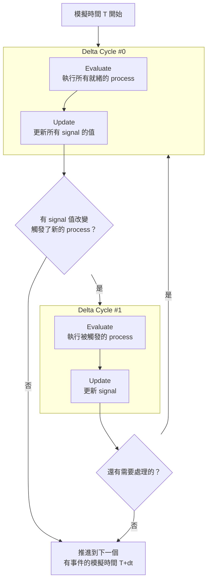

### 時間軸視覺化

```mermaid
gantt
    title 模擬時間 vs Delta Cycle
    dateFormat X
    axisFormat %s

    section 模擬時間 T=0
    Delta 0 Evaluate : 0, 1
    Delta 0 Update   : 1, 2
    Delta 1 Evaluate : 2, 3
    Delta 1 Update   : 3, 4

    section 模擬時間 T=10ns
    Delta 0 Evaluate : 5, 6
    Delta 0 Update   : 6, 7

    section 模擬時間 T=20ns
    Delta 0 Evaluate : 8, 9
    Delta 0 Update   : 9, 10
    Delta 1 Evaluate : 10, 11
    Delta 1 Update   : 11, 12
```

**重點**：模擬時間在 delta cycle 之間**不會前進**。Delta cycle 發生在「零時間」內。這就像 Python asyncio 的 microtask -- `loop.call_soon(...)` 在當前 iteration 結束前就會執行，不會等到下一個 event loop tick。

---

## 動態 Process 與 Fork-Join

SystemC 2.1 引入了動態建立 process 的能力。在此之前，所有 process 都必須在 elaboration（建構）階段建立。

### sc_spawn -- 動態建立 Process

**軟體對應**：`asyncio.create_task(fn())` / `threading.Thread(target=fn).start()`

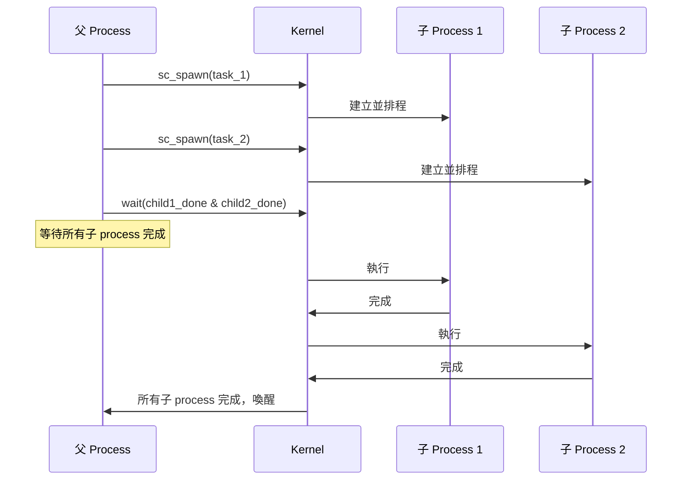

### sc_process_handle 與 Fork-Join

**軟體對應**：

| SystemC | Python | C++ |
|---------|--------|-----|
| `sc_spawn()` | `asyncio.create_task()` | `std::async()` |
| `sc_process_handle` | `asyncio.Task` | `std::future<T>` |
| `wait(handle.terminated_event())` | `await task` | `future.get()` |
| Fork-Join all | `asyncio.gather()` | 多個 `std::async` + `future.get()` |

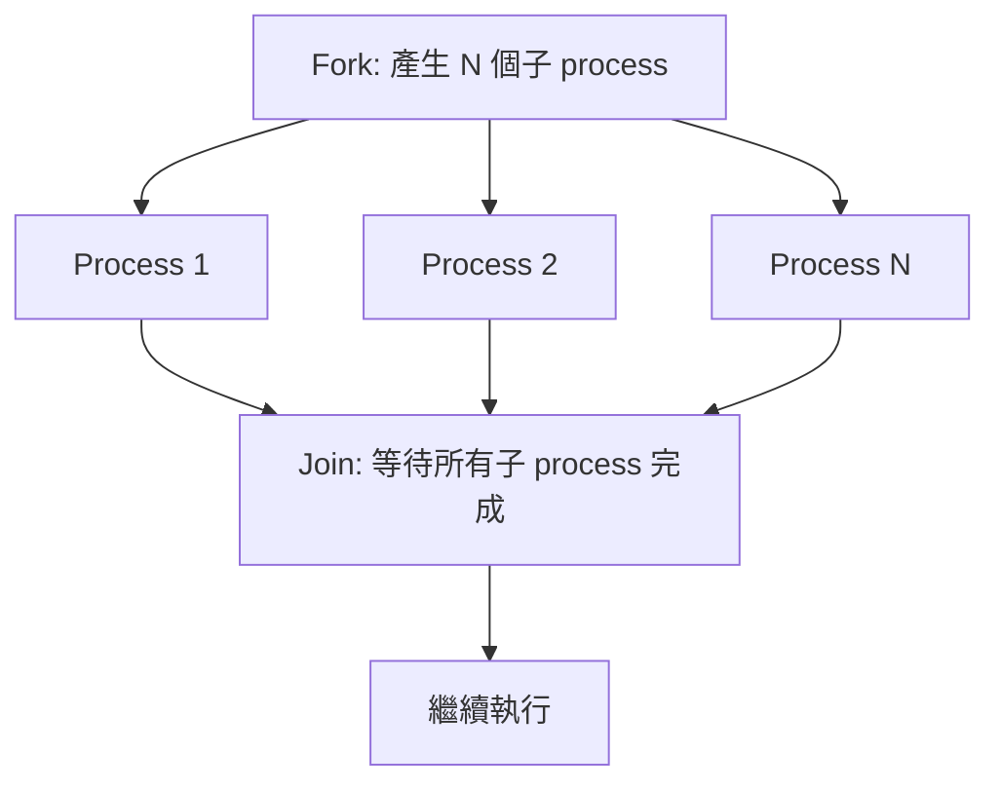

### Barrier -- 同步屏障

Barrier 讓多個 process 在某個點同步 -- 所有 process 都到達 barrier 後，才一起繼續。

**軟體對應**：`pthread_barrier_wait()` / `Python threading.Barrier`

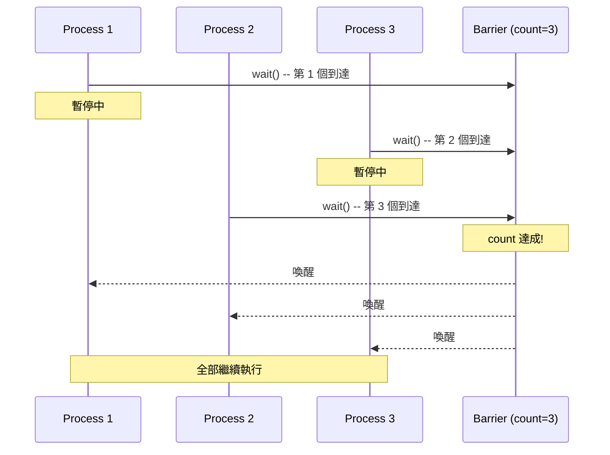

---

## Mutex 與 Semaphore

雖然 SystemC 是單 thread 執行（不會有 race condition），但仍然提供 `sc_mutex` 和 `sc_semaphore`，因為硬體中存在**資源競爭**的概念。

### sc_mutex

**軟體對應**：`threading.Lock()` (Python) / `std::mutex` (C++)

用途：確保在同一模擬時間內，只有一個 process 使用某個共享資源。

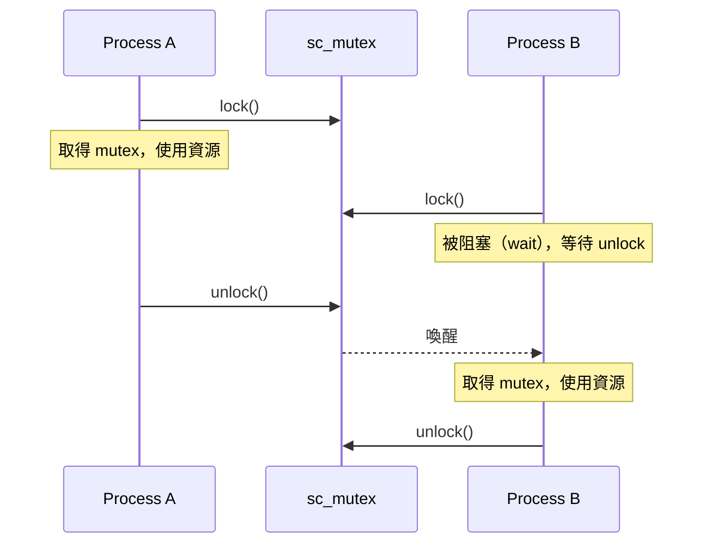

**注意**：這裡的「阻塞」是 SystemC 的 `wait()` -- process 暫停並交出控制權，不是 OS 的 thread blocking。

### sc_semaphore

**軟體對應**：`threading.Semaphore(n)` (Python) / 有限容量的 buffer

用途：限制同時使用某個資源的 process 數量。

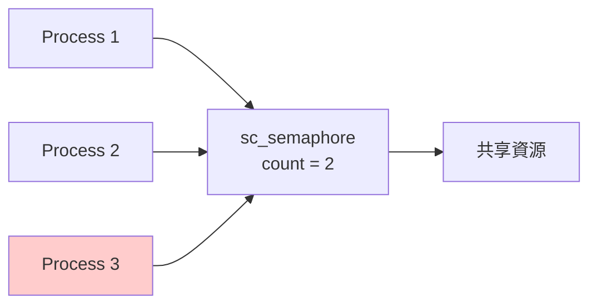

上圖中，semaphore 的計數為 2，所以最多兩個 process 可以同時存取資源。Process 3 必須等待。

---

## Simulation Kernel 完整流程

以下是 SystemC simulation kernel 在一個模擬時間點的完整執行流程：

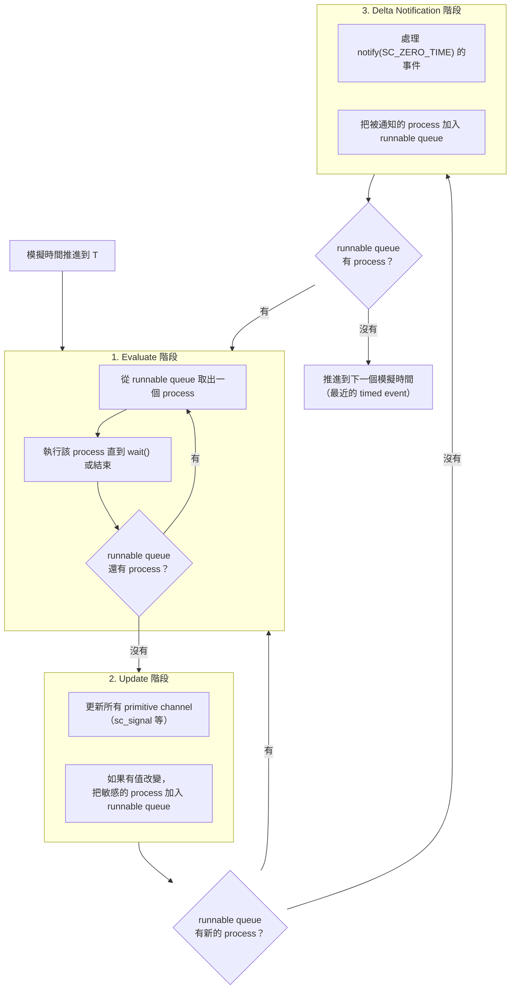

### 與其他事件迴圈的比較

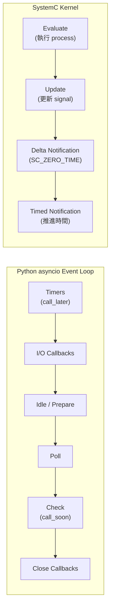

---

## 範例中的並行模型應用

| 範例 | 使用的 Process 類型 | 並行特點 |
|------|-------------------|---------|
| [simple_fifo](../code/sysc/simple_fifo/_index.md) | SC_THREAD x2 | Producer 和 Consumer 透過 event 交替執行 |
| [pipe](../code/sysc/pipe/_index.md) | SC_CTHREAD x3 | 三個 pipeline stage 同步在 clock edge |
| [fir](../code/sysc/fir/_index.md) | SC_CTHREAD | Behavioral: 1 個 / RTL: FSM + Datapath 各 1 個 |
| [simple_bus](../code/sysc/simple_bus/_index.md) | SC_THREAD + SC_METHOD | Master 用 thread，仲裁用 method |
| [risc_cpu](../code/sysc/risc_cpu/_index.md) | SC_CTHREAD x5 | 五個 pipeline stage 同步在 clock edge |
| [2.1 fork-join](../code/sysc/2.1/_index.md) | sc_spawn | 動態建立子 process 並等待完成 |
| [2.1 barrier](../code/sysc/2.1/_index.md) | SC_THREAD + barrier | 多個 process 在 barrier 同步 |
| [2.1 mutex](../code/sysc/2.1/_index.md) | SC_THREAD + sc_mutex | 多個 process 互斥存取共享資源 |
| [async_suspend](../code/sysc/async_suspend/_index.md) | SC_THREAD + async | SystemC process 與外部 OS thread 互動 |

---

## 常見誤解與陷阱

### 誤解 1：「SC_THREAD 就是 OS thread」

**錯**。SC_THREAD 是由 SystemC kernel 排程的 coroutine，全部跑在同一個 OS thread 上。沒有平行執行，沒有 race condition。

### 誤解 2：「write 之後馬上 read 可以拿到新值」

**不一定**。如果你寫入的是 `sc_signal`，新值要到下一個 delta cycle 的 update 階段才會生效。在同一個 evaluate 階段內，`read()` 拿到的還是舊值。

### 誤解 3：「process 的執行順序是固定的」

**不保證**。在同一個 delta cycle 中，哪個 process 先執行是 implementation-defined。你的模型不應該依賴特定的執行順序。

### 誤解 4：「SC_METHOD 比 SC_THREAD 好」

**各有適用場景**。SC_METHOD 記憶體開銷小、效率高，適合簡單的組合邏輯。SC_THREAD 功能強大，適合複雜的多步驟流程。選擇取決於需求。

---

## 重點整理

1. **SystemC 是單 thread 的協作式多工** -- 不需要 mutex，不會有 race condition
2. **三種 process**：SC_THREAD（協程）、SC_METHOD（回調）、SC_CTHREAD（clock 協程）
3. **Delta cycle 模擬「同時」** -- evaluate（計算）和 update（更新）分開進行
4. **sc_spawn 支援動態 process** -- fork-join 模式在 SystemC 2.1 之後可用
5. **執行順序不保證** -- 不要依賴同一 delta cycle 內 process 的執行順序

---

## 延伸閱讀

- [systemc-for-software-engineers.md](systemc-for-software-engineers.md) -- SystemC 核心概念總覽
- [2.1 版本特性](../code/sysc/2.1/_index.md) -- 動態 process、fork-join、barrier 的實際範例
- [async_suspend](../code/sysc/async_suspend/_index.md) -- 與外部 OS thread 互動
- [behavioral-vs-rtl.md](behavioral-vs-rtl.md) -- 不同抽象層級如何使用 process
