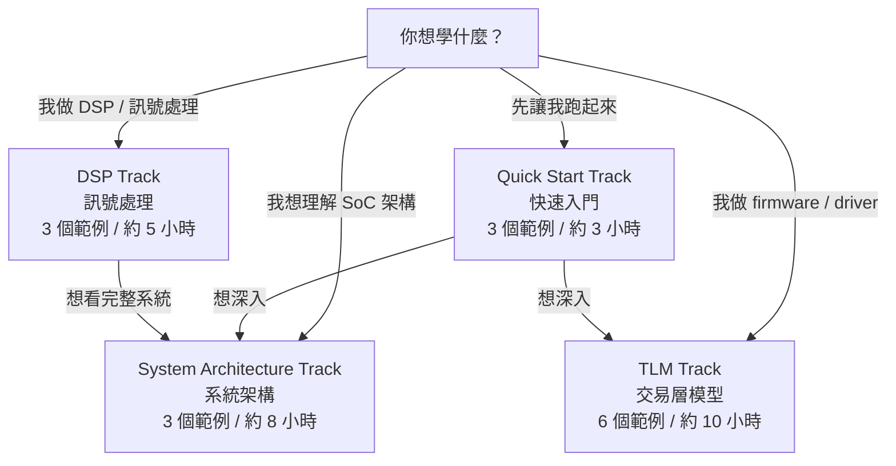
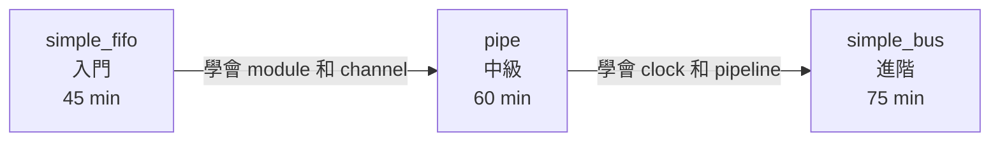
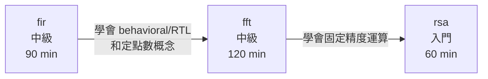
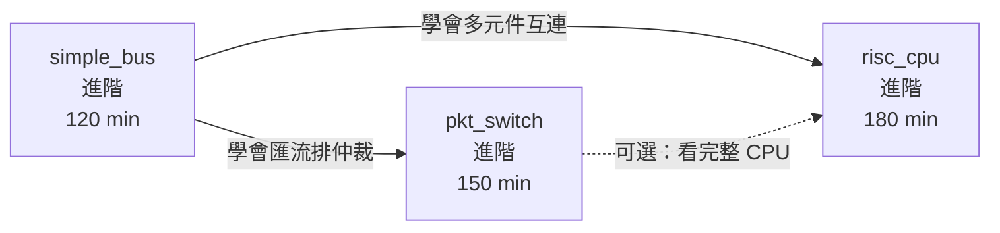
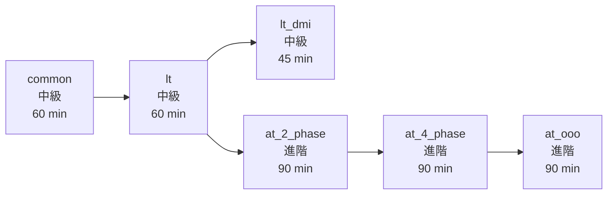
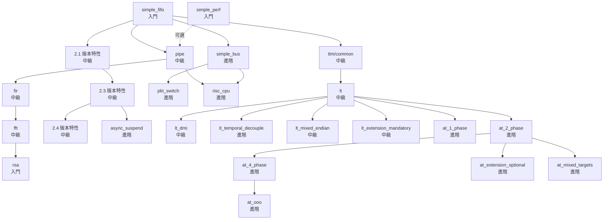

# 學習路線圖

> 本文件提供四條學習路線，讓你根據自己的目標選擇最適合的範例閱讀順序。
> 每條路線都標注了**難度等級**、**預估時間**、以及**你將學到什麼**。

---

## 四條學習路線總覽

---

## Track 1: Quick Start（快速入門）

> **目標**：用最少的時間理解 SystemC 的核心運作方式。
> **適合**：第一次接觸 SystemC，只想快速建立直覺。

| 順序 | 範例 | 難度 | 預估時間 | 你將學到 |
|------|------|------|---------|---------|
| 1 | [simple_fifo](../code/sysc/simple_fifo/_index.md) | 入門 | 45 分鐘 | sc_module、sc_channel、SC_THREAD、event 阻塞通訊 |
| 2 | [pipe](../code/sysc/pipe/_index.md) | 中級 | 60 分鐘 | 多級管線、SC_CTHREAD、clock 驅動、模組間訊號連接 |
| 3 | [simple_bus](../code/sysc/simple_bus/_index.md) | 進階 | 75 分鐘 | sc_interface 多型、仲裁機制、多 master/slave 系統 |

### 學習路徑圖

### 各範例重點

**simple_fifo** -- 你的第一個 SystemC 程式

- **前置知識**：C++ 基礎
- **核心收穫**：理解 SystemC 的三大支柱 -- module（元件）、channel（通訊）、process（行為）
- **關鍵帶走**：SystemC 的 FIFO channel 就是 Python queue.Queue 的硬體版本

**pipe** -- 從單一元件到多級系統

- **前置知識**：simple_fifo 的 module/process 概念
- **核心收穫**：理解硬體管線的「同時多工」特性，以及 SC_CTHREAD 如何在 clock edge 驅動下運作
- **關鍵帶走**：管線就是 Unix pipe -- 每個階段同時處理不同資料

**simple_bus** -- 真正的系統級設計

- **前置知識**：module、channel、interface 概念
- **核心收穫**：理解 sc_interface 如何實現多型、匯流排仲裁如何解決資源競爭
- **關鍵帶走**：匯流排仲裁就是多執行緒環境下的 lock 排程策略

---

## Track 2: DSP / 訊號處理

> **目標**：理解數位訊號處理的硬體建模方式。
> **適合**：從事音訊、影像、通訊等 DSP 相關工作的軟體工程師。

| 順序 | 範例 | 難度 | 預估時間 | 你將學到 |
|------|------|------|---------|---------|
| 1 | [fir](../code/sysc/fir/_index.md) | 中級 | 90 分鐘 | Behavioral vs RTL 雙實作、狀態機分解、定點數 |
| 2 | [fft](../code/sysc/fft/_index.md) | 中級 | 120 分鐘 | 浮點 vs 定點實作、蝶形運算結構 |
| 3 | [rsa](../code/sysc/rsa/_index.md) | 入門 | 60 分鐘 | SystemC 的 sc_bigint 大數型別、純運算模組 |

### 學習路徑圖

### 各範例重點

**fir** -- 行為級與 RTL 的雙重視角

- **前置知識**：基本的 SC_MODULE 和 SC_CTHREAD
- **核心收穫**：同一個演算法（滑動視窗加權平均）如何用兩種完全不同的抽象層級實作
- **關鍵帶走**：Behavioral 就是 Python prototype，RTL 就是手動優化的 C++
- **延伸閱讀**：[behavioral-vs-rtl.md](behavioral-vs-rtl.md)

**fft** -- 從浮點到定點的精度取捨

- **前置知識**：fir 的 behavioral/RTL 概念、基本的傅立葉轉換直覺
- **核心收穫**：理解定點數（fixed-point）如何用有限位元逼近浮點數精度
- **關鍵帶走**：定點數就是「小數點位置固定的整數運算」，硬體上便宜很多

**rsa** -- 大數運算的硬體加速

- **前置知識**：基本 C++ 和 RSA 演算法概念
- **核心收穫**：理解 SystemC 的 sc_bigint / sc_biguint 型別如何處理任意精度整數
- **關鍵帶走**：SystemC 內建了硬體友善的大數運算，不需要第三方函式庫

---

## Track 3: System Architecture（系統架構）

> **目標**：理解完整 SoC 系統的建模方式，從匯流排到 CPU。
> **適合**：想理解嵌入式系統 / SoC 架構的軟體工程師。

| 順序 | 範例 | 難度 | 預估時間 | 你將學到 |
|------|------|------|---------|---------|
| 1 | [simple_bus](../code/sysc/simple_bus/_index.md) | 進階 | 120 分鐘 | 匯流排協議、仲裁、多 master/slave |
| 2 | [pkt_switch](../code/sysc/pkt_switch/_index.md) | 進階 | 150 分鐘 | 封包路由、FIFO 佇列、網路拓撲 |
| 3 | [risc_cpu](../code/sysc/risc_cpu/_index.md) | 進階 | 180 分鐘 | Fetch-Decode-Execute、管線、快取 |

### 學習路徑圖

### 各範例重點

**simple_bus** -- 共享匯流排與仲裁

- **前置知識**：SC_MODULE、sc_interface、sc_channel
- **核心收穫**：理解多個 master 如何透過仲裁共享一條匯流排，以及 blocking / non-blocking 傳輸的差異
- **關鍵帶走**：匯流排仲裁 = 多執行緒搶 lock 的排程器

**pkt_switch** -- 封包交換網路

- **前置知識**：simple_bus 的多元件互連概念
- **核心收穫**：理解封包路由、FIFO 佇列管理、以及 N-to-N 通訊拓撲
- **關鍵帶走**：封包交換就是一個硬體版本的 message broker / 網路路由器

**risc_cpu** -- 完整的 CPU 模型

- **前置知識**：匯流排概念（simple_bus）、管線概念（pipe）
- **核心收穫**：理解 CPU 的五大單元（fetch、decode、execute、memory、writeback）如何協作
- **關鍵帶走**：CPU 就是一個「讀取指令 -> 解碼 -> 執行」的無窮迴圈，加上快取來加速

---

## Track 4: TLM（交易層模型）

> **目標**：理解 TLM 2.0 的通訊建模方式，從最簡單的 blocking 到複雜的多階段協議。
> **適合**：做 firmware / driver 開發、需要與硬體模型互動的軟體工程師。

| 順序 | 範例 | 難度 | 預估時間 | 你將學到 |
|------|------|------|---------|---------|
| 1 | [common](../code/tlm/common/_index.md) | 中級 | 60 分鐘 | 共用元件庫：initiator、target、bus、memory |
| 2 | [lt](../code/tlm/lt/_index.md) | 中級 | 60 分鐘 | Loosely-Timed blocking transport |
| 3 | [lt_dmi](../code/tlm/lt_dmi/_index.md) | 中級 | 45 分鐘 | Direct Memory Interface 快速路徑 |
| 4 | [at_2_phase](../code/tlm/at_2_phase/_index.md) | 進階 | 90 分鐘 | Approximately-Timed 雙階段協議 |
| 5 | [at_4_phase](../code/tlm/at_4_phase/_index.md) | 進階 | 90 分鐘 | 完整四階段握手協議 |
| 6 | [at_ooo](../code/tlm/at_ooo/_index.md) | 進階 | 90 分鐘 | 亂序完成（Out-of-Order） |

### 學習路徑圖

### 各範例重點

**common** -- TLM 的共用積木

- **前置知識**：基本的 SC_MODULE 概念
- **核心收穫**：理解 initiator / target / bus / memory 四種角色
- **關鍵帶走**：這是所有 TLM 範例共用的 client-server 元件庫

**lt** -- 最簡單的 TLM 通訊

- **前置知識**：common 的元件角色
- **核心收穫**：理解 `b_transport()` blocking 呼叫的完整流程
- **關鍵帶走**：LT 就是同步 HTTP -- 送出 request，阻塞等待 response
- **延伸閱讀**：[tlm-explained.md](tlm-explained.md)

**lt_dmi** -- 記憶體直接存取

- **前置知識**：lt 的 blocking transport
- **核心收穫**：理解 DMI 如何繞過 bus 直接讀寫 target 記憶體
- **關鍵帶走**：DMI 就是 mmap -- 把遠端記憶體映射到本地指標

**at_2_phase** -- 非阻塞的雙階段協議

- **前置知識**：lt 的 transport 概念
- **核心收穫**：理解 `nb_transport_fw/bw` 的 BEGIN_REQ / END_REQ 兩階段交握
- **關鍵帶走**：AT 就是非同步 RPC -- 送出 request 後立刻返回，稍後收到 callback

**at_4_phase** -- 完整的四階段握手

- **前置知識**：at_2_phase 的雙階段概念
- **核心收穫**：理解 BEGIN_REQ / END_REQ / BEGIN_RESP / END_RESP 四階段如何模擬真實匯流排時序
- **關鍵帶走**：四階段就是 TCP 的 SYN/ACK 握手 -- 每一步都有明確的確認

**at_ooo** -- 亂序完成

- **前置知識**：at_4_phase 的完整協議
- **核心收穫**：理解 target 如何以不同於 request 順序完成 response（Out-of-Order）
- **關鍵帶走**：就像 `asyncio.gather()` -- 多個請求同時發出，完成順序不確定

---

## 補充範例（可選讀）

以下範例不在主要路線中，但可根據興趣選讀：

| 範例 | 屬於 | 特色 |
|------|------|------|
| [simple_perf](../code/sysc/simple_perf/_index.md) | Quick Start | 效能建模，學習如何加上時間延遲 |
| [2.1](../code/sysc/2.1/_index.md) | 版本特性 | 動態 process、fork-join、barrier、mutex |
| [2.3](../code/sysc/2.3/_index.md) | 版本特性 | 握手協議、非同步事件 |
| [2.4](../code/sysc/2.4/_index.md) | 版本特性 | 類別內初始化（語法糖） |
| [async_suspend](../code/sysc/async_suspend/_index.md) | 版本特性 | 非同步暫停與外部中斷 |
| [lt_temporal_decouple](../code/tlm/lt_temporal_decouple/_index.md) | TLM 進階 | 時間解耦優化 |
| [lt_mixed_endian](../code/tlm/lt_mixed_endian/_index.md) | TLM 進階 | Big/Little Endian 混合處理 |
| [lt_extension_mandatory](../code/tlm/lt_extension_mandatory/_index.md) | TLM 進階 | 必要的 transaction 擴展 |
| [at_1_phase](../code/tlm/at_1_phase/_index.md) | TLM 進階 | 單階段 AT 協議 |
| [at_extension_optional](../code/tlm/at_extension_optional/_index.md) | TLM 進階 | 可選的 transaction 擴展 |
| [at_mixed_targets](../code/tlm/at_mixed_targets/_index.md) | TLM 進階 | 混合 LT/AT target |

---

## 完整前置依賴圖

