# SystemC -- 軟體工程師的全局觀

> 本文用軟體工程師熟悉的概念來解釋 SystemC 的核心觀念。
> 你不需要任何硬體背景就能理解這份文件。

---

## SystemC 是什麼？

**一句話**：SystemC 是一個 C++ class library，讓你用寫 C++ 程式的方式來建模硬體系統。

它不是一種新語言，而是一組定義在 `systemc.h` 裡的 class 和 macro。你用標準 C++ compiler（gcc / clang）編譯，連結 SystemC library，然後像普通程式一樣執行。

```
你的 SystemC 模型（.cpp）
        |
        v
  標準 C++ Compiler (g++)
        |
        v
  連結 libsystemc.a
        |
        v
  可執行檔（模擬器）
```

### 為什麼軟體工程師需要了解？

1. **硬體-軟體協同設計（HW/SW Co-design）**：在 SoC 開發中，firmware 和 hardware 需要同時開發。SystemC 讓你在硬體還沒做出來之前就能測試 firmware。

2. **嵌入式系統驗證**：你的 driver 程式碼可以在 SystemC 模擬環境中執行，不用等實際晶片。

3. **效能建模**：用 SystemC 模擬系統架構，在投片之前就能預估效能瓶頸。

4. **理解硬體行為**：即使你不設計硬體，理解硬體的運作方式能幫助你寫出更好的底層軟體。

---

## 核心概念對照表

以下是 SystemC 核心概念與軟體概念的對應關係：

| SystemC 概念 | 軟體對應 | 說明 |
|-------------|---------|------|
| `sc_module` | class / component | 可重用的硬體模組 |
| `sc_port` | dependency injection interface | 模組的對外連接點 |
| `sc_signal` | Observable / reactive variable | 帶有變更通知的訊號線 |
| `SC_THREAD` | coroutine / Python coroutine (asyncio) | 有自己的執行流程，可以暫停與恢復 |
| `SC_METHOD` | event callback | 被事件觸發時執行一次，不能暫停 |
| `sc_event` | condition variable / asyncio.Future | 用來通知「某件事發生了」 |
| `sc_channel` | typed communication pipe | 帶協議的通訊管道 |
| `sc_interface` | C++ abstract class / Python ABC | 定義通訊協議的純虛擬介面 |

以下我們逐一展開。

---

## sc_module -- 可重用的元件

`sc_module` 就是一個 C++ class，代表一個硬體模組。

**軟體對應**：就像你在微服務架構中的一個 service，或者 React 中的一個 component。它有自己的內部狀態、對外的介面、以及內部的行為邏輯。

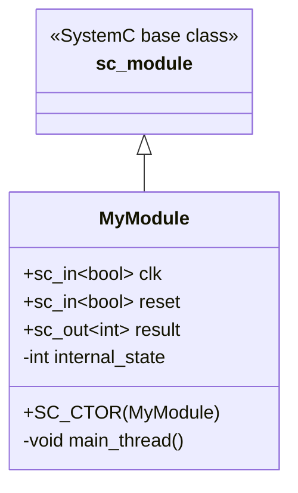

**軟體世界的對照**：

| 硬體模組的元素 | 軟體 class 的對應 |
|-------------|----------------|
| input port（輸入埠） | constructor 參數 / 依賴注入 |
| output port（輸出埠） | return value / callback |
| internal signal（內部訊號） | private member variable |
| process（行為） | method / thread |

---

## sc_port -- 依賴注入介面

`sc_port` 是模組對外的連接點。一個 port 必須連接到一個實作了特定 interface 的 channel。

**軟體對應**：這就是 **dependency injection**。你不在模組內部直接建立通訊物件，而是宣告「我需要一個實作了某某介面的東西」，然後在外部把具體實作注入進來。

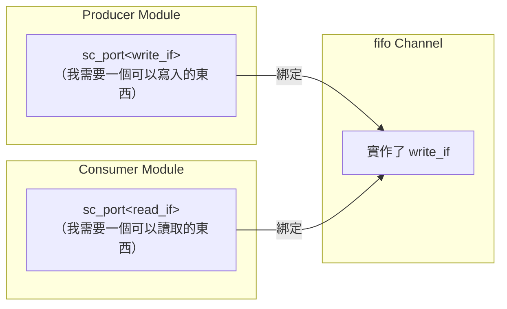

**關鍵觀念**：module 之間永遠不直接通訊。它們透過 port 連接到 channel，channel 實作了特定的 interface。這就像 dependency injection (like Python's inject library) 的 `@inject` -- 模組只知道介面，不知道具體實作。

---

## sc_signal -- 可觀察的響應式變數

`sc_signal` 是一條「線」，當它的值改變時，會自動通知所有監聽者。

**軟體對應**：

- **RxJS Observable**：signal 的值改變時，訂閱者會收到通知
- **Vue.js reactive ref**：你修改值，UI 自動更新
- **Database trigger**：欄位改變時觸發回調

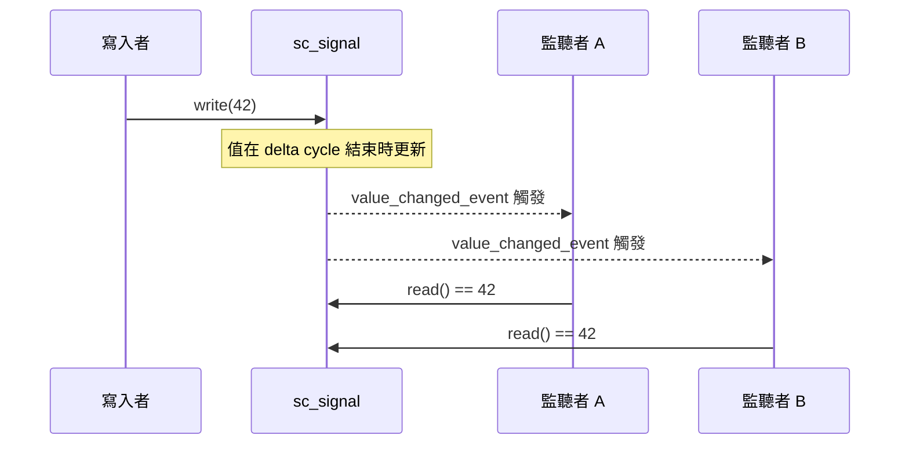

**重要差異**：sc_signal 的寫入不是即時生效的。新值要到下一個 **delta cycle** 才會更新。這是為了模擬硬體中「所有訊號同時更新」的特性。（詳見 [concurrency-model.md](concurrency-model.md) 的 delta cycle 章節。）

---

## SC_THREAD -- 協程 / Python Coroutine

`SC_THREAD` 是一個有自己執行流程的 process。它可以在執行途中暫停（`wait()`），等待某個事件後繼續執行。

**軟體對應**：

- **Python 的 asyncio coroutine**：獨立的輕量級執行流程
- **Python 的 async/await**：`wait()` 就是 `await`
- **C++ 的 coroutine (C++20)**：`co_await` 暫停，之後繼續

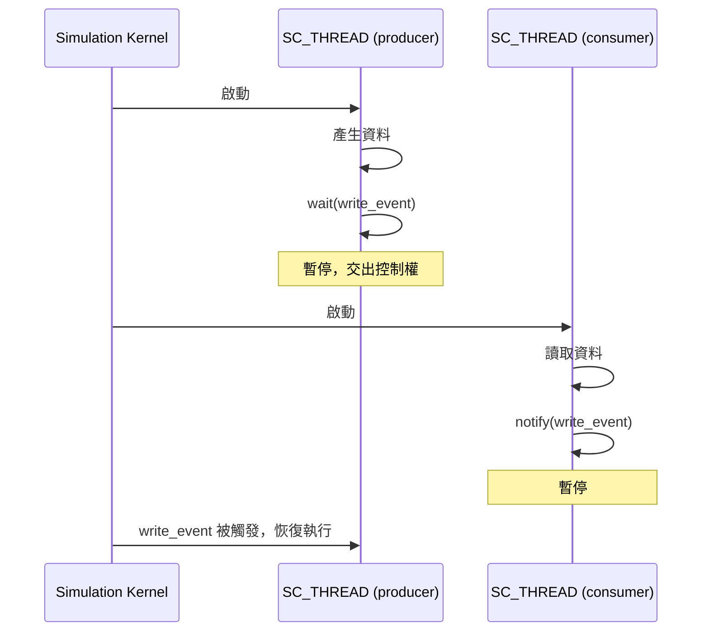

**關鍵差異**：SC_THREAD 是**協作式（cooperative）**多工，不是搶占式（preemptive）。一個 thread 必須主動呼叫 `wait()` 才會讓出控制權。這意味著不需要 mutex -- 因為在任一時刻只有一個 thread 在執行。

---

## SC_METHOD -- 事件回調

`SC_METHOD` 是一個簡單的回調函式。當它的敏感事件（sensitivity）被觸發時，kernel 會呼叫它一次。它不能暫停（不能呼叫 `wait()`）。

**軟體對應**：

- **DOM event listener**：`button.addEventListener('click', handler)`
- **React useEffect**：dependency 改變時執行
- **Database trigger**：INSERT / UPDATE 時觸發

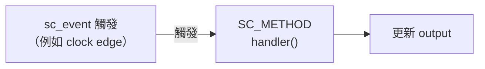

**SC_THREAD vs SC_METHOD**：

| 特性 | SC_THREAD | SC_METHOD |
|------|-----------|-----------|
| 可以 `wait()` | 可以 | 不行 |
| 執行方式 | 像 coroutine，有狀態 | 像 callback，無狀態 |
| 記憶體開銷 | 較大（需要 stack） | 較小（不需要 stack） |
| 適合場景 | 複雜的多步驟流程 | 簡單的組合邏輯、狀態轉移 |
| 軟體類比 | Python coroutine (asyncio) / async function | event handler / callback |

---

## sc_event -- 條件變數 / asyncio.Future

`sc_event` 是 SystemC 中最基礎的同步機制。它代表「某件事情發生了」。

**軟體對應**：

- **pthread 的 condition variable**：`pthread_cond_signal` / `pthread_cond_wait`
- **Python 的 asyncio.Future set_result**：事件觸發時，等待的 thread 被喚醒
- **Python 的 queue.Queue put**：解除另一端的阻塞

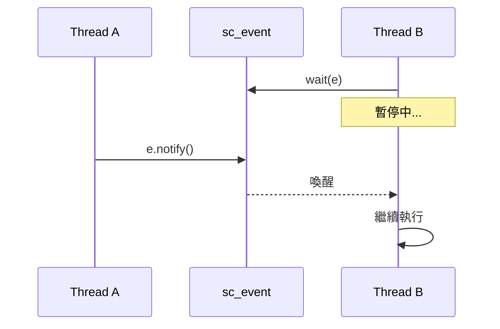

**三種通知時機**：

| 呼叫方式 | 生效時機 | 軟體類比 |
|---------|---------|---------|
| `e.notify()` | 立即（同一 delta cycle） | `loop.call_soon()` 放入 callback queue |
| `e.notify(SC_ZERO_TIME)` | 下一個 delta cycle | `setTimeout(fn, 0)` |
| `e.notify(10, SC_NS)` | 10 奈秒後 | `setTimeout(fn, 10)` |

---

## sc_channel 與 sc_interface -- 通訊管道與協議

`sc_interface` 定義通訊協議（pure virtual class），`sc_channel` 實作該協議。

**軟體對應**：

- `sc_interface` = C++ abstract class / Python ABC
- `sc_channel` = 該 interface 的具體實作

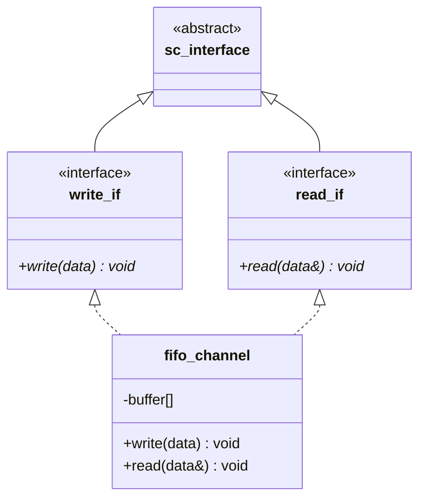

**為什麼要這樣設計？**

這就像軟體架構中的 **介面隔離原則（Interface Segregation Principle）**：

- Producer 只需要知道 `write_if`（「我可以寫入」）
- Consumer 只需要知道 `read_if`（「我可以讀取」）
- 實際的 FIFO 同時實作兩者，但各端只看到自己需要的

這使得模組可以重用 -- 你可以把 FIFO 換成任何實作了 `write_if` 的 channel，Producer 完全不需要修改。

---

## Simulation Kernel -- 事件迴圈

SystemC 的 simulation kernel 就是一個事件迴圈（event loop），和 Python asyncio event loop 幾乎是相同的概念。

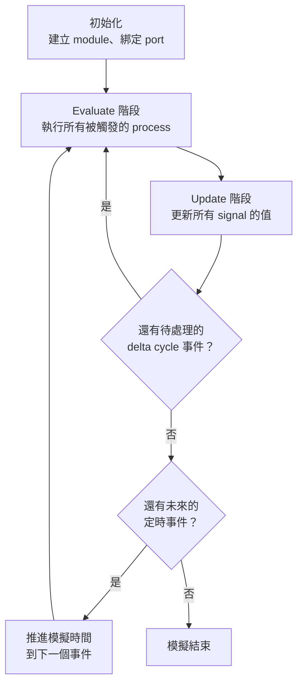

**與 Python asyncio event loop 的對比**：

| 概念 | Python asyncio | SystemC |
|------|---------|---------|
| 事件迴圈 | Event Loop | Simulation Kernel |
| 回調佇列 | Callback Queue | 待執行的 SC_METHOD |
| 微任務 | call_soon queue | Delta Cycle |
| 定時器 | call_later | timed event (wait 10 ns) |
| I/O 回調 | add_reader callback | SC_THREAD 被 event 喚醒 |

---

## Delta Cycle -- 微任務佇列

Delta cycle 是 SystemC 中最令軟體工程師困惑的概念之一。它的核心目的是**解決同時更新的順序問題**。

### 問題：訊號的讀寫順序

假設兩個 process 在同一時刻執行：
- Process A 讀取 signal X，然後根據結果寫入 signal Y
- Process B 讀取 signal Y，然後根據結果寫入 signal X

如果沒有 delta cycle，結果會取決於 A 和 B 誰先執行（race condition）。

### 解法：分開「計算」和「更新」

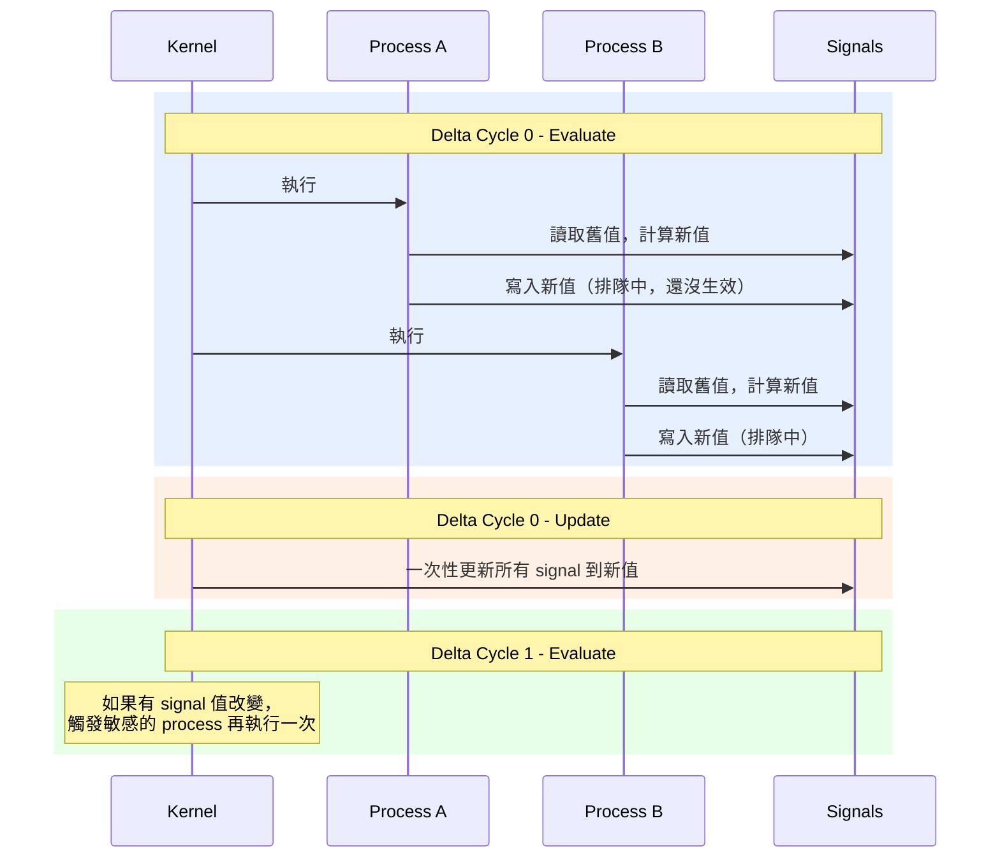

**軟體類比**：

- 就像 React 的 `setState` -- 你呼叫 `setState` 時值不會立刻改變，而是等到 render cycle 結束後才一起更新
- 或者像 Vue.js 的 `nextTick` -- DOM 更新是批次（batched）的

**為什麼這很重要？**

因為在硬體中，所有的暫存器在 clock edge 時「同時」更新。Delta cycle 機制讓模擬器能在單一執行緒上正確模擬這個「同時」的語意。

（更詳細的說明請見 [concurrency-model.md](concurrency-model.md)。）

---

## 一個完整範例的生命週期

以下是一個典型 SystemC 模型從開始到結束的完整流程：

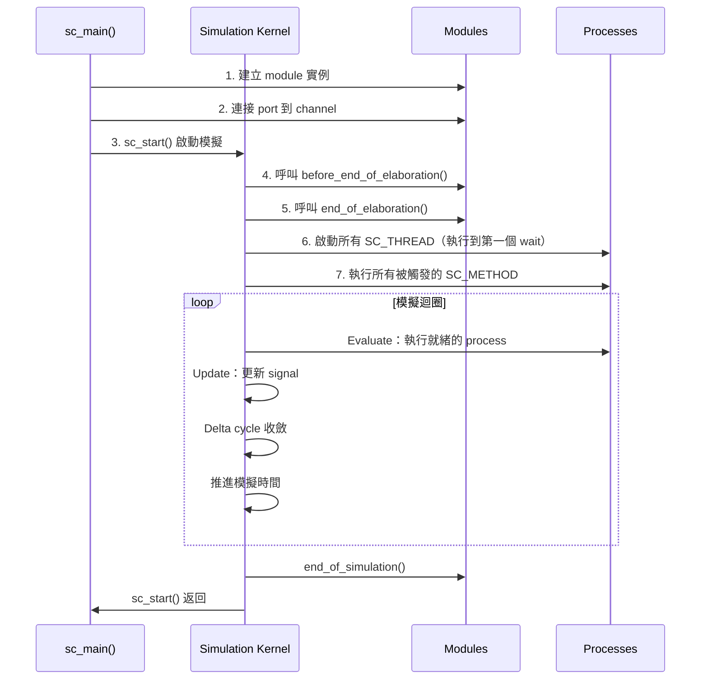

---

## 概念全景圖

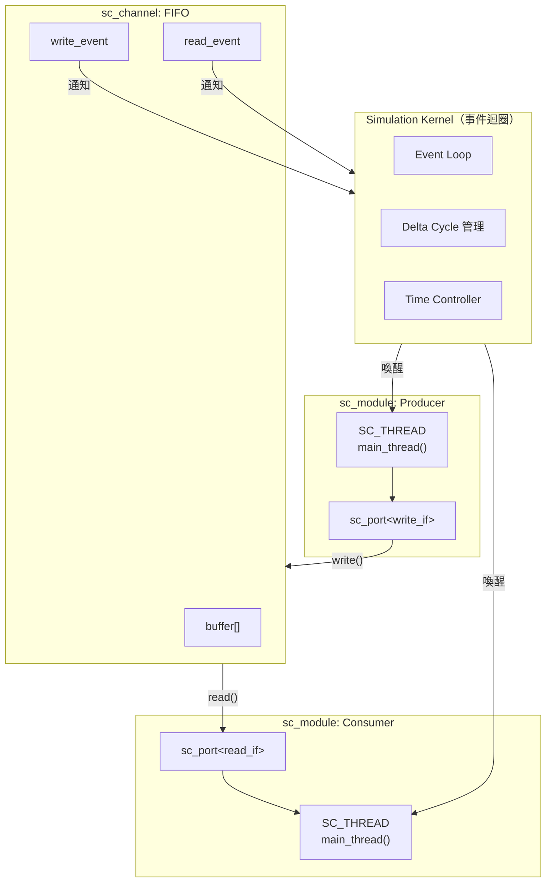

---

## 下一步

- 想動手看範例？前往 [learning-path.md](learning-path.md) 選擇你的學習路線
- 想深入理解並行模型？閱讀 [concurrency-model.md](concurrency-model.md)
- 想了解 TLM 交易層模型？閱讀 [tlm-explained.md](tlm-explained.md)
- 想理解 Behavioral vs RTL？閱讀 [behavioral-vs-rtl.md](behavioral-vs-rtl.md)
