# TLM -- 軟體工程師的交易層模型指南

> 本文用軟體工程師熟悉的概念來解釋 TLM (Transaction Level Modeling) 2.0。
> 前置知識：建議先閱讀 [systemc-for-software-engineers.md](systemc-for-software-engineers.md)。

---

## TLM 是什麼？

**一句話**：TLM 是 SystemC 的通訊抽象層，讓你用「交易（transaction）」而非「訊號線（wire）」來描述元件間的資料傳輸。

### 為什麼需要 TLM？

想像你要模擬一個 SoC 系統：CPU 透過匯流排讀寫記憶體。

**不用 TLM（RTL 層級）**：你需要模擬每一條訊號線 -- address bus (32 條線)、data bus (64 條線)、read/write 控制線、handshake 線... 每個 clock cycle 都要更新所有這些線的值。模擬速度極慢。

**用 TLM**：你把一次「CPU 讀取記憶體位址 0x1000」打包成一個 transaction 物件，直接傳給記憶體模組。不需要模擬每條線，模擬速度快了 100-1000 倍。

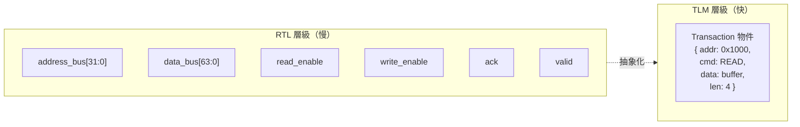

**軟體類比**：RTL 就像直接操作 TCP socket（手動管理 SYN/ACK/FIN），TLM 就像用 HTTP library（直接發 request 拿 response）。

---

## 核心概念

### Transaction = 請求物件

TLM 的 transaction（`tlm_generic_payload`）就是一個描述讀寫操作的物件。

**軟體對應**：HTTP Request

| tlm_generic_payload 欄位 | HTTP Request 對應 | 說明 |
|--------------------------|-------------------|------|
| `address` | URL path | 目標位址 |
| `command` (READ/WRITE) | GET / POST | 操作類型 |
| `data_ptr` | Request / Response body | 資料指標 |
| `data_length` | Content-Length | 資料長度 |
| `response_status` | HTTP Status Code | 操作結果 |
| `byte_enable_ptr` | 無直接對應 | 哪些 byte 有效（部分寫入） |
| `streaming_width` | 無直接對應 | 串流傳輸的寬度 |

### TLM Socket = 雙向連接

TLM socket 是一個**雙向**的通訊端點，同時包含 forward path（送出請求）和 backward path（接收回應/通知）。

**軟體對應**：WebSocket -- 建立連接後，雙方都可以主動發送訊息。

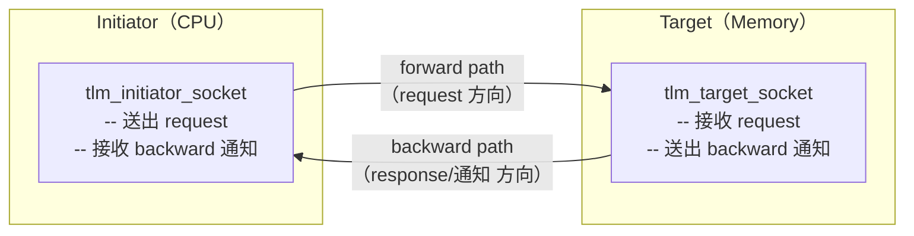

**與一般 port 的差異**：

| 特性 | sc_port | tlm_socket |
|------|---------|------------|
| 方向 | 單向 | 雙向 |
| 通訊方式 | 透過 channel | 直接連接 |
| 協議 | 自訂 | TLM 標準（b_transport / nb_transport） |
| 繫結 | 需要中間 channel | socket 對 socket 直接綁定 |

---

## LT vs AT：速度與精度的取捨

TLM 定義了兩種通訊模式，對應不同的精度需求：

### Loosely-Timed (LT) -- 同步呼叫

**軟體對應**：同步 HTTP 請求（`requests.get()`）

Initiator 呼叫 `b_transport()`，整個呼叫會**阻塞（blocking）**直到 target 處理完畢。就像你呼叫 `requests.get(url)` 一樣，函式返回時 response 已經在手上了。

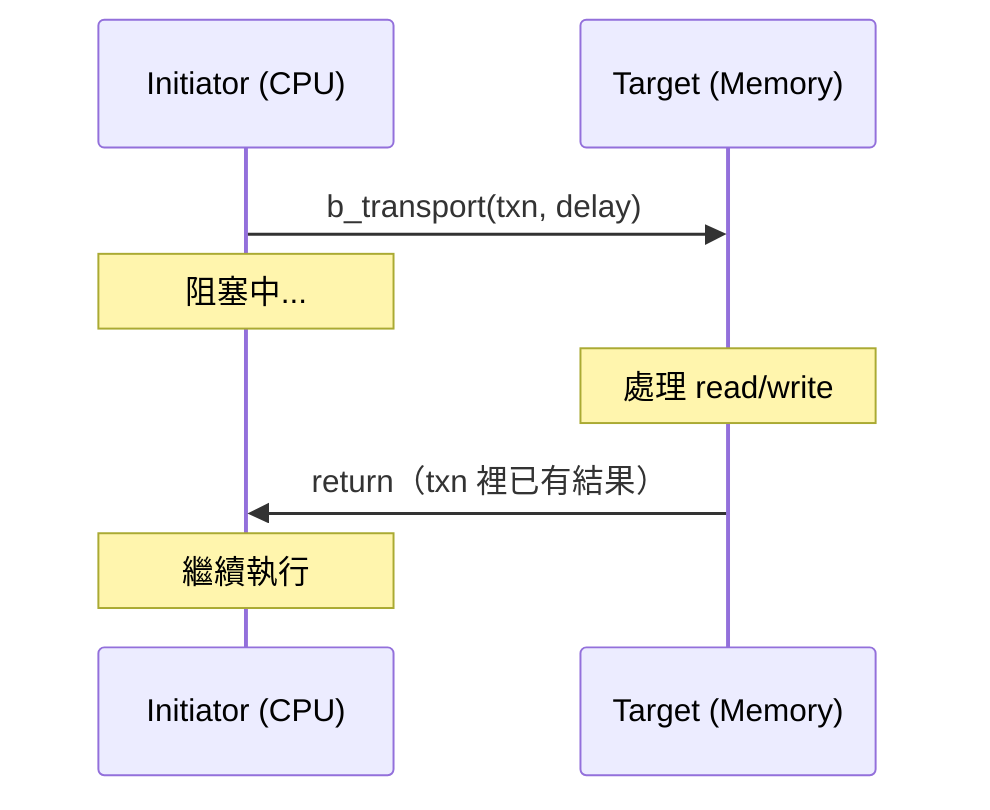

**特點**：
- 程式碼簡單，像一般的函式呼叫
- 模擬速度最快
- 時序不精確（不模擬匯流排仲裁、排隊等待等）
- 適合：firmware 開發、功能驗證、早期架構探索

### Approximately-Timed (AT) -- 非同步呼叫

**軟體對應**：非同步 RPC / callback-based HTTP

Initiator 呼叫 `nb_transport_fw()`，函式**立刻返回**（non-blocking）。稍後 target 會透過 `nb_transport_bw()` 回呼通知結果。

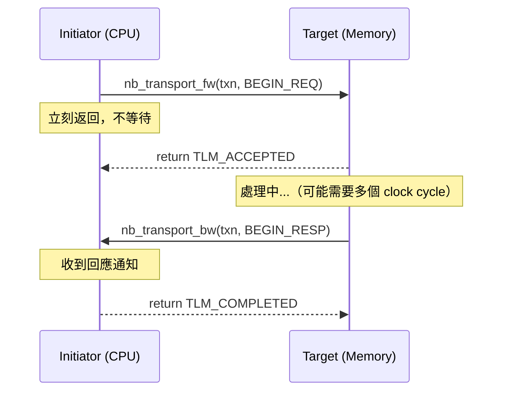

**特點**：
- 程式碼複雜，需要管理狀態機
- 模擬速度較慢
- 時序較精確（可以模擬仲裁延遲、管線效應等）
- 適合：效能分析、匯流排架構驗證、與 RTL 混合模擬

### LT vs AT 決策表

| 你的需求 | 選擇 | 原因 |
|---------|------|------|
| 跑 firmware / driver | LT | 不在乎精確時序，要快 |
| 驗證功能正確性 | LT | 只關心「對不對」 |
| 分析匯流排頻寬 | AT | 需要精確的排隊和仲裁時序 |
| 與 RTL 模組混合模擬 | AT | RTL 需要 cycle-accurate 時序 |
| SoC 架構初步探索 | LT | 先快速看大方向 |
| 精確效能建模 | AT | 需要考慮所有延遲因素 |

---

## Phase Protocol -- 交易的生命週期

AT 模式中，一次交易被拆分為多個**階段（phase）**。不同的 phase 數量代表不同的精度：

### 1-Phase Protocol

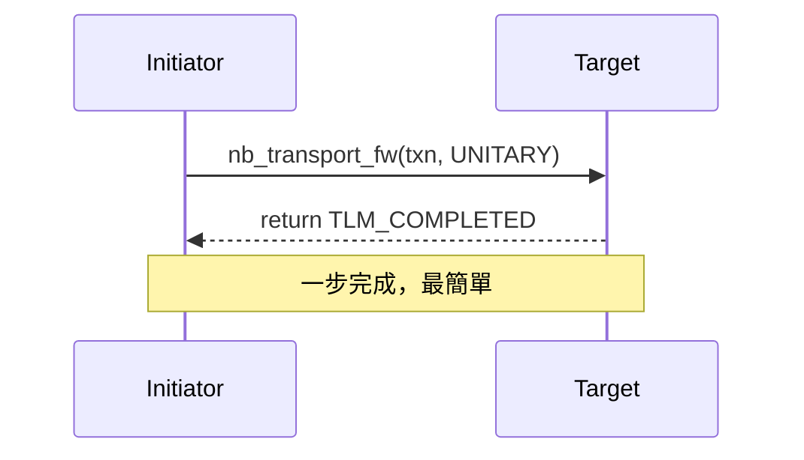

**軟體類比**：UDP -- 送出就忘，不等回應。

### 2-Phase Protocol

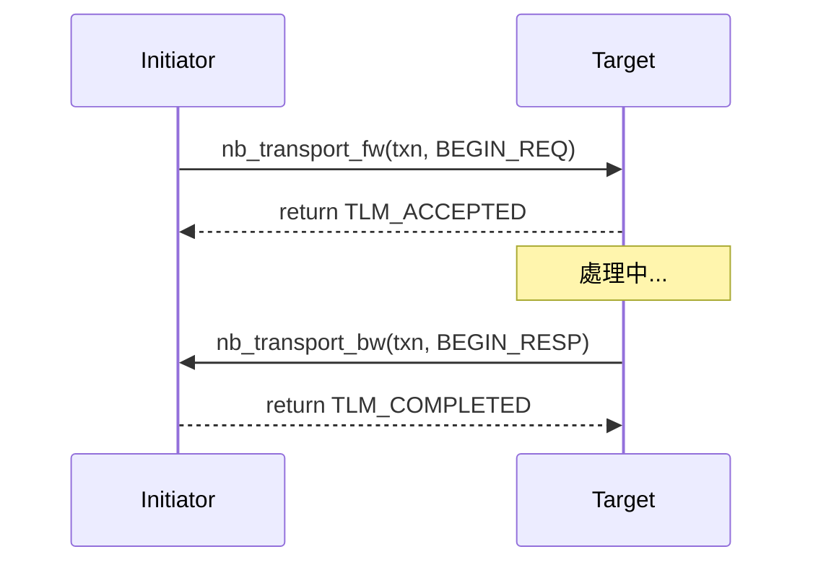

**軟體類比**：簡單的 request-response RPC。

### 4-Phase Protocol（完整握手）

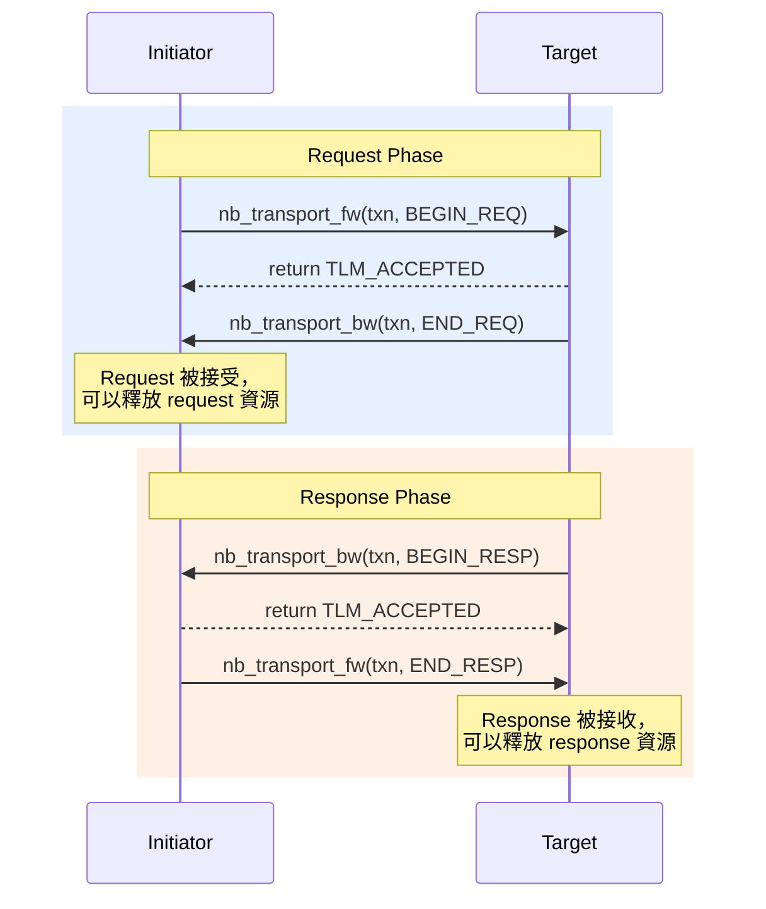

**軟體類比**：TCP 的完整握手：
- BEGIN_REQ = SYN（我要傳資料）
- END_REQ = SYN-ACK（我收到你的請求了）
- BEGIN_RESP = 資料傳輸（回應來了）
- END_RESP = ACK（我收到回應了）

**為什麼需要這麼多 phase？**

關鍵在於**資源管理**。在硬體中，匯流排是共享的：
- END_REQ 告訴 initiator：「匯流排 request channel 已經空了，下一個 master 可以送 request 了」
- END_RESP 告訴 target：「匯流排 response channel 已經空了，可以送下一個 response 了」

---

## DMI -- 快速路徑

DMI (Direct Memory Interface) 讓 initiator 繞過 bus，直接用指標讀寫 target 的記憶體。

**軟體對應**：`mmap()` / kernel bypass

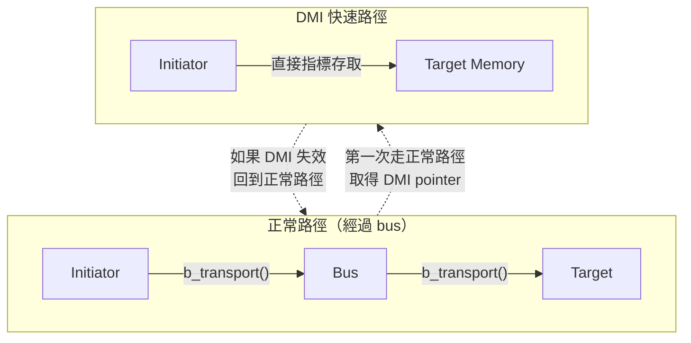

**流程**：

1. Initiator 第一次走正常的 `b_transport()` 路徑
2. Target 回傳一個 DMI hint：「你可以直接存取我的記憶體」
3. Initiator 呼叫 `get_direct_mem_ptr()` 取得 DMI 指標
4. 之後的存取直接用指標（`memcpy`），不再經過 bus
5. 如果 target 的記憶體映射改變，會透過 `invalidate_direct_mem_ptr()` 通知 initiator

**為什麼快？** 省掉了 bus 路由、transaction 物件建立、virtual function call 等所有開銷。

---

## Temporal Decoupling -- 批次處理

Temporal decoupling 讓 initiator 可以「跑在模擬時間前面」，累積多個操作後再同步。

**軟體對應**：Database 的 batch write / write-behind cache

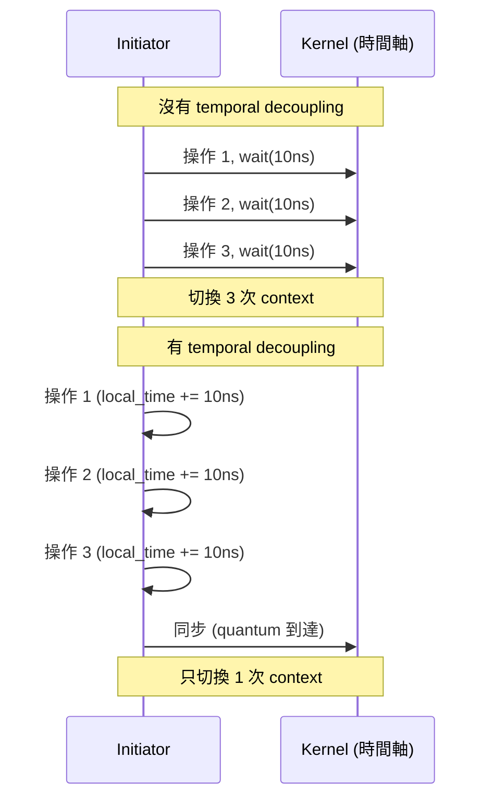

**好處**：大幅減少 process context switch 的開銷。

**代價**：不同 initiator 之間的時序可能有偏差（最大偏差 = quantum 大小）。

---

## Extensions -- 自訂 Metadata

TLM 允許你在 transaction 上附加自訂的擴展資料。

**軟體對應**：HTTP 的 custom header

| TLM Extension 概念 | HTTP 對應 |
|-------------------|----------|
| `tlm_generic_payload` | HTTP Request |
| `tlm_extension` | Custom Header |
| Mandatory extension | 必要的 Header（缺少則 400 Bad Request） |
| Optional extension | 可選的 Header（忽略也能正常運作） |
| `set_extension()` | 加入 Header |
| `get_extension()` | 讀取 Header |

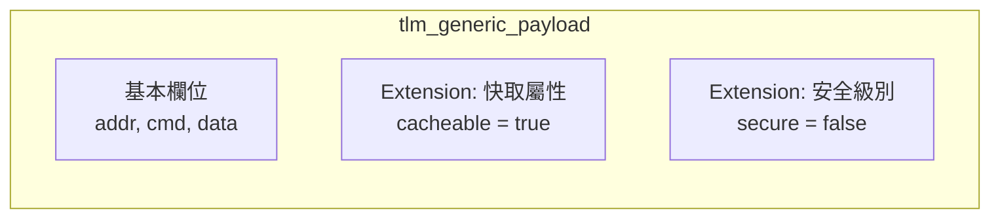

**Mandatory vs Optional**：

- **Mandatory**（對應 [lt_extension_mandatory](../code/tlm/lt_extension_mandatory/_index.md)）：target 如果不認識這個 extension，必須回傳錯誤。就像 API 要求必傳的參數。
- **Optional**（對應 [at_extension_optional](../code/tlm/at_extension_optional/_index.md)）：target 可以忽略不認識的 extension。就像 API 的可選參數。

---

## TLM 範例對照表

### LT 系列範例

| 範例 | 核心概念 | 軟體類比 | 在 LT 上增加的功能 |
|------|---------|---------|------------------|
| [lt](../code/tlm/lt/_index.md) | `b_transport` blocking 呼叫 | 同步 HTTP | 基礎版本 |
| [lt_dmi](../code/tlm/lt_dmi/_index.md) | Direct Memory Interface | `mmap()` | + 記憶體快速路徑 |
| [lt_temporal_decouple](../code/tlm/lt_temporal_decouple/_index.md) | 時間解耦 + quantum | 批次寫入 | + 模擬速度優化 |
| [lt_mixed_endian](../code/tlm/lt_mixed_endian/_index.md) | Endianness 轉換 | Big/Little Endian | + 位元組序處理 |
| [lt_extension_mandatory](../code/tlm/lt_extension_mandatory/_index.md) | 必要的 transaction 擴展 | 必要的 HTTP Header | + 自訂 metadata |

### AT 系列範例

| 範例 | 核心概念 | 軟體類比 | Phase 數量 |
|------|---------|---------|-----------|
| [at_1_phase](../code/tlm/at_1_phase/_index.md) | 單步完成 | UDP fire-and-forget | 1 |
| [at_2_phase](../code/tlm/at_2_phase/_index.md) | 請求-回應 | 簡單 RPC | 2 |
| [at_4_phase](../code/tlm/at_4_phase/_index.md) | 完整握手 | TCP 四次交握 | 4 |
| [at_extension_optional](../code/tlm/at_extension_optional/_index.md) | 可選擴展 | 可選 HTTP Header | 2 |
| [at_mixed_targets](../code/tlm/at_mixed_targets/_index.md) | LT+AT target 混合 | 異質微服務 | 混合 |
| [at_ooo](../code/tlm/at_ooo/_index.md) | 亂序完成 | `Promise.all()` | 4 |

---

## TLM 全景架構圖

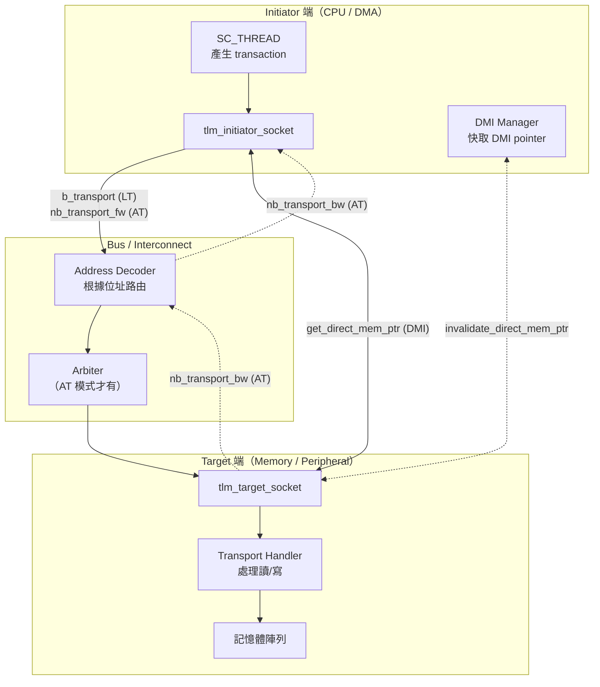

---

## 下一步

- 準備好開始看 TLM 範例？從 [common](../code/tlm/common/_index.md) 開始，了解共用元件庫
- 想看最簡單的 TLM 通訊？閱讀 [lt](../code/tlm/lt/_index.md)
- 想了解 SystemC 核心概念？回到 [systemc-for-software-engineers.md](systemc-for-software-engineers.md)
- 想看完整學習路線？前往 [learning-path.md](learning-path.md)
