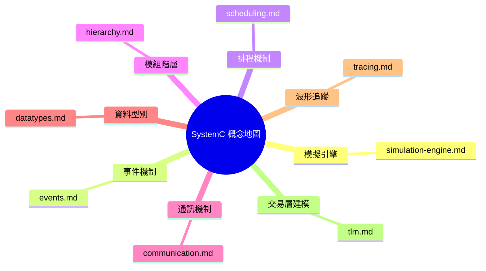
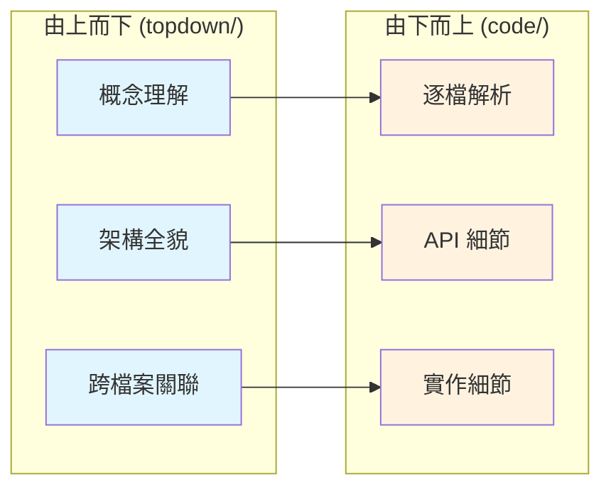

# SystemC 由上而下概念文件總覽

本目錄包含 SystemC 的**概念性架構文件**，從學習者的角度出發，
以日常生活類比來解釋 SystemC 的核心觀念，再逐步深入技術細節。

> **目標讀者**：沒有硬體 RTL 背景的軟體工程師。
> 所有解釋力求連高中生也能理解。

---

## 文件一覽

| 檔案 | 主題 | 難度 |
|------|------|------|
| [learning-path.md](learning-path.md) | 學習路徑索引 | -- |
| [simulation-engine.md](simulation-engine.md) | 核心模擬引擎 | 初級→中級 |
| [events.md](events.md) | 事件機制 | 初級→中級 |
| [scheduling.md](scheduling.md) | 排程機制 | 中級→進階 |
| [hierarchy.md](hierarchy.md) | 模組階層 | 初級 |
| [communication.md](communication.md) | 通訊機制 | 中級 |
| [datatypes.md](datatypes.md) | 資料型別 | 初級→中級 |
| [tracing.md](tracing.md) | 波形追蹤 | 初級 |
| [tlm.md](tlm.md) | 交易層建模 (TLM) | 中級→進階 |

---

## 如何使用這些文件

1. **先讀 [learning-path.md](learning-path.md)**，了解建議的閱讀順序
2. 每份文件都以「生活類比」開頭，幫助建立直覺
3. 概念理解後，可點擊文件中的連結前往 `doc_v2/code/` 查看對應的底層程式碼文件
4. Mermaid 圖表可用 GitHub、VSCode 預覽或任何支援 Mermaid 的工具檢視

---

## 與底層程式碼文件的關係

- **由上而下文件 (本目錄)**：回答「這是什麼？為什麼要這樣設計？」
- **由下而上文件 (`doc_v2/code/`)**：回答「程式碼具體怎麼寫的？API 怎麼用？」
