# 通訊機制

## 生活類比：公司的部門間溝通

想像一家大公司裡不同部門之間的溝通方式：

- **Interface（介面）** = 公司的溝通規範——「報告要用什麼格式？會議怎麼預約？」
- **Channel（通道）** = 具體的溝通工具——Email、Slack、電話
- **Port（埠口）** = 每個部門的對外聯絡窗口——「找業務部請撥分機 101」
- **Signal** = 公佈欄——寫上新的公告，大家下次經過就能看到
- **FIFO** = 排隊的信箱——先寄來的信先處理
- **Mutex** = 會議室鑰匙——一次只有一個人可以用
- **Semaphore** = 停車場剩餘車位數——有限數量的共享資源

重點是：部門不需要知道對方用什麼電腦或軟體，
只需要遵守約定好的溝通規範（介面）。

---

## Interface-Channel-Port 模式

這是 SystemC 通訊機制的核心設計模式，
也是理解所有通訊元件的鑰匙。

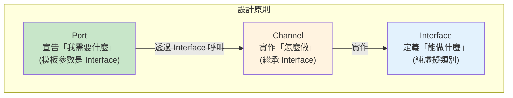

### 為什麼要這樣設計？

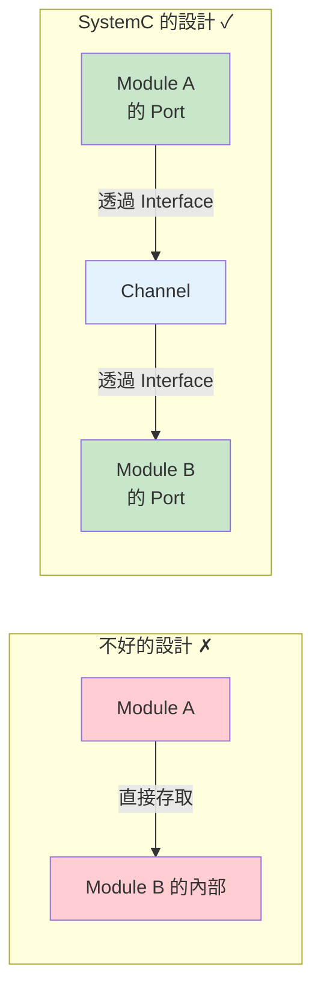

好處：
1. **解耦** — 模組不需要知道對方的存在
2. **可替換** — 換一種 Channel 實作，模組不用改
3. **可重用** — 同一個模組可以在不同系統中使用

---

## Signal 與 Request-Update 機制

`sc_signal` 是最基本的通訊 channel，對應硬體中的導線（wire）。

### Signal 的核心行為

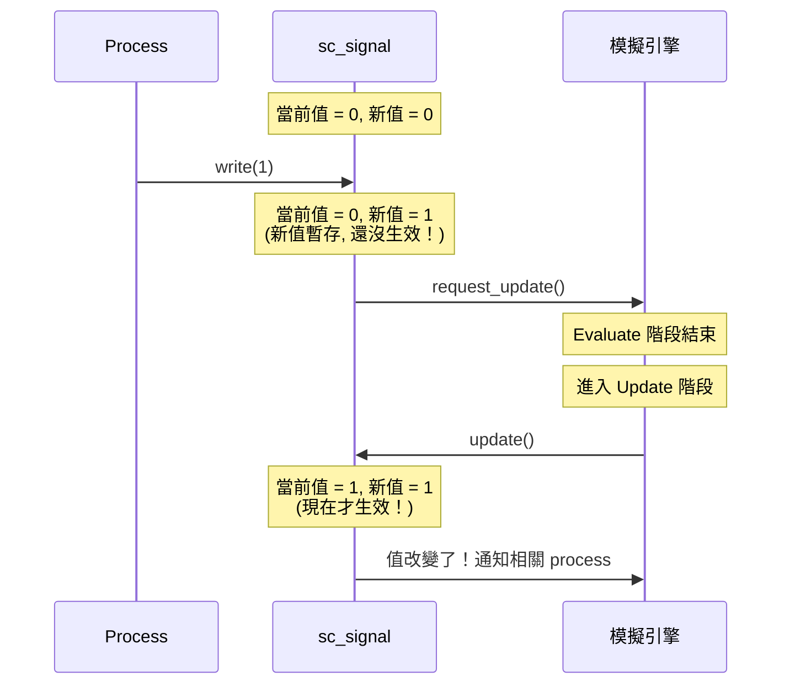

### 為什麼 Signal 不能立即更新？

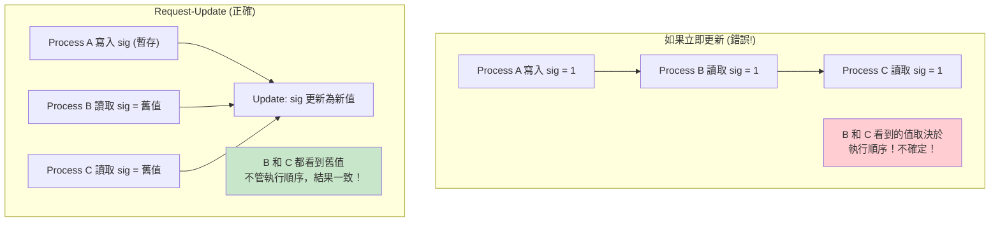

### sc_signal 的類別結構

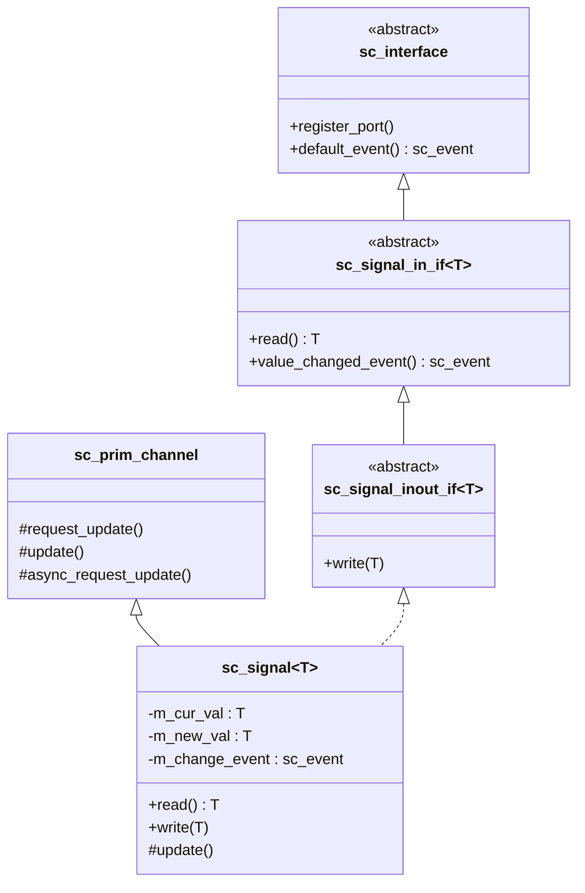

---

## FIFO — 先進先出佇列

`sc_fifo` 就像排隊買東西——先排的人先買到。

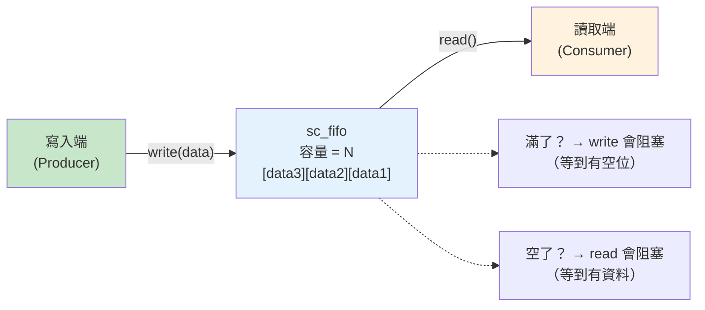

### FIFO 的事件通知

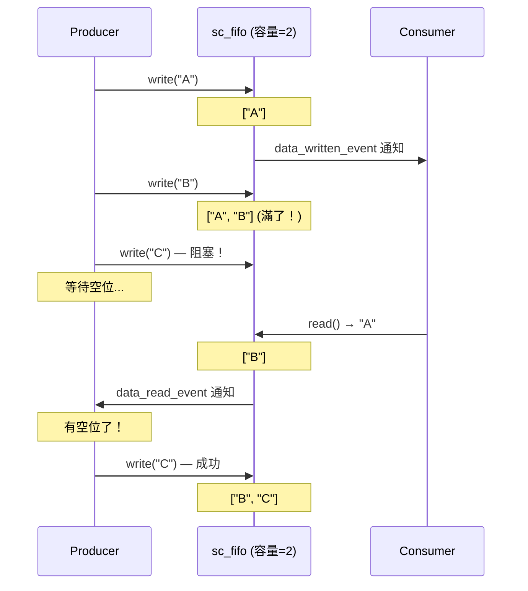

### FIFO vs Signal 的差異

| 特性 | sc_signal | sc_fifo |
|------|-----------|---------|
| 資料保留 | 只保留最新值 | 保留所有值直到被讀取 |
| 阻塞 | 不阻塞 | 滿時寫入阻塞，空時讀取阻塞 |
| 適用場景 | 硬體信號線 | 資料流、生產者-消費者 |
| 多個讀取者 | 可以 | 不行（讀取會消耗資料） |
| Delta cycle | 需要（request-update） | 需要 |

---

## Mutex — 互斥鎖

`sc_mutex` 保證同一時間只有一個 process 可以存取共享資源。

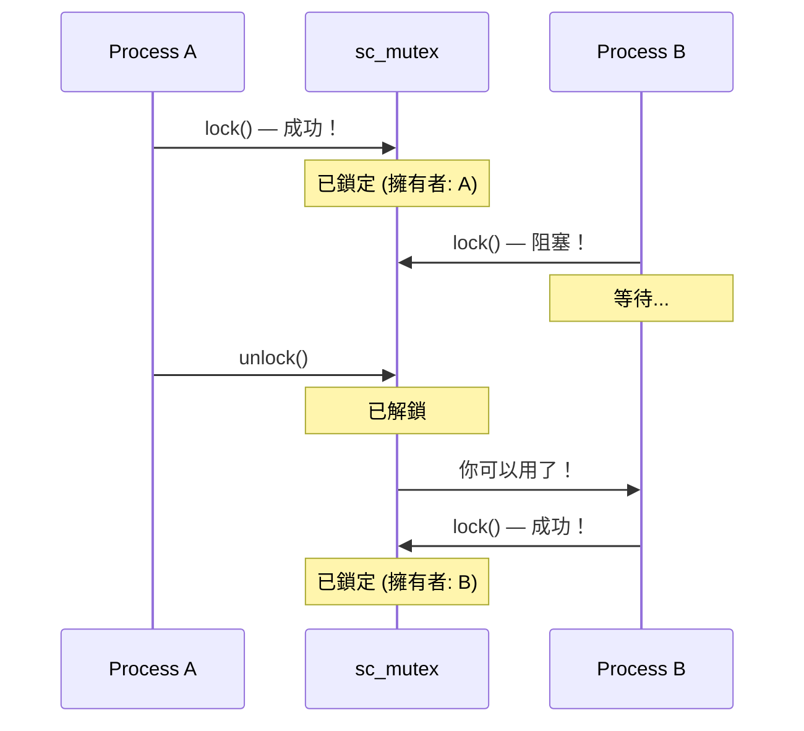

類比：圖書館的自習室只有一把鑰匙。
你用完了，把鑰匙還回去，下一個排隊的人才能進去。

---

## Semaphore — 號誌

`sc_semaphore` 允許最多 N 個 process 同時存取資源。

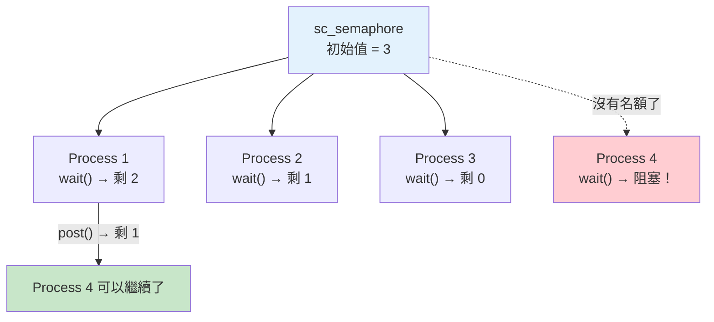

類比：停車場有 3 個車位。前三台車可以直接停，
第四台車要在門口等，直到有車開走騰出車位。

---

## Resolved Signal — 多驅動器信號

當多個 process 同時驅動同一根信號線時，需要「解析」規則：

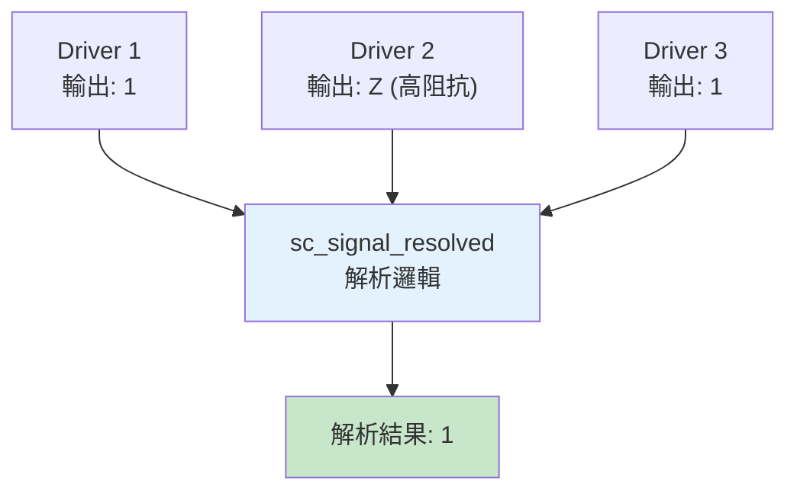

### 四值邏輯的解析表

| Driver A | Driver B | 解析結果 |
|----------|----------|----------|
| 0 | 0 | 0 |
| 0 | 1 | X (衝突!) |
| 0 | Z | 0 |
| 1 | 1 | 1 |
| 1 | Z | 1 |
| Z | Z | Z |

普通的 `sc_signal` 只允許一個寫入者（writer policy），
`sc_signal_resolved` 允許多個寫入者但會進行邏輯解析。

---

## 通訊元件如何對應到硬體

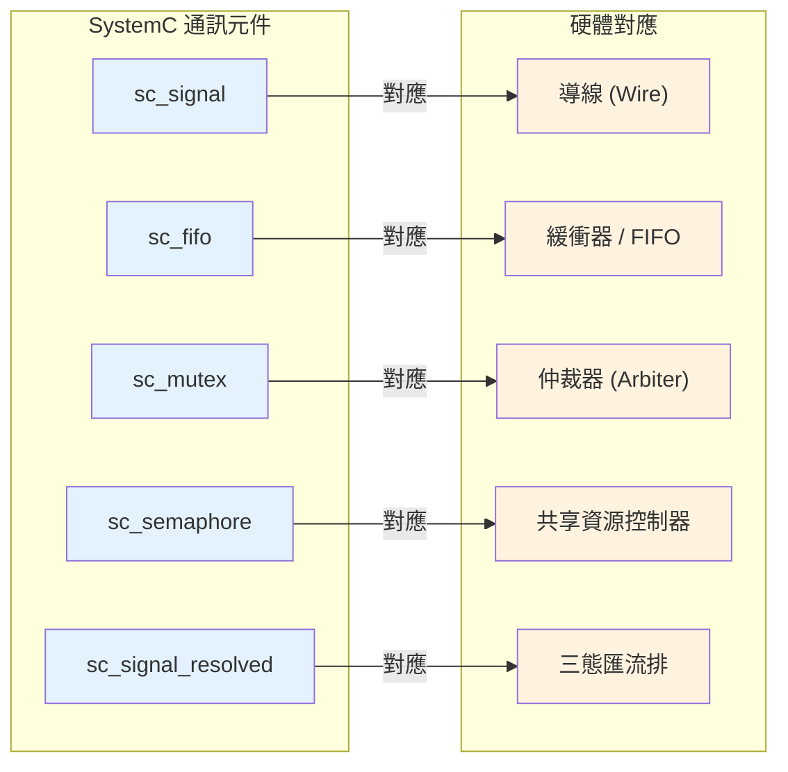

---

## 完整的通訊架構圖

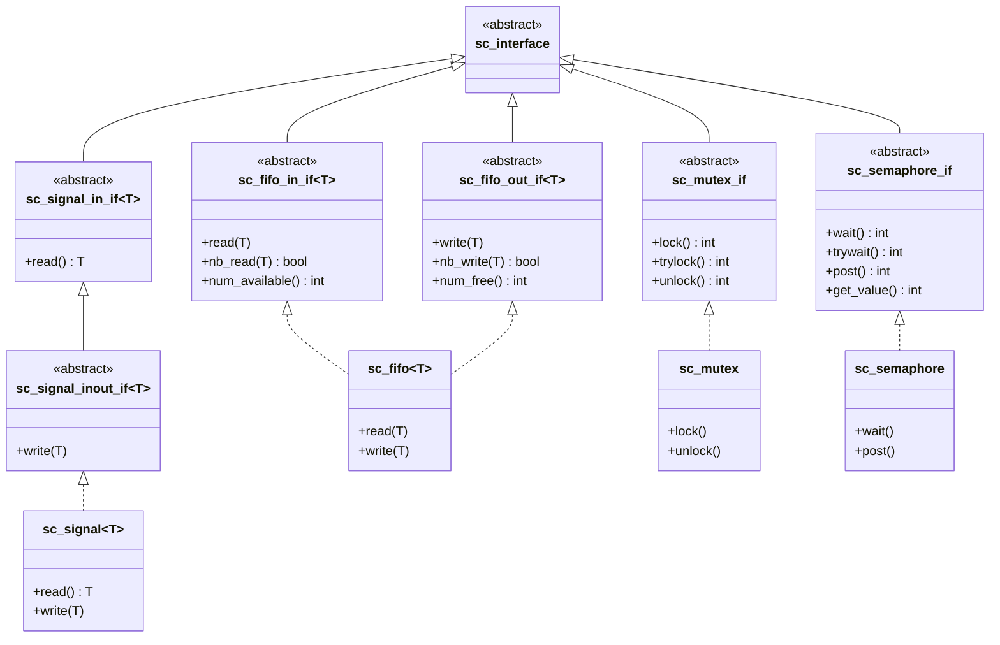

---

## 相關模組

| 概念 | 文件 | 關係 |
|------|------|------|
| 模組階層 | [hierarchy.md](hierarchy.md) | Port 和 Export 是模組的對外介面 |
| 事件機制 | [events.md](events.md) | Channel 透過事件通知值的改變 |
| 排程機制 | [scheduling.md](scheduling.md) | request_update/update 是排程的核心部分 |
| 資料型別 | [datatypes.md](datatypes.md) | Signal 的模板參數決定傳輸什麼資料 |
| TLM | [tlm.md](tlm.md) | TLM 是更高層次的通訊抽象 |

### 對應的底層程式碼文件

| 原始碼概念 | 程式碼文件 |
|-----------|-----------|
| sc_interface | [doc_v2/code/sysc/communication/sc_interface.md](../code/sysc/communication/sc_interface.md) |
| sc_signal | [doc_v2/code/sysc/communication/sc_signal.md](../code/sysc/communication/sc_signal.md) |
| sc_signal_ifs | [doc_v2/code/sysc/communication/sc_signal_ifs.md](../code/sysc/communication/sc_signal_ifs.md) |
| sc_prim_channel | [doc_v2/code/sysc/communication/sc_prim_channel.md](../code/sysc/communication/sc_prim_channel.md) |
| sc_port | [doc_v2/code/sysc/communication/sc_port.md](../code/sysc/communication/sc_port.md) |
| sc_export | [doc_v2/code/sysc/communication/sc_export.md](../code/sysc/communication/sc_export.md) |
| sc_fifo | [doc_v2/code/sysc/communication/sc_fifo.md](../code/sysc/communication/sc_fifo.md) |
| sc_mutex | [doc_v2/code/sysc/communication/sc_mutex.md](../code/sysc/communication/sc_mutex.md) |
| sc_semaphore | [doc_v2/code/sysc/communication/sc_semaphore.md](../code/sysc/communication/sc_semaphore.md) |
| sc_signal_resolved | [doc_v2/code/sysc/communication/sc_signal_resolved.md](../code/sysc/communication/sc_signal_resolved.md) |

---

## 學習小提示

1. **Interface-Channel-Port 是 SystemC 最重要的設計模式**——理解它，就理解了一半的 SystemC
2. **Signal 的值不是立即更新的**——寫入後要到下一個 delta cycle 才生效，這是最常見的初學者困惑
3. **FIFO 會阻塞，Signal 不會**——選錯通訊元件會讓你的設計出現意想不到的行為
4. **普通 signal 只允許一個寫入者**——如果需要多個驅動器，用 `sc_signal_resolved`
5. **Mutex 和 Semaphore 主要用在抽象建模**——RTL 級的設計通常不用它們
6. **Port 的 `->` 運算子會被轉發到 Channel 的 Interface**——`port->read()` 其實是呼叫 Channel 的 `read()`
