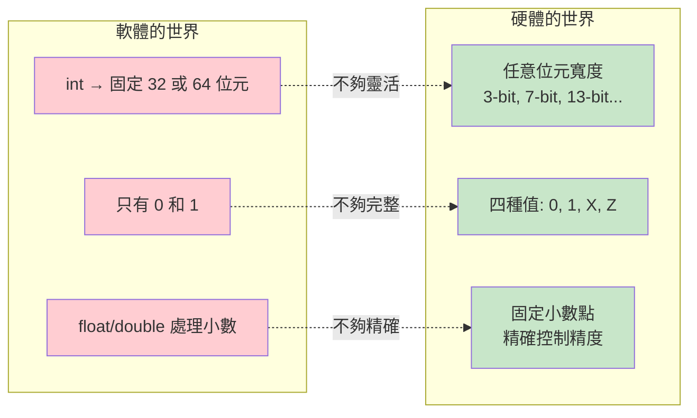
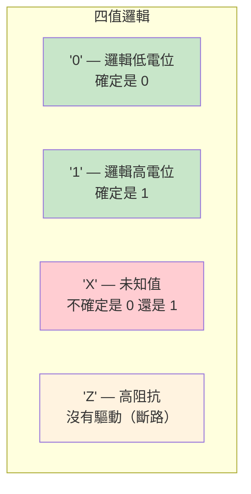
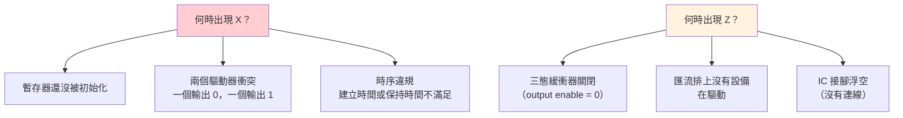
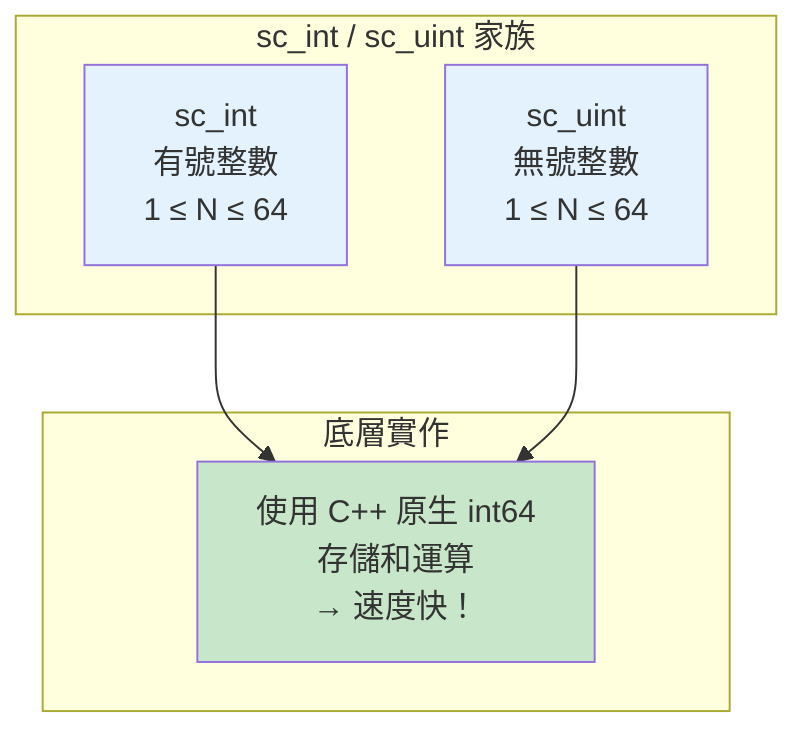
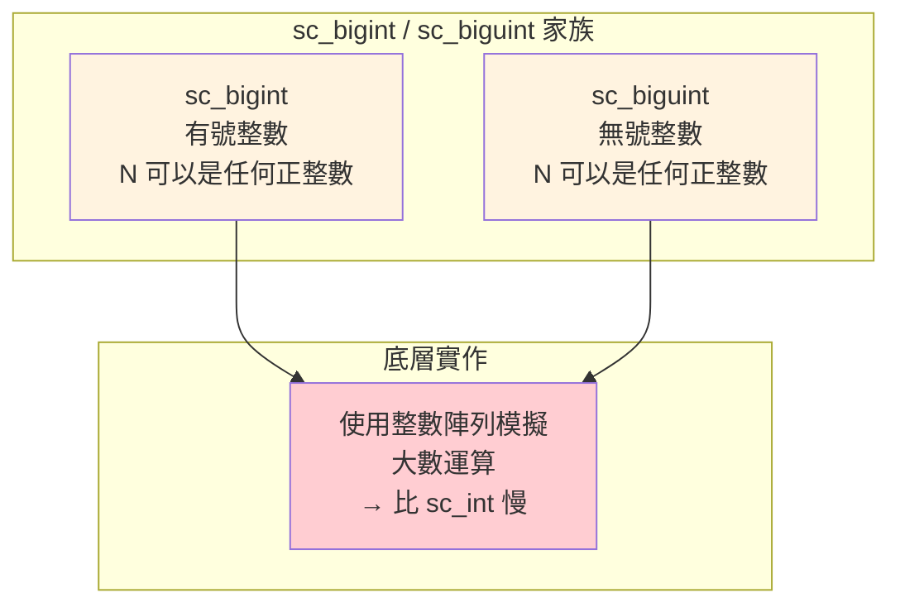
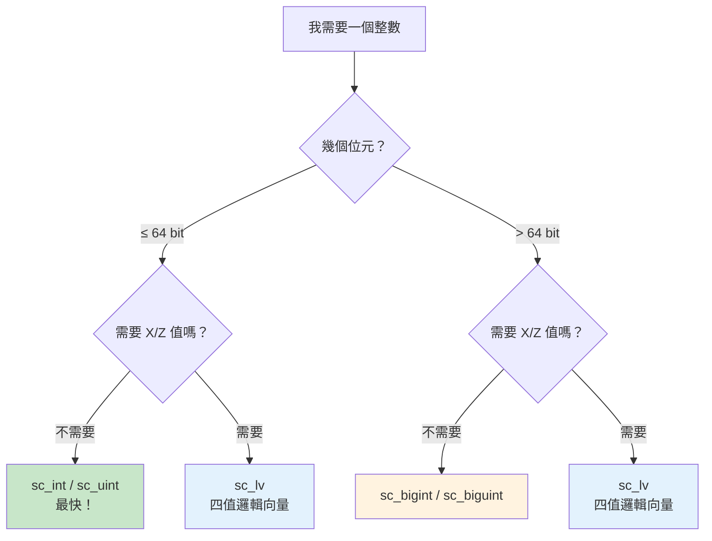
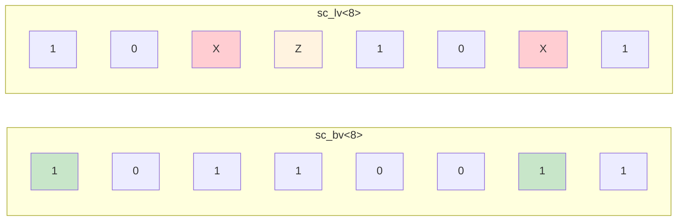
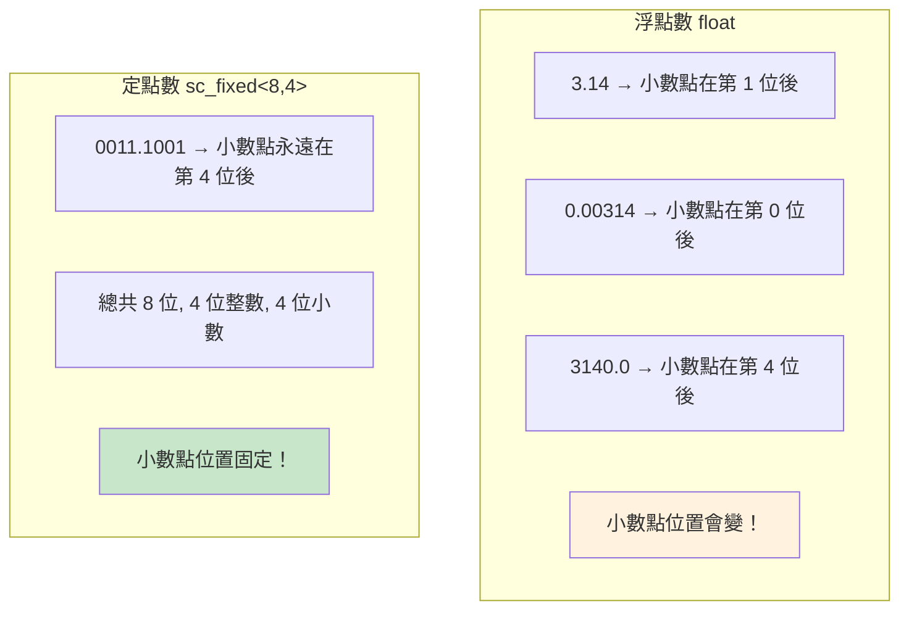
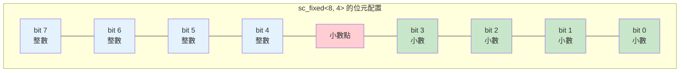
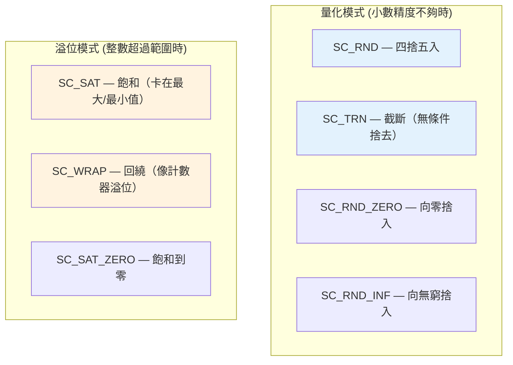

# 資料型別

## 生活類比：不同的量尺和計量工具

想像你在一家五金行，面前有各種量測工具：

- **C++ `int`** = 一般的直尺——能量大部分的東西，但精度和範圍有限
- **`sc_int<N>`** = 訂製長度的尺——你可以指定剛好要幾公分刻度
- **`sc_bigint<N>`** = 建築師用的長捲尺——可以量非常長的距離
- **`sc_logic`** = 交通號誌——不只是紅/綠，還有「黃燈」和「故障閃爍」
- **`sc_bv<N>`** = 一排交通號誌——多個燈號排在一起
- **`sc_fixed<>`** = 精密天平——可以量到小數點後很多位

硬體需要這些特殊型別，因為硬體的「數字」和軟體的「數字」很不一樣。

---

## 為什麼硬體需要特殊型別？

### 軟體 vs 硬體的數字觀



| 需求 | C++ 原生型別 | SystemC 型別 | 原因 |
|------|-------------|-------------|------|
| 5-bit 計數器 | 沒有 | `sc_uint<5>` | 硬體的暫存器就是 5-bit |
| 未知值 X | 沒有 | `sc_logic` | 初始化前的值是未知的 |
| 高阻抗 Z | 沒有 | `sc_logic` | 三態匯流排需要 |
| 128-bit 寬度 | 沒有 | `sc_biguint<128>` | 寬資料路徑 |
| 精確小數 | `double` 有誤差 | `sc_fixed<8,4>` | DSP 需要精確的定點數 |

---

## 二值邏輯 vs 四值邏輯

### 二值邏輯（`sc_bit`, `sc_bv`）

只有 `0` 和 `1`，就像普通的布林值。

### 四值邏輯（`sc_logic`, `sc_lv`）

有四種值，對應真實硬體的電氣狀態：



### 什麼時候會出現 X 和 Z？



### 四值邏輯運算表

AND 運算：

| & | 0 | 1 | X | Z |
|---|---|---|---|---|
| **0** | 0 | 0 | 0 | 0 |
| **1** | 0 | 1 | X | X |
| **X** | 0 | X | X | X |
| **Z** | 0 | X | X | X |

**直覺理解**：只要有一邊確定是 0，AND 的結果就確定是 0。
如果有任何不確定（X 或 Z），結果也不確定。

---

## 固定寬度整數

### sc_int / sc_uint（1~64 bit）



```cpp
sc_uint<4> nibble = 0xF;    // 4-bit 無號: 0~15
sc_int<8>  byte_val = -128; // 8-bit 有號: -128~127
sc_uint<1> single_bit = 1;  // 1-bit: 就是一個位元

// 位元操作
nibble[2] = 0;               // 設定第 2 位為 0
sc_uint<2> sub = nibble.range(3, 2); // 取出高 2 位
```

### sc_bigint / sc_biguint（任意寬度）



```cpp
sc_biguint<128> wide_data;    // 128-bit 無號
sc_bigint<256>  very_wide;    // 256-bit 有號
sc_biguint<1024> huge;        // 1024-bit 都可以！
```

### 選擇指南



---

## 位元向量與邏輯向量

### sc_bv — 二值位元向量

```cpp
sc_bv<8> byte_vec = "10110011";   // 8-bit 二值向量
sc_bv<4> nibble = byte_vec.range(7, 4);  // 取高 4 位
byte_vec[0] = 1;                  // 設定最低位
```

### sc_lv — 四值邏輯向量

```cpp
sc_lv<8> logic_vec = "10XZ10X1";  // 包含 X 和 Z！
sc_lv<4> bus_val = "ZZZZ";        // 高阻抗匯流排
```



---

## 定點數（Fixed-Point）

### 什麼是定點數？

浮點數（`float`/`double`）的小數點位置是「浮動的」，
定點數的小數點位置是「固定的」。



### sc_fixed 的參數

```cpp
sc_fixed<WL, IWL, Q_MODE, O_MODE, N_BITS> value;
//        |    |     |       |       |
//        |    |     |       |       溢位飽和的位數
//        |    |     |       溢位模式 (SC_SAT, SC_WRAP...)
//        |    |     量化模式 (SC_RND, SC_TRN...)
//        |    整數位元寬度
//        總位元寬度
```



### 量化與溢位模式



### 為什麼用定點數而不用浮點數？

| 特性 | 浮點數 | 定點數 |
|------|--------|--------|
| 硬體成本 | 高（需要複雜的浮點運算單元） | 低（只需要整數運算單元） |
| 精度控制 | 精度隨數值大小變化 | 精度固定且可預測 |
| 速度 | 較慢 | 較快 |
| 應用場景 | 通用計算 | DSP、音訊、影像處理 |

---

## 型別系統總覽

```mermaid
classDiagram
    class sc_value_base {
        <<abstract>>
    }

    class sc_int_base {
        -m_val : int64
        -m_len : int
    }

    class sc_uint_base {
        -m_val : uint64
        -m_len : int
    }

    class sc_signed {
        -digit : sc_digit*
        -ndigits : int
        -nbits : int
    }

    class sc_unsigned {
        -digit : sc_digit*
        -ndigits : int
        -nbits : int
    }

    class sc_lv_base {
        -m_data : sc_digit*
        -m_ctrl : sc_digit*
        -m_len : int
    }

    class sc_bv_base {
        -m_data : sc_digit*
        -m_len : int
    }

    class sc_fxnum {
        -m_rep : scfx_rep*
        -m_params : sc_fxtype_params
    }

    sc_value_base <|-- sc_int_base
    sc_value_base <|-- sc_uint_base
    sc_value_base <|-- sc_signed
    sc_value_base <|-- sc_unsigned

    sc_int_base <|-- "sc_int<N>"
    sc_uint_base <|-- "sc_uint<N>"
    sc_signed <|-- "sc_bigint<N>"
    sc_unsigned <|-- "sc_biguint<N>"

    sc_bv_base <|-- "sc_bv<N>"
    sc_lv_base <|-- "sc_lv<N>"
    sc_bv_base <|-- sc_lv_base : extends

    sc_fxnum <|-- "sc_fixed<...>"
    sc_fxnum <|-- "sc_ufixed<...>"
```

---

## 相關模組

| 概念 | 文件 | 關係 |
|------|------|------|
| 通訊機制 | [communication.md](communication.md) | Signal 的模板參數用的就是這些型別 |
| 波形追蹤 | [tracing.md](tracing.md) | 追蹤時會記錄這些型別的值變化 |
| 模組階層 | [hierarchy.md](hierarchy.md) | Port 的模板參數也用這些型別 |

### 對應的底層程式碼文件

| 原始碼概念 | 程式碼文件 |
|-----------|-----------|
| sc_int / sc_uint | [doc_v2/code/sysc/datatypes/int/_index.md](../code/sysc/datatypes/int/_index.md) |
| sc_bigint / sc_biguint | [doc_v2/code/sysc/datatypes/int/_index.md](../code/sysc/datatypes/int/_index.md) |
| sc_bit | [doc_v2/code/sysc/datatypes/bit/sc_bit.md](../code/sysc/datatypes/bit/sc_bit.md) |
| sc_logic | [doc_v2/code/sysc/datatypes/bit/sc_logic.md](../code/sysc/datatypes/bit/sc_logic.md) |
| sc_bv | [doc_v2/code/sysc/datatypes/bit/sc_bv.md](../code/sysc/datatypes/bit/sc_bv.md) |
| sc_lv | [doc_v2/code/sysc/datatypes/bit/sc_lv.md](../code/sysc/datatypes/bit/sc_lv.md) |
| sc_fixed | [doc_v2/code/sysc/datatypes/fx/sc_fixed.md](../code/sysc/datatypes/fx/sc_fixed.md) |
| sc_fxnum | [doc_v2/code/sysc/datatypes/fx/sc_fxnum.md](../code/sysc/datatypes/fx/sc_fxnum.md) |

---

## 學習小提示

1. **不知道選哪個？先用 `sc_uint<N>`**——最常用、最快，適合大多數情況
2. **只有需要 X/Z 值時才用 `sc_logic` / `sc_lv`**——四值邏輯運算較慢
3. **`sc_int<64>` 比 `sc_bigint<64>` 快得多**——64 位以內都用 `sc_int`/`sc_uint`
4. **定點數是進階主題**——初學者可以先跳過，等需要 DSP 建模時再學
5. **位元操作和位元切片非常方便**——`x.range(7,4)` 和 `x[3]` 是常用操作
6. **注意有號 vs 無號**——混用會產生意想不到的結果，就像 C++ 一樣
