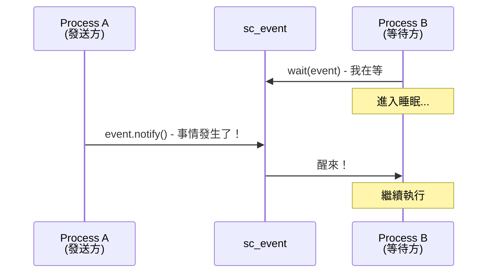
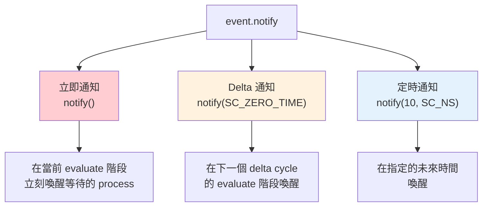
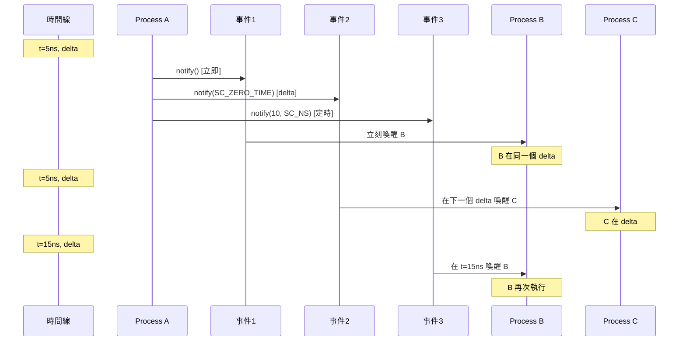
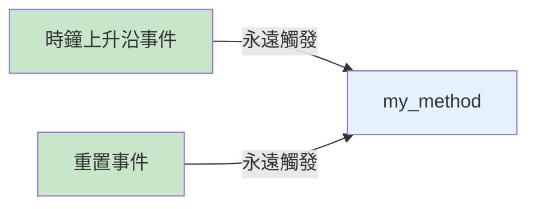
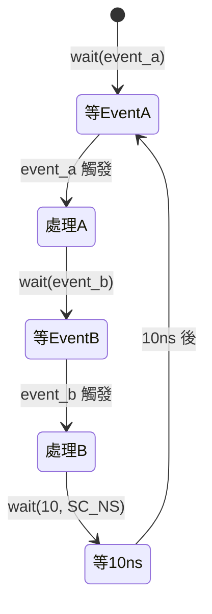
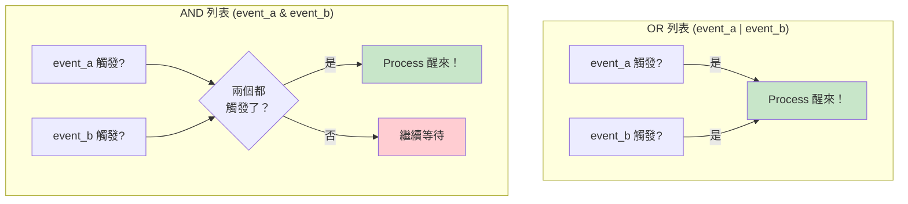
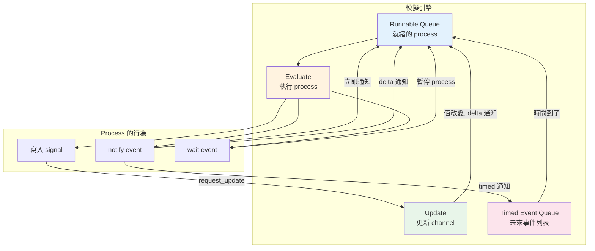
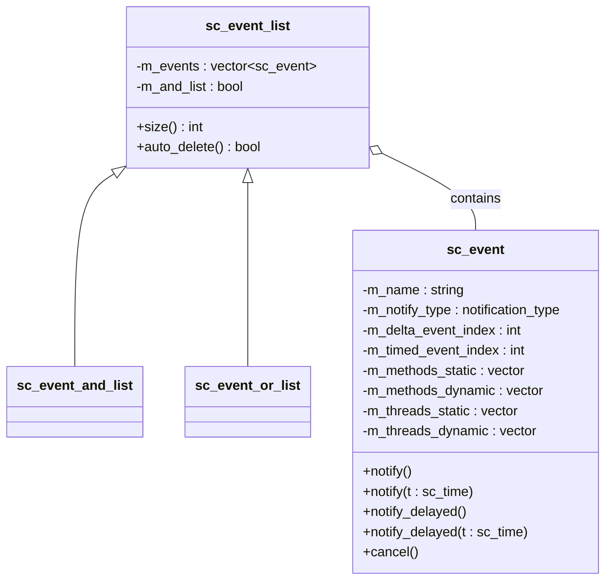

# 事件機制

## 生活類比：手機通知

SystemC 的事件機制就像手機的通知系統：

- **事件（sc_event）** = 手機的通知鈴聲——「叮！有事情發生了」
- **等待事件（wait）** = 你在等某個 App 的通知——「等快遞到了通知我」
- **觸發事件（notify）** = 有人按了發送鍵——「快遞送達了，發送通知」
- **敏感度列表（sensitivity）** = 你在設定頁面打開了哪些 App 的通知

你不需要每秒鐘都去檢查快遞到了沒有（輪詢），
只需要等通知響就好（事件驅動）。這就是事件機制的精髓。

---

## 事件是什麼？

`sc_event` 是 SystemC 中最基本的同步原語。它本身**不攜帶任何資料**，
只是一個「信號彈」——告訴模擬引擎：「有事情發生了，相關的 process 該醒來了。」



---

## 三種通知方式

事件可以用三種不同的「延遲」來觸發通知：



### 立即通知 `notify()`

```cpp
event.notify();  // 立刻！現在！馬上！
```

類比：你在辦公室裡直接拍同事的肩膀說「嘿，這個做好了」。
同事**立即**就知道了。

**注意**：立即通知只在當前 evaluate 階段生效，
如果沒有 process 正在等待，這個通知就丟失了。

### Delta 通知 `notify(SC_ZERO_TIME)`

```cpp
event.notify(SC_ZERO_TIME);  // 下一個 delta cycle
```

類比：你發了一封公司內部即時訊息。對方很快就會看到，
但不是你打字的同一個「瞬間」——中間有一個微小的延遲。

**這是最常用的通知方式**，因為它保證了正確的事件順序。

### 定時通知 `notify(time)`

```cpp
event.notify(10, SC_NS);  // 10 奈秒後
```

類比：你設了一個鬧鐘，10 秒後響。

---

## 通知的時序圖



---

## 靜態敏感度 vs 動態敏感度

### 靜態敏感度（Static Sensitivity）

在建構階段就設定好，模擬過程中不會改變。

```cpp
SC_METHOD(my_method);
sensitive << clk.pos() << reset;  // 永遠對這些事件敏感
```

類比：你在手機設定中打開了「Gmail」和「Line」的通知——
只要有新郵件或新訊息，永遠都會通知你。



### 動態敏感度（Dynamic Sensitivity）

在 process 執行時動態決定要等什麼事件。

```cpp
void my_thread() {
    while (true) {
        wait(event_a);        // 這次等 event_a
        // ... 做一些事 ...
        wait(event_b);        // 下一次等 event_b
        // ... 做另一些事 ...
        wait(10, SC_NS);      // 再等 10ns
    }
}
```

類比：你在等快遞的時候，等到後，接著改成等外賣通知，
然後再等計程車通知——每次等的東西不同。



### SC_METHOD vs SC_THREAD 的差別

| 特性 | SC_METHOD | SC_THREAD |
|------|-----------|-----------|
| 敏感度 | 主要用靜態 | 主要用動態 |
| 能否 `wait()` | 不行！ | 可以 |
| 執行方式 | 每次從頭到尾跑完 | 可以暫停和繼續 |
| 類比 | 鬧鐘響了做一件事 | 一個長期員工，做到一半可以休息 |

---

## 事件列表（AND / OR）

有時候你想等多個事件的組合：

### OR 列表 — 任一事件觸發就醒來

```cpp
wait(event_a | event_b | event_c);
```

類比：「快遞、外賣、朋友來電——任何一個到了就通知我。」

### AND 列表 — 所有事件都觸發才醒來

```cpp
wait(event_a & event_b & event_c);
```

類比：「快遞到了**而且**外賣到了**而且**朋友來電了——三個都齊了才通知我。」



---

## 事件如何驅動模擬

把所有概念串起來，看看事件在整個模擬中扮演的角色：



---

## sc_event 的內部結構



---

## 相關模組

| 概念 | 文件 | 關係 |
|------|------|------|
| 模擬引擎 | [simulation-engine.md](simulation-engine.md) | 事件驅動整個模擬引擎的運轉 |
| 排程機制 | [scheduling.md](scheduling.md) | 排程器決定何時處理哪些事件 |
| 通訊機制 | [communication.md](communication.md) | Signal 內部透過事件通知值的改變 |
| 模組階層 | [hierarchy.md](hierarchy.md) | Process 定義在模組中，process 使用事件 |

### 對應的底層程式碼文件

| 原始碼概念 | 程式碼文件 |
|-----------|-----------|
| sc_event | [doc_v2/code/sysc/kernel/sc_event.md](../code/sysc/kernel/sc_event.md) |
| sc_sensitive | [doc_v2/code/sysc/kernel/sc_sensitive.md](../code/sysc/kernel/sc_sensitive.md) |
| sc_wait | [doc_v2/code/sysc/kernel/sc_wait.md](../code/sysc/kernel/sc_wait.md) |
| sc_method_process | [doc_v2/code/sysc/kernel/sc_method_process.md](../code/sysc/kernel/sc_method_process.md) |
| sc_thread_process | [doc_v2/code/sysc/kernel/sc_thread_process.md](../code/sysc/kernel/sc_thread_process.md) |
| sc_event_finder | [doc_v2/code/sysc/communication/sc_event_finder.md](../code/sysc/communication/sc_event_finder.md) |

---

## 學習小提示

1. **事件不攜帶資料**——它只是一個「叮！」的通知，資料要透過 signal 或其他方式傳遞
2. **立即通知容易出錯**——初學者建議優先使用 delta 通知 (`notify(SC_ZERO_TIME)`)
3. **SC_METHOD 不能呼叫 `wait()`**——這是初學者最常犯的錯誤之一
4. **AND 列表的事件不需要在同一瞬間觸發**——只要全部都觸發過就行
5. **事件是一次性的**——觸發後就消失了，不像信號會保持值。如果需要「記住」狀態，用 signal
6. **`cancel()` 只能取消 timed 通知**——已經發出的立即和 delta 通知無法取消
