# 模組階層

## 生活類比：樂高積木組裝

SystemC 的模組階層就像用樂高積木蓋房子：

- **sc_object** = 每一顆樂高積木的基底——不管是牆壁、窗戶、門，都是樂高積木
- **sc_module** = 一個組裝好的子結構——比如「二樓的浴室」是一個模組
- **Port（埠口）** = 積木上的接頭——讓兩個子結構可以拼接在一起
- **Export（輸出口）** = 積木上的卡槽——接受別人的接頭
- **Channel（通道）** = 連接兩個接頭的管道——資料在這裡流動
- **物件樹** = 組裝說明書上的零件清單——每個零件有名字和歸屬

就像你可以把「浴室模組」拔出來換成另一個設計，
SystemC 的模組化設計也讓你可以替換和重用元件。

---

## sc_object：萬物之根

`sc_object` 是 SystemC 中所有具名物件的基礎類別。
所有模組、埠口、通道、process 都繼承自它。

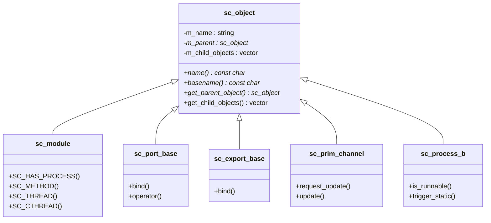

### 階層式命名

每個 `sc_object` 都有一個**階層式名稱**，反映它在物件樹中的位置：

```
top                        # 頂層模組
top.cpu                    # top 裡面的 cpu 子模組
top.cpu.alu                # cpu 裡面的 alu 子模組
top.cpu.alu.port_a         # alu 的一個埠口
top.cpu.alu.method_p_0     # alu 的一個 process
```

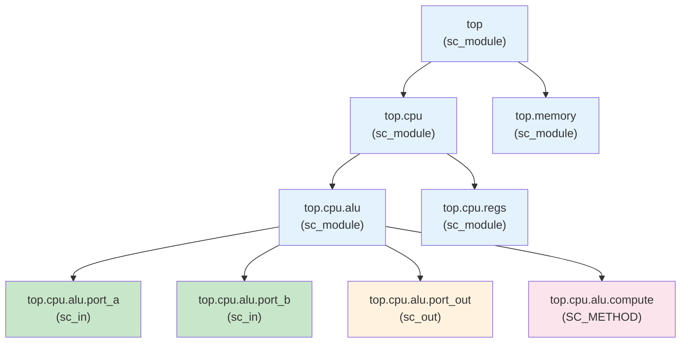

---

## sc_module：設計的基本單元

`sc_module` 是你在 SystemC 中定義硬體元件的基本方式。
每個模組可以包含：

1. **子模組** — 更小的元件
2. **埠口（Port）** — 對外的介面
3. **Process** — 行為描述（SC_METHOD, SC_THREAD, SC_CTHREAD）
4. **內部信號** — 子模組之間的連線
5. **內部變數** — 模組的私有狀態

```cpp
SC_MODULE(ALU) {
    // Ports
    sc_in<int>  a, b;
    sc_in<int>  op;
    sc_out<int> result;

    // Process
    void compute() {
        if (op.read() == 0)
            result.write(a.read() + b.read());
        else
            result.write(a.read() - b.read());
    }

    SC_CTOR(ALU) {
        SC_METHOD(compute);
        sensitive << a << b << op;
    }
};
```

### 模組的建構流程

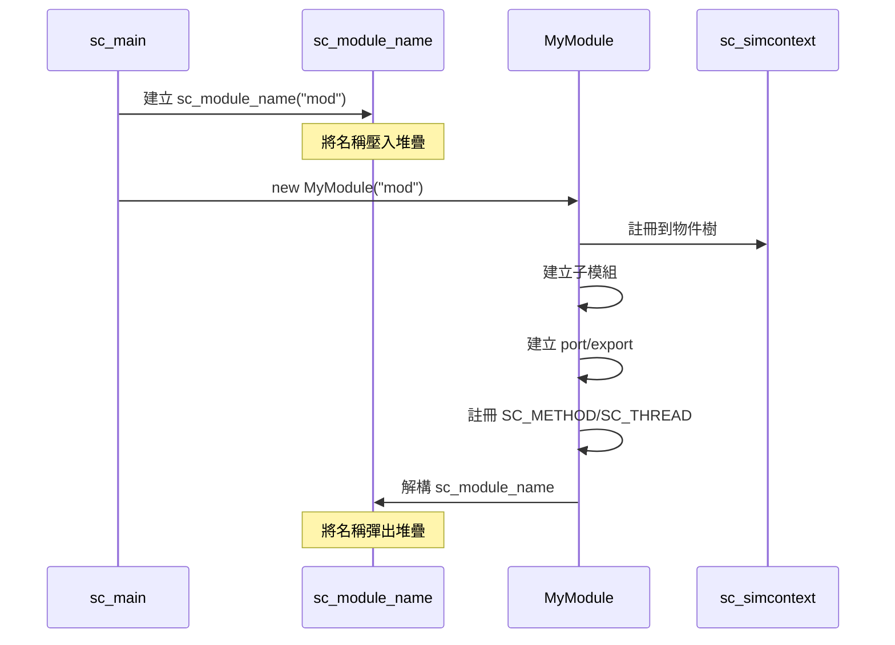

---

## Port、Export 與 Channel

這三者構成了 SystemC 模組之間通訊的鐵三角：

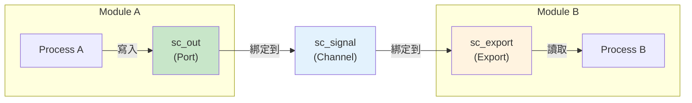

### Port — 模組的「插頭」

Port 定義了模組需要什麼樣的外部連接：

| Port 類型 | 方向 | 類比 |
|-----------|------|------|
| `sc_in<T>` | 輸入 | USB 的資料輸入線 |
| `sc_out<T>` | 輸出 | USB 的資料輸出線 |
| `sc_inout<T>` | 雙向 | 雙向的 I2C 資料線 |

### Export — 模組的「插座」

Export 讓模組直接提供一個介面的實作，
不需要透過中間的 channel。

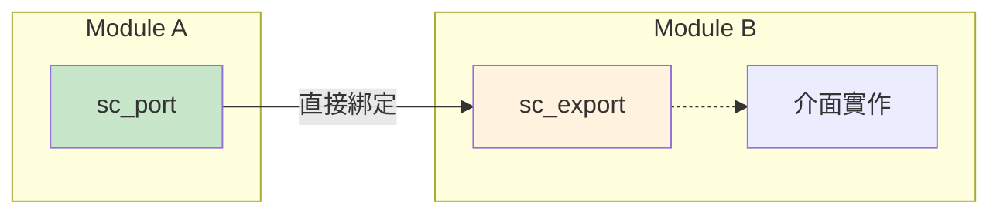

### Channel — 通訊的管道

Channel 是實現介面的具體元件，負責資料的傳輸和同步。

---

## 綁定（Binding）

綁定是在 elaboration 階段把 port、export、channel 連接起來的過程。

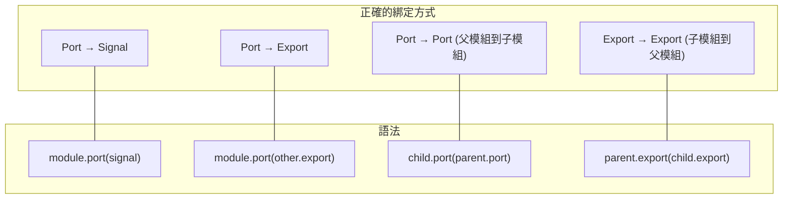

### 階層式綁定

在多層模組中，port 可以「穿越」層次：

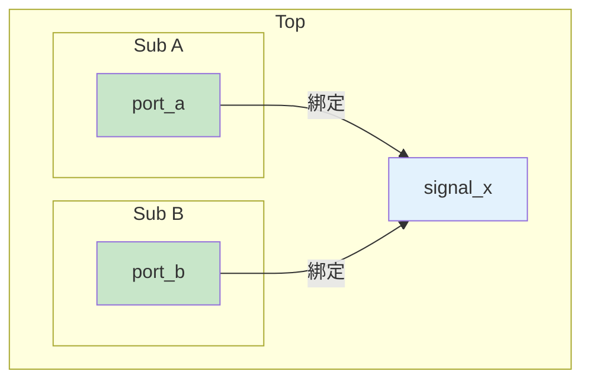

---

## Elaboration 階段做了什麼？

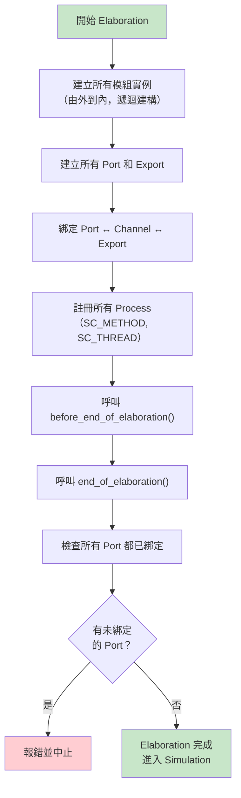

### sc_module_name 的巧妙設計

`sc_module_name` 利用建構子和解構子的配對，
自動管理模組的名稱堆疊：

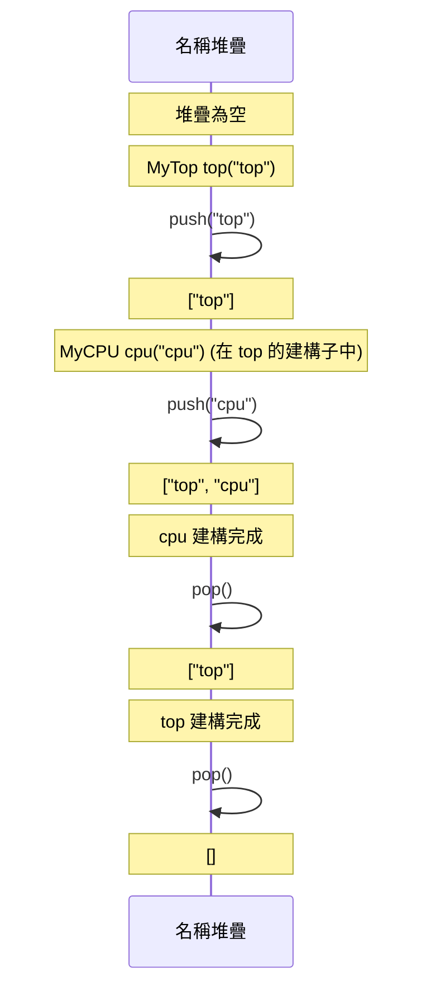

---

## 如何對應到硬體區塊

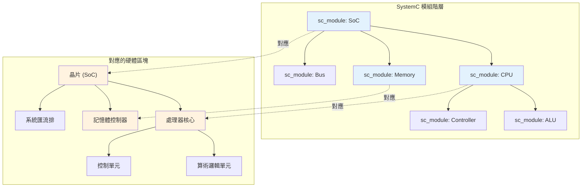

在硬體設計中：
- **模組** 對應一個硬體功能區塊（IP Block）
- **Port** 對應晶片的接腳或區塊的輸入/輸出
- **Signal** 對應實體的導線（wire）
- **物件樹** 對應硬體的階層式設計圖（block diagram）

---

## sc_object_manager 與 sc_module_registry

這兩個類別在幕後管理所有物件和模組：

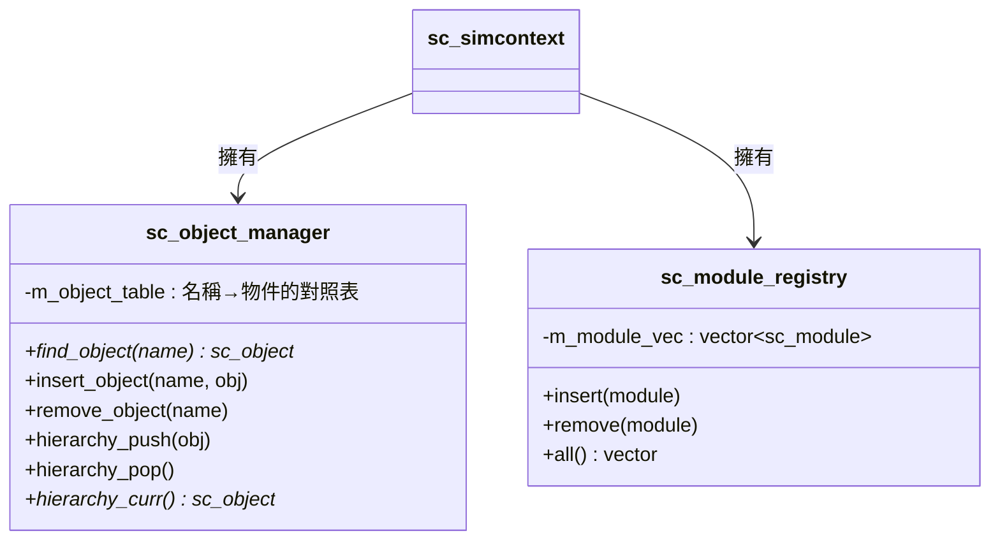

---

## 相關模組

| 概念 | 文件 | 關係 |
|------|------|------|
| 模擬引擎 | [simulation-engine.md](simulation-engine.md) | Elaboration 是模擬引擎生命週期的第一階段 |
| 通訊機制 | [communication.md](communication.md) | Port-Channel-Export 模式的詳細說明 |
| 事件機制 | [events.md](events.md) | Process 透過事件驅動執行 |
| 排程機制 | [scheduling.md](scheduling.md) | Process 的排程行為 |

### 對應的底層程式碼文件

| 原始碼概念 | 程式碼文件 |
|-----------|-----------|
| sc_object | [doc_v2/code/sysc/kernel/sc_object.md](../code/sysc/kernel/sc_object.md) |
| sc_module | [doc_v2/code/sysc/kernel/sc_module.md](../code/sysc/kernel/sc_module.md) |
| sc_module_name | [doc_v2/code/sysc/kernel/sc_module_name.md](../code/sysc/kernel/sc_module_name.md) |
| sc_module_registry | [doc_v2/code/sysc/kernel/sc_module_registry.md](../code/sysc/kernel/sc_module_registry.md) |
| sc_object_manager | [doc_v2/code/sysc/kernel/sc_object_manager.md](../code/sysc/kernel/sc_object_manager.md) |
| sc_port | [doc_v2/code/sysc/communication/sc_port.md](../code/sysc/communication/sc_port.md) |
| sc_export | [doc_v2/code/sysc/communication/sc_export.md](../code/sysc/communication/sc_export.md) |

---

## 學習小提示

1. **sc_object 就像 Java 的 Object 類別**——所有 SystemC 具名物件都繼承自它
2. **模組 = 容器**——它本身不「做事」，裡面的 process 才做事
3. **Port 定義「需要什麼」，Channel 提供「怎麼做」**——這是介面與實作分離的經典設計
4. **階層式名稱就是物件的地址**——用 `top.cpu.alu` 可以唯一識別任何物件
5. **Elaboration 完成後，結構就固定了**——模擬階段不能再新增或刪除模組
6. **畫物件樹是理解設計的第一步**——拿到一個 SystemC 設計，先畫出模組階層圖
