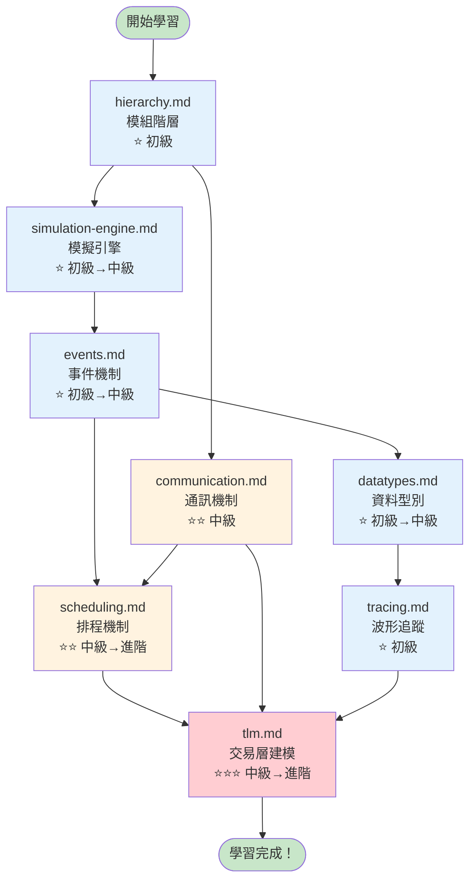
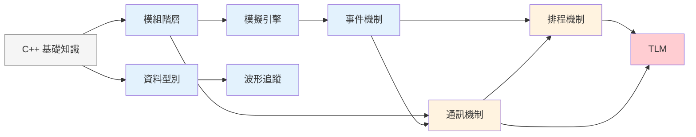

# SystemC 學習路徑

## 生活類比：學開車

學 SystemC 就像學開車：
- **第一步**：了解車的基本構造（引擎、方向盤、煞車）→ 對應「模組階層」
- **第二步**：學會發動和停車 → 對應「模擬引擎」
- **第三步**：學會看交通號誌 → 對應「事件機制」
- **第四步**：學會在車道間切換 → 對應「排程機制」
- **第五步**：學會與其他車輛互動 → 對應「通訊機制」
- **第六步**：了解儀表板上的數字 → 對應「資料型別」
- **第七步**：學會看行車記錄器 → 對應「波形追蹤」
- **第八步**：進階駕駛技巧 → 對應「TLM」

---

## 學習路徑流程圖

---

## 建議閱讀順序

### 第一階段：打好基礎（初級）

| 順序 | 文件 | 先修知識 | 預計時間 | 你會學到 |
|------|------|----------|----------|----------|
| 1 | [hierarchy.md](hierarchy.md) | C++ 基礎 | 30 分鐘 | 模組、埠口、物件樹 |
| 2 | [simulation-engine.md](simulation-engine.md) | hierarchy.md | 45 分鐘 | 模擬如何啟動和運行 |
| 3 | [events.md](events.md) | simulation-engine.md | 40 分鐘 | 事件驅動的核心概念 |
| 4 | [datatypes.md](datatypes.md) | 無 | 30 分鐘 | 硬體專用資料型別 |
| 5 | [tracing.md](tracing.md) | datatypes.md | 20 分鐘 | 如何觀察模擬結果 |

### 第二階段：深入核心（中級）

| 順序 | 文件 | 先修知識 | 預計時間 | 你會學到 |
|------|------|----------|----------|----------|
| 6 | [communication.md](communication.md) | hierarchy.md, events.md | 50 分鐘 | 模組之間如何溝通 |
| 7 | [scheduling.md](scheduling.md) | events.md, communication.md | 60 分鐘 | 排程器的完整運作 |

### 第三階段：進階應用（進階）

| 順序 | 文件 | 先修知識 | 預計時間 | 你會學到 |
|------|------|----------|----------|----------|
| 8 | [tlm.md](tlm.md) | 以上全部 | 90 分鐘 | 交易層建模的完整體系 |

---

## 各主題的先修關係圖

---

## 難度等級說明

| 等級 | 符號 | 說明 |
|------|------|------|
| 初級 | ⭐ | 只需要 C++ 基礎，概念用類比解釋 |
| 中級 | ⭐⭐ | 需要理解前面的初級概念，開始接觸硬體模擬的專業知識 |
| 進階 | ⭐⭐⭐ | 需要對 SystemC 有整體認識，涉及複雜的設計模式 |

---

## 學習小提示

1. **不要跳過類比**：每份文件開頭的生活類比是刻意設計的，幫助你建立直覺
2. **畫 Mermaid 圖**：建議用支援 Mermaid 的編輯器閱讀，圖表比文字更容易理解
3. **搭配程式碼文件**：概念理解後，去 `doc_v2/code/` 看對應的程式碼文件
4. **動手實作**：看完概念文件後，試著寫一個簡單的 SystemC 程式
5. **反覆閱讀**：有些概念（如 delta cycle）第一次不容易完全理解，這是正常的
