# 排程機制

## 生活類比：餐廳廚房的出餐系統

想像一間忙碌餐廳的廚房：

- **訂單** = 事件通知——「三號桌要牛排！」
- **出餐窗口** = Runnable Queue——所有準備好要出的菜排在這裡
- **廚師依序出菜** = Evaluate Phase——一道一道做完
- **服務生核對餐點** = Update Phase——確認所有菜都對了才端出去
- **一輪出餐完成** = 一個 Delta Cycle
- **等下一波訂單** = 推進模擬時間

所有同一輪的訂單是「同時到的」（同一個 delta），
但廚師只能一道一道做（單執行緒模擬），
所以 SystemC 必須有一套公平的排程規則。

---

## Evaluate-Update 典範

SystemC 排程的核心就是不斷重複兩個階段：

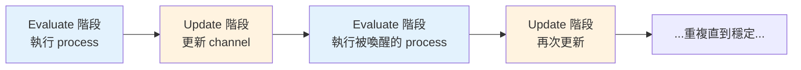

### 為什麼需要分兩階段？

因為硬體的特性：**所有正反器在時鐘邊沿同時翻轉**。

如果允許一個 process 寫入值後，另一個 process 立刻就看到新值，
那麼執行順序就會影響結果——這不符合硬體行為。

分離成 Evaluate 和 Update 保證了：
1. 在 Evaluate 階段，所有 process 讀到的是**上一輪 Update 的結果**
2. 寫入的新值先「暫存」起來
3. 等所有 process 都跑完了，再統一 Update

---

## Delta Cycle 完整解析

一個 delta cycle 由一次 Evaluate + 一次 Update 組成：

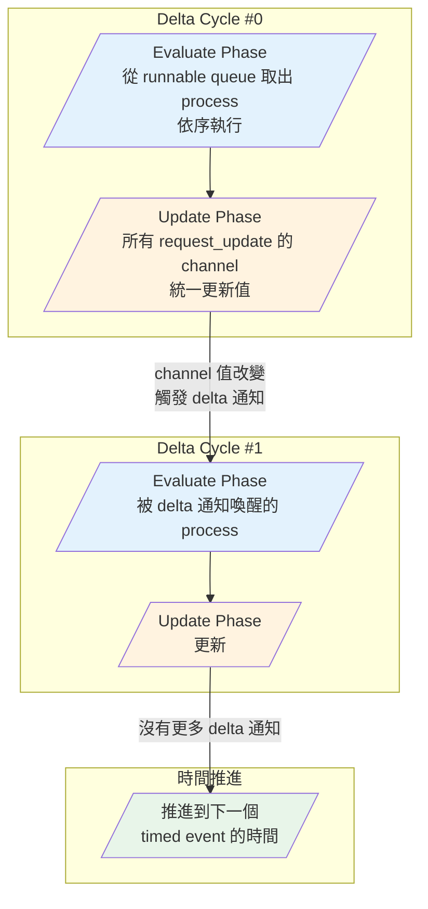

### 一個具體例子

假設有一個簡單的組合邏輯鏈：A → B → C

```
signal_a 改變 → process_b 讀 a 算 b → signal_b 改變 → process_c 讀 b 算 c
```

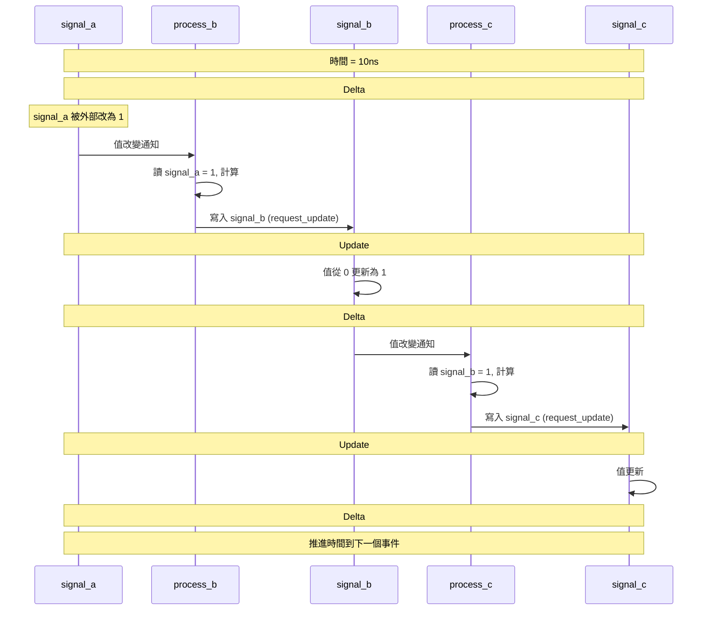

---

## Process 執行順序

### 關鍵觀念：同一個 delta 內，process 的執行順序是**不確定的**

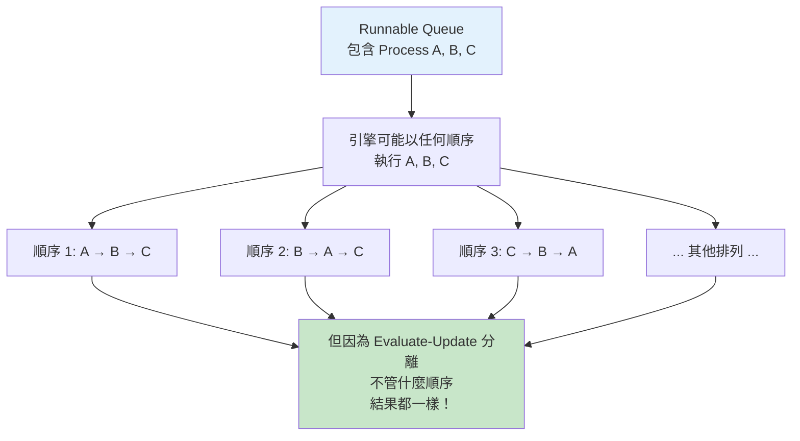

**這就是 Evaluate-Update 設計的精妙之處**：
因為所有 process 在 Evaluate 階段讀到的都是舊值，
寫入的新值到 Update 才生效，
所以不管引擎先執行哪個 process，最終結果都相同。

### SC_METHOD vs SC_THREAD 的排程差異

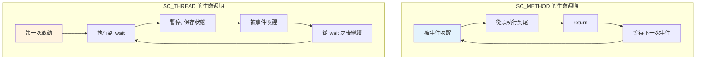

---

## Runnable Queue 的運作

Runnable Queue 是排程器的核心資料結構，
儲存所有「準備好要執行」的 process：

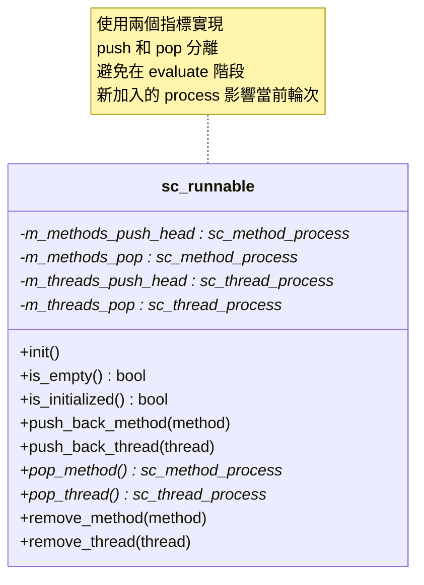

### Push / Pop 分離機制

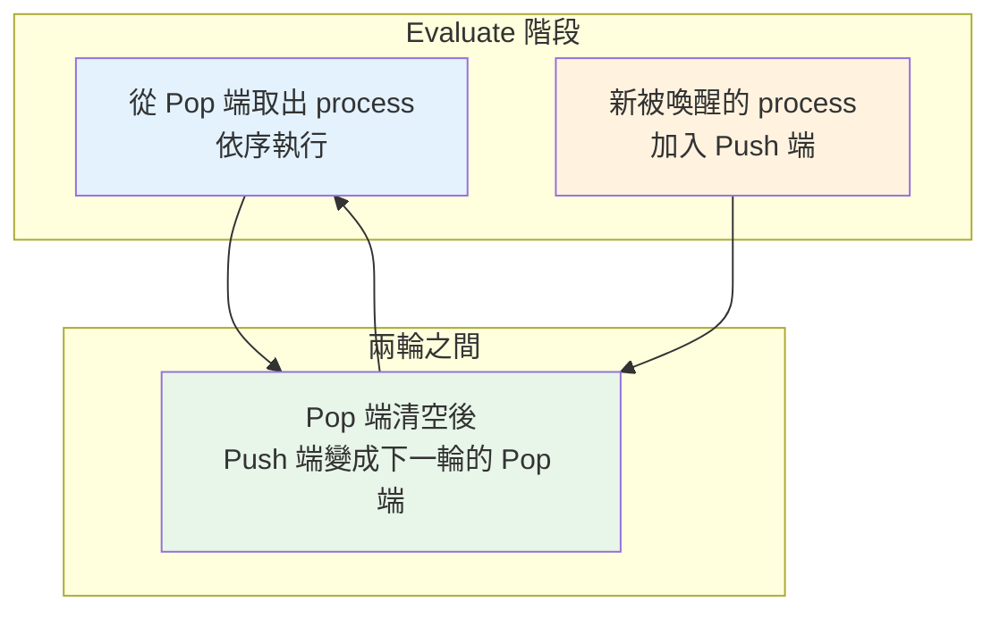

這個設計確保：在 evaluate 階段因為立即通知而被喚醒的 process，
會在**同一個 delta cycle** 內被執行，但不會打亂當前正在執行的順序。

---

## Timed vs Untimed 通知的排程

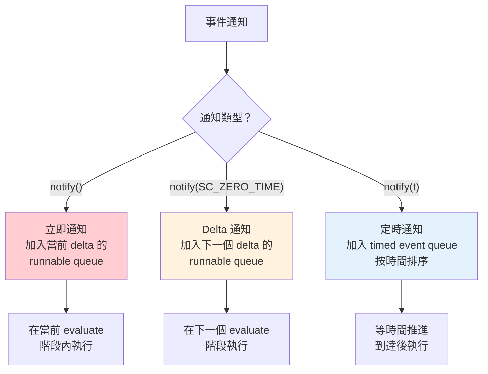

### Timed Event Queue

定時事件使用優先佇列（priority queue）管理，按觸發時間排序：

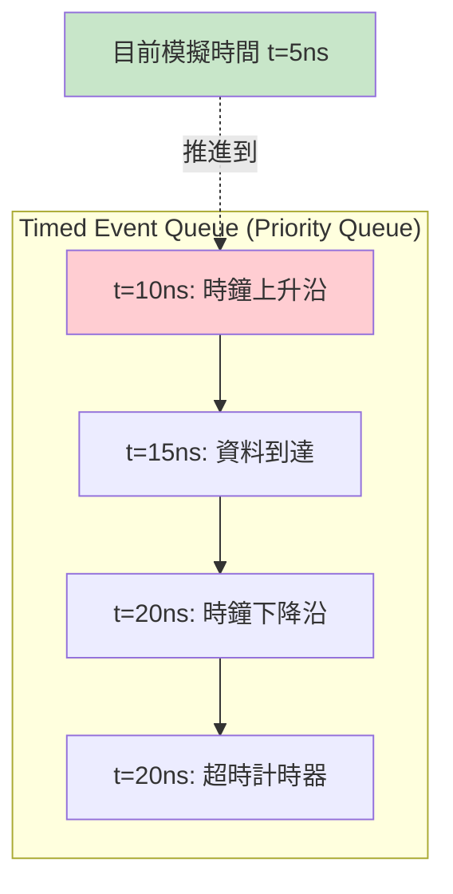

當所有 delta cycle 都穩定了（沒有更多 delta 通知），
引擎才會推進模擬時間到 timed event queue 中的下一個時間點。

---

## 完整排程演算法

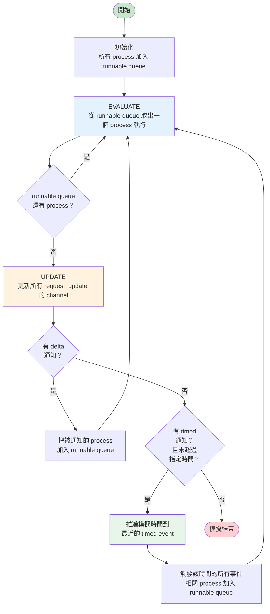

---

## 常見排程陷阱

### 陷阱一：無限 Delta Cycle

```cpp
// 危險！A 和 B 互相觸發，永遠停不下來
SC_METHOD(process_a);
sensitive << sig_b;
void process_a() { sig_a.write(!sig_b.read()); }

SC_METHOD(process_b);
sensitive << sig_a;
void process_b() { sig_b.write(!sig_a.read()); }
```

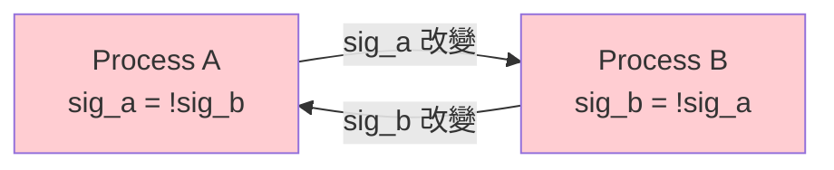

SystemC 引擎會在偵測到過多 delta cycle 時報錯並中止。

### 陷阱二：SC_METHOD 中呼叫 wait()

```cpp
SC_METHOD(my_method);
void my_method() {
    wait(10, SC_NS);  // 錯誤！SC_METHOD 不能 wait!
}
```

SC_METHOD 沒有自己的執行堆疊，無法暫停和恢復。
只有 SC_THREAD 和 SC_CTHREAD 才能呼叫 `wait()`。

---

## 相關模組

| 概念 | 文件 | 關係 |
|------|------|------|
| 模擬引擎 | [simulation-engine.md](simulation-engine.md) | 排程器是模擬引擎的心臟 |
| 事件機制 | [events.md](events.md) | 事件觸發排程 |
| 通訊機制 | [communication.md](communication.md) | Channel 的 request_update/update 是排程的一部分 |
| 模組階層 | [hierarchy.md](hierarchy.md) | Process 定義在模組中 |

### 對應的底層程式碼文件

| 原始碼概念 | 程式碼文件 |
|-----------|-----------|
| sc_simcontext | [doc_v2/code/sysc/kernel/sc_simcontext.md](../code/sysc/kernel/sc_simcontext.md) |
| sc_runnable | [doc_v2/code/sysc/kernel/sc_runnable.md](../code/sysc/kernel/sc_runnable.md) |
| sc_method_process | [doc_v2/code/sysc/kernel/sc_method_process.md](../code/sysc/kernel/sc_method_process.md) |
| sc_thread_process | [doc_v2/code/sysc/kernel/sc_thread_process.md](../code/sysc/kernel/sc_thread_process.md) |
| sc_event | [doc_v2/code/sysc/kernel/sc_event.md](../code/sysc/kernel/sc_event.md) |
| sc_prim_channel | [doc_v2/code/sysc/communication/sc_prim_channel.md](../code/sysc/communication/sc_prim_channel.md) |

---

## 學習小提示

1. **Evaluate-Update 是排程的靈魂**——理解了這個，就理解了 SystemC 為什麼能正確模擬硬體
2. **同一 delta 內的執行順序不確定**——永遠不要依賴 process 的執行順序來寫正確的程式碼
3. **Delta cycle 很快但不是免費的**——太多 delta cycle（如組合邏輯鏈太長）會影響模擬速度
4. **時間只在 delta cycle 穩定後才推進**——模擬時間是「離散跳躍」的，不是連續流動的
5. **初學者先掌握 SC_THREAD + wait()**——比 SC_METHOD + 靜態敏感度更直覺
6. **畫時序圖來除錯**——遇到排程問題時，手動畫出每個 delta cycle 中各 process 看到的值
