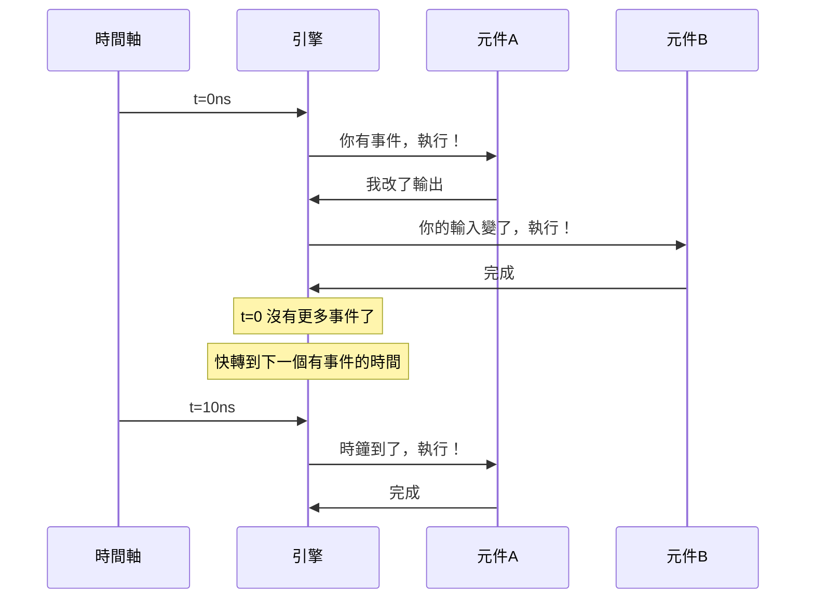
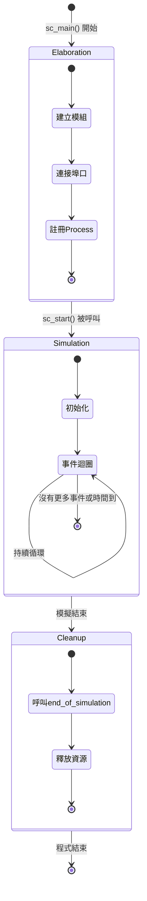
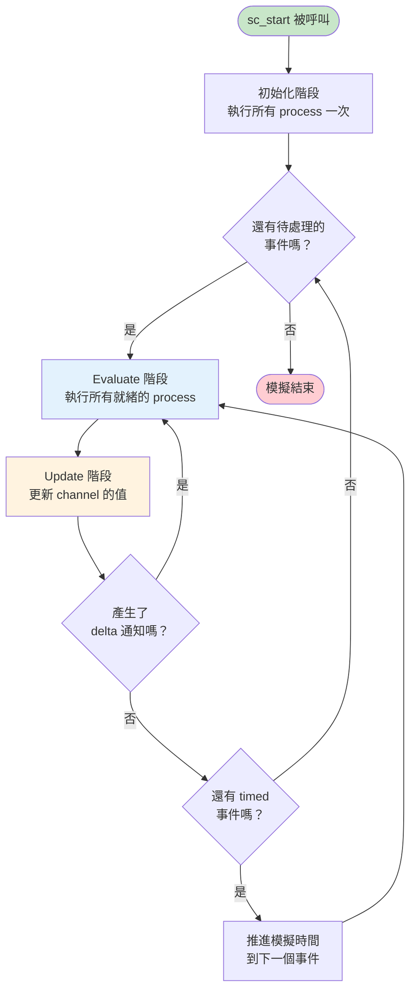
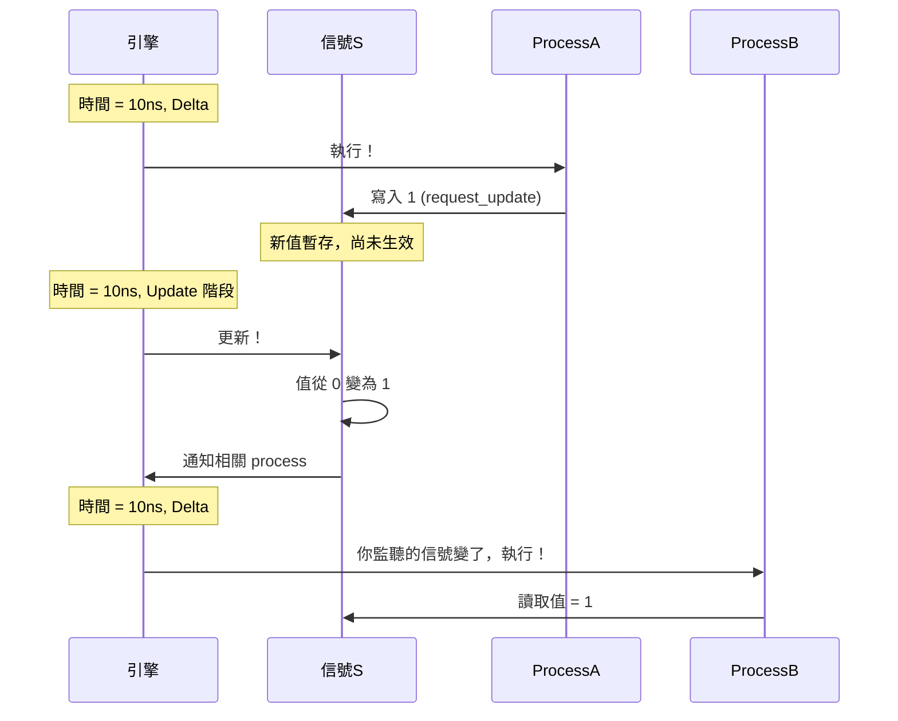
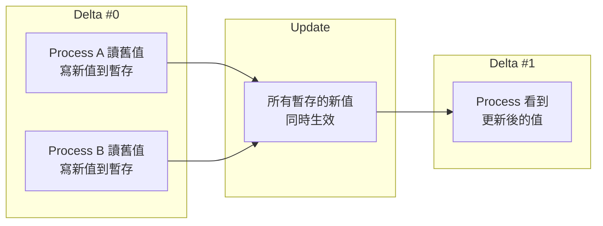
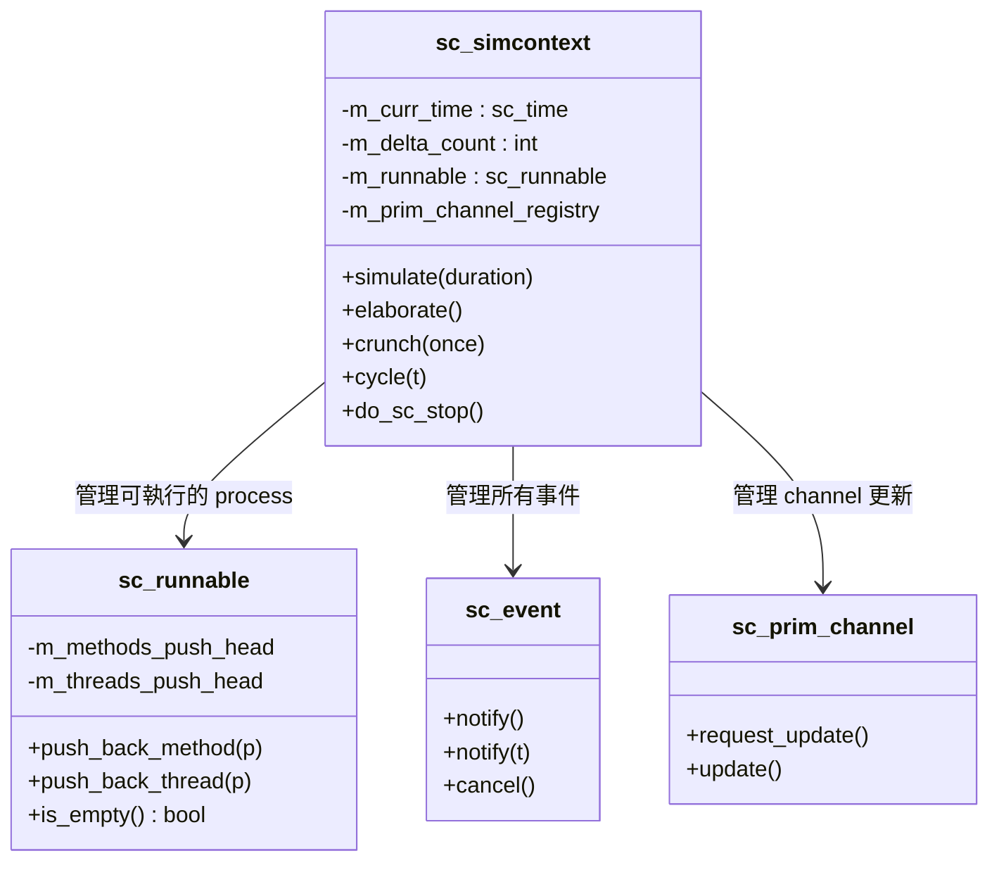
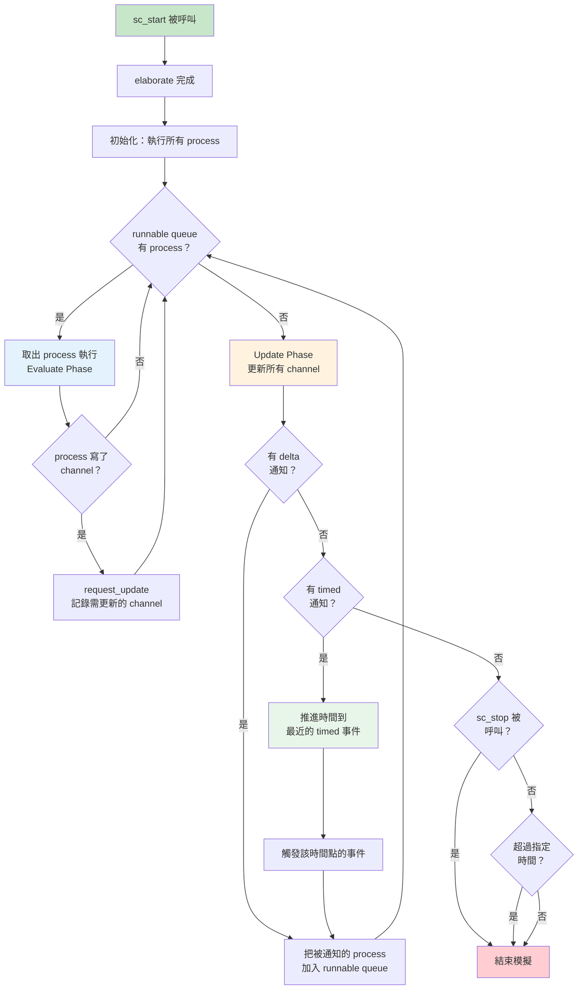

# 核心模擬引擎

## 生活類比：交響樂團的指揮

想像一場交響樂演出：

- **指揮** = `sc_simcontext`（模擬上下文）——掌控整場演出的節奏
- **樂譜** = 事件與排程——什麼時候誰該演奏
- **樂手** = 各個 process（SC_METHOD, SC_THREAD）——實際執行工作的人
- **排練** = elaboration（建構階段）——正式演出前的準備
- **演出** = simulation（模擬階段）——真正開始運行
- **散場** = cleanup（清理階段）——收拾舞台

指揮不會自己演奏任何樂器，但沒有指揮，整個樂團就會亂成一團。
SystemC 的模擬引擎就是這個指揮。

---

## 什麼是事件驅動模擬？

傳統程式是「一行一行往下跑」的，但硬體不是這樣運作的。
在真實硬體中，所有電路是**同時運行**的——時鐘一跳，所有正反器同時更新。

事件驅動模擬的核心想法：

> **只有在「發生事情」的時候才做運算，沒事發生就快轉時間。**



這就像一部電影的快轉——中間沒有劇情的部分直接跳過，
只在有事情發生的「關鍵幀」停下來處理。

---

## 模擬的三大生命階段

SystemC 程式的生命週期分為三個階段：



### 階段一：Elaboration（建構階段）

這是「搭舞台」的階段。在 `sc_main()` 函式中，你做的是：

1. **建立模組** (`new MyModule("name")`)
2. **連接埠口** (`module1.port(signal)`)
3. **註冊 process** (在模組建構子中用 `SC_METHOD`, `SC_THREAD`)

```cpp
int sc_main(int argc, char* argv[]) {
    // === Elaboration 階段 ===
    sc_signal<bool> clk_sig;
    MyModule mod("mod");
    mod.clk(clk_sig);

    // === 進入 Simulation 階段 ===
    sc_start(100, SC_NS);

    // === Cleanup 自動發生 ===
    return 0;
}
```

**重要**：Elaboration 階段不能呼叫 `wait()` 或 `sc_stop()`，
就像排練時不能開始正式演出。

### 階段二：Simulation（模擬階段）

呼叫 `sc_start()` 後進入此階段。引擎開始運行事件迴圈。

### 階段三：Cleanup（清理階段）

模擬結束後，引擎呼叫所有模組的 `end_of_simulation()` 回呼函式，
然後釋放資源。

---

## sc_start() 與主模擬迴圈

`sc_start()` 有幾種呼叫方式：

```cpp
sc_start();              // 跑到沒有事件為止
sc_start(100, SC_NS);    // 跑 100 奈秒
sc_start(SC_ZERO_TIME);  // 只跑一個 delta cycle
```

呼叫 `sc_start()` 後，引擎內部的主迴圈開始運轉：



---

## Delta Cycle（德爾塔週期）

Delta cycle 是 SystemC 中最重要也最容易混淆的概念之一。

### 類比：傳話遊戲

想像一排人在玩傳話遊戲：
1. 第一個人說了一句話（寫入信號）
2. 但聽的人不會馬上反應——他要等「一個瞬間」才會聽到
3. 這個「瞬間」就是一個 delta cycle

**Delta cycle 佔用零模擬時間**，但有明確的先後順序。



### 為什麼需要 Delta Cycle？

因為硬體中所有正反器是**同時翻轉**的。但軟體無法真正同時執行所有東西，
所以用 delta cycle 來模擬「邏輯上的同時」：

- 同一個 delta 內，所有 process 看到的信號值是相同的（上一次 update 的結果）
- 寫入的新值要到下一個 delta 才會生效
- 這保證了順序無關性——不管先執行哪個 process，結果都一樣



---

## sc_simcontext：幕後的總指揮

`sc_simcontext` 是整個模擬的中央控制器。它管理：



### 核心方法

- **`elaborate()`**：完成建構階段，檢查所有綁定是否正確
- **`simulate(duration)`**：主要的模擬驅動函式
- **`crunch(once)`**：執行一輪 evaluate-update（一個或多個 delta cycle）
- **`cycle(t)`**：推進模擬時間

---

## 完整的模擬時間推進流程



---

## 相關模組

| 概念 | 文件 | 關係 |
|------|------|------|
| 事件機制 | [events.md](events.md) | 事件是驅動模擬引擎的燃料 |
| 排程機制 | [scheduling.md](scheduling.md) | 排程器是引擎內部的核心演算法 |
| 模組階層 | [hierarchy.md](hierarchy.md) | 模組在 elaboration 階段建立 |
| 通訊機制 | [communication.md](communication.md) | Channel 的 update 是 delta cycle 的關鍵 |

### 對應的底層程式碼文件

| 原始碼概念 | 程式碼文件 |
|-----------|-----------|
| sc_simcontext | [doc_v2/code/sysc/kernel/sc_simcontext.md](../code/sysc/kernel/sc_simcontext.md) |
| sc_runnable | [doc_v2/code/sysc/kernel/sc_runnable.md](../code/sysc/kernel/sc_runnable.md) |
| sc_time | [doc_v2/code/sysc/kernel/sc_time.md](../code/sysc/kernel/sc_time.md) |
| sc_event | [doc_v2/code/sysc/kernel/sc_event.md](../code/sysc/kernel/sc_event.md) |

---

## 學習小提示

1. **模擬引擎的核心就是一個 while 迴圈**——不斷地「找事件 → 執行 process → 更新 channel → 找下一個事件」
2. **Delta cycle 不佔時間但有順序**——這是理解 SystemC 行為最關鍵的觀念
3. **Elaboration 和 Simulation 嚴格分離**——建構階段做的事不能在模擬階段做，反之亦然
4. **`sc_simcontext` 是全域單例**——整個程式只有一個模擬上下文，所有模組都在裡面運行
5. **思考方式要從「循序執行」轉換到「事件驅動」**——這是軟體工程師學習 SystemC 最大的心理轉換
