# 交易層建模 (TLM)

## 生活類比：快遞物流系統

想像整個快遞物流系統：

- **RTL 級建模** = 追蹤每一個包裹在每一秒鐘的確切位置——非常精確但極其費力
- **TLM 建模** = 只追蹤「包裹從倉庫A發出，3天後到達倉庫B」——快速且足夠精確
- **Generic Payload** = 標準化的包裹——不管裡面裝什麼，外面都有統一的運單格式
- **Socket** = 倉庫的收發窗口——「發貨窗口」(initiator) 和「收貨窗口」(target)
- **Transaction** = 一次包裹的寄送——從發送到接收的完整過程
- **Temporal Decoupling** = 快遞員一次帶走多個包裹——不用每個包裹都跑一趟

在晶片設計的早期階段，你不需要知道每根導線的時序，
只需要知道「CPU 讀了記憶體位址 0x1000，得到了資料 0xDEADBEEF，花了 100ns」。

---

## 什麼是 TLM？為什麼需要它？

### RTL 太慢的問題

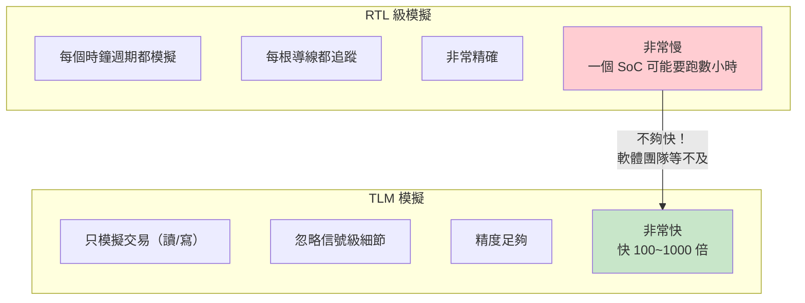

### TLM 的應用場景

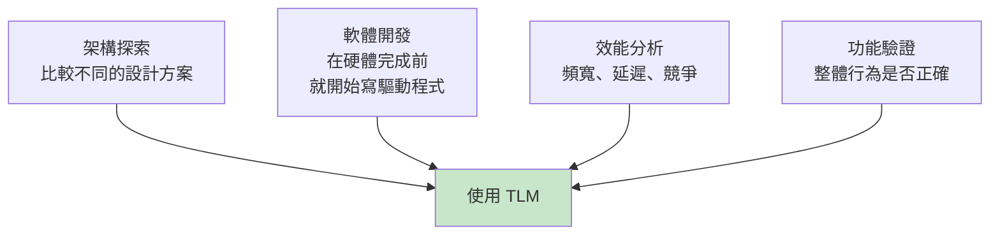

---

## TLM 1.0 vs TLM 2.0

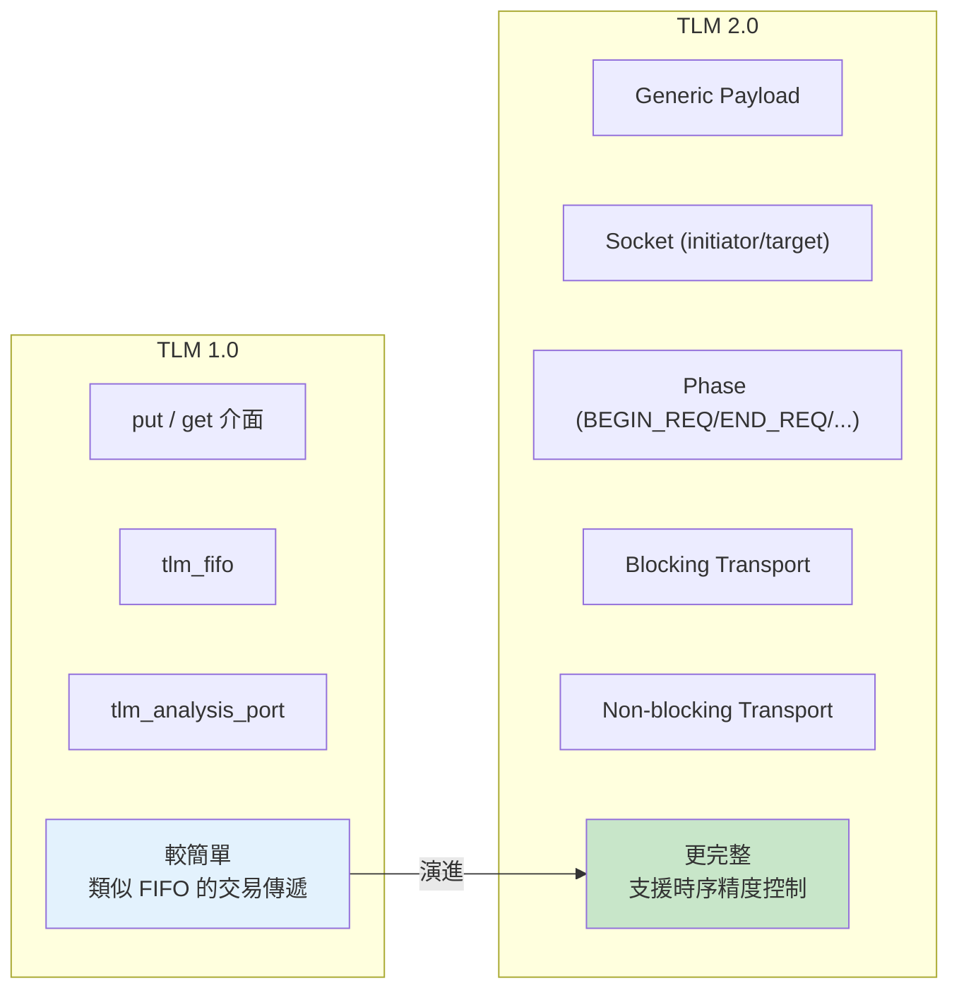

| 特性 | TLM 1.0 | TLM 2.0 |
|------|---------|---------|
| 主要介面 | put/get/peek | b_transport / nb_transport_fw/bw |
| 資料格式 | 任意型別 | Generic Payload (標準化) |
| 時序模型 | 無 | 有 (AT/LT) |
| 用途 | 簡單的資料傳遞 | 完整的匯流排建模 |
| 標準化 | 基本 | IEEE 1666-2011 |

---

## Generic Payload（通用載荷）

Generic Payload 是 TLM 2.0 定義的標準化交易格式，
就像國際物流的「國際運單」——不管寄什麼、從哪寄到哪，格式都一樣。

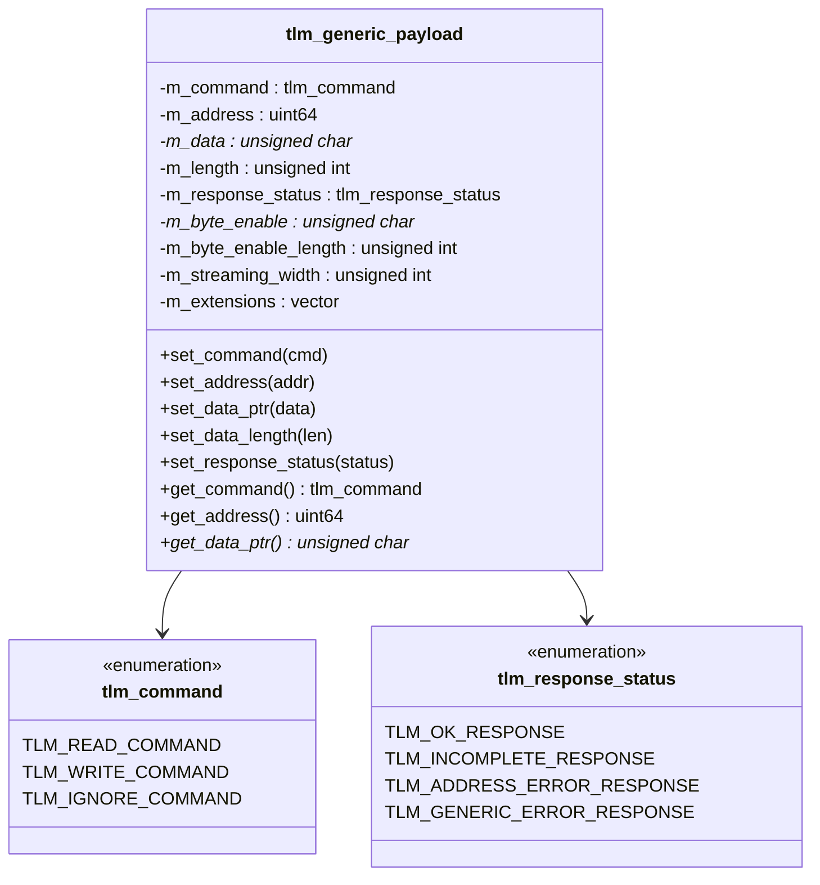

### 常用欄位解釋

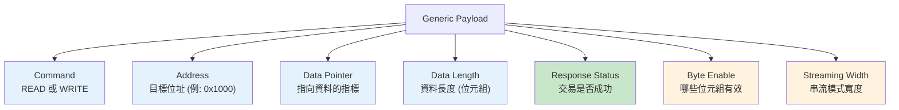

### 使用範例

```cpp
// 建立一個讀取交易
tlm::tlm_generic_payload trans;
unsigned char data[4];

trans.set_command(tlm::TLM_READ_COMMAND);
trans.set_address(0x1000);
trans.set_data_ptr(data);
trans.set_data_length(4);
trans.set_response_status(tlm::TLM_INCOMPLETE_RESPONSE);

// 發送交易
sc_time delay = SC_ZERO_TIME;
socket->b_transport(trans, delay);

// 檢查結果
if (trans.get_response_status() == tlm::TLM_OK_RESPONSE) {
    // data[] 現在包含從 0x1000 讀到的 4 個位元組
}
```

---

## Socket：發起者與目標

### 基本概念

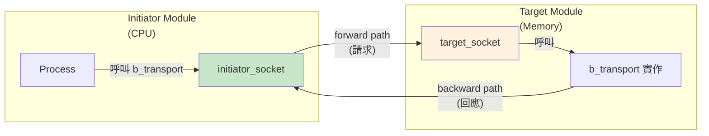

### Socket 的類別結構

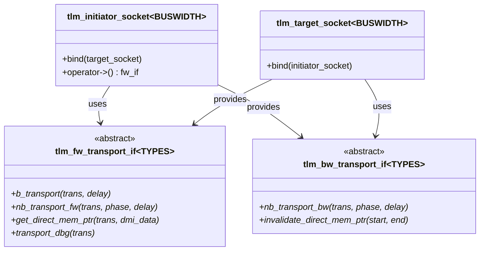

### 綁定方式

```cpp
// 直接綁定
initiator.socket.bind(target.socket);

// 或用運算子
initiator.socket(target.socket);
```

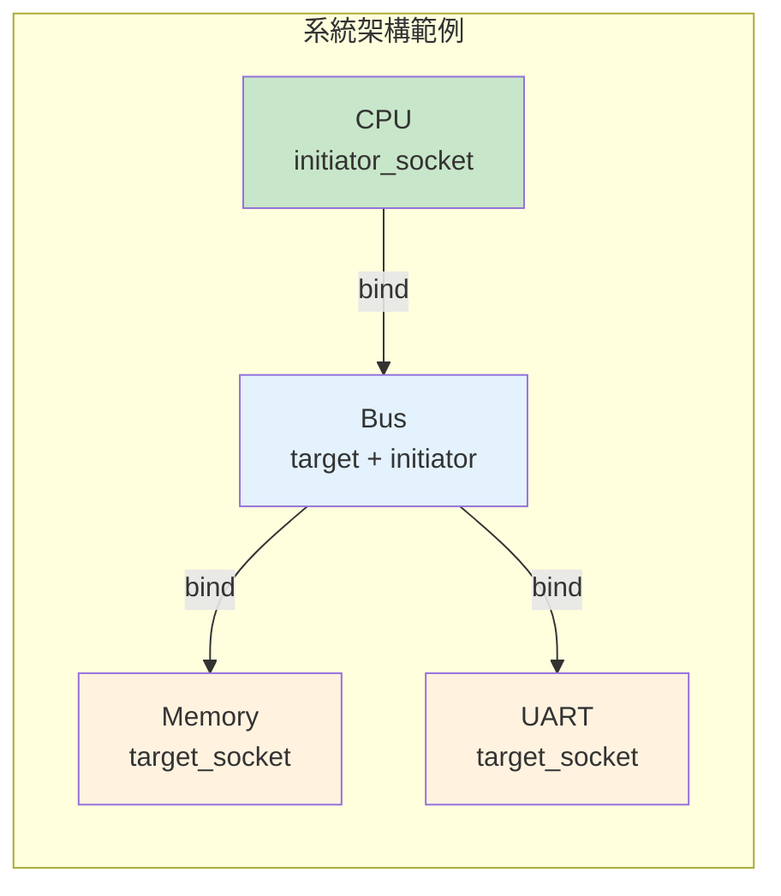

---

## 兩種傳輸模式

### Blocking Transport（阻塞傳輸）

```cpp
void b_transport(tlm::tlm_generic_payload& trans, sc_time& delay);
```

整個交易在一個函式呼叫中完成，就像打電話——
撥號、等待接通、對話、掛斷，全部在一通電話中完成。

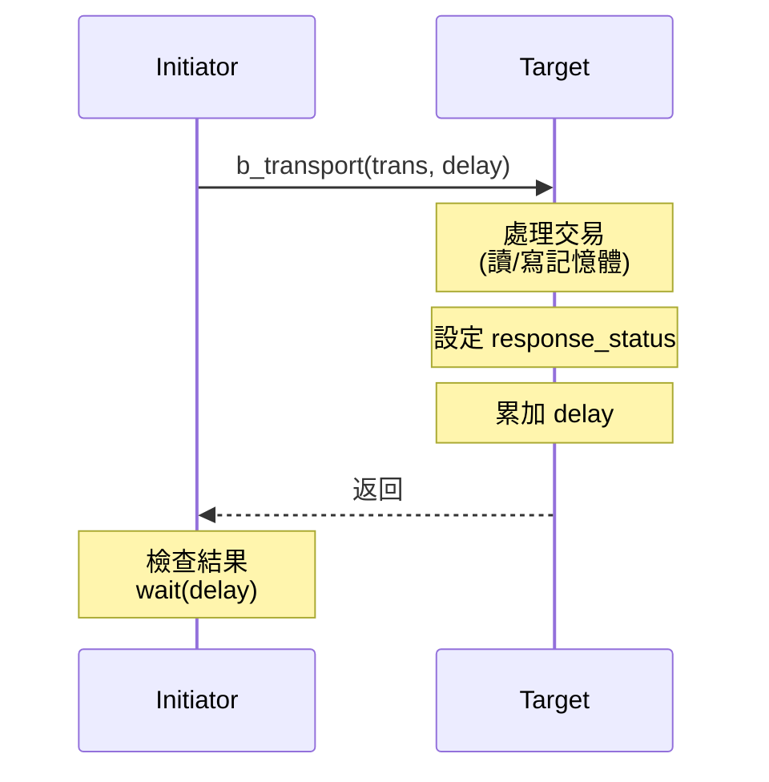

### Non-blocking Transport（非阻塞傳輸）

```cpp
tlm_sync_enum nb_transport_fw(tlm_generic_payload& trans,
                               tlm_phase& phase,
                               sc_time& delay);
```

交易分多個階段完成，就像寄快遞——
下單、攬件、運送、派件、簽收，每個階段獨立。

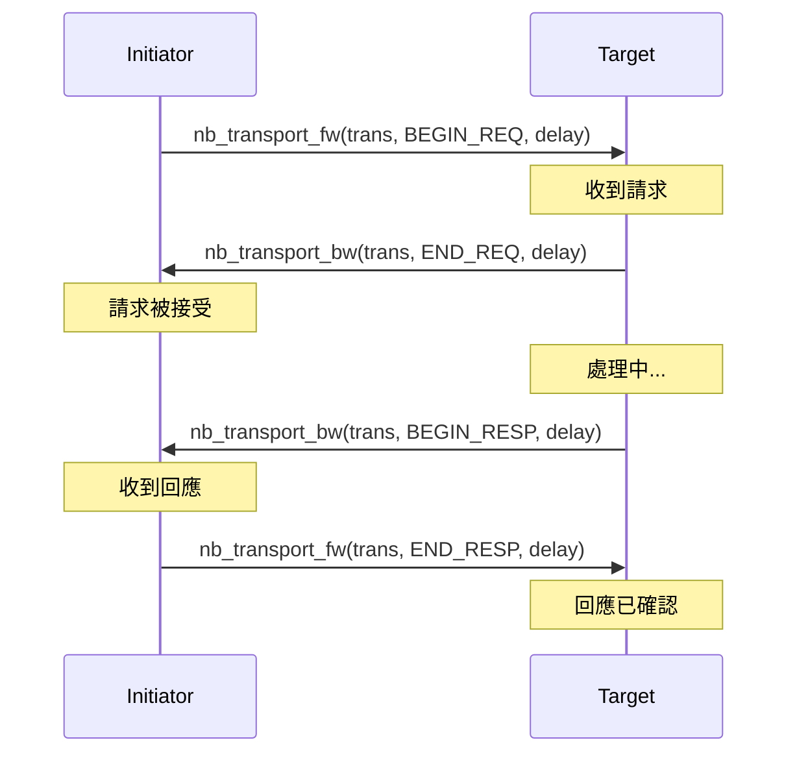

---

## Loosely-Timed vs Approximately-Timed

### Loosely-Timed (LT) — 粗略時序

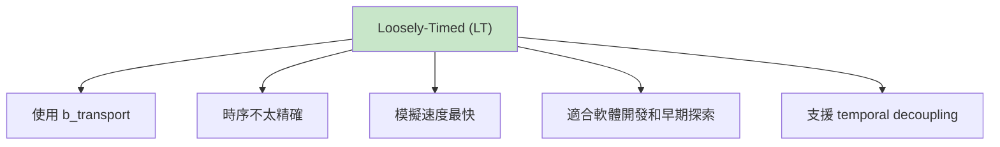

### Approximately-Timed (AT) — 近似時序

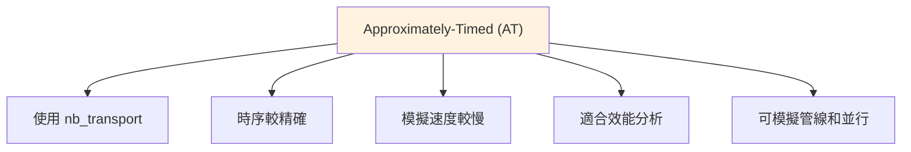

### 精度與速度的取捨

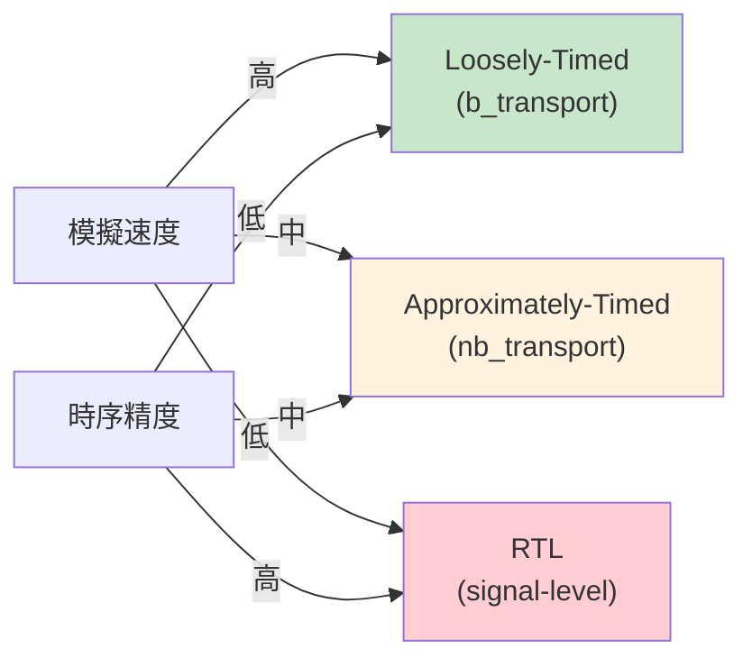

---

## Phase（交易階段）

TLM 2.0 定義了四個基本階段：

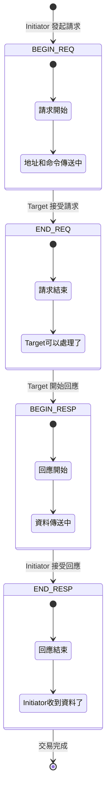

### Phase 對應到匯流排行為

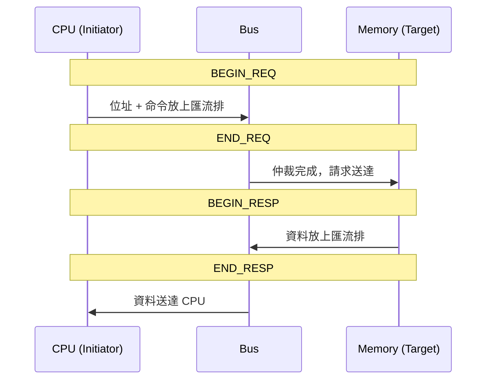

---

## Temporal Decoupling 與 Quantum

### 問題：同步太頻繁

在正常的模擬中，每次交易都要和引擎同步（呼叫 `wait()`），
這會嚴重拖慢模擬速度。

### 解決：讓 process 跑得比模擬時間快

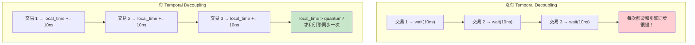

### Quantum Keeper

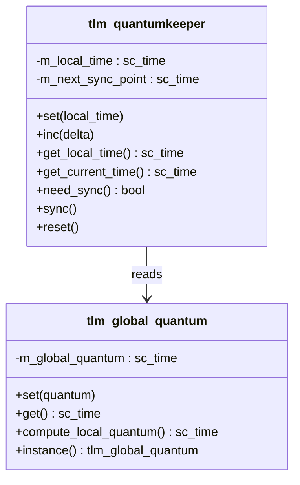

### 使用範例

```cpp
// 設定 global quantum (例如 1 微秒)
tlm::tlm_global_quantum::instance().set(sc_time(1, SC_US));

// 在 initiator 中
tlm_utils::tlm_quantumkeeper qk;
qk.reset();

void run() {
    while (true) {
        // 執行交易
        sc_time delay = SC_ZERO_TIME;
        socket->b_transport(trans, delay);

        // 累加本地時間
        qk.inc(delay);

        // 檢查是否需要同步
        if (qk.need_sync()) {
            qk.sync();  // wait(local_time)
        }
    }
}
```

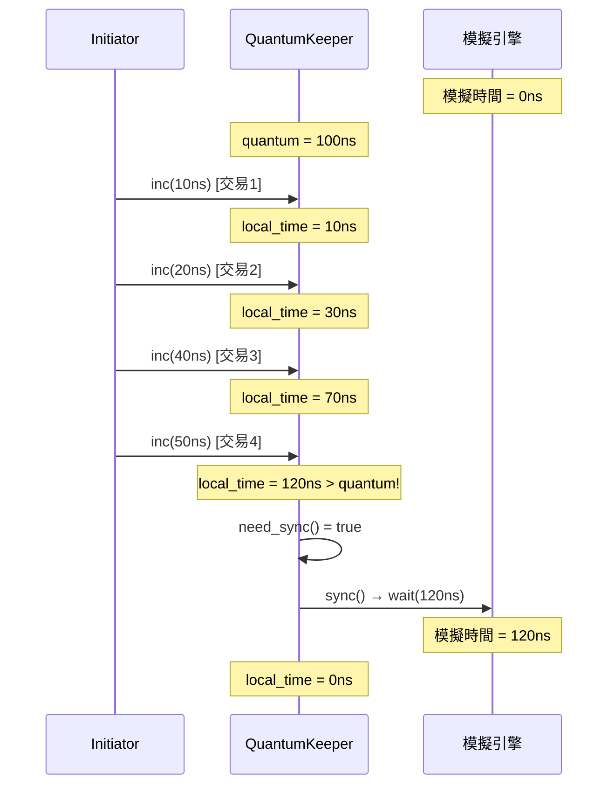

---

## DMI（Direct Memory Interface）

DMI 允許 initiator 直接存取 target 的記憶體，
跳過 transport 介面——就像快遞員直接把鑰匙給你，以後你自己去倉庫拿。

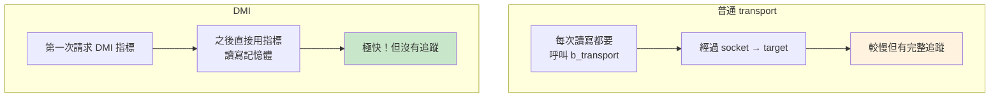

---

## TLM 2.0 便利 Socket

`tlm_utils` 提供了簡化版的 socket，減少樣板程式碼：

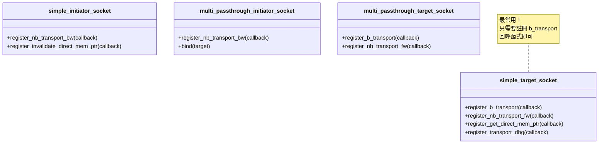

---

## 完整的 TLM 2.0 系統範例

```mermaid
flowchart TD
    subgraph "SoC 平台模型"
        CPU["CPU<br/>simple_initiator_socket"]
        DMA["DMA<br/>initiator + target"]
        BUS["Interconnect<br/>multi_passthrough<br/>target + initiator"]
        RAM["RAM<br/>simple_target_socket<br/>+ DMI 支援"]
        UART["UART<br/>simple_target_socket"]
        GPIO["GPIO<br/>simple_target_socket"]
    end

    CPU -->|"0x0000-0xFFFF"| BUS
    DMA -->|"0x0000-0xFFFF"| BUS
    BUS -->|"0x0000-0x7FFF"| RAM
    BUS -->|"0x8000-0x800F"| UART
    BUS -->|"0x8010-0x801F"| GPIO
    CPU -->|"設定 DMA"| DMA

    style CPU fill:#c8e6c9
    style DMA fill:#e3f2fd
    style BUS fill:#fff3e0
    style RAM fill:#fce4ec
    style UART fill:#fce4ec
    style GPIO fill:#fce4ec
```

---

## 相關模組

| 概念 | 文件 | 關係 |
|------|------|------|
| 通訊機制 | [communication.md](communication.md) | TLM 是更高層次的通訊抽象 |
| 模組階層 | [hierarchy.md](hierarchy.md) | TLM 模組仍然是 sc_module |
| 事件機制 | [events.md](events.md) | Temporal decoupling 減少事件同步 |
| 排程機制 | [scheduling.md](scheduling.md) | Quantum 影響排程頻率 |

### 對應的底層程式碼文件

| 原始碼概念 | 程式碼文件 |
|-----------|-----------|
| tlm_generic_payload | [doc_v2/code/tlm_core/tlm_2/tlm_generic_payload.md](../code/tlm_core/tlm_2/tlm_generic_payload.md) |
| tlm_phase | [doc_v2/code/tlm_core/tlm_2/tlm_phase.md](../code/tlm_core/tlm_2/tlm_phase.md) |
| tlm_fw_bw_ifs | [doc_v2/code/tlm_core/tlm_2/tlm_fw_bw_ifs.md](../code/tlm_core/tlm_2/tlm_fw_bw_ifs.md) |
| tlm_initiator_socket | [doc_v2/code/tlm_core/tlm_2/tlm_initiator_socket.md](../code/tlm_core/tlm_2/tlm_initiator_socket.md) |
| tlm_target_socket | [doc_v2/code/tlm_core/tlm_2/tlm_target_socket.md](../code/tlm_core/tlm_2/tlm_target_socket.md) |
| tlm_global_quantum | [doc_v2/code/tlm_core/tlm_2/tlm_global_quantum.md](../code/tlm_core/tlm_2/tlm_global_quantum.md) |
| tlm_dmi | [doc_v2/code/tlm_core/tlm_2/tlm_dmi.md](../code/tlm_core/tlm_2/tlm_dmi.md) |
| tlm_quantumkeeper | [doc_v2/code/tlm_utils/tlm_quantumkeeper.md](../code/tlm_utils/tlm_quantumkeeper.md) |
| simple_initiator_socket | [doc_v2/code/tlm_utils/simple_initiator_socket.md](../code/tlm_utils/simple_initiator_socket.md) |
| simple_target_socket | [doc_v2/code/tlm_utils/simple_target_socket.md](../code/tlm_utils/simple_target_socket.md) |
| tlm_analysis | [doc_v2/code/tlm_core/tlm_1/tlm_analysis.md](../code/tlm_core/tlm_1/tlm_analysis.md) |
| tlm_req_rsp | [doc_v2/code/tlm_core/tlm_1/tlm_req_rsp.md](../code/tlm_core/tlm_1/tlm_req_rsp.md) |
| peq_with_cb_and_phase | [doc_v2/code/tlm_utils/peq_with_cb_and_phase.md](../code/tlm_utils/peq_with_cb_and_phase.md) |

---

## 學習小提示

1. **先學 b_transport，再學 nb_transport**——大多數情況下 LT 模式就夠了
2. **Generic Payload 是 TLM 2.0 的核心**——理解它的每個欄位
3. **Socket = Port + Export 的結合體**——它同時提供了 forward 和 backward 路徑
4. **Temporal Decoupling 是速度的關鍵**——不用它，TLM 的速度優勢會大打折扣
5. **DMI 讓記憶體存取飛快**——對記憶體密集的模擬非常重要
6. **TLM 和 RTL 可以混合使用**——用 TLM 建模大部分系統，只對關注的部分用 RTL
7. **simple_target_socket 是你的好朋友**——它省去了很多樣板程式碼
8. **Extension 機制讓 Generic Payload 可擴展**——需要自訂欄位時不用修改 payload 本身
