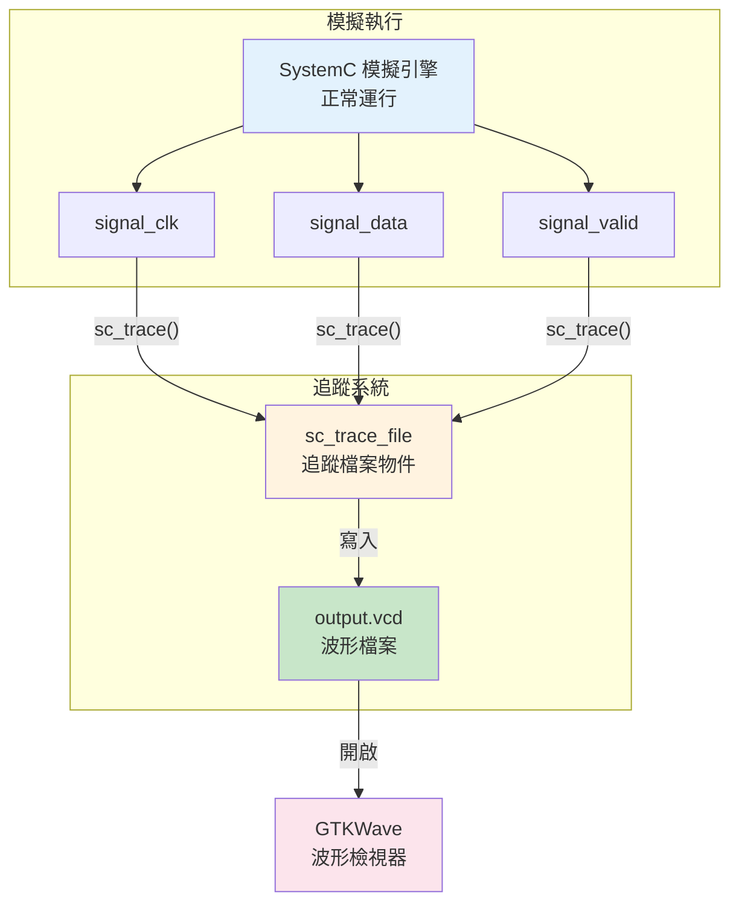
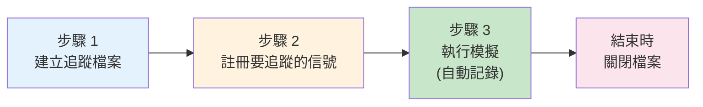
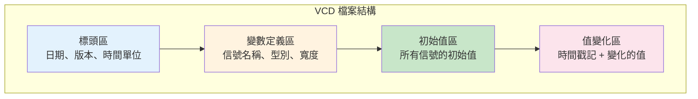
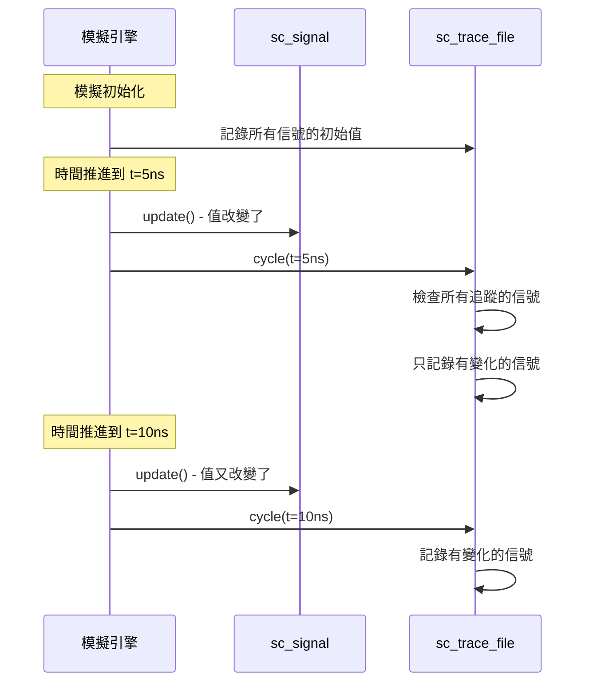
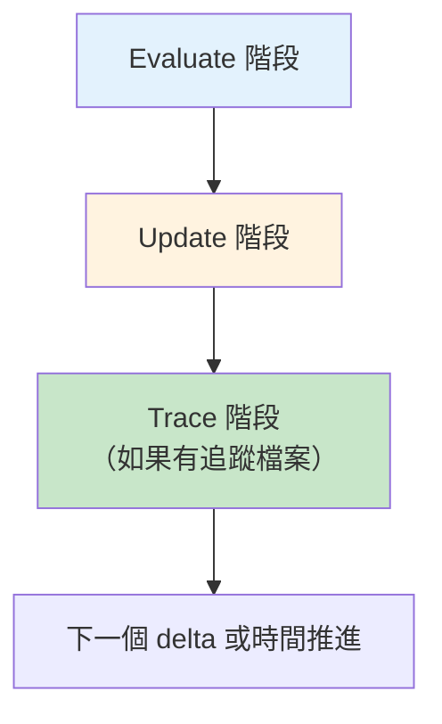
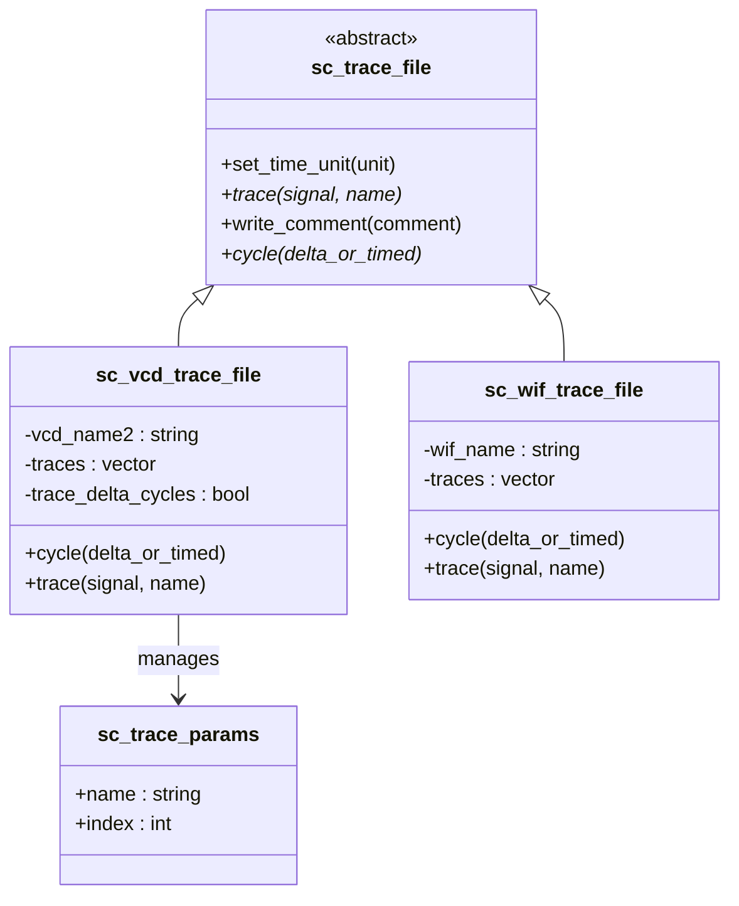
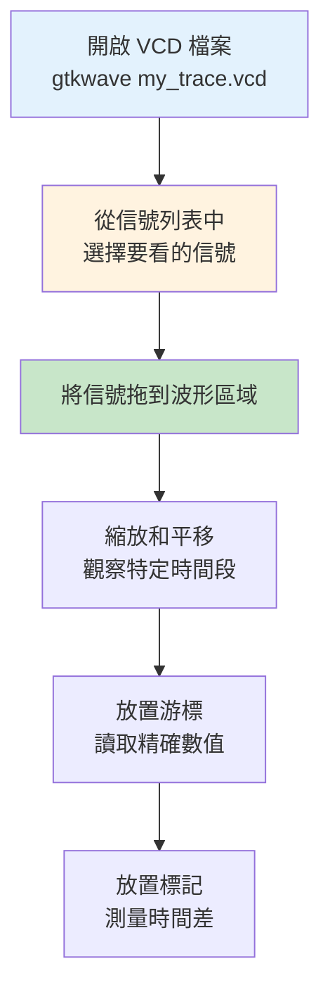
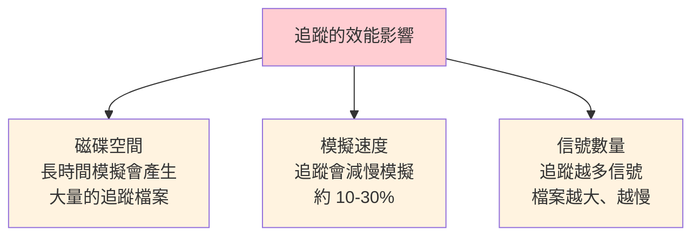

# 波形追蹤

## 生活類比：行車記錄器

波形追蹤就像汽車上的行車記錄器（dashcam）：

- **追蹤檔案** = 行車記錄器的影片——記錄了「什麼時候發生了什麼事」
- **sc_trace()** = 把攝影機對準某個方向——「我要錄這個信號的變化」
- **VCD 格式** = 影片的格式（MP4、AVI）——一種標準化的儲存方式
- **GTKWave** = 影片播放器——用來回放和分析錄下來的內容

行車記錄器不會改變你的駕駛行為，只是安靜地記錄一切。
波形追蹤也一樣——它不影響模擬的結果，只是記錄信號的變化歷史。

---

## 什麼是波形追蹤？

在硬體設計中，**波形（waveform）** 是信號隨時間變化的圖形表示。
波形追蹤就是在模擬過程中，把選定信號的每一次值變化都記錄下來。



### 波形長什麼樣？

```
時間:     0ns    5ns    10ns   15ns   20ns   25ns
         |      |      |      |      |      |
clk:     _|‾‾‾‾‾|_____|‾‾‾‾‾|_____|‾‾‾‾‾|_____
data:    ====00===|====FF===|====42===|====00===
valid:   _________|‾‾‾‾‾‾‾‾‾‾‾‾‾‾‾‾‾‾‾|________
```

---

## 使用方式

### 基本三步驟



```cpp
int sc_main(int argc, char* argv[]) {
    // ... 建立模組和信號 ...

    // 步驟 1: 建立 VCD 追蹤檔案
    sc_trace_file* tf = sc_create_vcd_trace_file("my_trace");

    // 步驟 2: 註冊要追蹤的信號
    sc_trace(tf, clk_signal, "clk");
    sc_trace(tf, data_signal, "data");
    sc_trace(tf, valid_signal, "valid");

    // 步驟 3: 執行模擬 (追蹤自動發生)
    sc_start(100, SC_NS);

    // 關閉檔案
    sc_close_vcd_trace_file(tf);

    return 0;
}
```

---

## VCD 格式解析

VCD（Value Change Dump）是 IEEE 1364 標準定義的波形格式，
是最通用的硬體模擬波形格式。

### VCD 檔案結構



### VCD 檔案範例

```
$date
    Mon Mar 15 2026
$end
$version
    SystemC 3.0.0
$end
$timescale
    1 ps
$end

$scope module top $end
$var wire 1 ! clk $end
$var wire 8 " data [7:0] $end
$var wire 1 # valid $end
$upscope $end

$enddefinitions $end

$dumpvars
0!
b00000000 "
0#
$end

#5000
1!

#10000
0!
b11111111 "
1#

#15000
1!
b01000010 "
```

各部分的意義：

| 符號 | 意義 |
|------|------|
| `$date` ... `$end` | 檔案建立日期 |
| `$timescale 1 ps` | 時間最小單位是 1 皮秒 |
| `$var wire 1 ! clk` | 信號 `clk` 是 1-bit，代號是 `!` |
| `#5000` | 時間推進到 5000 ps (= 5 ns) |
| `1!` | 代號 `!` 的信號（clk）變為 1 |
| `b11111111 "` | 代號 `"` 的信號（data）變為 0xFF |

---

## 追蹤如何嵌入模擬



### 追蹤的時機

追蹤發生在每個 delta cycle 的 **Update 階段之後**：



---

## 追蹤系統的類別架構



### 支援的追蹤格式

| 格式 | 函式 | 說明 |
|------|------|------|
| VCD | `sc_create_vcd_trace_file()` | 最通用，幾乎所有工具都支援 |
| WIF (ISDB) | `sc_create_wif_trace_file()` | Cadence 的格式，較少用 |

---

## 用 GTKWave 檢視波形

GTKWave 是免費開源的波形檢視工具。

### 安裝

```bash
# Ubuntu/Debian
sudo apt install gtkwave

# macOS
brew install gtkwave
```

### 使用流程



### GTKWave 的波形顯示

```
         ┌─────────────────────────────────────────────┐
         │  GTKWave - my_trace.vcd                     │
         ├──────────┬──────────────────────────────────┤
         │ Signals  │  Waveforms                       │
         │          │  0ns   10ns   20ns   30ns   40ns │
         │ top.clk  │  _|‾|__|‾|__|‾|__|‾|__|‾|__     │
         │ top.data │  ==00==|==FF==|==42==|==00==     │
         │ top.valid│  ______|‾‾‾‾‾‾‾‾‾‾‾‾|______     │
         │          │        ↑              ↑          │
         │          │     cursor1       cursor2        │
         │          │     Δt = 20ns                    │
         └──────────┴──────────────────────────────────┘
```

---

## 可追蹤的資料型別

| 資料型別 | 可追蹤 | 說明 |
|----------|--------|------|
| `bool` | 是 | 顯示為 0/1 |
| `sc_bit` | 是 | 顯示為 0/1 |
| `sc_logic` | 是 | 顯示為 0/1/X/Z |
| `sc_int<N>` / `sc_uint<N>` | 是 | 顯示為數值 |
| `sc_bv<N>` | 是 | 顯示為位元向量 |
| `sc_lv<N>` | 是 | 顯示為邏輯向量 |
| `int`, `unsigned` | 是 | 顯示為數值 |
| `float`, `double` | 是 | 顯示為模擬波形 |
| `sc_fixed<>` | 是 | 顯示為定點數值 |
| 自訂型別 | 需自己實作 `sc_trace` |  |

---

## 追蹤的效能考量



### 最佳實踐

1. **只追蹤需要的信號** — 不要追蹤所有信號
2. **限制追蹤時間** — 只追蹤有問題的時間段
3. **使用條件追蹤** — 在特定條件下才開始追蹤
4. **壓縮檔案** — VCD 檔案是文字格式，壓縮率很高

---

## 相關模組

| 概念 | 文件 | 關係 |
|------|------|------|
| 資料型別 | [datatypes.md](datatypes.md) | 追蹤的是資料型別的值變化 |
| 通訊機制 | [communication.md](communication.md) | 通常追蹤的是 signal 的值 |
| 模擬引擎 | [simulation-engine.md](simulation-engine.md) | 追蹤嵌入在模擬迴圈中 |
| 排程機制 | [scheduling.md](scheduling.md) | 追蹤發生在 update 之後 |

### 對應的底層程式碼文件

| 原始碼概念 | 程式碼文件 |
|-----------|-----------|
| sc_trace | [doc_v2/code/sysc/tracing/sc_trace.md](../code/sysc/tracing/sc_trace.md) |
| sc_trace_file_base | [doc_v2/code/sysc/tracing/sc_trace_file_base.md](../code/sysc/tracing/sc_trace_file_base.md) |
| sc_vcd_trace | [doc_v2/code/sysc/tracing/sc_vcd_trace.md](../code/sysc/tracing/sc_vcd_trace.md) |
| sc_wif_trace | [doc_v2/code/sysc/tracing/sc_wif_trace.md](../code/sysc/tracing/sc_wif_trace.md) |

---

## 學習小提示

1. **波形追蹤是除錯的最佳工具**——比 printf 好用一百倍，因為你可以看到所有信號的時序關係
2. **先模擬再追蹤**——確認模擬能正確結束後，再加入追蹤來觀察行為
3. **VCD 是文字格式**——你可以用文字編輯器直接打開看，雖然不太好讀
4. **GTKWave 是免費的**——不需要昂貴的商業工具就能看波形
5. **追蹤信號要在 sc_start() 之前設定**——模擬開始後不能新增追蹤信號
6. **記得關閉追蹤檔案**——否則最後的資料可能會遺失
