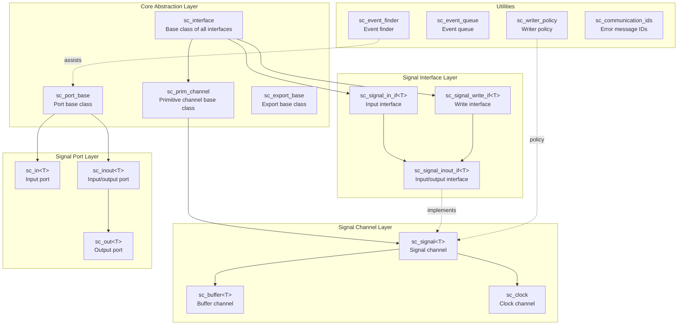
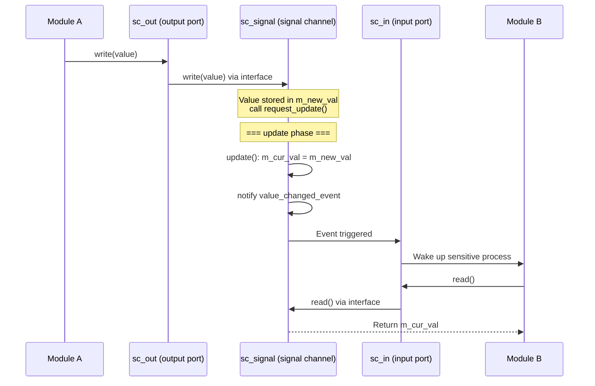
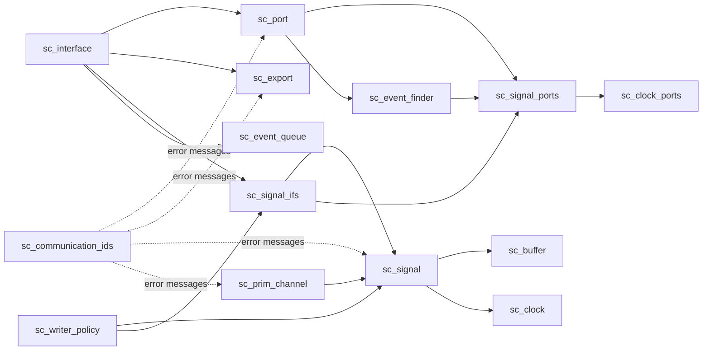

# communication -- SystemC Communication Subsystem

The `communication` subsystem of SystemC defines all the infrastructure for inter-module communication. It implements four core concepts: **Interface**, **Channel**, **Port**, and **Export**, enabling hardware modules to exchange data and events.

## Overview

Think of a city's postal system:
- **Interface** is like the rules for "sending" and "receiving" mail -- defining what operations are possible
- **Channel** is like the actual mailboxes and postboxes -- implementing data storage and delivery
- **Port** is like the mail slot on each building's entrance -- modules access external channels through it
- **Export** is like a "service window" -- letting a module expose its internal interface to the outside

This architecture follows the "separation of interface and implementation" design principle: modules depend only on interface definitions, not on specific channel implementations, achieving loose coupling.

## Architecture Diagram

## Data Flow Diagram

## File List

| File | Description |
|------|-------------|
| [sc_interface.md](sc_interface.md) | Abstract base class of all interface classes |
| [sc_port.md](sc_port.md) | Port base class, entry point for modules to access external channels |
| [sc_export.md](sc_export.md) | Export base class, lets modules expose internal interfaces |
| [sc_prim_channel.md](sc_prim_channel.md) | Abstract base class of primitive channels |
| [sc_signal.md](sc_signal.md) | Generic signal channel `sc_signal<T>` |
| [sc_signal_ifs.md](sc_signal_ifs.md) | Signal-related interface definitions |
| [sc_signal_ports.md](sc_signal_ports.md) | Signal-specific port classes (`sc_in`, `sc_inout`, `sc_out`) |
| [sc_writer_policy.md](sc_writer_policy.md) | Signal writer policy, controls multi-writer behavior |
| [sc_buffer.md](sc_buffer.md) | Buffer channel, triggers event on every write |
| [sc_clock.md](sc_clock.md) | Clock channel, generates periodic boolean signal |
| [sc_clock_ports.md](sc_clock_ports.md) | Type aliases for clock-specific ports |
| [sc_event_finder.md](sc_event_finder.md) | Event finder, defers event resolution until binding completes |
| [sc_event_queue.md](sc_event_queue.md) | Event queue, supports multiple pending notifications |
| [sc_communication_ids.md](sc_communication_ids.md) | Error/warning message IDs for the communication subsystem |

## Dependency Diagram

## Design Philosophy

### Why separate interfaces, channels, and ports?

In real hardware design, wiring and communication protocols are separate concepts. SystemC follows this philosophy:

1. **Interface** defines "what can be done" (e.g., read, write)
2. **Channel** defines "how it's done" (e.g., using two registers to implement delta cycle updates)
3. **Port** defines "where to access" (bridge connecting modules to channels)
4. **Export** defines "what service is provided" (making a sub-module's interface visible externally)

This separation allows different channel implementations for the same interface, and lets modules communicate without knowing the specific channel type.

## Related Directories

- `sysc/kernel/` - Core simulation engine (events, scheduler)
- `sysc/datatypes/` - Data types (`sc_logic`, `sc_bv`, etc.)
- `sysc/tracing/` - Waveform tracing
