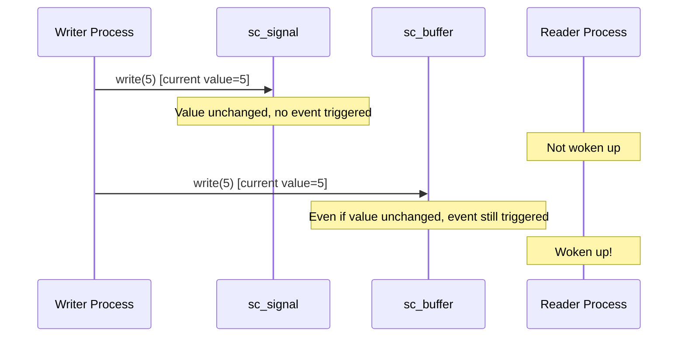

# sc_buffer -- Buffer Channel, Triggers Event on Every Write

## Overview

`sc_buffer<T>` is a subclass of `sc_signal<T>`, with one key difference: **every call to `write()` triggers `value_changed_event()`**, even when the written value is the same as the current value. This is useful for scenarios where you need to detect the "write action" rather than "value change".

**Source file:** `sc_buffer.h` (header-only)

## Everyday Analogy

Comparing `sc_signal` and `sc_buffer`:

- **sc_signal** is like a "doorbell" -- it only rings when there's a **new visitor** at the door (event triggered on value change)
- **sc_buffer** is like a "doorbell logger" -- **every press is recorded**, even if the same person is still standing at the door (event triggered on every write)

## Behavioral Difference



## Class Definition

```cpp
template< typename T, sc_writer_policy POL = SC_DEFAULT_WRITER_POLICY >
class sc_buffer : public sc_signal<T, POL>
{
public:
    typedef sc_buffer<T,POL> this_type;
    typedef sc_signal<T,POL> base_type;

    // constructors
    sc_buffer();
    explicit sc_buffer( const char* name_ );
    sc_buffer( const char* name_, const T& initial_value_ );

    virtual void write( const T& );
    virtual const char* kind() const { return "sc_buffer"; }

protected:
    virtual void update();
};
```

## Key Method Differences

### `write()` - Always Requests Update

```cpp
template< typename T, sc_writer_policy POL >
void sc_buffer<T,POL>::write( const T& value_ )
{
    if( !base_type::policy_type::check_write(this, true) )
        return;

    this->m_new_val = value_;
    this->request_update();  // Always called, does not check if value changed
}
```

Note the second argument passed as `true` (indicating `value_changed`), ensuring the writer policy check treats the value as changed.

### `update()` - Always Performs Update

```cpp
template< typename T, sc_writer_policy POL >
void sc_buffer<T,POL>::update()
{
    base_type::policy_type::update();
    base_type::do_update();  // Always executed, does not check if value changed
}
```

Unlike `sc_signal`'s `update()`, `sc_buffer` skips the "did the value change" check and directly calls `do_update()` to update the value and trigger the event.

## sc_signal vs sc_buffer Comparison

| Property | sc_signal | sc_buffer |
|----------|-----------|-----------|
| write(same_value) | No event triggered | Event triggered |
| write(different_value) | Event triggered | Event triggered |
| request_update condition | On value change | On every write |
| update condition | On value change | Every time |
| Use case | Modeling wires | Modeling registers/FIFO entries |

## Use Cases

1. **Counter triggering**: Every write of the same value should trigger downstream processes
2. **FIFO entry**: Even consecutive writes of the same data are each a valid operation
3. **Event generator**: Using the write action itself as an event source
4. **Hardware register simulation**: Registers "load" a value every clock cycle regardless of whether the value changed

## Design Notes

### Performance Considerations

`sc_buffer` has more update overhead than `sc_signal` because every write enters the update phase. If you don't need to detect "writes of the same value", use `sc_signal` instead.

### RTL Correspondence

- `sc_signal` is more like a `wire` in Verilog -- only value changes produce events
- `sc_buffer` is more like a `reg` with `always @(*)` triggering in Verilog -- every assignment is an event

## Related Files

- `sc_signal.h` - Base class
- `sc_writer_policy.h` - Writer policy definitions
- `sc_prim_channel.h` - Source of the `request_update()` method
