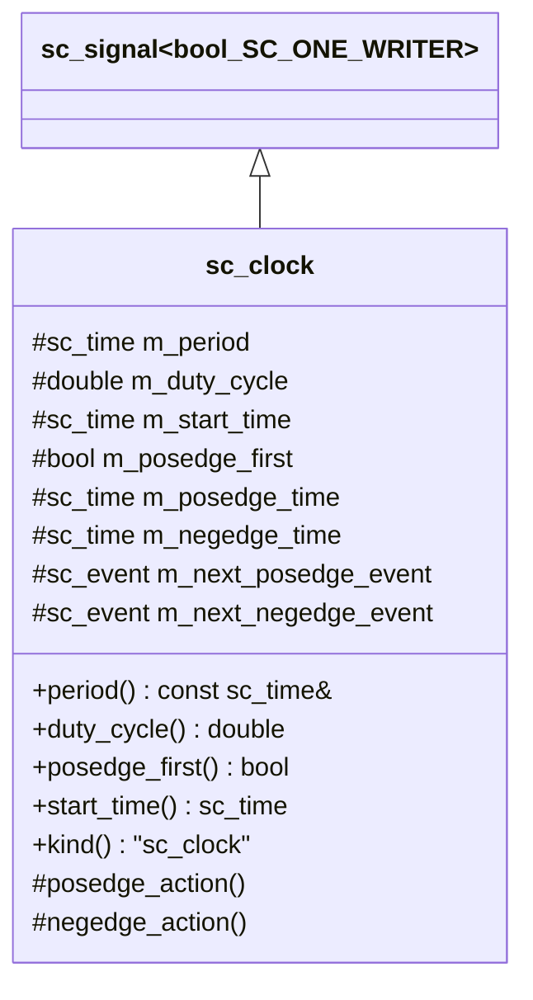
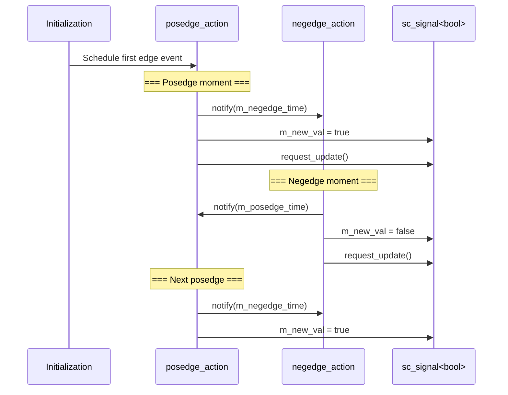

# sc_clock -- Clock Channel

## Overview

`sc_clock` is the clock generator in SystemC, inheriting from `sc_signal<bool, SC_ONE_WRITER>`. It automatically generates a periodic boolean signal that alternates between `true` and `false`, simulating a hardware clock.

**Source files:** `sc_clock.h`, `sc_clock.cpp`

## Everyday Analogy

`sc_clock` is like an automatic "traffic light":
- It switches between "green (true)" and "red (false)" at fixed intervals
- **period** is the time for one complete red-green cycle
- **duty cycle** is the proportion of green time in the whole period (default 0.5 = 50%)
- **start time** is when the first light turns on
- **posedge first** determines whether it starts with green or red

```mermaid
gantt
    title sc_clock timing diagram (period=10, duty=0.5, posedge_first=true)
    dateFormat X
    axisFormat %s

    section clock
    HIGH (true)  : 0, 5
    LOW (false)  : 5, 10
    HIGH (true)  : 10, 15
    LOW (false)  : 15, 20
```



## Class Definition



## Constructors

`sc_clock` provides multiple construction methods:

```cpp
// Most complete version
sc_clock( const char* name_,
          const sc_time& period_,          // period
          double duty_cycle_ = 0.5,        // duty cycle (0~1)
          const sc_time& start_time_ = SC_ZERO_TIME,  // start time
          bool posedge_first_ = true );    // posedge first?

// Using value + unit
sc_clock( const char* name_,
          double period_v_,
          sc_time_unit period_tu_,
          double duty_cycle_ = 0.5 );

// Backward compatible (uses default time unit)
sc_clock( const char* name_,
          double period_,
          double duty_cycle_ = 0.5,
          double start_time_ = 0.0,
          bool posedge_first_ = true );
```

## Clock Generation Mechanism



The core consists of two alternating action methods:

```cpp
void sc_clock::posedge_action()
{
    m_next_negedge_event.notify_internal( m_negedge_time );  // schedule next negedge
    m_new_val = true;
    request_update();
}

void sc_clock::negedge_action()
{
    m_next_posedge_event.notify_internal( m_posedge_time );  // schedule next posedge
    m_new_val = false;
    request_update();
}
```

## Time Calculation

```
period = 10ns, duty_cycle = 0.6

|<---------- period (10ns) ---------->|
|<-- high (6ns) -->|<-- low (4ns) --->|
    posedge_time        negedge_time
     = 4ns                = 6ns

m_posedge_time = period - negedge_time
m_negedge_time = period * duty_cycle
```

## Write Protection

```cpp
virtual void sc_clock::write( const bool& ) {
    // reports error: SC_ID_ATTEMPT_TO_WRITE_TO_CLOCK_
}
```

`sc_clock` overrides `write()` to report an error. Clock signals are generated automatically and do not allow external writes.

## Port Binding Protection

```cpp
virtual void sc_clock::register_port( sc_port_base& port_, const char* if_type ) {
    // checks if port is sc_inout or sc_out, and reports error
    // SC_ID_ATTEMPT_TO_BIND_CLOCK_TO_OUTPUT_
}
```

Clock channels do not allow binding to `sc_inout` or `sc_out` ports, because clock signals can only be read, not written by external modules.

## Design Notes

### `is_clock()` Flag

```cpp
bool is_clock() const { return true; }
```

`sc_signal<bool>` has a virtual method `is_clock()` that returns `false` by default. `sc_clock` overrides it to return `true`, allowing the system to distinguish between ordinary bool signals and clock signals.

### RTL Correspondence

| SystemC | Verilog |
|---------|---------|
| `sc_clock clk("clk", 10, SC_NS)` | `always #5 clk = ~clk;` |
| `period()` | Full period |
| `duty_cycle()` | High-level proportion |
| `posedge_event()` | `@(posedge clk)` |
| `negedge_event()` | `@(negedge clk)` |

### Why use `notify_internal()` instead of `notify()`?

`notify_internal()` is the non-deprecated version of `notify_delayed()` with better performance. Since the clock is a core system component that must schedule two events every clock cycle, using the lighter-weight method is important.

## Related Files

- `sc_signal.h` - Base class `sc_signal<bool>`
- `sc_clock_ports.h` - Type aliases for clock ports
- `sc_signal_ports.h` - `sc_in<bool>` used to connect to clocks
- `sc_communication_ids.h` - Clock-related error messages
