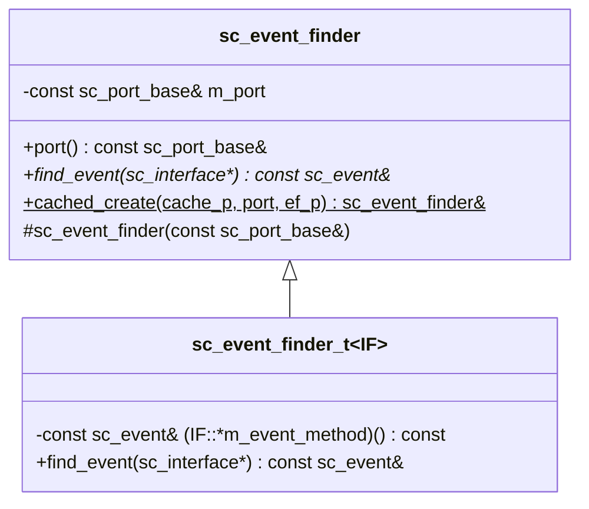
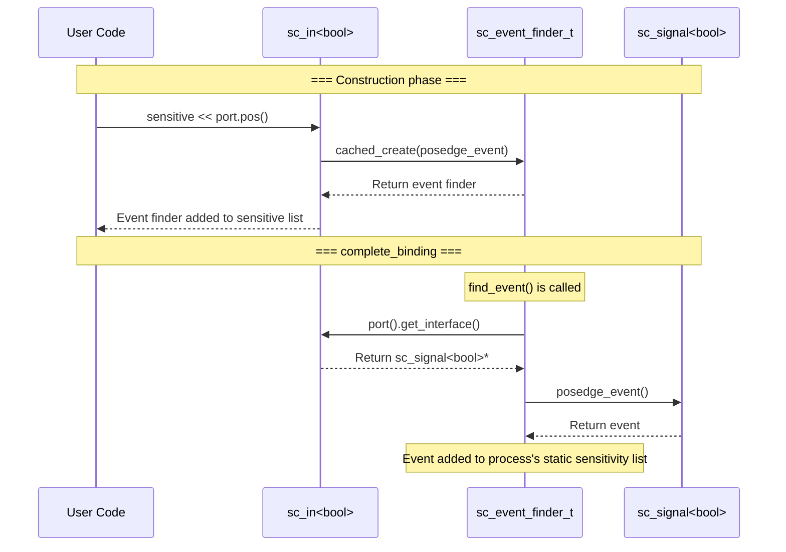

# sc_event_finder -- Event Finder

## Overview

`sc_event_finder` solves a timing problem: when setting up `sensitive` lists during the elaboration phase, ports may not yet be bound to channels, so events cannot be retrieved directly. The event finder acts as a "deferred proxy", recording "which method to call on the interface to get the event", and performs the actual resolution after binding is complete.

**Source files:** `sc_event_finder.h`, `sc_event_finder.cpp`

## Everyday Analogy

Imagine you're subscribing to a newspaper, but it hasn't started delivery yet:
- **Getting event directly** = You go to the mailbox to get the newspaper, but it hasn't been delivered yet (binding not complete)
- **Event finder** = You leave a note "please put the newspaper in my mailbox", and the postman will deliver it when the time comes

The event finder is that "note" -- it records "where" and "what event to find", and actually retrieves the event only when everything is ready.

## Class Hierarchy



## Key Methods

### `find_event()` - Find Event

```cpp
template <class IF>
const sc_event&
sc_event_finder_t<IF>::find_event( sc_interface* if_p ) const
{
    const IF* iface = ( if_p ) ? dynamic_cast<const IF*>( if_p ) :
                                 dynamic_cast<const IF*>( port().get_interface() );
    if( iface == 0 ) {
        report_error( SC_ID_FIND_EVENT_, "port is not bound" );
        return sc_event::none();
    }
    return (const_cast<IF*>( iface )->*m_event_method) ();
}
```

1. If an interface pointer `if_p` is provided, use it
2. Otherwise get the interface from the associated port
3. Call the interface's event method via the function pointer `m_event_method`

### `cached_create()` - Cached Creation

```cpp
template<typename IF>
static sc_event_finder&
sc_event_finder::cached_create( sc_event_finder*& cache_p
                              , const sc_port_base& port_
                              , const sc_event& (IF::*ef_p)() const )
{
    if( !cache_p ) {
        cache_p = new sc_event_finder_t<IF>( port_, ef_p );
    }
    sc_assert( &port_ == &cache_p->port() );
    return *cache_p;
}
```

This is a lazy-creation + caching static factory method. Only one event finder instance is created per event type per port.

## Usage Flow



## Usage in Signal Ports

`sc_in<bool>` uses event finders to implement the `pos()` and `neg()` methods:

```cpp
// in sc_in<bool>
sc_event_finder& pos() const {
    return sc_event_finder::cached_create(
        m_pos_finder_p, *this,
        &in_if_type::posedge_event );
}

sc_event_finder& neg() const {
    return sc_event_finder::cached_create(
        m_neg_finder_p, *this,
        &in_if_type::negedge_event );
}
```

## Design Notes

### Why are event finders needed?

When setting `sensitive << clk.pos()` in `SC_CTOR`, the timeline is:
1. Module constructor executes -> `sensitive` needs events
2. But at this point `clk` may not yet be bound to `sc_clock`
3. So `clk->posedge_event()` cannot be called directly

The event finder records "call `posedge_event()` when the time comes", and actually retrieves the event during `complete_binding()`.

### Caching Strategy

Each port creates only one event finder per event type. For example, `sc_in<bool>` has at most three:
- `m_change_finder_p` - Value change event
- `m_pos_finder_p` - Posedge event
- `m_neg_finder_p` - Negedge event

This avoids redundant memory allocation.

### Member Function Pointer

`sc_event_finder_t<IF>` stores a "pointer to interface member function":

```cpp
const sc_event& (IF::*m_event_method) () const;
```

This is C++ member function pointer syntax, allowing dynamic invocation of the specified event accessor method at runtime.

## Related Files

- `sc_port.h` - Event finders cooperate with ports to complete binding
- `sc_signal_ports.h` - `sc_in<bool>` uses event finders
- `sc_signal_ifs.h` - Interface definitions for event methods (such as `posedge_event()`)
