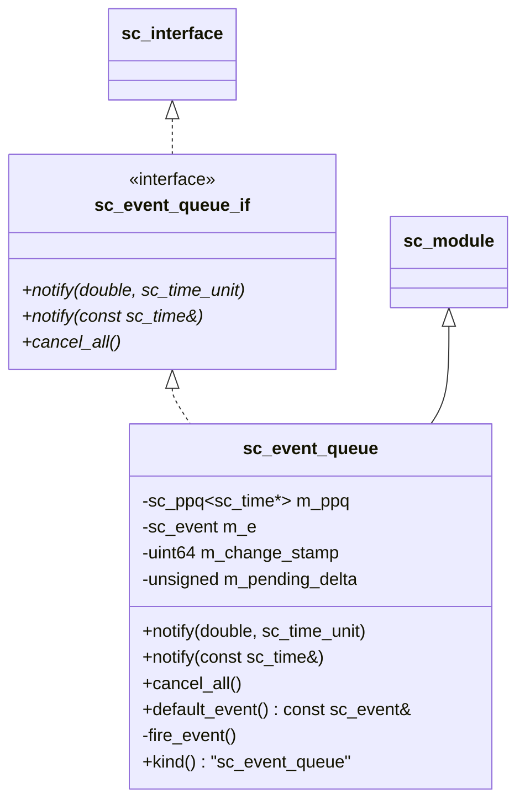
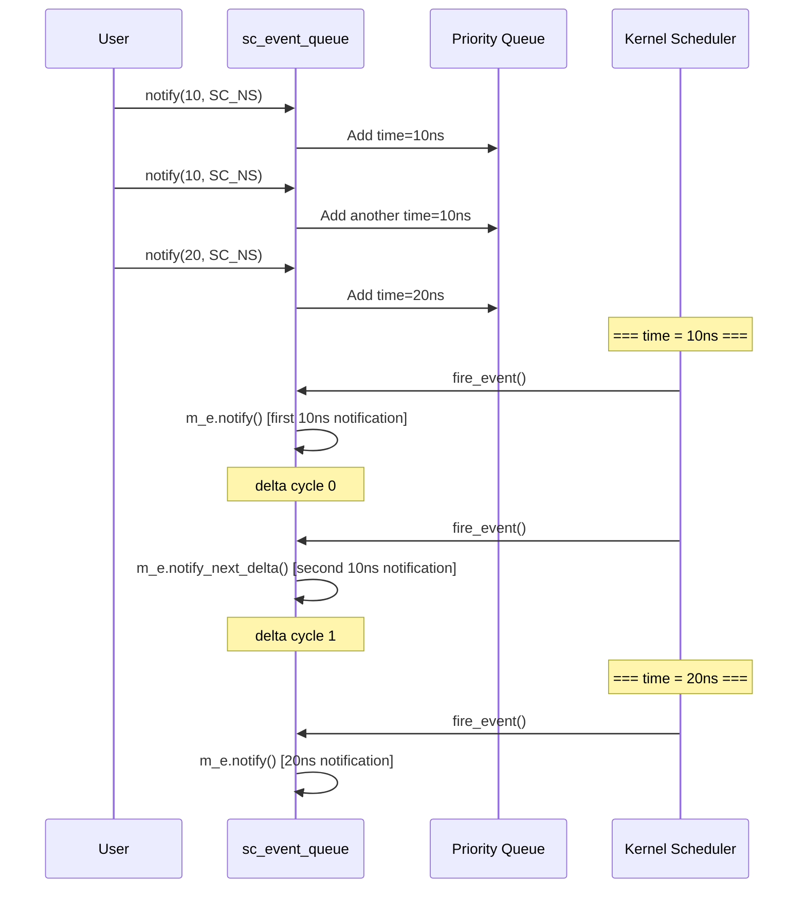

# sc_event_queue -- Event Queue

## Overview

`sc_event_queue` is a queue that can hold multiple pending notifications simultaneously. Unlike a regular `sc_event` (where a later `notify()` overwrites the previous one), `sc_event_queue` guarantees that **each `notify()` call produces a corresponding trigger**.

**Source files:** `sc_event_queue.h`, `sc_event_queue.cpp`

## Everyday Analogy

Comparing `sc_event` and `sc_event_queue`:

- **sc_event** is like "one alarm clock" -- you set three alarms in a row, but each setting overwrites the previous one, so it only rings once
- **sc_event_queue** is like an "alarm schedule" -- you set three alarm times, and all three will ring at their respective times

If multiple notifications are scheduled for the same time point, the event queue will fire them in separate delta cycles, ensuring each notification is seen by the process.

## Class Structure



## Key Methods

### `notify()` - Schedule Notification

```cpp
virtual void notify(const sc_time& when);

inline void notify(double when, sc_time_unit base)
{
    notify( sc_time(when, base) );
}
```

Adds a new notification to the queue. The notification will fire after `when` time.

### `cancel_all()` - Cancel All Pending Notifications

Clears all notifications in the queue that have not yet fired.

### `default_event()` - Get Trigger Event

```cpp
const sc_event& default_event() const
{
    return m_e;
}
```

Returns the queue's internal event. Processes can listen to the queue's triggers via `sensitive << event_queue.default_event()`.

## Internal Mechanism



### Multiple Notifications at the Same Time

When multiple notifications are scheduled for the same simulation time, the event queue uses delta cycles to distinguish them:
- The first notification fires immediately
- Subsequent notifications fire in the next delta cycle
- This ensures each `notify()` is detected by sensitive processes

## As a Hierarchical Channel

`sc_event_queue` inherits from `sc_module` (not `sc_prim_channel`) because it uses an internal process (`fire_event`) to implement the triggering logic. This makes it a "hierarchical channel" rather than a "primitive channel".

## Port Type

```cpp
typedef sc_port<sc_event_queue_if, 1, SC_ONE_OR_MORE_BOUND> sc_event_queue_port;
```

Provides a convenient port type alias, allowing modules to connect to event queues through ports.

## Use Cases

1. **Interrupt controller**: Multiple interrupt sources may fire simultaneously, each needing to be handled
2. **DMA controller**: Multiple transfer requests scheduled at different times
3. **Network simulation**: Scheduling of multiple packet arrival events
4. **Testbench**: Time-scheduled stimulus signals

## Design Notes

### sc_event vs sc_event_queue

| Property | sc_event | sc_event_queue |
|----------|----------|----------------|
| Multiple notify at same time | Only one kept | Each one kept |
| cancel | Cancels the most recent one | Cancels all |
| Inherits from | Standalone class | sc_module |
| Performance | Faster | Queue overhead |

### Why use a priority queue?

Notifications may be added in arbitrary order but must fire in chronological order. The priority queue (`sc_ppq`) automatically maintains time ordering.

## Related Files

- `sc_interface.h` - `sc_event_queue_if` inherits from `sc_interface`
- `sc_port.h` - `sc_event_queue_port` uses `sc_port`
- `sc_event.h` - Internally uses `sc_event` to trigger
