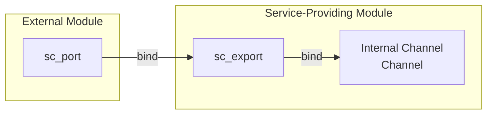
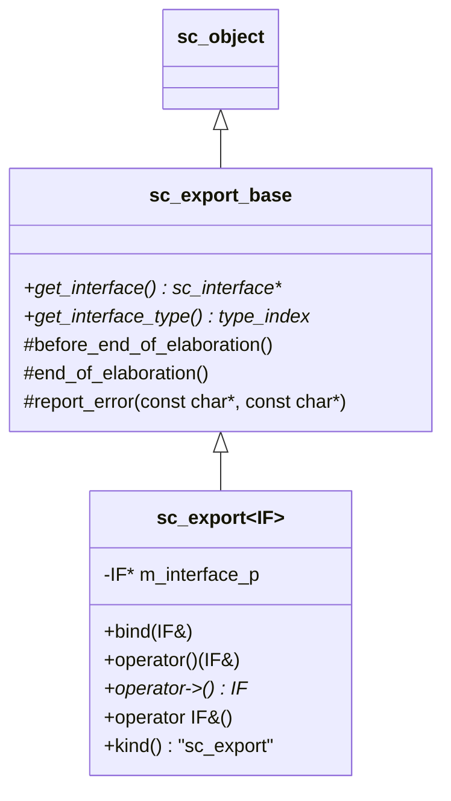
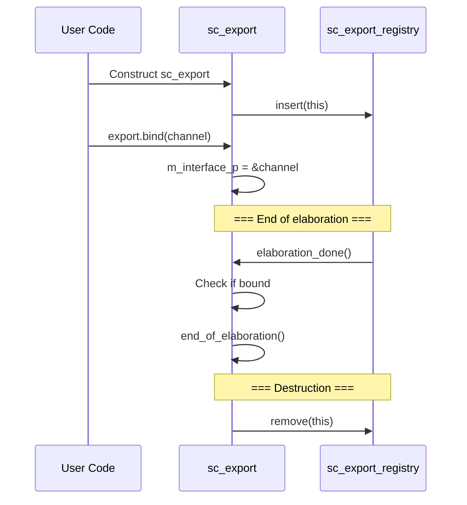

# sc_export -- Export Base Class, Lets Modules Expose Internal Interfaces

## Overview

`sc_export` allows a module to expose its internal interface (typically provided by an internal channel) to the outside. This is the opposite direction of `sc_port`: a port "seeks an interface externally", while an export "provides an interface externally".

**Source files:** `sc_export.h`, `sc_export.cpp`

## Everyday Analogy

Think of a building:
- **sc_port** is like "a plug extending from an office", needing to find an external power source
- **sc_export** is like "a service window on the building's exterior wall", letting people outside use the services inside

For example, a "bank module" has an internal "account access channel", and through `sc_export`, an external "ATM module" can connect to this service window via its port.



## Class Hierarchy



## Key Method Descriptions

### `bind()` - Bind Interface

```cpp
virtual void bind( IF& interface_ )
{
    if ( m_interface_p )
    {
        SC_REPORT_ERROR(SC_ID_SC_EXPORT_ALREADY_BOUND_, name());
        return;
    }
    m_interface_p = &interface_;
}
```

An `sc_export` can only be bound once. Unlike `sc_port`, `sc_export` binds to a **local interface implementation** (typically an internal channel), not an external channel.

### `operator->()` - Access Interface

```cpp
IF* operator -> () {
    if ( m_interface_p == 0 )
    {
        SC_REPORT_ERROR(SC_ID_SC_EXPORT_HAS_NO_INTERFACE_, name());
    }
    return m_interface_p;
}
```

Similar to `sc_port`, you can call interface methods directly through `->`.

### `operator IF&()` - Implicit Conversion

`sc_export` can be implicitly converted to a reference of its interface type. This allows `sc_port` to bind directly to `sc_export`, because `sc_export` looks like an interface.

## Lifecycle



## Conceptual Usage Example

```cpp
// Producer module with an export
SC_MODULE(Producer) {
    sc_export<sc_signal_inout_if<int>> data_export;
    sc_signal<int> internal_signal;

    SC_CTOR(Producer) {
        data_export.bind(internal_signal); // expose internal signal
    }
};

// Consumer module with a port
SC_MODULE(Consumer) {
    sc_port<sc_signal_in_if<int>> data_port;
    // ...
};

// Top-level binding
Producer prod("prod");
Consumer cons("cons");
cons.data_port.bind(prod.data_export); // port binds to export
```

## sc_export_registry

An internal management class held by `sc_simcontext`, responsible for tracking all `sc_export` instances and triggering callbacks at appropriate times. At the end of elaboration, it checks that all `sc_export` instances are bound to an interface.

## Design Notes

### Port vs Export

| Property | sc_port | sc_export |
|----------|---------|-----------|
| Direction | Seeks interface externally | Provides interface externally |
| Bind target | External channel or parent port | Internal channel |
| Multi-binding | Yes (depending on N value) | No (can only bind once) |
| Hierarchical traversal | Can connect to parent port | External ports can bind directly |

### RTL Connection

In RTL, module inputs/outputs are defined through port lists. `sc_export` is more of a concept introduced by SystemC for transaction-level modeling (TLM), allowing complex modules to expose multiple service interfaces beyond just signal-level connections.

## Related Files

- `sc_interface.h` - Base class of the interface exposed by `sc_export`
- `sc_port.h` - Ports can bind to exports
- `sc_communication_ids.h` - Related error message IDs
