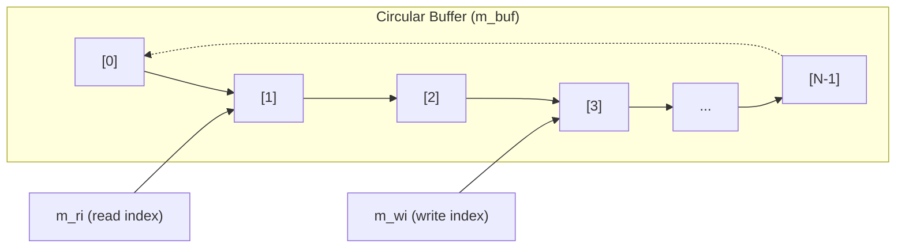
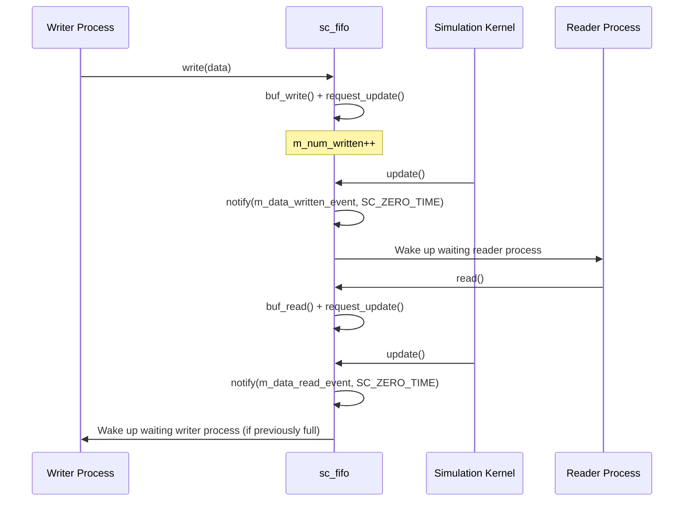

# sc_fifo.h - Complete Implementation of the FIFO Channel

## Overview

`sc_fifo` is the FIFO (First-In, First-Out) primitive channel class in SystemC. It provides a fixed-size buffer that lets a producer module write data and a consumer module read data, automatically handling full/empty blocking and synchronization.

This file exists because hardware design frequently requires a data queue between two modules, allowing the producer and consumer to operate at different rates, and FIFO is the most basic decoupling mechanism.

## Core Concept / Everyday Analogy

### Queuing at a Cafeteria Window

Imagine a school cafeteria's serving counter:

- The **kitchen** (producer) places finished trays on the serving counter
- **Students** (consumers) take trays from the other end of the counter
- The counter can only hold **16 trays** (default size)
- When the counter is full, the kitchen must **wait** (blocking write)
- When the counter is empty, students must **wait** (blocking read)
- Trays placed first are always taken first (first-in, first-out)

```
Kitchen --write--> [tray1][tray2][tray3]...[trayN] --read--> Student
                   ^                                ^
                   wi (write index)                  ri (read index)
```

### Circular Buffer

The underlying implementation uses a **circular buffer**. Like a conveyor belt sushi restaurant, the write and read pointers wrap around the circular array, avoiding data movement.



## Detailed Class Description

### `sc_fifo<T>` Template Class

```cpp
template <class T>
class sc_fifo
: public sc_fifo_in_if<T>,
  public sc_fifo_out_if<T>,
  public sc_prim_channel
```

Implements both input and output interfaces, and inherits from primitive channel to gain the `update()` and `request_update()` mechanism.

### Constructors

| Constructor | Description |
|-------------|-------------|
| `sc_fifo(int size_ = 16)` | Create FIFO of size `size_`, auto-named |
| `sc_fifo(const char* name_, int size_ = 16)` | Create named FIFO |

The default size of 16 is a common engineering convention, sufficient for most pipeline scenarios.

### Blocking Read / Write

```cpp
void read(T& val_);
T read();
void write(const T& val_);
```

- `read()`: If the FIFO is empty, the process **blocks** (calls `wait(m_data_written_event)`) until new data is written
- `write()`: If the FIFO is full, the process **blocks** (calls `wait(m_data_read_event)`) until data is read out

### Non-Blocking Read / Write

```cpp
bool nb_read(T& val_);
bool nb_write(const T& val_);
```

- If the operation cannot complete immediately, returns `false` without blocking
- On success returns `true` and calls `request_update()` to schedule an update

### Query Methods

| Method | Description |
|--------|-------------|
| `num_available()` | Returns number of readable samples (`m_num_readable - m_num_read`) |
| `num_free()` | Returns number of writable slots (`m_size - m_num_readable - m_num_written`) |
| `data_written_event()` | Event triggered when data is written (reader side can use to listen) |
| `data_read_event()` | Event triggered when data is read (writer side can use to listen) |

### Connection Rules: Single Reader, Single Writer

```cpp
void register_port(sc_port_base&, const char*);
```

FIFO enforces **only one reader and one writer**. `register_port` uses RTTI to check the bound interface type, reporting an error if a second reader or writer is detected.

### update() Mechanism

```cpp
void update();
```

Called during the delta cycle's update phase:
1. If read operations occurred, notify `m_data_read_event` (using `SC_ZERO_TIME` delayed notification)
2. If write operations occurred, notify `m_data_written_event`
3. Reset counters

This ensures event notifications happen at the correct time, not at the moment of read/write.

### Internal Circular Buffer Operations

| Method | Description |
|--------|-------------|
| `buf_init(int)` | Allocate array, initialize indices |
| `buf_write(const T&)` | Write to `m_buf[m_wi]`, advance `m_wi`, decrease `m_free` |
| `buf_read(T&)` | Read from `m_buf[m_ri]`, clear slot (supports shared_ptr), advance `m_ri`, increase `m_free` |

Index advancement uses `(index + 1) % m_size` to implement the circular behavior.

### Member Variables

| Variable | Type | Description |
|----------|------|-------------|
| `m_size` | `int` | Buffer size |
| `m_buf` | `T*` | Dynamically allocated array |
| `m_free` | `int` | Number of free slots |
| `m_ri` | `int` | Next read position |
| `m_wi` | `int` | Next write position |
| `m_reader` | `sc_port_base*` | Connected reader (design rule check) |
| `m_writer` | `sc_port_base*` | Connected writer (design rule check) |
| `m_num_readable` | `int` | Number of readable samples |
| `m_num_read` | `int` | Number read in this delta cycle |
| `m_num_written` | `int` | Number written in this delta cycle |

## Design Rationale / RTL Background

In RTL design, FIFO is the most common component for cross-clock-domain or pipeline decoupling. SystemC's `sc_fifo` simulates synchronous FIFO behavior:

- **Single reader, single writer** restriction: corresponds to hardware FIFOs typically having one read port and one write port
- **request_update / update separation**: corresponds to writes taking effect at clock edges in hardware, not instantly visible
- **SC_ZERO_TIME notification**: ensures events propagate in the next delta cycle, simulating register delay



## Related Files

- `sc_fifo_ifs.h` - FIFO input/output interface definitions
- `sc_fifo_ports.h` - FIFO-specific port classes
- `sc_prim_channel.h` - Primitive channel base class (provides update mechanism)
- `sc_communication_ids.h` - Communication error message IDs
