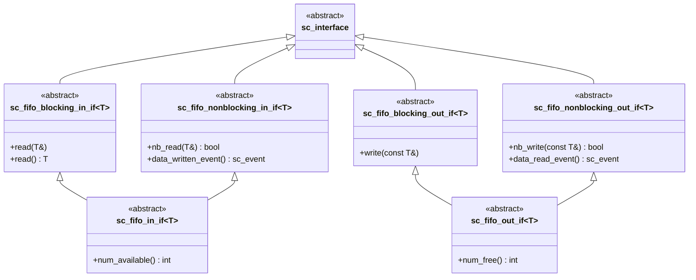

# sc_fifo_ifs.h - FIFO Channel Interface Definitions

## Overview

This file defines all abstract interface classes for the `sc_fifo` channel. It separates FIFO read and write operations into blocking and non-blocking versions, allowing users to use only the parts they need.

These interfaces exist for **decoupling**: modules only need to know "I can read data from here" or "I can write data here", without needing to know whether the implementation behind is `sc_fifo` or something else.

## Core Concept / Everyday Analogy

### Different Service Windows at a Restaurant

Imagine a restaurant with different service windows:

- **Blocking window** (`blocking`): You queue up and wait until food is available. Nothing available? Just stand and wait
- **Non-blocking window** (`nonblocking`): You ask if food is available. If not, you leave without waiting
- **Full service window** (`in_if` / `out_if`): Both types of windows, plus you can ask "how many servings are left"

## Interface Inheritance Hierarchy



## Detailed Interface Descriptions

### `sc_fifo_blocking_in_if<T>` - Blocking Read Interface

```cpp
virtual void read(T&) = 0;
virtual T read() = 0;
```

Two versions: one writes the result into a reference, the other returns the value directly. If the FIFO is empty when called, the process will suspend until data is available.

### `sc_fifo_nonblocking_in_if<T>` - Non-Blocking Read Interface

```cpp
virtual bool nb_read(T&) = 0;
virtual const sc_event& data_written_event() const = 0;
```

- `nb_read`: Attempts to read; returns `true` on success, `false` on failure
- `data_written_event`: Returns the "new data was written" event, allowing you to `wait()` on it yourself

### `sc_fifo_in_if<T>` - Complete Input Interface

Combines the blocking and non-blocking interfaces, plus:

```cpp
virtual int num_available() const = 0;
```

Queries how many data items are currently available to read. Copy and assignment are disabled.

### `sc_fifo_blocking_out_if<T>` - Blocking Write Interface

```cpp
virtual void write(const T&) = 0;
```

If the FIFO is full, the process will suspend until a slot is available.

### `sc_fifo_nonblocking_out_if<T>` - Non-Blocking Write Interface

```cpp
virtual bool nb_write(const T&) = 0;
virtual const sc_event& data_read_event() const = 0;
```

- `nb_write`: Attempts to write; returns `true` on success
- `data_read_event`: The "data was read out" event

### `sc_fifo_out_if<T>` - Complete Output Interface

Combines the blocking and non-blocking interfaces, plus:

```cpp
virtual int num_free() const = 0;
```

Queries how many free slots are currently available for writing.

## Design Rationale

### Why separate blocking and non-blocking?

This improvement was added in 2004 by Bishnupriya Bhattacharye of Cadence. The benefits of separation:

1. **Fine-grained interface binding**: If a module only needs non-blocking operations, its port can bind only to `sc_fifo_nonblocking_in_if`
2. **Interface Segregation Principle (ISP)**: Does not force users to implement methods they don't need
3. **Backward compatibility**: The complete interface `sc_fifo_in_if` inherits both, so legacy code is unaffected

### Virtual Inheritance

All interfaces use `virtual public sc_interface` inheritance to avoid multiple `sc_interface` copies in diamond inheritance scenarios.

## Related Files

- `sc_fifo.h` - FIFO channel implementation
- `sc_fifo_ports.h` - FIFO-specific port classes
- `sc_interface.h` - Base class of all interfaces
