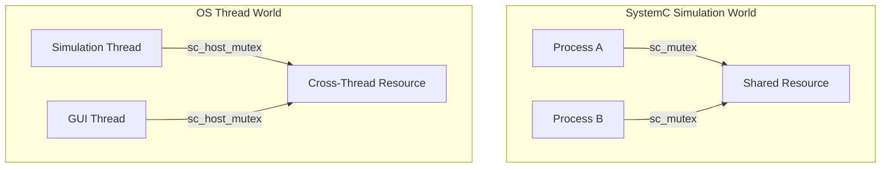

# sc_host_mutex.h - OS-Level Mutex Wrapper

## Overview

`sc_host_mutex` is a class that wraps a real operating system mutex (`std::mutex`), implementing the `sc_mutex_if` interface. Unlike `sc_mutex` (which operates within the SystemC simulation environment), `sc_host_mutex` uses **real OS thread synchronization mechanisms**, suitable for synchronization between the SystemC simulation kernel and external threads.

## Core Concept / Everyday Analogy

### Two Types of Locks

- **sc_mutex** (simulation mutex): Like a lock in a game. Game characters (SystemC processes) take turns using it, scheduled by the game engine (simulation kernel), with only one character moving at a time
- **sc_host_mutex** (real mutex): Like a real-world lock. Multiple people (OS threads) may try to open the door simultaneously, requiring hardware-level synchronization

### When is a real lock needed?

When your SystemC simulation needs to interact with external systems:
- External GUI thread updating visualization
- External hardware interface (HW-in-the-loop)
- async_request_update() for cross-thread notification

## Detailed Class Description

### `sc_host_mutex` Class

```cpp
class sc_host_mutex : public sc_mutex_if
{
public:
    sc_host_mutex() = default;
    virtual ~sc_host_mutex() = default;

    virtual int lock()    { m_mtx.lock(); return 0; }
    virtual int trylock() { return m_mtx.try_lock() ? 0 : -1; }
    virtual int unlock()  { m_mtx.unlock(); return 0; }

private:
    std::mutex m_mtx;
};
```

An extremely simple wrapper that directly forwards to `std::mutex`.

### Method Correspondence

| `sc_host_mutex` | `std::mutex` | Description |
|-----------------|-------------|-------------|
| `lock()` | `m_mtx.lock()` | Block until lock is acquired |
| `trylock()` | `m_mtx.try_lock()` | Try to acquire lock, returns -1 on failure |
| `unlock()` | `m_mtx.unlock()` | Unlock |

### Limitations

The source code comment mentions: `unlock()` should return -1 when called by a non-owner, but currently **this cannot be checked**. This is because `std::mutex` itself does not track owner information (unlike `sc_mutex` which has `m_owner`).

## Comparison with `sc_mutex`

| Property | `sc_mutex` | `sc_host_mutex` |
|----------|-----------|-----------------|
| Inheritance | `sc_mutex_if` + `sc_object` | `sc_mutex_if` |
| Underlying mechanism | `sc_event` + `wait()` | `std::mutex` |
| Use case | Synchronization between SystemC processes | Synchronization between OS threads |
| Owner tracking | Yes (`m_owner`) | No |
| Reentrant | Yes | No (`std::mutex` is not reentrant) |
| Naming | Yes (inherits `sc_object`) | No |
| Blocking method | Simulation kernel scheduling | OS thread blocking |



## Design Rationale

### Why not just use `std::mutex`?

By implementing `sc_mutex_if`, `sc_host_mutex` can be used anywhere `sc_mutex_if` is expected. For example, `sc_scoped_lock` works with both `sc_mutex` and `sc_host_mutex` without code changes.

### Platform Compatibility

The file includes MSVC DLL warning suppression (`#pragma warning(push/pop)`) because `std::mutex` as a private member in a DLL-exported class generates warnings.

## Related Files

- `sc_mutex_if.h` - Mutex interface (includes `sc_scoped_lock`)
- `sc_mutex.h` - Mutex for the simulation environment
- `sc_host_semaphore.h` - OS-level semaphore wrapper
