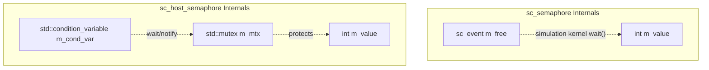

# sc_host_semaphore.h - OS-Level Semaphore Wrapper

## Overview

`sc_host_semaphore` is a class that wraps a real operating system semaphore, implemented using `std::mutex` and `std::condition_variable`, implementing the `sc_semaphore_if` interface. Unlike `sc_semaphore` (which operates within the SystemC simulation environment), it uses **real OS thread synchronization mechanisms**.

## Core Concept / Everyday Analogy

### Two Types of Parking Lot Management

- **sc_semaphore** (simulation semaphore): Like a parking lot in a game, managed by the game engine, with only one car moving at a time
- **sc_host_semaphore** (real semaphore): Like a real-world parking lot, where multiple cars may arrive simultaneously, requiring actual gates and sensors

## Detailed Class Description

### `sc_host_semaphore` Class

```cpp
class sc_host_semaphore : public sc_semaphore_if
{
public:
    explicit sc_host_semaphore(int init = 0);
    virtual ~sc_host_semaphore() = default;

    virtual int wait();
    virtual int trywait();
    virtual int post();
    virtual int get_value() const;

private:
    std::mutex m_mtx;
    std::condition_variable m_cond_var;
    int m_value = 0;
};
```

### Method Implementations

#### `wait()` - Blocking Acquire

```cpp
virtual int wait()
{
    std::unique_lock lock(m_mtx);
    while (m_value <= 0) {
        m_cond_var.wait(lock);
    }
    --m_value;
    return 0;
}
```

Uses the classic `std::condition_variable` wait pattern:
1. Acquire the mutex lock
2. Check the condition in a loop (`m_value > 0`); if not satisfied, wait
3. After condition is met, decrement the count

The `while` loop (instead of `if`) is to guard against **spurious wakeups**, which is standard practice in OS thread synchronization.

#### `trywait()` - Try to Acquire

```cpp
virtual int trywait()
{
    std::unique_lock lock(m_mtx);
    if (m_value <= 0) return -1;
    --m_value;
    return 0;
}
```

Does not wait; directly checks and returns the result.

#### `post()` - Release

```cpp
virtual int post()
{
    std::unique_lock lock(m_mtx);
    ++m_value;
    m_cond_var.notify_one();
    return 0;
}
```

Increments the count and notifies one waiting thread.

#### `get_value()` - Query

```cpp
virtual int get_value() const { return m_value; }
```

Note: This method does not acquire a lock, and the returned value may be stale immediately after reading. This is acceptable in multi-threaded environments since the precise value is typically only used for debugging or logging.

### Member Variables

| Variable | Type | Description |
|----------|------|-------------|
| `m_mtx` | `std::mutex` | Mutex protecting `m_value` |
| `m_cond_var` | `std::condition_variable` | Condition variable for blocking waits |
| `m_value` | `int` | Semaphore count value |

## Comparison with `sc_semaphore`

| Property | `sc_semaphore` | `sc_host_semaphore` |
|----------|---------------|---------------------|
| Inheritance | `sc_semaphore_if` + `sc_object` | `sc_semaphore_if` |
| Underlying mechanism | `sc_event` + `wait()` | `std::mutex` + `std::condition_variable` |
| Use case | Synchronization between SystemC processes | Synchronization between OS threads |
| Naming | Yes (inherits `sc_object`) | No |
| Default initial value | Must be specified | 0 |
| Blocking method | Simulation kernel scheduling | OS thread blocking |



## Design Rationale

### Why use mutex + condition_variable instead of an OS semaphore?

The C++ standard library (up to C++20) does not have `std::semaphore` (C++20 added `std::counting_semaphore`). Using `std::mutex` + `std::condition_variable` is the most portable approach.

### Default Initial Value of 0

Unlike `sc_semaphore` (which must be explicitly specified), `sc_host_semaphore` defaults to initial value 0. This means if you create a `sc_host_semaphore` without specifying an initial value, the first thread calling `wait()` will block until someone calls `post()`. This pattern is common in "producer-consumer" initialization.

## Related Files

- `sc_semaphore_if.h` - Semaphore interface definition
- `sc_semaphore.h` / `.cpp` - Semaphore for the simulation environment
- `sc_host_mutex.h` - OS-level mutex wrapper
