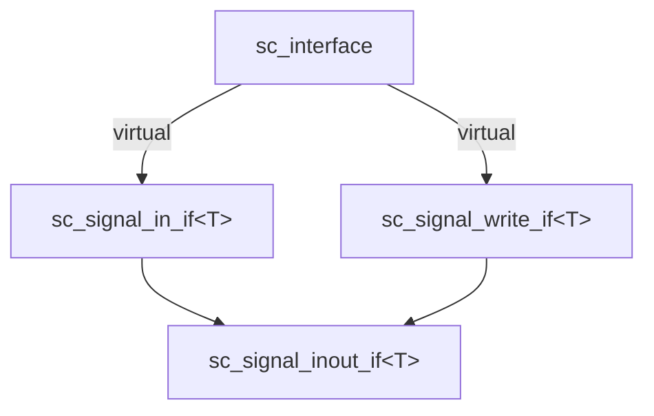

# sc_interface -- Abstract Base Class of All Interface Classes

## Overview

`sc_interface` is the topmost abstract class in the SystemC communication architecture. All interfaces (such as `sc_signal_in_if`, `sc_signal_write_if`) must virtually inherit from this class. It defines the most basic contract for an interface: the ability to provide a default event and register ports.

**Source files:** `sc_interface.h`, `sc_interface.cpp`

## Everyday Analogy

Think of `sc_interface` as a "service contract template". Just like all contracts must have "signing date" and "terms of service" as basic fields, all SystemC interfaces must be able to:
1. Provide a "default event" (letting listeners know when something changes)
2. Allow "ports to register" (letting users declare they want to use this service)

## Class Definition

```cpp
class sc_interface
{
public:
    // Register a port to this interface (default does nothing)
    virtual void register_port( sc_port_base& port_, const char* if_typename_ );

    // Get the default event
    virtual const sc_event& default_event() const;

    // Destructor
    virtual ~sc_interface();

protected:
    // Constructor (protected, cannot be instantiated directly)
    sc_interface();

private:
    // Copy disabled
    sc_interface( const sc_interface& );
    sc_interface& operator = ( const sc_interface& );
};
```

## Key Method Descriptions

### `register_port()`

Called by the system when a port is bound to a channel implementing this interface. The default implementation does nothing.

Actual channels (like `sc_signal`) override this method for additional checks, such as ensuring only one output port is bound to the same signal (writer check).

### `default_event()`

Returns the "default event" of this interface. When you use the `sensitive << port` syntax to set a process's sensitivity list, the system calls this method to find the event to listen to.

The default implementation issues a warning `SC_ID_NO_DEFAULT_EVENT_` and returns `sc_event::none()`, because not all interfaces have a default event.

## Design Notes

### Why must virtual inheritance be used?

The source code comments emphasize: **direct inheritance from `sc_interface` must use `virtual` inheritance**.

This is because `sc_signal_inout_if<T>` inherits from both `sc_signal_in_if<T>` and `sc_signal_write_if<T>`, and both of those inherit from `sc_interface`. Without virtual inheritance, there would be a "diamond inheritance problem", resulting in two copies of `sc_interface` in one object.



### Why is copying disabled?

An interface represents a "service endpoint", just like a phone number cannot be copied to another phone for use. Copying an interface would cause identity confusion, so both the copy constructor and assignment operator are placed in the `private` section to disable them.

## RTL Connection

In RTL hardware design, there is no explicit "interface" concept. Wires directly connect modules. `sc_interface` is a concept SystemC borrowed from software engineering (particularly Java's interface concept), aimed at supporting flexible module interconnection at higher abstraction levels.

## Related Files

- `sc_port.h` - Ports bind to channels implementing `sc_interface`
- `sc_export.h` - Exports expose objects implementing `sc_interface`
- `sc_prim_channel.h` - Primitive channels typically implement a sub-interface of `sc_interface`
- `sc_communication_ids.h` - Defines error messages like `SC_ID_NO_DEFAULT_EVENT_`
