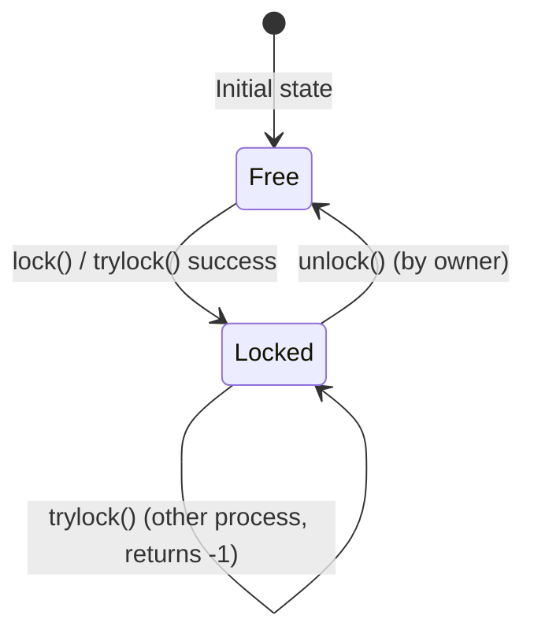
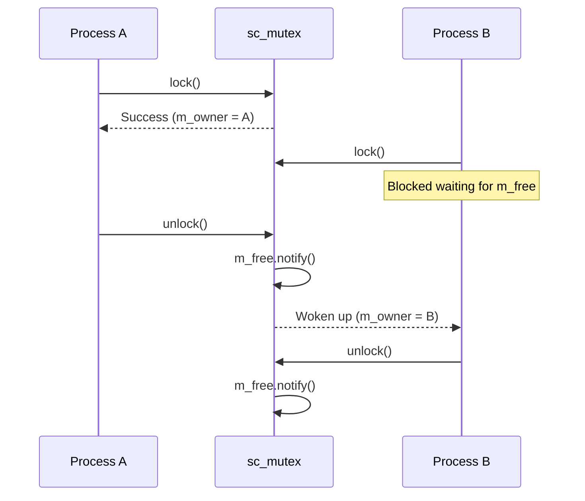

# sc_mutex.h / .cpp - Mutex Primitive Channel

## Overview

`sc_mutex` is the mutex primitive channel in SystemC, used to protect shared resources and ensure only one process can access the resource at a time. It implements the `sc_mutex_if` interface, providing the three classic operations: `lock()`, `trylock()`, `unlock()`.

## Core Concept / Everyday Analogy

### A Bathroom Lock

Imagine a bathroom with only one stall:

- **lock()**: You want to enter. If someone is inside (locked), you **queue up and wait**. When the person inside leaves, you enter and lock the door
- **trylock()**: You glance at the sign on the door. If "occupied", you **leave immediately** (return -1). If "vacant", you enter and lock the door
- **unlock()**: You're done, open the door and leave. If someone is waiting outside, they can now enter
- Important rule: Only the person who locked the door can open it! Others cannot unlock for you (`unlock` checks `m_owner`)



## Detailed Class Description

### `sc_mutex` Class

```cpp
class sc_mutex
: public sc_mutex_if,
  public sc_object
```

Note it inherits `sc_object` rather than `sc_prim_channel`. This is because mutex does not need the `update()` / `request_update()` mechanism; its state changes take effect immediately.

### Constructors

```cpp
sc_mutex();                        // Auto-named "mutex_0", "mutex_1", ...
sc_mutex(const char* name_);       // Named
```

Both initialize `m_owner` to `0` (no owner) and mark the `m_free` event as a kernel event.

### Interface Methods

#### `lock()` - Blocking Lock

```cpp
int sc_mutex::lock()
{
    if (m_owner == sc_get_current_process_b()) return 0;
    while (in_use()) {
        sc_core::wait(m_free, sc_get_curr_simcontext());
    }
    m_owner = sc_get_current_process_b();
    return 0;
}
```

Key behaviors:
- If **already the owner**, returns 0 immediately (reentrant)
- If occupied by another process, blocks via `wait(m_free)`, waiting for the `m_free` event
- When lock is acquired, sets `m_owner` to the current process

#### `trylock()` - Try to Lock

```cpp
int sc_mutex::trylock()
{
    if (m_owner == sc_get_current_process_b()) return 0;
    if (in_use()) return -1;
    m_owner = sc_get_current_process_b();
    return 0;
}
```

Same as `lock()` but non-blocking. Returns -1 if the lock cannot be acquired.

#### `unlock()` - Unlock

```cpp
int sc_mutex::unlock()
{
    if (m_owner != sc_get_current_process_b()) return -1;
    m_owner = 0;
    m_free.notify();
    return 0;
}
```

- Only the owner can unlock; otherwise returns -1
- After unlocking, immediately notifies the `m_free` event (using immediate notification), waking up waiting processes

### Member Variables

| Variable | Type | Description |
|----------|------|-------------|
| `m_owner` | `sc_process_b*` | Pointer to the process currently holding the lock, `0` means no one |
| `m_free` | `sc_event` | Event triggered when the lock is released |

### Helper Method

```cpp
bool in_use() const { return (m_owner != 0); }
```

## Design Rationale / RTL Background

### Why inherit `sc_object` instead of `sc_prim_channel`?

This change was made in SystemC 2.3. `sc_prim_channel` provides the `update()` mechanism designed to simulate hardware "write delay" (values take effect in the next delta cycle). But mutex does not need this behavior -- locking/unlocking should take effect **immediately**, so it only needs to inherit `sc_object` for naming capability.

### Immediate vs Delayed Notification

`m_free.notify()` uses **immediate notification** (no arguments), not `notify(SC_ZERO_TIME)`. This means waiting processes can be woken up in the same delta cycle, avoiding unnecessary delay.

### Reentrant Design

Both `lock()` and `trylock()` allow the owner to acquire the lock repeatedly without deadlocking. This is practical in hardware simulation because the same process may access the same shared resource through different call paths.



## Related Files

- `sc_mutex_if.h` - Mutex interface definition (includes `sc_scoped_lock`)
- `sc_host_mutex.h` - OS-level mutex wrapper
- `sc_semaphore.h` - Semaphore (allows multiple processes to access simultaneously)
