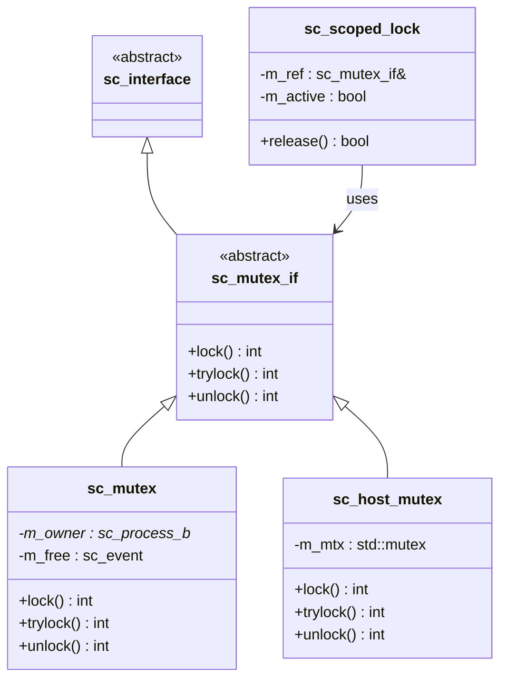

# sc_mutex_if.h - Mutex Interface and RAII Lock Guard

## Overview

This file defines two classes:
1. `sc_mutex_if` - Abstract interface for mutex, declaring the three classic operations: `lock()`, `trylock()`, `unlock()`
2. `sc_scoped_lock` - RAII-style automatic lock/unlock utility class

## Core Concept / Everyday Analogy

### Keys and Smart Locks

- **sc_mutex_if** is like an "operating specification" for a lock: any lock conforming to the specification can be operated the same way (turn, try, unlock)
- **sc_scoped_lock** is like a "smart door lock": it locks automatically when you enter the room, and unlocks automatically when you leave the room (leave the scope). Even if you forget to manually unlock, the door opens automatically

### RAII Pattern

RAII (Resource Acquisition Is Initialization) is a classic C++ pattern:
- Constructor acquires the resource (lock)
- Destructor releases the resource (unlock)
- Even if an exception occurs, unlocking is never forgotten

## Detailed Class Descriptions

### `sc_mutex_if` - Abstract Interface

```cpp
class sc_mutex_if : virtual public sc_interface
{
public:
    virtual int lock() = 0;      // Block until lock is acquired, returns 0
    virtual int trylock() = 0;   // Try to acquire lock, returns -1 on failure
    virtual int unlock() = 0;    // Unlock, returns -1 if non-owner
};
```

Three pure virtual functions define the complete mutex contract. Return values use integers rather than booleans to allow for future error code expansion.

### `sc_scoped_lock` - Automatic Lock Guard

```cpp
class sc_scoped_lock
{
public:
    typedef sc_mutex_if lockable_type;

    explicit sc_scoped_lock(lockable_type& mtx);
    bool release();
    ~sc_scoped_lock();
};
```

#### Usage

```cpp
void some_process() {
    sc_scoped_lock guard(my_mutex);  // automatic lock()
    // ... operate on shared resource ...
    // guard goes out of scope and automatically calls unlock()
}
```

#### `release()` Method

Allows early manual unlocking:

```cpp
void some_process() {
    sc_scoped_lock guard(my_mutex);
    // ... critical operations ...
    guard.release();  // early unlock, returns true
    // ... operations that don't need the lock ...
    guard.release();  // already unlocked, returns false (no double-unlock)
}
```

The `m_active` flag ensures no double-unlocking.

### Member Variables

| Variable | Type | Description |
|----------|------|-------------|
| `m_ref` | `lockable_type&` | Reference to the locked mutex |
| `m_active` | `bool` | Whether the lock is currently held |

## Design Rationale

### Why is an interface class needed?

`sc_mutex_if` allows different mutex implementations (`sc_mutex`, `sc_host_mutex`) to be used through the same interface. Module ports can bind to `sc_mutex_if` without knowing the specific implementation.

### Virtual Inheritance from `sc_interface`

Using `virtual public sc_interface` avoids diamond inheritance problems, which is standard practice for SystemC interface classes.

### `sc_scoped_lock` Design Choices

The source code has a commented-out template version:

```cpp
//template< typename Lockable = sc_mutex_if >
```

The final choice was a non-template version using `sc_mutex_if` directly. This simplifies usage but sacrifices some generic capability. Similar to C++11's `std::lock_guard`, but simpler.



## Related Files

- `sc_mutex.h` / `sc_mutex.cpp` - Mutex implementation for the simulation environment
- `sc_host_mutex.h` - OS-level mutex wrapper
- `sc_interface.h` - Base class of all interfaces
