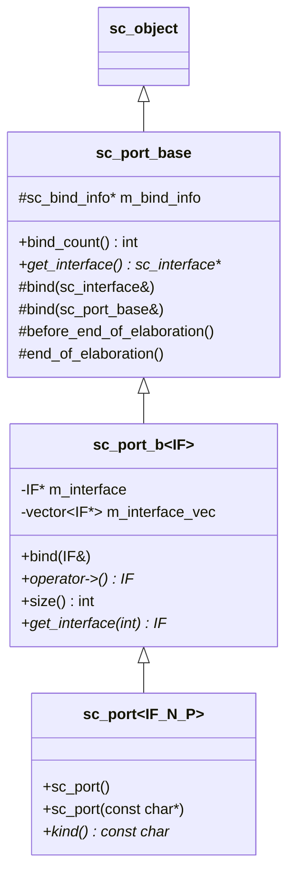
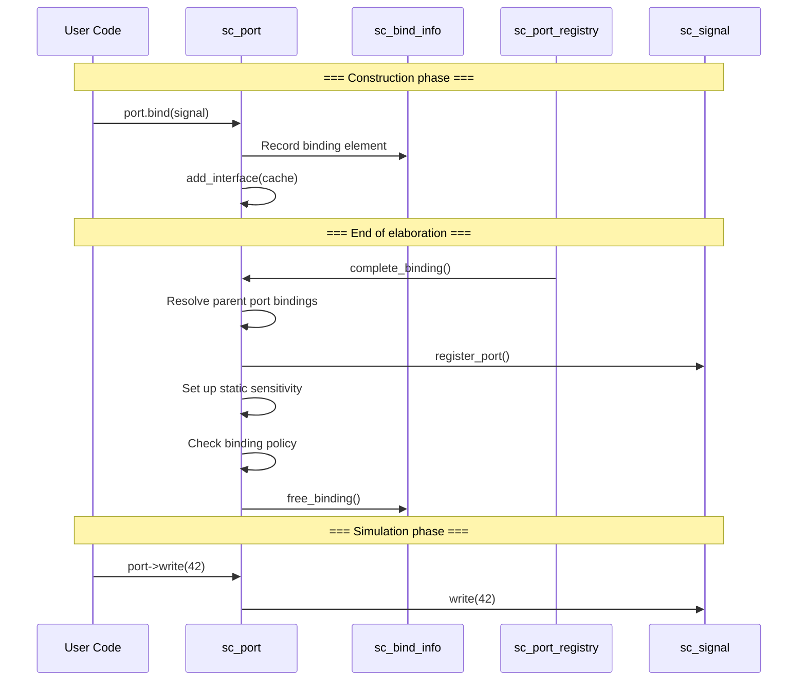

# sc_port -- Port Base Class, Entry Point for Modules to Access External Channels

## Overview

`sc_port` is the "gateway" for modules to communicate externally in SystemC. Each module connects to external channels through ports. Ports are bound to channels during the elaboration phase, and then during simulation, interface methods are called through `operator->()`.

This file defines a three-level class hierarchy:
1. `sc_port_base` - Non-templated base class
2. `sc_port_b<IF>` - Templated intermediate base class
3. `sc_port<IF, N, P>` - Final user-facing template class

**Source files:** `sc_port.h`, `sc_port.cpp`

## Everyday Analogy

Think of an office building:
- **Module** is an office inside the building
- **Port** is the "network jack" on the office wall
- **Channel** is the physical network cabling inside the building
- **Interface** is the network protocol (e.g., Ethernet)

The office doesn't need to know how the wiring runs behind the wall; it just communicates through the network jack (port) following the protocol (interface). During the renovation phase (elaboration), the network jacks are wired up (bound), and then normal use can begin.

## Class Hierarchy



## Binding Policy (Port Policy)

```cpp
enum sc_port_policy
{
    SC_ONE_OR_MORE_BOUND,   // Default: must bind at least one channel
    SC_ZERO_OR_MORE_BOUND,  // Can be unbound (optional port)
    SC_ALL_BOUND            // Must bind exactly N channels
};
```

Template parameter `N` controls the maximum number of bindings (N <= 0 means unlimited), and `P` controls the binding policy.

## Key Method Descriptions

### `bind()` - Binding

```cpp
void sc_port_base::bind( sc_interface& interface_ );  // Bind to interface (channel)
void sc_port_base::bind( sc_port_base& parent_ );     // Bind to parent port
```

Binding can only occur during the elaboration phase. Binding to a parent port is used in hierarchical design, e.g., connecting a sub-module's port to a parent module's port.

### `operator->()` - Access Interface

```cpp
template <class IF>
IF* sc_port_b<IF>::operator -> ()
{
    if( m_interface == 0 ) {
        report_error( SC_ID_GET_IF_, "port is not bound" );
        sc_core::sc_abort();
    }
    return m_interface;
}
```

This is the most common way to use a port. Through the `->` operator, you can directly call the bound channel's interface methods:

```cpp
// port is sc_port<sc_signal_inout_if<int>>
port->write(42);         // Write value through port
int val = port->read();  // Read value through port
```

### `complete_binding()` - Complete Binding

This is a method called internally by the system at the end of elaboration, responsible for:
1. Recursively resolving parent port bindings
2. Adding all bound interfaces to the cache
3. Calling `register_port()` to notify channels
4. Completing static sensitivity list setup
5. Checking that binding counts meet policy requirements

## Binding Flow



## Internal Structure

### `sc_bind_info` - Binding Information

Stores all binding information during elaboration, including:
- `vec` - List of binding elements (interface or parent port pointers)
- `has_parent` - Whether there is a parent port binding
- `is_leaf` - Whether it is a leaf node (no child ports bound to this port)
- `thread_vec` / `method_vec` - Pending sensitivity list setups

After elaboration completes, `sc_bind_info` is freed to save memory.

### `sc_port_registry` - Port Registry

Held by `sc_simcontext`, responsible for managing lifecycle callbacks for all ports:
- `construction_done()` - Construction complete
- `complete_binding()` - Complete binding
- `elaboration_done()` - Elaboration complete
- `start_simulation()` / `simulation_done()` - Simulation start/end

## Design Notes

### Why can't ports be created after simulation starts?

Ports register with `sc_port_registry` at construction, and this must be completed during the elaboration phase. If ports are created during simulation, binding and sensitivity list setup would fail.

### Multi-Binding

When `N > 1`, a port can bind to multiple channels. This corresponds to the concept of a bus in hardware design. Specific indexed interfaces can be accessed via `operator[]` or `get_interface(int)`.

## Related Files

- `sc_interface.h` - Base class of the interface that ports bind to
- `sc_export.h` - Export is the "reverse" concept of a port
- `sc_signal_ports.h` - Signal-specific port classes
- `sc_event_finder.h` - Event finder used with ports
- `sc_communication_ids.h` - Binding-related error messages
