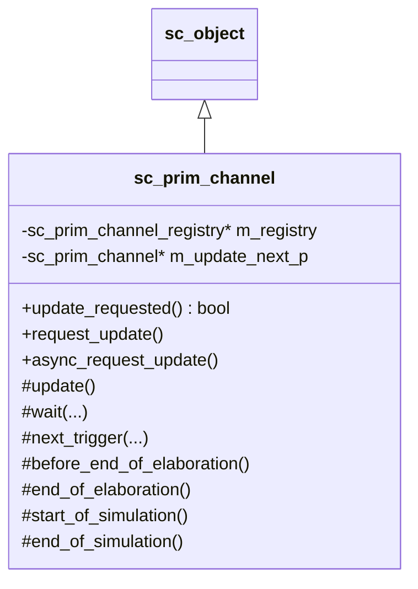
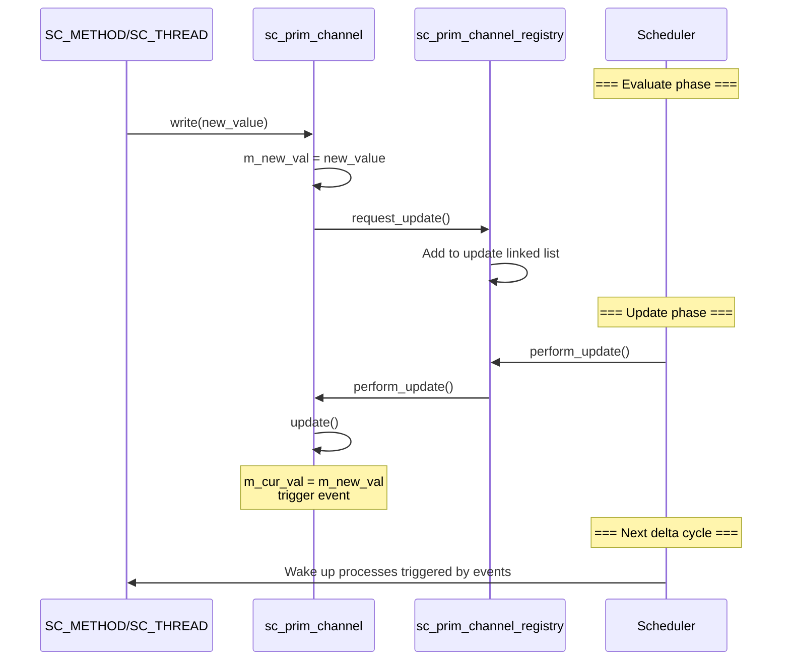

# sc_prim_channel -- Abstract Base Class of Primitive Channels

## Overview

`sc_prim_channel` is the base class for all "primitive channels". Primitive channels are the core communication components in SystemC that can participate in the simulator's **update phase**. The most important subclass is `sc_signal`.

Unlike hierarchical channels (which inherit from `sc_module`), primitive channels interact directly with the simulation engine's scheduler through a "request update - execute update" two-phase mechanism to ensure simulation correctness.

**Source files:** `sc_prim_channel.h`, `sc_prim_channel.cpp`

## Everyday Analogy

Think of a bulletin board system:
- **write** is like writing a new message on a sticky note and putting it in the "pending updates area"
- **request_update()** is like telling the administrator "I have a new message to post"
- **update()** is like the administrator moving sticky notes from the "pending updates area" to the bulletin board at a specific time
- **event notification** is like the administrator broadcasting "The bulletin board has been updated!" after replacing content

This "store first, update later" mechanism ensures that at any given point in time, everyone sees consistent bulletin board content.

## Class Definition



## Key Method Descriptions

### `request_update()` - Request Update

```cpp
inline void sc_prim_channel::request_update()
{
    if( ! m_update_next_p ) {
        m_registry->request_update( *this );
    }
}
```

Called when a new value is written to the channel, adding itself to the update queue. Duplicate requests are ignored (by checking whether `m_update_next_p` is null).

### `update()` - Execute Update

```cpp
virtual void sc_prim_channel::update();  // default: does nothing
```

Called during the simulator's update phase. Subclasses (like `sc_signal`) override this method to write the new value to the current value and trigger event notifications.

### `async_request_update()` - Asynchronous Update Request

```cpp
inline void sc_prim_channel::async_request_update()
{
    m_registry->async_request_update(*this);
}
```

Thread-safely requests an update from outside the simulator. This is critical for integrating SystemC with external systems (such as OS threads, hardware accelerators).

### `async_attach_suspending()` / `async_detach_suspending()`

Informs the kernel that this channel may produce asynchronous updates from outside. The kernel will pause and wait when there are no other events, rather than ending the simulation.

## Update Mechanism



## Internal Implementation: Update Linked List

`sc_prim_channel_registry` uses an intrusive linked list to manage channels pending update:

- `m_update_next_p` member points to the next channel in the list
- `m_update_list_p` is the list head
- `m_update_list_end` is the list terminator (uses the registry's own address, guaranteed not to collide with any channel address)

This design avoids dynamic memory allocation, providing extremely high performance.

## Built-in `wait()` and `next_trigger()`

`sc_prim_channel` provides numerous `wait()` and `next_trigger()` overloads. These methods simply forward to `sc_core::wait()` and `sc_core::next_trigger()`, with the difference that they automatically include the simulation context (`simcontext()`), so channel implementations don't need to manually retrieve the context.

Supported wait modes include:
- **No arguments** - Wait for events in the static sensitivity list
- **Event** - `wait(event)`, `wait(event_or_list)`, `wait(event_and_list)`
- **Timed** - `wait(sc_time)`, `wait(double, sc_time_unit)`
- **Timed + event** - `wait(time, event)`, `wait(time, event_or_list)`
- **Delta cycle count** - `wait(int n)`

## sc_prim_channel_registry::async_update_list

Used to handle asynchronous update requests from external threads. Thread safety is achieved using mutex and semaphore:

- `append()` - Safely add update requests from external threads
- `accept_updates()` - Convert external requests to internal requests in the simulator thread
- `suspend()` / `attach_suspending()` - Manage simulator pause/resume

## Design Notes

### Why is two-phase update needed?

This corresponds to the behavior of sequential logic in hardware. In real hardware, registers update their values **simultaneously** at clock edges. The two-phase update mechanism simulates this behavior:
1. **Evaluate phase**: Calculate new values but don't apply them immediately
2. **Update phase**: All new values take effect simultaneously

Without this mechanism, the order of signal updates would affect simulation results, which is inconsistent with the parallel behavior of hardware.

### RTL Correspondence

| SystemC Concept | RTL Correspondence |
|----------------|-------------------|
| `request_update()` | Scheduling of non-blocking assignment (`<=`) |
| `update()` | Non-blocking assignment taking effect at end of delta cycle |
| delta cycle | One evaluate + update cycle |

## Related Files

- `sc_signal.h` - Most important primitive channel subclass
- `sc_buffer.h` - Variant of `sc_signal`
- `sc_interface.h` - Primitive channels typically implement some interface
- `sc_communication_ids.h` - Related error messages
