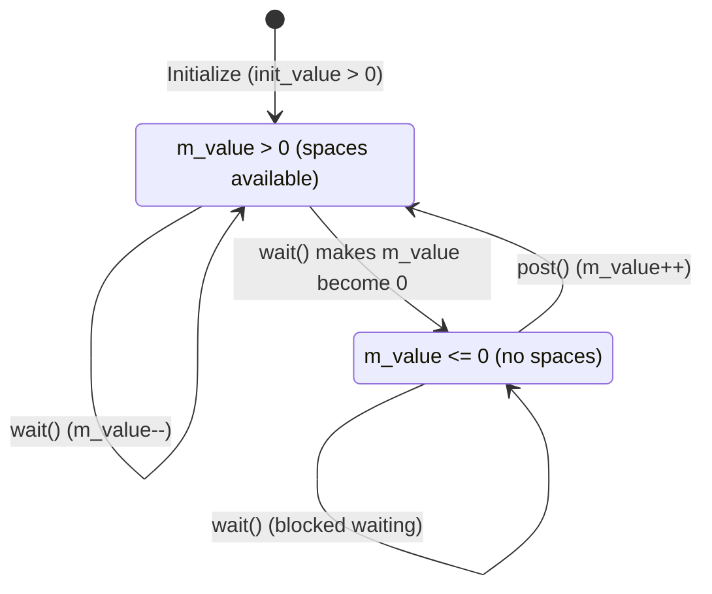

# sc_semaphore.h / .cpp - Semaphore Primitive Channel

## Overview

`sc_semaphore` is the semaphore primitive channel in SystemC. Unlike a mutex which only allows one process to access, a semaphore allows **up to N processes** to simultaneously access a shared resource, where N is the initial value of the semaphore.

## Core Concept / Everyday Analogy

### Parking Lot Counter

Imagine a parking lot with 3 spaces:

- **Entrance sign**: "Remaining spaces: 3" (initial value `m_value = 3`)
- **wait()**: Drive in. If there are spaces (`m_value > 0`), decrement the space count and park. If the count is 0, queue up at the entrance and wait
- **trywait()**: Glance at the sign. If there are spaces, enter (decrement count). If no spaces, drive away (return -1)
- **post()**: Drive out. Increment the space count; if someone is waiting, notify the first car
- **get_value()**: Check how many spaces are left

```
Space count (m_value): 3 -> 2 -> 1 -> 0 -> (blocked) -> 1 -> 0
                       ^    ^    ^    ^                  ^    ^
                     wait wait wait wait               post wait
```



## Detailed Class Description

### `sc_semaphore` Class

```cpp
class sc_semaphore
: public sc_semaphore_if,
  public sc_object
```

Similar to `sc_mutex`, it inherits `sc_object` rather than `sc_prim_channel`.

### Constructors

```cpp
sc_semaphore(int init_value_);                    // Auto-named
sc_semaphore(const char* name_, int init_value_); // Named
```

- `init_value_` must not be negative; otherwise reports `SC_ID_INVALID_SEMAPHORE_VALUE_` error
- Unlike `sc_mutex`, semaphores **must specify an initial value** (no default)

### Interface Methods

#### `wait()` - Blocking Acquire

```cpp
int sc_semaphore::wait()
{
    while (in_use()) {
        sc_core::wait(m_free, sc_get_curr_simcontext());
    }
    --m_value;
    return 0;
}
```

- `in_use()` checks `m_value <= 0`
- Blocks until `m_value > 0`
- On success, decrements `m_value` by 1

#### `trywait()` - Try to Acquire

```cpp
int sc_semaphore::trywait()
{
    if (in_use()) return -1;
    --m_value;
    return 0;
}
```

Non-blocking version.

#### `post()` - Release

```cpp
int sc_semaphore::post()
{
    ++m_value;
    m_free.notify();
    return 0;
}
```

- Increments `m_value`
- Immediately notifies the `m_free` event, waking up a waiting process
- Note: **any process can call `post()`**, unlike mutex where only the owner can unlock

#### `get_value()` - Query Current Value

```cpp
int get_value() const { return m_value; }
```

### Member Variables

| Variable | Type | Description |
|----------|------|-------------|
| `m_free` | `sc_event` | Event triggered when the semaphore is released |
| `m_value` | `int` | Current value of the semaphore |

### Error Reporting

```cpp
void report_error(const char* id, const char* add_msg = 0) const;
```

Formats the error message including the semaphore name, e.g.: `"semaphore 'my_sem'"`.

## Design Rationale / RTL Background

### mutex vs semaphore

| Property | mutex | semaphore |
|----------|-------|-----------|
| Max concurrent access | 1 | N (determined by initial value) |
| Ownership | Yes (only owner can unlock) | No (anyone can post) |
| Reentrant | Yes (owner can lock repeatedly) | No |
| Use case | Mutual exclusion | Resource pool, rate control |

### Hardware Correspondence

In hardware, semaphores are commonly found in:
- **DMA channel management**: System has 4 DMA channels, managed with semaphore(4)
- **Bus arbitration**: Limiting the number of masters simultaneously transmitting on the bus
- **Buffer management**: Tracking the number of available memory blocks

### Immediate Notification

Same as `sc_mutex`, `post()` uses `m_free.notify()` (immediate notification), allowing waiting processes to be woken up in the same delta cycle.

## Related Files

- `sc_semaphore_if.h` - Semaphore interface definition
- `sc_host_semaphore.h` - OS-level semaphore wrapper
- `sc_mutex.h` - Mutex (allows only one process)
