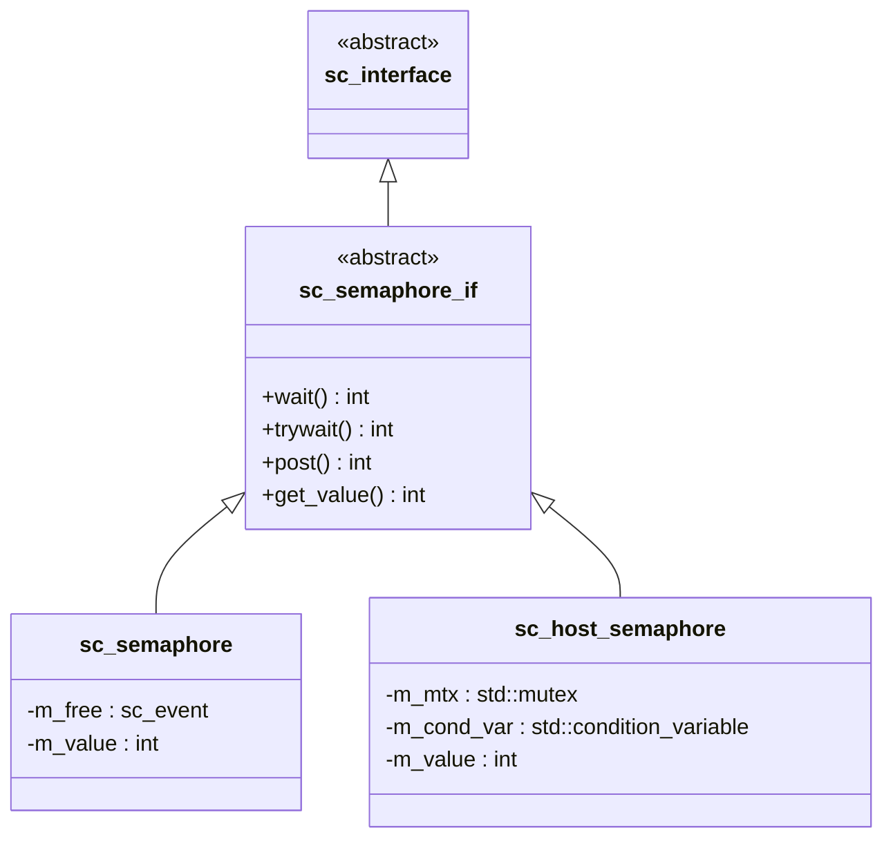

# sc_semaphore_if.h - Semaphore Interface Definition

## Overview

`sc_semaphore_if` defines the abstract interface for semaphores, declaring four pure virtual functions: `wait()`, `trywait()`, `post()`, and `get_value()`. Any class implementing this interface can be used as a semaphore.

## Core Concept / Everyday Analogy

### Parking Lot Management Specification

This interface is like a "parking lot management specification":

- Regardless of whether it's an indoor garage, open-air lot, or mechanical parking structure, as long as it follows these four rules, it's a "qualified parking lot"
- `wait()` = Enter and take a spot
- `trywait()` = Check if there are empty spots
- `post()` = Leave and free a spot
- `get_value()` = Check remaining available spots

## Interface Methods

```cpp
class sc_semaphore_if : virtual public sc_interface
{
public:
    virtual int wait() = 0;           // Blocking acquire, waits if no spots
    virtual int trywait() = 0;        // Try to acquire, returns -1 if no spots
    virtual int post() = 0;           // Release
    virtual int get_value() const = 0; // Query current value
};
```

| Method | Success Return | Failure Return | Description |
|--------|---------------|----------------|-------------|
| `wait()` | 0 | Does not return (blocks) | Decrements count, blocks if no spots |
| `trywait()` | 0 | -1 | Decrements count, returns -1 immediately if no spots |
| `post()` | 0 | - | Increments count, notifies waiters |
| `get_value()` | Current value | - | Read-only query |

## Design Rationale

### Differences from `sc_mutex_if`

| Design Aspect | `sc_mutex_if` | `sc_semaphore_if` |
|--------------|---------------|-------------------|
| Method naming | lock / trylock / unlock | wait / trywait / post |
| Query method | None | `get_value()` |
| Ownership concept | Implicit (only owner can unlock) | None (anyone can post) |

The naming convention comes from the POSIX standard: `sem_wait`, `sem_trywait`, `sem_post`.



## Related Files

- `sc_semaphore.h` / `sc_semaphore.cpp` - Semaphore implementation for the simulation environment
- `sc_host_semaphore.h` - OS-level semaphore wrapper
- `sc_mutex_if.h` - Mutex interface (similar but allows only single access)
- `sc_interface.h` - Base class of all interfaces
